# Bibliotecas


```r
library(tidyverse)
```

```
## Warning: package 'tidyverse' was built under R version 4.2.1
```

```
## ── Attaching packages ─────────────────────────────────────── tidyverse 1.3.2 ──
## ✔ ggplot2 3.3.6     ✔ purrr   0.3.4
## ✔ tibble  3.1.7     ✔ dplyr   1.0.9
## ✔ tidyr   1.2.0     ✔ stringr 1.4.0
## ✔ readr   2.1.2     ✔ forcats 0.5.1
## ── Conflicts ────────────────────────────────────────── tidyverse_conflicts() ──
## ✖ dplyr::filter() masks stats::filter()
## ✖ dplyr::lag()    masks stats::lag()
```


# ggplot2

A etapa de visualização possui um papel importantíssimo no contexto de análise de dados, Ben Shneiderman, um importante nome da ciência da computação: "Visualização nos dá resposta para perguntas que nós não sabiamos que tinhamos". 

E no R, apesar de existirem muitos recursos default para a visualização de dados, como as funções: `plot()`, `hist()` e `boxplot()`, é quando começamos a trabalhar com as bibliotecas de visualização do R, que o recurso gráfico é realmente potencializado. E sem dúvida o principal pacote para visualização no R, é o `ggplot2`. Neste, trabalhamos com a lógica do *Grammar of Graphics*, uma abstração lógica em que o gráfico é visto como um mapeamento feito por camadas, são elas:


```r
  dados %>% 
    ggplot(aesthetic) +
      geometries(statistics) +
      facets() +
      coord()
      themes()
```

Contudo apenas três destas são obrigatórias: dados,  atributos estéticos (aesthetic), e objetos geométricos (geometries: pontos, barras, linhas, etc). Vamos começar por eles.


## camadas obrigatórias

Para as camadas obrigatórias, temos um layout similar a este:


```r
  dados %>% 
    ggplot(aesthetic) +
      geometries() 
```


E para entender melhor do que se tratam, vamos adicioná-los um a um. Vamos utilizar aqui a base `drinks`, e no que ao aplicar o ggplot apenas, temos um painel em branco, com isto podemos entender que esta função tem como papel inicializar o gráfico:


```r
drinks <- fivethirtyeight::drinks
drinks %>% head()
```

```
## # A tibble: 6 × 5
##   country           beer_servings spirit_servings wine_servings total_litres_of…
##   <chr>                     <int>           <int>         <int>            <dbl>
## 1 Afghanistan                   0               0             0              0  
## 2 Albania                      89             132            54              4.9
## 3 Algeria                      25               0            14              0.7
## 4 Andorra                     245             138           312             12.4
## 5 Angola                      217              57            45              5.9
## 6 Antigua & Barbuda           102             128            45              4.9
```


```r
drinks %>% 
  ggplot() 
```


Passamos agora para o elemento `aesthetic`, no R esta função é representada de maneira abreviada, `aes()`. E por ser uma função, podemos pesquisar sobre, e então teremos que este "mapeamento estético" descreve como as variáveis dos dados serão mapeadas para propriedades visuais (estéticas) de geometrias. Não ajudou muito né? Mas traduzindo, o que estamos dizendo é que no `aes()` você indicará qual variável será mapeada no gráfico. Um mapeamente usual trata do eixo x e eixo y:


```r
drinks %>% 
  ggplot(aes(x = beer_servings, y = wine_servings)) 
```

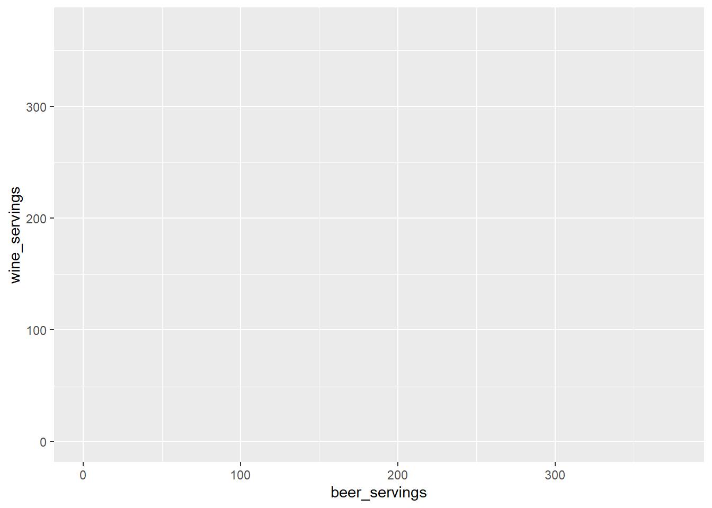

Note que agora o gráfico passou a apresentar as variáveis nos eixos, mas nada além disto, por quê? Pois não indicamos como gostariamos que este gráfico apresentasse estes eixos. E para isto temos o nosso terceiro elemento obrigatório, as geometrias:


```r
drinks %>% 
  ggplot(aes(x = beer_servings, y = wine_servings)) +
  geom_point()
```

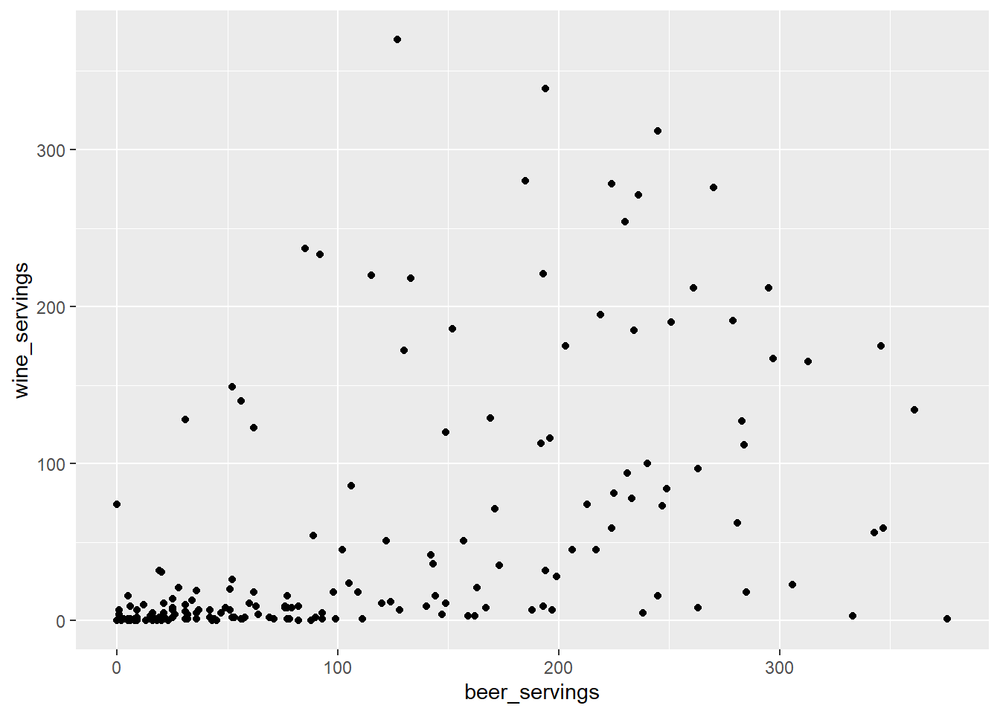
E poderíamos trabalhar com outra geometria. Qualquer uma? Não. Precisaria ser uma geometria que trabalhasse com dois eixos, sendo ambos numéricos, dado as variáveis escolhidas:


```r
drinks %>% 
  ggplot(aes(x = beer_servings, y = wine_servings)) +
    #geom_point()
    #geom_area() +
    #geom_bin_2d() +
    #geom_jitter()
    geom_rug()
```

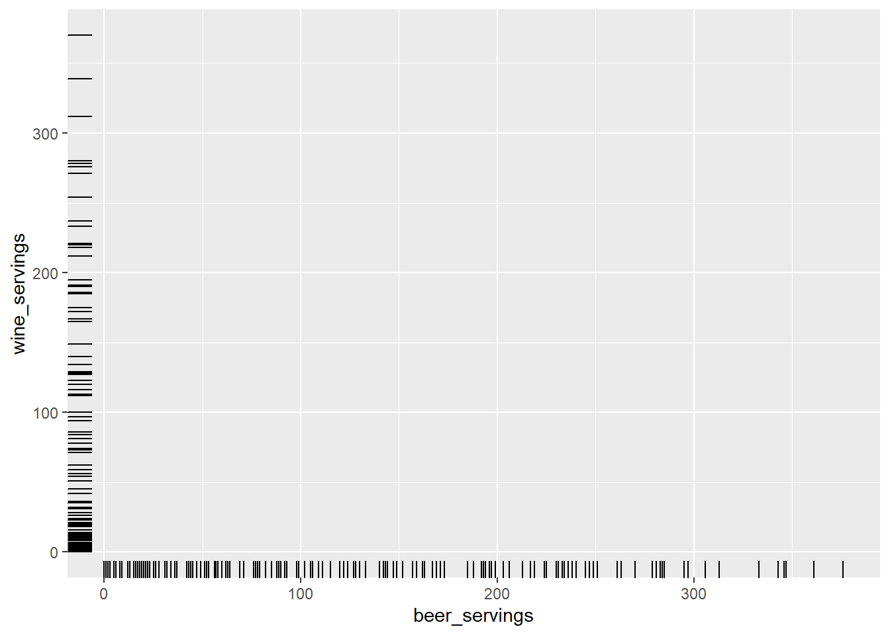

Inclusive podemos usar mais de um layer, e fazendo ajustes nas geometrias de forma independente:


```r
drinks %>% 
  ggplot(aes(x = beer_servings, y = wine_servings)) +
    geom_point(aes(color = total_litres_of_pure_alcohol)) +
    #geom_area()
    #geom_bin_2d() +
    #geom_jitter()
    geom_rug(alpha = 0.2)
```

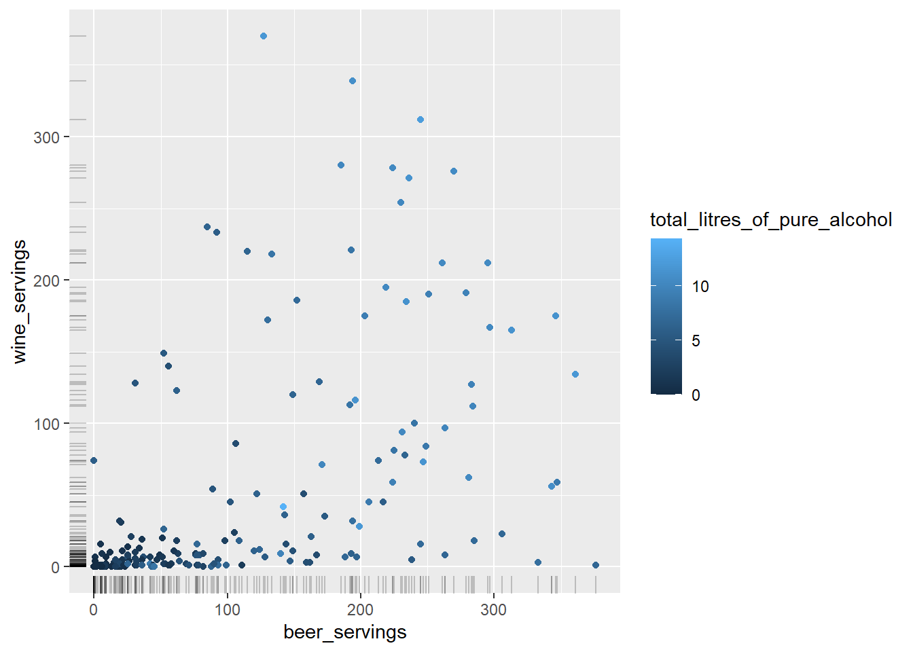

Mas quem são esses? 


```r
drinks %>% 
  ggplot(aes(x = beer_servings, y = wine_servings, color = total_litres_of_pure_alcohol)) +
    geom_point() +
    geom_text(aes(label = country))
```

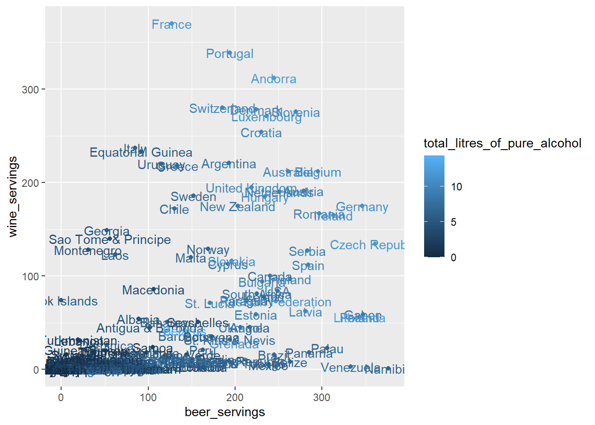


Ruim de ler? 


```r
drinks %>% 
  ggplot(aes(x = beer_servings, y = wine_servings, color = total_litres_of_pure_alcohol)) +
    geom_point(alpha = 0.1) +
    geom_text(data = . %>% filter( total_litres_of_pure_alcohol > 10), aes(label = country))
```

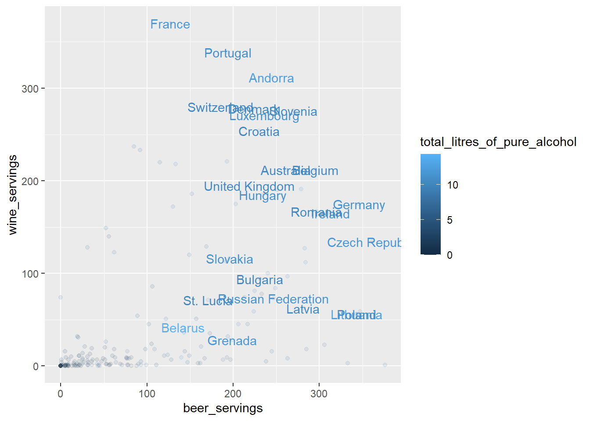


```r
drinks %>% 
  ggplot(aes(x = beer_servings, y = wine_servings, color = total_litres_of_pure_alcohol)) +
    geom_point(alpha = 0.1) +
    ggrepel::geom_text_repel(data = . %>% filter( total_litres_of_pure_alcohol > 10), aes(label = country))
```

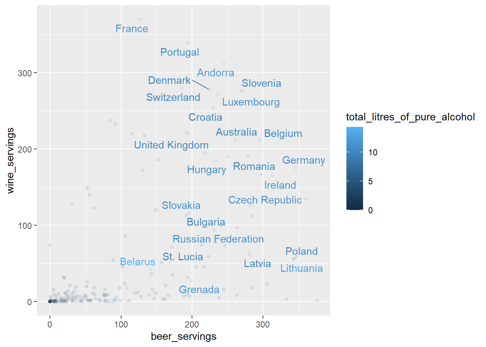

Aqui já estamos utilizando recursos avançados, mas o meu ponto era justo mostrar o quanto a dificuldade não é o código. Mas não se preocupe pois vamos passar por recursos suficientes para que você possa evoluir neste pacote ;)

No mais vale comentar também que o ggplot trabalha com o encadeamento de funções, porém a dinâmica aqui é um pouco diferente do `%>%` e por isso trabalhamos com o operador `+`.


## demais camadas 

Retornando a totalidade da camadas, temos ainda os níveis em que podemos fazer: a divisão de gráficos (faceting), sistemas de coordenadas (coord), temas de fundo (themes), e sumarizações estatísticas (statistics).


```r
  dados %>% 
    ggplot(aesthetic) +
      geometries(statistics) +
      facets() +
      coord()
      themes()
```


E aqui vale dar uma checada na cheat sheet do ggplot, pois ela nos dá dicas valiosas sobre quais geometrias você pode ou não aplicar a depender do tipo da variável, além de sobre as demais camadas: 


<div class="figure" style="text-align: center">

<p class="caption">CheatSheet ggplot2 (folha 01)</p>
</div>


# E como eu sigo aprendendo tudo isso? 

Treinando, fazendo uso das muitas excelentes referências existentes, e usando o pacote `esquisse::esquisser()` :) 


# E como eu escolho o gráfico? 

Existem diferentes opções de geometria, 


geom_line - para linhas definidas por pares (x,y).

geom_abline - para retas definidas por um intercepto e uma inclinação.

geom_hline - para retas horizontais.

geom_bar - para barras.

geom_histogram - para histogramas.

geom_boxplot - para boxplots.

geom_density - para densidades.

geom_area - para áreas.


isso além de todos as demais camadas

Por meio do frame que relaciona a classe das variáveis ou o possível objetivo da análise com os gráficos:

>  <https://www.data-to-viz.com/>


Vamos ver algumas possíbilidades


```r
diamante <- dados::diamante %>%  glimpse()
```

```
## Rows: 53,940
## Columns: 10
## $ preco         <int> 326, 326, 327, 334, 335, 336, 336, 337, 337, 338, 339, 3…
## $ quilate       <dbl> 0.23, 0.21, 0.23, 0.29, 0.31, 0.24, 0.24, 0.26, 0.22, 0.…
## $ corte         <ord> Ideal, Premium, Bom, Premium, Bom, Muito Bom, Muito Bom,…
## $ cor           <ord> E, E, E, I, J, J, I, H, E, H, J, J, F, J, E, E, I, J, J,…
## $ transparencia <ord> SI2, SI1, VS1, VS2, SI2, VVS2, VVS1, SI1, VS2, VS1, SI1,…
## $ profundidade  <dbl> 61.5, 59.8, 56.9, 62.4, 63.3, 62.8, 62.3, 61.9, 65.1, 59…
## $ tabela        <dbl> 55, 61, 65, 58, 58, 57, 57, 55, 61, 61, 55, 56, 61, 54, …
## $ x             <dbl> 3.95, 3.89, 4.05, 4.20, 4.34, 3.94, 3.95, 4.07, 3.87, 4.…
## $ y             <dbl> 3.98, 3.84, 4.07, 4.23, 4.35, 3.96, 3.98, 4.11, 3.78, 4.…
## $ z             <dbl> 2.43, 2.31, 2.31, 2.63, 2.75, 2.48, 2.47, 2.53, 2.49, 2.…
```

## distribuição 


```r
library(titanic)
titanic <- titanic_train

# Gráfico

titanic %>%
  ggplot(aes(x = Age,y = ..density..,fill = Sex)) +
  geom_histogram(binwidth = 5,
                 position = "dodge",
                 col = "white",
                 boundary = 0,
                 alpha = 0.7) +
  facet_grid(~Sex,
             labeller = labeller(Sex = function(Sex) paste(Sex,
                                                           "passengers")))+
  scale_x_continuous(expand = c(0, 0))+
  labs(y = "Density")+
  theme_minimal()+
  theme(panel.grid.minor.y =element_blank(),
        panel.grid.major.x = element_blank(),
        panel.grid.minor.x = element_blank(),
        legend.position = "none",
        panel.spacing = unit(1, "lines"),
        strip.text=element_text(hjust=0.8, vjust = -1.2)
  )
```

```
## Warning: Removed 177 rows containing non-finite values (stat_bin).
```


```r
titanic %>%
  ggplot(aes(x = Age, y = ..count..)) +
  geom_density(data = select(titanic, -Sex),
               aes(fill = "a"),
               color = "transparent",
               alpha = 0.6)+
  geom_density(aes(fill = Sex),
               color = "transparent")+
  scale_x_continuous(name = "age (years)",
                     limits = c(0, 85),
                     expand = c(0, 0)) +
  scale_y_continuous(limits = c(0, 25),
                     name = "scaled density",
                     expand = c(0, 0))+
  scale_fill_manual(breaks = c("a", "female", "male"),
                    values = c("gray", "#D55E00", "#0072B2"),
                    labels=c("all","female","male"),
                    name = "")+
  facet_wrap(~Sex)+
  theme_minimal()+
  theme(panel.grid.minor.y =element_blank(),
        panel.grid.major.x = element_blank(),
        panel.grid.minor.x = element_blank(),
        legend.position = "bottom",
        legend.justification = "right",
        strip.text.x = element_blank())+
  ggtitle("Titanic Passengers Age by Sex")
```

```
## Warning: Removed 354 rows containing non-finite values (stat_density).
```

```
## Warning: Removed 177 rows containing non-finite values (stat_density).
```


## relação


```r
p <-  diamante %>% 
  sample_frac(0.10) %>% 
  ggplot(aes(x = quilate, y = preco)) +
  geom_point(aes(text = transparencia), size = 4) +
  geom_smooth(aes(colour = corte, fill = corte)) + 
  facet_grid(.~corte) 
```

```
## Warning: Ignoring unknown aesthetics: text
```

```r
plotly::ggplotly(p)
```

```
## `geom_smooth()` using method = 'gam' and formula 'y ~ s(x, bs = "cs")'
```

```{=html}
<div id="htmlwidget-a2fcf063759d596b509d" style="width:672px;height:480px;" class="plotly html-widget"></div>
<script type="application/json" data-for="htmlwidget-a2fcf063759d596b509d">{"x":{"data":[{"x":[1.19,1.01,1.52,0.71,1.03,0.96,1,1,1.01,1.01,2.01,0.51,0.9,0.9,0.82,1.13,3.65,2.11,1.7,0.9,0.9,1.51,1.21,1.52,0.7,1.3,1.26,0.48,0.5,0.91,0.4,0.46,1.5,1.32,0.9,1.01,0.5,0.27,0.7,1.51,0.71,0.51,1.01,1,1,0.7,0.7,0.7,0.96,1.01,1.2,0.46,1,0.7,0.9,0.91,0.98,1.05,0.51,1,0.5,2.5,0.7,0.7,0.3,1.51,0.5,2.1,2.25,0.69,2,0.73,0.7,1,0.99,1.01,1.81,0.5,0.5,2.4,1.21,1.32,0.84,0.63,0.56,1.05,2.53,1.51,1,0.58,2.5,1.04,0.9,1,1,0.9,1.01,1.5,1.2,0.72,1.96,1.06,0.9,0.9,0.7,0.7,0.74,0.71,1.6,1.33,0.46,0.5,0.9,0.5,0.45,0.48,1.03,1.52,1,1.51,1.5,1.51,0.9,0.7,1,1.01,1.21,0.25,0.75,1.01,0.96,0.5,0.7,0.3,0.9,0.58,1.64,1,1.5,2.01,0.7,1,0.92,1.5,1.05,0.81,0.76,1,1.9,0.4,2.02,0.72],"y":[5198,4844,8001,1828,3149,2867,4435,4656,2036,4118,13744,1234,1939,3697,2838,4123,11668,7019,9996,3473,3743,8387,4637,4648,2560,2571,3881,1215,994,2763,813,1035,7300,6061,3812,3816,1238,371,2697,7468,2747,1071,4118,3864,4312,1848,2352,1138,2304,6353,3011,982,3427,2797,3205,2390,1712,2789,1160,2818,1031,14194,2048,1840,799,3765,1323,11923,6653,1691,15540,2050,956,3192,2812,3546,8362,1134,827,15824,4147,12648,2359,2011,1358,2396,17103,11739,6397,893,13278,2745,3689,3146,2280,3508,4853,7187,4368,2879,6147,2992,2815,3276,1115,1808,1865,3205,8666,5139,1002,1332,3689,1327,794,1367,3743,7303,4150,8879,7644,5801,3205,2117,3763,3540,3984,1013,2648,4256,3533,713,2479,790,4194,1641,8954,3965,8044,10711,1014,4928,3924,5846,3615,1687,2193,7553,8576,798,9095,2306],"text":["quilate: 1.19<br />preco:  5198<br />SI1","quilate: 1.01<br />preco:  4844<br />SI1","quilate: 1.52<br />preco:  8001<br />SI1","quilate: 0.71<br />preco:  1828<br />SI1","quilate: 1.03<br />preco:  3149<br />SI2","quilate: 0.96<br />preco:  2867<br />SI2","quilate: 1.00<br />preco:  4435<br />VS2","quilate: 1.00<br />preco:  4656<br />VS2","quilate: 1.01<br />preco:  2036<br />I1","quilate: 1.01<br />preco:  4118<br />SI2","quilate: 2.01<br />preco: 13744<br />VS2","quilate: 0.51<br />preco:  1234<br />VS1","quilate: 0.90<br />preco:  1939<br />I1","quilate: 0.90<br />preco:  3697<br />VS2","quilate: 0.82<br />preco:  2838<br />SI1","quilate: 1.13<br />preco:  4123<br />SI1","quilate: 3.65<br />preco: 11668<br />I1","quilate: 2.11<br />preco:  7019<br />I1","quilate: 1.70<br />preco:  9996<br />SI2","quilate: 0.90<br />preco:  3473<br />SI2","quilate: 0.90<br />preco:  3743<br />SI1","quilate: 1.51<br />preco:  8387<br />SI1","quilate: 1.21<br />preco:  4637<br />SI1","quilate: 1.52<br />preco:  4648<br />I1","quilate: 0.70<br />preco:  2560<br />VS2","quilate: 1.30<br />preco:  2571<br />I1","quilate: 1.26<br />preco:  3881<br />SI2","quilate: 0.48<br />preco:  1215<br />VS2","quilate: 0.50<br />preco:   994<br />SI1","quilate: 0.91<br />preco:  2763<br />SI2","quilate: 0.40<br />preco:   813<br />VS2","quilate: 0.46<br />preco:  1035<br />VS1","quilate: 1.50<br />preco:  7300<br />SI1","quilate: 1.32<br />preco:  6061<br />SI1","quilate: 0.90<br />preco:  3812<br />SI1","quilate: 1.01<br />preco:  3816<br />SI2","quilate: 0.50<br />preco:  1238<br />SI1","quilate: 0.27<br />preco:   371<br />VS1","quilate: 0.70<br />preco:  2697<br />VS2","quilate: 1.51<br />preco:  7468<br />SI1","quilate: 0.71<br />preco:  2747<br />VS1","quilate: 0.51<br />preco:  1071<br />SI1","quilate: 1.01<br />preco:  4118<br />SI2","quilate: 1.00<br />preco:  3864<br />SI2","quilate: 1.00<br />preco:  4312<br />VVS2","quilate: 0.70<br />preco:  1848<br />SI1","quilate: 0.70<br />preco:  2352<br />VS2","quilate: 0.70<br />preco:  1138<br />I1","quilate: 0.96<br />preco:  2304<br />I1","quilate: 1.01<br />preco:  6353<br />VS1","quilate: 1.20<br />preco:  3011<br />I1","quilate: 0.46<br />preco:   982<br />VS2","quilate: 1.00<br />preco:  3427<br />SI1","quilate: 0.70<br />preco:  2797<br />VVS1","quilate: 0.90<br />preco:  3205<br />SI2","quilate: 0.91<br />preco:  2390<br />SI1","quilate: 0.98<br />preco:  1712<br />I1","quilate: 1.05<br />preco:  2789<br />SI2","quilate: 0.51<br />preco:  1160<br />SI1","quilate: 1.00<br />preco:  2818<br />SI2","quilate: 0.50<br />preco:  1031<br />SI2","quilate: 2.50<br />preco: 14194<br />SI2","quilate: 0.70<br />preco:  2048<br />SI1","quilate: 0.70<br />preco:  1840<br />SI1","quilate: 0.30<br />preco:   799<br />VS1","quilate: 1.51<br />preco:  3765<br />I1","quilate: 0.50<br />preco:  1323<br />SI1","quilate: 2.10<br />preco: 11923<br />SI2","quilate: 2.25<br />preco:  6653<br />I1","quilate: 0.69<br />preco:  1691<br />SI2","quilate: 2.00<br />preco: 15540<br />SI2","quilate: 0.73<br />preco:  2050<br />SI2","quilate: 0.70<br />preco:   956<br />I1","quilate: 1.00<br />preco:  3192<br />SI2","quilate: 0.99<br />preco:  2812<br />SI1","quilate: 1.01<br />preco:  3546<br />SI1","quilate: 1.81<br />preco:  8362<br />SI1","quilate: 0.50<br />preco:  1134<br />VS1","quilate: 0.50<br />preco:   827<br />I1","quilate: 2.40<br />preco: 15824<br />SI2","quilate: 1.21<br />preco:  4147<br />SI1","quilate: 1.32<br />preco: 12648<br />VVS1","quilate: 0.84<br />preco:  2359<br />VS2","quilate: 0.63<br />preco:  2011<br />VS2","quilate: 0.56<br />preco:  1358<br />SI1","quilate: 1.05<br />preco:  2396<br />I1","quilate: 2.53<br />preco: 17103<br />SI2","quilate: 1.51<br />preco: 11739<br />VS1","quilate: 1.00<br />preco:  6397<br />VS1","quilate: 0.58<br />preco:   893<br />I1","quilate: 2.50<br />preco: 13278<br />SI2","quilate: 1.04<br />preco:  2745<br />SI2","quilate: 0.90<br />preco:  3689<br />SI1","quilate: 1.00<br />preco:  3146<br />SI2","quilate: 1.00<br />preco:  2280<br />I1","quilate: 0.90<br />preco:  3508<br />SI1","quilate: 1.01<br />preco:  4853<br />SI1","quilate: 1.50<br />preco:  7187<br />SI2","quilate: 1.20<br />preco:  4368<br />SI2","quilate: 0.72<br />preco:  2879<br />VS1","quilate: 1.96<br />preco:  6147<br />I1","quilate: 1.06<br />preco:  2992<br />SI2","quilate: 0.90<br />preco:  2815<br />VS2","quilate: 0.90<br />preco:  3276<br />VS1","quilate: 0.70<br />preco:  1115<br />I1","quilate: 0.70<br />preco:  1808<br />SI1","quilate: 0.74<br />preco:  1865<br />I1","quilate: 0.71<br />preco:  3205<br />IF","quilate: 1.60<br />preco:  8666<br />SI2","quilate: 1.33<br />preco:  5139<br />SI2","quilate: 0.46<br />preco:  1002<br />VS2","quilate: 0.50<br />preco:  1332<br />VS2","quilate: 0.90<br />preco:  3689<br />SI1","quilate: 0.50<br />preco:  1327<br />VS1","quilate: 0.45<br />preco:   794<br />SI1","quilate: 0.48<br />preco:  1367<br />VVS2","quilate: 1.03<br />preco:  3743<br />SI2","quilate: 1.52<br />preco:  7303<br />VVS2","quilate: 1.00<br />preco:  4150<br />SI1","quilate: 1.51<br />preco:  8879<br />VS2","quilate: 1.50<br />preco:  7644<br />SI2","quilate: 1.51<br />preco:  5801<br />SI2","quilate: 0.90<br />preco:  3205<br />SI2","quilate: 0.70<br />preco:  2117<br />VVS2","quilate: 1.00<br />preco:  3763<br />SI2","quilate: 1.01<br />preco:  3540<br />SI2","quilate: 1.21<br />preco:  3984<br />SI2","quilate: 0.25<br />preco:  1013<br />SI2","quilate: 0.75<br />preco:  2648<br />VS2","quilate: 1.01<br />preco:  4256<br />SI1","quilate: 0.96<br />preco:  3533<br />SI2","quilate: 0.50<br />preco:   713<br />I1","quilate: 0.70<br />preco:  2479<br />VS2","quilate: 0.30<br />preco:   790<br />VVS1","quilate: 0.90<br />preco:  4194<br />VVS1","quilate: 0.58<br />preco:  1641<br />SI1","quilate: 1.64<br />preco:  8954<br />SI2","quilate: 1.00<br />preco:  3965<br />SI2","quilate: 1.50<br />preco:  8044<br />VS1","quilate: 2.01<br />preco: 10711<br />SI2","quilate: 0.70<br />preco:  1014<br />I1","quilate: 1.00<br />preco:  4928<br />VVS2","quilate: 0.92<br />preco:  3924<br />VS1","quilate: 1.50<br />preco:  5846<br />VS2","quilate: 1.05<br />preco:  3615<br />SI2","quilate: 0.81<br />preco:  1687<br />SI2","quilate: 0.76<br />preco:  2193<br />SI1","quilate: 1.00<br />preco:  7553<br />VVS2","quilate: 1.90<br />preco:  8576<br />SI2","quilate: 0.40<br />preco:   798<br />VS1","quilate: 2.02<br />preco:  9095<br />SI2","quilate: 0.72<br />preco:  2306<br />VS2"],"type":"scatter","mode":"markers","marker":{"autocolorscale":false,"color":"rgba(0,0,0,1)","opacity":1,"size":15.1181102362205,"symbol":"circle","line":{"width":1.88976377952756,"color":"rgba(0,0,0,1)"}},"hoveron":"points","showlegend":false,"xaxis":"x","yaxis":"y","hoverinfo":"text","frame":null},{"x":[1,2.02,0.41,0.9,0.71,1.51,0.5,1.01,1,0.4,1.02,1.01,1.13,0.9,1.01,0.71,2.01,0.34,0.9,1,0.58,0.45,0.61,0.31,1.01,0.9,0.9,1.51,1.02,1,0.5,0.23,0.9,0.32,1.01,0.3,0.31,0.72,1,0.31,1.06,0.3,0.91,1.75,1.21,2,1.23,0.4,0.41,0.41,1.3,1.12,1.01,0.92,1.61,2.01,0.5,0.79,0.3,0.32,0.35,0.79,0.7,0.33,1.27,1.5,0.42,0.41,1.02,0.27,0.31,0.32,1.31,0.55,0.38,1.01,0.74,0.91,1.71,0.7,0.41,0.51,1.01,1.51,1.03,1.73,0.9,1,0.4,0.7,0.6,1.08,0.77,0.31,0.5,1,0.31,0.54,0.47,0.4,0.3,1.01,1.02,0.9,0.53,0.56,1.21,1.5,1,0.32,0.45,1,1,0.5,1.1,1.72,0.77,0.7,1.52,0.38,0.7,2.01,0.54,0.76,0.66,0.71,3,0.31,1.51,1.01,0.88,1.01,1.16,1.17,0.32,0.3,0.7,0.31,1.01,0.36,0.39,0.8,1,1.2,1.04,0.35,0.31,1.51,0.9,0.51,1.01,1.71,1.01,0.4,1.5,1.36,0.5,1.5,0.52,0.51,0.35,0.72,2.27,1,0.54,1.71,0.34,0.9,0.34,0.33,0.92,0.7,0.5,0.3,0.9,0.9,1.3,2.15,1.02,0.41,0.5,0.51,1.59,0.32,0.31,0.73,1.1,0.51,0.51,1.5,0.3,0.41,0.3,0.9,0.57,1,0.3,0.9,0.7,1.01,0.26,0.61,1.02,1.51,0.35,0.43,0.7,1.11,0.52,1.51,1,0.32,0.9,0.32,1.11,0.9,0.41,0.7,0.61,0.9,1.21,1.01,2,0.93,0.34,0.41,0.47,0.76,2.03,0.41,2.01,0.32,0.3,0.5,0.32,0.7,0.5,2.27,0.61,0.5,0.3,1.04,0.4,1.05,1.5,1,0.9,0.44,1.01,1.01,0.3,2.19,0.7,0.75,0.89,1.01,0.35,0.3,0.23,0.3,1.21,1,0.7,1.05,1.2,0.57,1.12,0.3,1.01,0.41,0.42,0.67,0.52,0.9,1,0.3,0.23,3,0.79,0.49,0.32,0.35,1.3,0.51,0.91,1.01,0.9,1.04,1.21,1.01,1.5,1.51,1.01,0.26,0.7,0.9,0.31,1.51,0.31,0.4,0.57,0.41,1.09,0.33,2.41,0.9,0.51,0.35,0.35,0.72,0.3,0.7,0.48,0.34,0.38,1,1.5,0.91,0.46,1.02,0.76,0.71,1.05,0.71,0.46,0.32,0.5,1.01,1.7,1.02,2,0.7,0.53,2.01,0.39,2,0.58,2.02,1,0.23,0.75,0.32,1.25,1.01,0.7,1.21,0.7,1.7,1.52,1.24,0.7,1.07,0.54,0.71,0.37,1.55,0.95,1,0.9,0.7,0.62,0.41,0.26,1.5,0.4,1.5,1.01,1,0.5,0.52,1.01,0.91,0.41,0.49,0.25,1.11,0.9,0.6,1.7,0.23,1.01,2.06,1.14,0.74,0.91,1.01,0.5,0.5,0.9,1.03,1.28,0.31,1.23,0.31,0.6,0.4,1.51,0.9,0.25,1.19,1.01,0.31,0.41,1.52,0.3,0.91,0.3,0.9,0.91,1.51,1.01,0.37,0.96,0.7,0.72,0.57,1.01,2,1.01,0.5,1.5,0.9,0.43,0.4,1.5,1.5,1.01,0.7,0.77,0.7,1,0.31,0.7,0.96,0.9,1.51,0.84,0.91,0.83,0.71,0.9,0.36,1,0.32,0.3,0.82,1.02,1,1.01,2.03,0.31,1.04,0.7,1.04,0.44,1.5,2.01,0.92,0.31,0.33,0.28,1.73,0.32,0.31,0.55,1,0.41,0.62,0.9,0.7,0.36,0.5,0.9,1.01,0.7,1.01,1.08,1.03,1.53,1.68,1.01,0.4,0.45,0.33,1.5,1.72,0.54,0.62,1.13,0.3,0.97,1.51,0.41,0.75,0.7,1.01,1.56,1.12,0.51,0.3,0.32,1.01,0.5,0.9],"y":[4851,16565,705,3992,2573,8243,1197,5132,4394,599,4398,4413,3952,2873,6330,2772,15587,581,2717,4200,1388,1262,2120,544,4608,3400,3423,14654,4517,6445,1374,505,4054,780,4466,621,435,1663,4568,707,4257,339,3781,8385,7786,14889,6545,823,646,910,5175,8973,4260,5390,9169,13976,1333,2048,684,393,522,2849,2858,743,4324,8254,653,738,4633,586,826,477,4864,1715,719,6912,2058,3229,11250,2117,755,1668,4028,12319,3743,7847,4165,3858,891,1111,1350,4742,3489,707,1795,6098,586,1685,1226,687,789,4692,3909,3114,1224,1712,7359,4731,5860,591,1144,4581,4077,958,4084,13622,2911,2029,9028,633,2161,16013,1422,3121,2139,2719,14918,516,7340,3737,2558,4118,3644,4054,561,526,2351,470,4685,739,743,2829,3752,5975,6606,491,912,14148,3534,1180,4399,13068,5416,883,7722,7639,1433,10886,1289,1662,748,1166,14249,6272,2502,11225,689,4682,626,652,3382,3312,1348,394,3644,7214,12967,13317,2751,784,979,1895,11716,589,742,3616,4967,2523,1875,11179,351,749,678,2889,1642,3850,526,3357,2459,4234,679,1303,4712,6215,851,669,2386,5221,1289,8245,6194,645,2680,638,3846,3162,863,2352,1423,3153,4559,5271,17760,4405,612,638,1690,3249,15339,738,18374,645,378,1415,449,2370,1090,17051,1668,1645,447,5285,1254,4529,8555,5645,3267,970,3399,5786,421,13978,2083,2923,2728,7059,739,780,425,351,4824,3640,2699,4204,5544,1072,4853,432,6037,917,687,1990,1554,3734,4961,351,357,10863,3436,1182,801,644,5124,1662,3796,6606,3139,3204,6299,5543,6306,8904,6221,597,1950,4223,571,5647,489,945,1847,748,16406,492,17923,3724,959,504,711,2700,684,1935,1130,893,641,6248,13653,3344,1267,5706,2326,2331,4560,1788,1778,706,959,4475,14445,3656,13542,1699,1132,16085,648,12554,2243,15261,4400,425,2933,589,5197,4060,2525,7047,2381,14146,11235,7563,3033,3354,1745,2145,889,11364,3214,4859,4334,2421,1410,935,564,7980,882,5833,4468,4838,1190,1385,8569,2342,1064,1294,498,3916,3246,1306,11921,478,3768,15046,7042,2824,3632,6825,1447,1917,3625,5526,5018,544,5834,408,1793,622,6046,3057,575,7437,4285,544,717,7370,526,4744,394,4493,3290,8975,4116,738,3312,2759,2074,2298,4004,12654,3699,1764,14026,3401,931,882,6006,8910,5731,1840,2371,2498,3690,462,3018,3522,2934,9234,3312,3993,3250,4289,3449,923,4053,556,500,2947,4443,3965,4011,14720,502,5766,1865,7049,756,9281,7959,4247,489,434,375,14479,756,489,1695,3977,659,1850,4193,2611,665,1635,3734,4672,2546,4588,4656,4177,15619,5765,4049,622,1437,984,10271,10084,1640,1116,4025,526,3129,13010,570,2381,2276,4208,7554,7051,1668,605,533,4751,1232,4763],"text":["quilate: 1.00<br />preco:  4851<br />SI1","quilate: 2.02<br />preco: 16565<br />SI2","quilate: 0.41<br />preco:   705<br />SI1","quilate: 0.90<br />preco:  3992<br />SI1","quilate: 0.71<br />preco:  2573<br />SI1","quilate: 1.51<br />preco:  8243<br />SI2","quilate: 0.50<br />preco:  1197<br />SI1","quilate: 1.01<br />preco:  5132<br />SI1","quilate: 1.00<br />preco:  4394<br />SI2","quilate: 0.40<br />preco:   599<br />SI2","quilate: 1.02<br />preco:  4398<br />SI2","quilate: 1.01<br />preco:  4413<br />SI2","quilate: 1.13<br />preco:  3952<br />SI2","quilate: 0.90<br />preco:  2873<br />SI1","quilate: 1.01<br />preco:  6330<br />VS2","quilate: 0.71<br />preco:  2772<br />VS2","quilate: 2.01<br />preco: 15587<br />VS2","quilate: 0.34<br />preco:   581<br />SI1","quilate: 0.90<br />preco:  2717<br />SI2","quilate: 1.00<br />preco:  4200<br />SI1","quilate: 0.58<br />preco:  1388<br />SI1","quilate: 0.45<br />preco:  1262<br />VS1","quilate: 0.61<br />preco:  2120<br />VS1","quilate: 0.31<br />preco:   544<br />SI1","quilate: 1.01<br />preco:  4608<br />SI1","quilate: 0.90<br />preco:  3400<br />SI1","quilate: 0.90<br />preco:  3423<br />VS2","quilate: 1.51<br />preco: 14654<br />VVS2","quilate: 1.02<br />preco:  4517<br />SI2","quilate: 1.00<br />preco:  6445<br />VS2","quilate: 0.50<br />preco:  1374<br />SI1","quilate: 0.23<br />preco:   505<br />VVS2","quilate: 0.90<br />preco:  4054<br />VS2","quilate: 0.32<br />preco:   780<br />VS2","quilate: 1.01<br />preco:  4466<br />VS2","quilate: 0.30<br />preco:   621<br />VS2","quilate: 0.31<br />preco:   435<br />VS2","quilate: 0.72<br />preco:  1663<br />SI1","quilate: 1.00<br />preco:  4568<br />SI1","quilate: 0.31<br />preco:   707<br />VVS2","quilate: 1.06<br />preco:  4257<br />SI2","quilate: 0.30<br />preco:   339<br />SI1","quilate: 0.91<br />preco:  3781<br />SI2","quilate: 1.75<br />preco:  8385<br />SI2","quilate: 1.21<br />preco:  7786<br />VS2","quilate: 2.00<br />preco: 14889<br />VS2","quilate: 1.23<br />preco:  6545<br />SI1","quilate: 0.40<br />preco:   823<br />VVS2","quilate: 0.41<br />preco:   646<br />SI1","quilate: 0.41<br />preco:   910<br />VS2","quilate: 1.30<br />preco:  5175<br />VS2","quilate: 1.12<br />preco:  8973<br />IF","quilate: 1.01<br />preco:  4260<br />SI2","quilate: 0.92<br />preco:  5390<br />VVS2","quilate: 1.61<br />preco:  9169<br />SI2","quilate: 2.01<br />preco: 13976<br />SI1","quilate: 0.50<br />preco:  1333<br />SI1","quilate: 0.79<br />preco:  2048<br />VS2","quilate: 0.30<br />preco:   684<br />VVS2","quilate: 0.32<br />preco:   393<br />SI2","quilate: 0.35<br />preco:   522<br />SI1","quilate: 0.79<br />preco:  2849<br />SI1","quilate: 0.70<br />preco:  2858<br />VVS2","quilate: 0.33<br />preco:   743<br />VVS2","quilate: 1.27<br />preco:  4324<br />I1","quilate: 1.50<br />preco:  8254<br />SI1","quilate: 0.42<br />preco:   653<br />SI2","quilate: 0.41<br />preco:   738<br />SI1","quilate: 1.02<br />preco:  4633<br />SI2","quilate: 0.27<br />preco:   586<br />VVS1","quilate: 0.31<br />preco:   826<br />VVS1","quilate: 0.32<br />preco:   477<br />SI2","quilate: 1.31<br />preco:  4864<br />SI2","quilate: 0.55<br />preco:  1715<br />VS2","quilate: 0.38<br />preco:   719<br />VS2","quilate: 1.01<br />preco:  6912<br />VS2","quilate: 0.74<br />preco:  2058<br />SI1","quilate: 0.91<br />preco:  3229<br />SI1","quilate: 1.71<br />preco: 11250<br />VS2","quilate: 0.70<br />preco:  2117<br />SI1","quilate: 0.41<br />preco:   755<br />SI1","quilate: 0.51<br />preco:  1668<br />VS2","quilate: 1.01<br />preco:  4028<br />SI2","quilate: 1.51<br />preco: 12319<br />VS1","quilate: 1.03<br />preco:  3743<br />SI2","quilate: 1.73<br />preco:  7847<br />SI1","quilate: 0.90<br />preco:  4165<br />SI1","quilate: 1.00<br />preco:  3858<br />SI2","quilate: 0.40<br />preco:   891<br />VS2","quilate: 0.70<br />preco:  1111<br />I1","quilate: 0.60<br />preco:  1350<br />SI1","quilate: 1.08<br />preco:  4742<br />SI2","quilate: 0.77<br />preco:  3489<br />VS2","quilate: 0.31<br />preco:   707<br />VVS1","quilate: 0.50<br />preco:  1795<br />VS1","quilate: 1.00<br />preco:  6098<br />VS2","quilate: 0.31<br />preco:   586<br />VS2","quilate: 0.54<br />preco:  1685<br />VS1","quilate: 0.47<br />preco:  1226<br />VS2","quilate: 0.40<br />preco:   687<br />SI1","quilate: 0.30<br />preco:   789<br />VVS1","quilate: 1.01<br />preco:  4692<br />SI1","quilate: 1.02<br />preco:  3909<br />SI2","quilate: 0.90<br />preco:  3114<br />SI2","quilate: 0.53<br />preco:  1224<br />SI1","quilate: 0.56<br />preco:  1712<br />VS1","quilate: 1.21<br />preco:  7359<br />VS2","quilate: 1.50<br />preco:  4731<br />I1","quilate: 1.00<br />preco:  5860<br />VS2","quilate: 0.32<br />preco:   591<br />SI1","quilate: 0.45<br />preco:  1144<br />VS1","quilate: 1.00<br />preco:  4581<br />VS1","quilate: 1.00<br />preco:  4077<br />SI2","quilate: 0.50<br />preco:   958<br />SI2","quilate: 1.10<br />preco:  4084<br />SI2","quilate: 1.72<br />preco: 13622<br />SI1","quilate: 0.77<br />preco:  2911<br />VS2","quilate: 0.70<br />preco:  2029<br />SI1","quilate: 1.52<br />preco:  9028<br />SI2","quilate: 0.38<br />preco:   633<br />SI1","quilate: 0.70<br />preco:  2161<br />SI1","quilate: 2.01<br />preco: 16013<br />SI2","quilate: 0.54<br />preco:  1422<br />VS2","quilate: 0.76<br />preco:  3121<br />VS1","quilate: 0.66<br />preco:  2139<br />VS1","quilate: 0.71<br />preco:  2719<br />SI1","quilate: 3.00<br />preco: 14918<br />SI2","quilate: 0.31<br />preco:   516<br />SI1","quilate: 1.51<br />preco:  7340<br />SI2","quilate: 1.01<br />preco:  3737<br />SI2","quilate: 0.88<br />preco:  2558<br />SI1","quilate: 1.01<br />preco:  4118<br />SI2","quilate: 1.16<br />preco:  3644<br />SI2","quilate: 1.17<br />preco:  4054<br />SI1","quilate: 0.32<br />preco:   561<br />VS1","quilate: 0.30<br />preco:   526<br />VS2","quilate: 0.70<br />preco:  2351<br />VS2","quilate: 0.31<br />preco:   470<br />VS2","quilate: 1.01<br />preco:  4685<br />SI2","quilate: 0.36<br />preco:   739<br />VS2","quilate: 0.39<br />preco:   743<br />VS2","quilate: 0.80<br />preco:  2829<br />SI2","quilate: 1.00<br />preco:  3752<br />SI2","quilate: 1.20<br />preco:  5975<br />SI1","quilate: 1.04<br />preco:  6606<br />VS2","quilate: 0.35<br />preco:   491<br />SI2","quilate: 0.31<br />preco:   912<br />IF","quilate: 1.51<br />preco: 14148<br />SI1","quilate: 0.90<br />preco:  3534<br />SI2","quilate: 0.51<br />preco:  1180<br />SI2","quilate: 1.01<br />preco:  4399<br />SI1","quilate: 1.71<br />preco: 13068<br />VS2","quilate: 1.01<br />preco:  5416<br />VS1","quilate: 0.40<br />preco:   883<br />VS1","quilate: 1.50<br />preco:  7722<br />SI2","quilate: 1.36<br />preco:  7639<br />SI1","quilate: 0.50<br />preco:  1433<br />VS2","quilate: 1.50<br />preco: 10886<br />VS2","quilate: 0.52<br />preco:  1289<br />VS2","quilate: 0.51<br />preco:  1662<br />VS2","quilate: 0.35<br />preco:   748<br />SI1","quilate: 0.72<br />preco:  1166<br />I1","quilate: 2.27<br />preco: 14249<br />SI2","quilate: 1.00<br />preco:  6272<br />VS2","quilate: 0.54<br />preco:  2502<br />VVS2","quilate: 1.71<br />preco: 11225<br />SI2","quilate: 0.34<br />preco:   689<br />VS1","quilate: 0.90<br />preco:  4682<br />VS2","quilate: 0.34<br />preco:   626<br />SI1","quilate: 0.33<br />preco:   652<br />VS2","quilate: 0.92<br />preco:  3382<br />SI1","quilate: 0.70<br />preco:  3312<br />VVS2","quilate: 0.50<br />preco:  1348<br />VS2","quilate: 0.30<br />preco:   394<br />SI1","quilate: 0.90<br />preco:  3644<br />VS1","quilate: 0.90<br />preco:  7214<br />VVS1","quilate: 1.30<br />preco: 12967<br />VVS2","quilate: 2.15<br />preco: 13317<br />SI2","quilate: 1.02<br />preco:  2751<br />I1","quilate: 0.41<br />preco:   784<br />VS2","quilate: 0.50<br />preco:   979<br />SI2","quilate: 0.51<br />preco:  1895<br />VVS2","quilate: 1.59<br />preco: 11716<br />SI1","quilate: 0.32<br />preco:   589<br />SI1","quilate: 0.31<br />preco:   742<br />VVS1","quilate: 0.73<br />preco:  3616<br />VVS2","quilate: 1.10<br />preco:  4967<br />VS1","quilate: 0.51<br />preco:  2523<br />VVS2","quilate: 0.51<br />preco:  1875<br />VVS2","quilate: 1.50<br />preco: 11179<br />SI1","quilate: 0.30<br />preco:   351<br />SI1","quilate: 0.41<br />preco:   749<br />VS2","quilate: 0.30<br />preco:   678<br />VVS1","quilate: 0.90<br />preco:  2889<br />SI2","quilate: 0.57<br />preco:  1642<br />VS2","quilate: 1.00<br />preco:  3850<br />SI2","quilate: 0.30<br />preco:   526<br />SI1","quilate: 0.90<br />preco:  3357<br />SI1","quilate: 0.70<br />preco:  2459<br />SI1","quilate: 1.01<br />preco:  4234<br />SI2","quilate: 0.26<br />preco:   679<br />VVS1","quilate: 0.61<br />preco:  1303<br />VS2","quilate: 1.02<br />preco:  4712<br />SI2","quilate: 1.51<br />preco:  6215<br />SI2","quilate: 0.35<br />preco:   851<br />VS1","quilate: 0.43<br />preco:   669<br />SI2","quilate: 0.70<br />preco:  2386<br />SI1","quilate: 1.11<br />preco:  5221<br />VVS2","quilate: 0.52<br />preco:  1289<br />VS2","quilate: 1.51<br />preco:  8245<br />SI2","quilate: 1.00<br />preco:  6194<br />VVS2","quilate: 0.32<br />preco:   645<br />VVS2","quilate: 0.90<br />preco:  2680<br />SI2","quilate: 0.32<br />preco:   638<br />VS1","quilate: 1.11<br />preco:  3846<br />SI1","quilate: 0.90<br />preco:  3162<br />VS2","quilate: 0.41<br />preco:   863<br />VS2","quilate: 0.70<br />preco:  2352<br />VS2","quilate: 0.61<br />preco:  1423<br />SI2","quilate: 0.90<br />preco:  3153<br />SI2","quilate: 1.21<br />preco:  4559<br />SI2","quilate: 1.01<br />preco:  5271<br />SI1","quilate: 2.00<br />preco: 17760<br />SI2","quilate: 0.93<br />preco:  4405<br />SI1","quilate: 0.34<br />preco:   612<br />SI2","quilate: 0.41<br />preco:   638<br />SI2","quilate: 0.47<br />preco:  1690<br />VVS1","quilate: 0.76<br />preco:  3249<br />VS2","quilate: 2.03<br />preco: 15339<br />SI1","quilate: 0.41<br />preco:   738<br />SI1","quilate: 2.01<br />preco: 18374<br />SI1","quilate: 0.32<br />preco:   645<br />VS2","quilate: 0.30<br />preco:   378<br />SI2","quilate: 0.50<br />preco:  1415<br />VS1","quilate: 0.32<br />preco:   449<br />SI1","quilate: 0.70<br />preco:  2370<br />SI1","quilate: 0.50<br />preco:  1090<br />SI1","quilate: 2.27<br />preco: 17051<br />VS1","quilate: 0.61<br />preco:  1668<br />VS2","quilate: 0.50<br />preco:  1645<br />VS1","quilate: 0.30<br />preco:   447<br />SI1","quilate: 1.04<br />preco:  5285<br />SI1","quilate: 0.40<br />preco:  1254<br />VS1","quilate: 1.05<br />preco:  4529<br />VS2","quilate: 1.50<br />preco:  8555<br />VS2","quilate: 1.00<br />preco:  5645<br />VS2","quilate: 0.90<br />preco:  3267<br />SI2","quilate: 0.44<br />preco:   970<br />SI1","quilate: 1.01<br />preco:  3399<br />SI2","quilate: 1.01<br />preco:  5786<br />VS1","quilate: 0.30<br />preco:   421<br />SI1","quilate: 2.19<br />preco: 13978<br />SI1","quilate: 0.70<br />preco:  2083<br />VS2","quilate: 0.75<br />preco:  2923<br />SI1","quilate: 0.89<br />preco:  2728<br />SI2","quilate: 1.01<br />preco:  7059<br />VVS2","quilate: 0.35<br />preco:   739<br />SI1","quilate: 0.30<br />preco:   780<br />IF","quilate: 0.23<br />preco:   425<br />VVS2","quilate: 0.30<br />preco:   351<br />SI2","quilate: 1.21<br />preco:  4824<br />SI2","quilate: 1.00<br />preco:  3640<br />SI2","quilate: 0.70<br />preco:  2699<br />VVS2","quilate: 1.05<br />preco:  4204<br />SI2","quilate: 1.20<br />preco:  5544<br />SI2","quilate: 0.57<br />preco:  1072<br />SI1","quilate: 1.12<br />preco:  4853<br />VS2","quilate: 0.30<br />preco:   432<br />SI1","quilate: 1.01<br />preco:  6037<br />VS2","quilate: 0.41<br />preco:   917<br />VS2","quilate: 0.42<br />preco:   687<br />SI1","quilate: 0.67<br />preco:  1990<br />VS2","quilate: 0.52<br />preco:  1554<br />VS2","quilate: 0.90<br />preco:  3734<br />SI1","quilate: 1.00<br />preco:  4961<br />SI1","quilate: 0.30<br />preco:   351<br />SI1","quilate: 0.23<br />preco:   357<br />VS2","quilate: 3.00<br />preco: 10863<br />I1","quilate: 0.79<br />preco:  3436<br />VS1","quilate: 0.49<br />preco:  1182<br />VS1","quilate: 0.32<br />preco:   801<br />VS2","quilate: 0.35<br />preco:   644<br />SI1","quilate: 1.30<br />preco:  5124<br />SI2","quilate: 0.51<br />preco:  1662<br />VS2","quilate: 0.91<br />preco:  3796<br />SI1","quilate: 1.01<br />preco:  6606<br />VS2","quilate: 0.90<br />preco:  3139<br />SI2","quilate: 1.04<br />preco:  3204<br />SI2","quilate: 1.21<br />preco:  6299<br />IF","quilate: 1.01<br />preco:  5543<br />SI1","quilate: 1.50<br />preco:  6306<br />SI2","quilate: 1.51<br />preco:  8904<br />VS2","quilate: 1.01<br />preco:  6221<br />VS2","quilate: 0.26<br />preco:   597<br />IF","quilate: 0.70<br />preco:  1950<br />SI2","quilate: 0.90<br />preco:  4223<br />VS1","quilate: 0.31<br />preco:   571<br />SI1","quilate: 1.51<br />preco:  5647<br />I1","quilate: 0.31<br />preco:   489<br />VS2","quilate: 0.40<br />preco:   945<br />IF","quilate: 0.57<br />preco:  1847<br />SI1","quilate: 0.41<br />preco:   748<br />SI1","quilate: 1.09<br />preco: 16406<br />IF","quilate: 0.33<br />preco:   492<br />SI2","quilate: 2.41<br />preco: 17923<br />SI2","quilate: 0.90<br />preco:  3724<br />SI1","quilate: 0.51<br />preco:   959<br />SI1","quilate: 0.35<br />preco:   504<br />SI1","quilate: 0.35<br />preco:   711<br />VS2","quilate: 0.72<br />preco:  2700<br />VS2","quilate: 0.30<br />preco:   684<br />VVS1","quilate: 0.70<br />preco:  1935<br />SI2","quilate: 0.48<br />preco:  1130<br />VS2","quilate: 0.34<br />preco:   893<br />VVS1","quilate: 0.38<br />preco:   641<br />SI1","quilate: 1.00<br />preco:  6248<br />VS2","quilate: 1.50<br />preco: 13653<br />VS2","quilate: 0.91<br />preco:  3344<br />SI1","quilate: 0.46<br />preco:  1267<br />VS2","quilate: 1.02<br />preco:  5706<br />VS1","quilate: 0.76<br />preco:  2326<br />SI1","quilate: 0.71<br />preco:  2331<br />SI1","quilate: 1.05<br />preco:  4560<br />SI2","quilate: 0.71<br />preco:  1788<br />SI1","quilate: 0.46<br />preco:  1778<br />VVS2","quilate: 0.32<br />preco:   706<br />SI1","quilate: 0.50<br />preco:   959<br />SI1","quilate: 1.01<br />preco:  4475<br />SI1","quilate: 1.70<br />preco: 14445<br />VS1","quilate: 1.02<br />preco:  3656<br />SI2","quilate: 2.00<br />preco: 13542<br />VS2","quilate: 0.70<br />preco:  1699<br />SI2","quilate: 0.53<br />preco:  1132<br />SI1","quilate: 2.01<br />preco: 16085<br />SI2","quilate: 0.39<br />preco:   648<br />VS2","quilate: 2.00<br />preco: 12554<br />SI1","quilate: 0.58<br />preco:  2243<br />VVS1","quilate: 2.02<br />preco: 15261<br />SI2","quilate: 1.00<br />preco:  4400<br />SI2","quilate: 0.23<br />preco:   425<br />VVS1","quilate: 0.75<br />preco:  2933<br />SI2","quilate: 0.32<br />preco:   589<br />SI1","quilate: 1.25<br />preco:  5197<br />SI2","quilate: 1.01<br />preco:  4060<br />SI2","quilate: 0.70<br />preco:  2525<br />SI1","quilate: 1.21<br />preco:  7047<br />VS2","quilate: 0.70<br />preco:  2381<br />VS1","quilate: 1.70<br />preco: 14146<br />VVS2","quilate: 1.52<br />preco: 11235<br />VS2","quilate: 1.24<br />preco:  7563<br />SI1","quilate: 0.70<br />preco:  3033<br />VS2","quilate: 1.07<br />preco:  3354<br />I1","quilate: 0.54<br />preco:  1745<br />VS2","quilate: 0.71<br />preco:  2145<br />VS2","quilate: 0.37<br />preco:   889<br />VS1","quilate: 1.55<br />preco: 11364<br />VS2","quilate: 0.95<br />preco:  3214<br />SI2","quilate: 1.00<br />preco:  4859<br />SI1","quilate: 0.90<br />preco:  4334<br />VS2","quilate: 0.70<br />preco:  2421<br />VS1","quilate: 0.62<br />preco:  1410<br />SI2","quilate: 0.41<br />preco:   935<br />VS1","quilate: 0.26<br />preco:   564<br />VVS1","quilate: 1.50<br />preco:  7980<br />SI1","quilate: 0.40<br />preco:   882<br />SI1","quilate: 1.50<br />preco:  5833<br />SI2","quilate: 1.01<br />preco:  4468<br />SI2","quilate: 1.00<br />preco:  4838<br />VS2","quilate: 0.50<br />preco:  1190<br />SI1","quilate: 0.52<br />preco:  1385<br />VS2","quilate: 1.01<br />preco:  8569<br />VVS2","quilate: 0.91<br />preco:  2342<br />I1","quilate: 0.41<br />preco:  1064<br />VVS2","quilate: 0.49<br />preco:  1294<br />VS1","quilate: 0.25<br />preco:   498<br />VVS1","quilate: 1.11<br />preco:  3916<br />SI1","quilate: 0.90<br />preco:  3246<br />SI2","quilate: 0.60<br />preco:  1306<br />SI2","quilate: 1.70<br />preco: 11921<br />VS1","quilate: 0.23<br />preco:   478<br />VVS1","quilate: 1.01<br />preco:  3768<br />SI2","quilate: 2.06<br />preco: 15046<br />VS2","quilate: 1.14<br />preco:  7042<br />VS1","quilate: 0.74<br />preco:  2824<br />VS1","quilate: 0.91<br />preco:  3632<br />SI2","quilate: 1.01<br />preco:  6825<br />VS1","quilate: 0.50<br />preco:  1447<br />SI1","quilate: 0.50<br />preco:  1917<br />VVS2","quilate: 0.90<br />preco:  3625<br />SI1","quilate: 1.03<br />preco:  5526<br />SI1","quilate: 1.28<br />preco:  5018<br />SI2","quilate: 0.31<br />preco:   544<br />SI1","quilate: 1.23<br />preco:  5834<br />VS1","quilate: 0.31<br />preco:   408<br />SI1","quilate: 0.60<br />preco:  1793<br />VS2","quilate: 0.40<br />preco:   622<br />SI2","quilate: 1.51<br />preco:  6046<br />SI1","quilate: 0.90<br />preco:  3057<br />SI2","quilate: 0.25<br />preco:   575<br />VVS1","quilate: 1.19<br />preco:  7437<br />VS1","quilate: 1.01<br />preco:  4285<br />SI2","quilate: 0.31<br />preco:   544<br />VS2","quilate: 0.41<br />preco:   717<br />SI1","quilate: 1.52<br />preco:  7370<br />VS2","quilate: 0.30<br />preco:   526<br />SI1","quilate: 0.91<br />preco:  4744<br />VS1","quilate: 0.30<br />preco:   394<br />VS1","quilate: 0.90<br />preco:  4493<br />VS2","quilate: 0.91<br />preco:  3290<br />VS2","quilate: 1.51<br />preco:  8975<br />VS1","quilate: 1.01<br />preco:  4116<br />SI1","quilate: 0.37<br />preco:   738<br />SI1","quilate: 0.96<br />preco:  3312<br />VS2","quilate: 0.70<br />preco:  2759<br />VS1","quilate: 0.72<br />preco:  2074<br />SI1","quilate: 0.57<br />preco:  2298<br />VVS2","quilate: 1.01<br />preco:  4004<br />SI2","quilate: 2.00<br />preco: 12654<br />SI2","quilate: 1.01<br />preco:  3699<br />SI1","quilate: 0.50<br />preco:  1764<br />VVS2","quilate: 1.50<br />preco: 14026<br />VS2","quilate: 0.90<br />preco:  3401<br />SI2","quilate: 0.43<br />preco:   931<br />VS1","quilate: 0.40<br />preco:   882<br />SI1","quilate: 1.50<br />preco:  6006<br />SI2","quilate: 1.50<br />preco:  8910<br />SI2","quilate: 1.01<br />preco:  5731<br />VS2","quilate: 0.70<br />preco:  1840<br />SI1","quilate: 0.77<br />preco:  2371<br />SI2","quilate: 0.70<br />preco:  2498<br />SI1","quilate: 1.00<br />preco:  3690<br />SI1","quilate: 0.31<br />preco:   462<br />SI2","quilate: 0.70<br />preco:  3018<br />VVS1","quilate: 0.96<br />preco:  3522<br />SI1","quilate: 0.90<br />preco:  2934<br />SI2","quilate: 1.51<br />preco:  9234<br />SI1","quilate: 0.84<br />preco:  3312<br />VS2","quilate: 0.91<br />preco:  3993<br />SI1","quilate: 0.83<br />preco:  3250<br />SI1","quilate: 0.71<br />preco:  4289<br />VS2","quilate: 0.90<br />preco:  3449<br />SI1","quilate: 0.36<br />preco:   923<br />VVS1","quilate: 1.00<br />preco:  4053<br />SI2","quilate: 0.32<br />preco:   556<br />VS2","quilate: 0.30<br />preco:   500<br />SI1","quilate: 0.82<br />preco:  2947<br />VS2","quilate: 1.02<br />preco:  4443<br />SI1","quilate: 1.00<br />preco:  3965<br />SI2","quilate: 1.01<br />preco:  4011<br />SI2","quilate: 2.03<br />preco: 14720<br />SI2","quilate: 0.31<br />preco:   502<br />SI1","quilate: 1.04<br />preco:  5766<br />SI1","quilate: 0.70<br />preco:  1865<br />SI1","quilate: 1.04<br />preco:  7049<br />VS1","quilate: 0.44<br />preco:   756<br />SI1","quilate: 1.50<br />preco:  9281<br />SI2","quilate: 2.01<br />preco:  7959<br />I1","quilate: 0.92<br />preco:  4247<br />VS2","quilate: 0.31<br />preco:   489<br />VS2","quilate: 0.33<br />preco:   434<br />SI1","quilate: 0.28<br />preco:   375<br />VVS2","quilate: 1.73<br />preco: 14479<br />SI1","quilate: 0.32<br />preco:   756<br />SI1","quilate: 0.31<br />preco:   489<br />VS1","quilate: 0.55<br />preco:  1695<br />VS2","quilate: 1.00<br />preco:  3977<br />SI2","quilate: 0.41<br />preco:   659<br />SI1","quilate: 0.62<br />preco:  1850<br />VS2","quilate: 0.90<br />preco:  4193<br />SI1","quilate: 0.70<br />preco:  2611<br />VVS2","quilate: 0.36<br />preco:   665<br />SI1","quilate: 0.50<br />preco:  1635<br />VS2","quilate: 0.90<br />preco:  3734<br />SI1","quilate: 1.01<br />preco:  4672<br />SI2","quilate: 0.70<br />preco:  2546<br />SI1","quilate: 1.01<br />preco:  4588<br />SI1","quilate: 1.08<br />preco:  4656<br />SI2","quilate: 1.03<br />preco:  4177<br />SI2","quilate: 1.53<br />preco: 15619<br />VS1","quilate: 1.68<br />preco:  5765<br />I1","quilate: 1.01<br />preco:  4049<br />SI2","quilate: 0.40<br />preco:   622<br />SI2","quilate: 0.45<br />preco:  1437<br />IF","quilate: 0.33<br />preco:   984<br />IF","quilate: 1.50<br />preco: 10271<br />SI1","quilate: 1.72<br />preco: 10084<br />SI2","quilate: 0.54<br />preco:  1640<br />VS1","quilate: 0.62<br />preco:  1116<br />SI1","quilate: 1.13<br />preco:  4025<br />SI2","quilate: 0.30<br />preco:   526<br />VS1","quilate: 0.97<br />preco:  3129<br />VS2","quilate: 1.51<br />preco: 13010<br />VS2","quilate: 0.41<br />preco:   570<br />SI2","quilate: 0.75<br />preco:  2381<br />VVS1","quilate: 0.70<br />preco:  2276<br />SI1","quilate: 1.01<br />preco:  4208<br />VS2","quilate: 1.56<br />preco:  7554<br />SI2","quilate: 1.12<br />preco:  7051<br />VS2","quilate: 0.51<br />preco:  1668<br />VS2","quilate: 0.30<br />preco:   605<br />VS1","quilate: 0.32<br />preco:   533<br />SI1","quilate: 1.01<br />preco:  4751<br />SI2","quilate: 0.50<br />preco:  1232<br />SI1","quilate: 0.90<br />preco:  4763<br />VVS1"],"type":"scatter","mode":"markers","marker":{"autocolorscale":false,"color":"rgba(0,0,0,1)","opacity":1,"size":15.1181102362205,"symbol":"circle","line":{"width":1.88976377952756,"color":"rgba(0,0,0,1)"}},"hoveron":"points","showlegend":false,"xaxis":"x2","yaxis":"y","hoverinfo":"text","frame":null},{"x":[0.7,0.32,0.7,0.9,0.5,1.02,0.71,2.01,0.7,0.54,0.44,0.9,0.34,0.24,2.01,1.51,0.3,1.07,1.1,0.26,1.07,0.34,0.77,0.3,0.41,2.01,1.5,1.37,0.51,1.51,1.2,1.04,0.72,1.01,0.4,0.3,1.5,1,0.9,0.24,1.01,0.67,0.73,0.26,0.31,0.24,0.41,0.6,0.34,0.9,1.5,0.52,0.3,0.31,1.02,0.52,0.91,0.57,0.32,0.23,1.55,0.35,1.2,0.38,1,0.59,1.26,1,0.7,1.47,0.92,0.26,0.91,1.51,0.51,1.61,1.01,1.01,0.32,1.13,0.3,0.74,0.72,1.01,0.23,0.71,0.28,1.15,0.59,0.4,0.31,1.07,0.43,0.51,0.72,0.62,0.41,0.4,0.35,0.7,0.25,0.43,0.41,1.18,0.7,0.9,0.3,0.91,0.57,0.3,1.06,0.55,1.06,1.75,1.09,1.01,1.08,1.27,0.32,0.73,0.31,0.24,2,1.01,0.3,0.73,0.4,0.71,0.54,0.71,0.31,0.9,0.5,0.59,0.76,0.79,1,0.3,0.42,0.4,0.31,0.91,0.32,1.02,1,1.21,0.7,0.35,0.29,0.36,0.91,0.73,1.51,0.97,0.57,0.28,0.93,0.35,0.41,0.25,0.54,1.5,0.9,0.64,0.72,0.54,0.71,0.31,1.17,0.42,0.9,1.22,0.72,1.27,0.92,0.5,0.23,1.46,0.41,1,1.03,1.08,0.79,1.5,0.9,1.5,0.24,0.8,0.42,1.5,0.3,0.32,0.51,0.77,0.51,1.27,0.73,1,0.5,0.5,0.3,2.03,0.38,0.51,0.78,0.23,1.08,0.9,1,0.82,0.7,0.28,0.23,0.5,1.54,0.31,0.81,0.53,1.01,0.9,0.7,0.23,0.32,0.35,1.02,1.52,0.42,0.8,0.7,0.58,1.54,0.7,0.66,0.3,1.54,0.31,1.02,0.23,1.09,0.71,1.63,0.42,0.57,1.1,1.01,0.5,0.78,0.58,0.3,1.02,1.7,1.53,0.24,1.29,1.15,1.51,2.02,0.72,1.53,0.5,2.02,2.01,1.01,0.7,0.71,0.7,0.79,1.06,0.91,0.4,0.31,0.71,0.32,1.02,1.63,1.51,1.2,0.35,0.9,0.36,0.31,0.4,0.39,0.31,0.9,0.7,0.6,0.96,1.5,1.21,0.23,2.05,0.32,0.5,0.41,0.82,0.32,0.68,1.01,0.28,0.39,0.42,1.2,0.38,0.9,0.31,0.7,0.55,0.33,0.37,1.01,0.41,1.33,0.5,1.11,0.42,1.04,0.41,0.7,1.24,0.9,1.33,0.91,0.9,1.14,0.9,1.03,0.39,0.27,0.53,0.37,0.41,0.75,0.71,0.52,0.36,0.51,2.09,1.02,0.7,1.01,0.93,0.9,0.59,1.01,0.4,0.3,0.73,0.41,1.01,0.54,0.7,0.32,0.7,0.24,0.9,0.3,0.25,0.51,0.34,0.91,0.82,0.72,0.7,0.52,0.47,0.9,0.3,0.7,0.91,0.28,1.16,1,0.75,0.84,0.72,0.94,0.31,1.01,0.3,0.71,1.01,0.73,1.02,1.27,1.5,0.72,1,0.37,0.3,1,0.29,0.83,0.4,1.01,0.31,0.8,1.02,1.22,1.65,1.14,0.32,0.58,0.58,1.02,1.22,1.22,0.7,0.5,0.72,0.78,0.79,0.32,1.01,0.38,0.7,0.74,0.3,1.08,1.05,1.48,0.5,0.7,0.5,0.42,0.9,0.72,0.93,0.58,0.4,0.31,0.23,1.01,1.01,1.88,1.12,1.01,1.24,0.72,1.01,0.31,0.4,1.27,0.37,0.34,1.53,0.71,0.71,1.12,0.31,0.36,0.56,0.9,1.54,0.3,0.9,0.72,0.45,0.83,0.7,1.65,1.12,0.34,0.61,0.7,0.27,1.51,0.26,0.71,0.57,0.73,1.22,0.7,1.74,0.3,0.31,0.84,0.52,0.84,0.7,0.7,0.31,1.04,0.29,0.3,1.12,0.51,0.4,1.41,1.01,1.21,0.4,0.31,0.3,1.52,1.01,0.36,0.42,0.51,1,0.7,1.88,1.15,1.02,0.71,1.32,0.51,0.59,1.01,0.51,0.53,1.53,1.1,0.3,0.91,1.04,1.52,2.01,0.5,1,1.01,0.57,0.9,1.37,0.7,1.16,0.3,1,0.36,0.31,0.23,2.01,0.57,1.5,0.9,1.18,1.51,1.04,0.4,0.9,1.73,0.91,0.27,0.81,0.3,1.13,2.33,0.32,0.73,1.08,0.3,0.3,0.36,0.4,1,1.11,0.8,1.2,1.42,1.01,1.2,0.51,0.51,0.7,0.51,0.32,0.46,0.51,0.42,0.23,0.81,1.17,1.13,1.2,0.41,0.7,0.7,0.51,0.71,1,1.04,0.42,0.47,0.71,0.41,0.32,0.73,1.21,0.42,1.25,0.27,0.33,1.22,1.56,1.01,2.14,1.52,0.33,0.55,0.91,0.3,0.26,1.01,0.31,1.01,0.77,0.31,0.38,0.92,0.3,0.38,1.2,2,0.33,1.01,0.7,1.01,1.23,0.66,0.3,0.7,0.71,0.91,1.14,1.1,0.3,1.37,0.28,1.52,0.9,0.91,2.7,0.91,2.58,0.51,0.3,1.5,0.23,0.32,0.9,1.1,0.91,0.33,0.3,0.32,0.85,0.41,0.5,1.53,1.01,0.51,0.29,1.5,0.72,0.24,0.32,0.3,1.01,1.6,1.03,0.23,1.5,1.61,0.72,0.76,0.51,1.01,1.02,0.36,0.91,0.28,0.34,0.23,0.71,1.57,0.51,0.66,0.7,0.7,0.59,0.74,0.9,1.02,0.25,1.21,0.91,1.7,1.5,1.51,0.32,0.7,1,0.9,0.51,0.31,0.3,0.94,0.3,1.67,0.32,0.41,1.7,0.9,0.41,0.61,0.24,1.01,0.26,0.3,1.53,0.7,1.06,1.4,0.9,0.23,0.7,1.02,0.25,0.31,0.4,0.29,1.01,0.31,0.56,0.28,0.76,1.11,0.39,1.55,0.51,1.23,0.7,0.31,1.03,1.01,2.02,0.7,0.9,0.77,1.12,0.35,1.01,0.5,0.74,1.03,0.3,2.04,0.34,0.33,2,0.24,1.71,1.03,0.3,2.18,0.76,0.4,0.31,0.23,0.23,1.67,0.72,0.39,0.23,0.36,1.5,0.83,0.39,0.4,1.65,0.3,0.59,1.16,0.73,0.25,0.9,0.52,0.9,1.04,0.26,0.4,1.19,0.7,0.53,1.06,1.54,0.41,0.5,0.7,0.56,0.51,0.51,0.7,0.77,0.4,1.13,0.51,0.72,1.51,0.31,0.24,0.33,2.01,0.89,0.5,0.27,0.71,0.7,0.62,1.21,0.23,1.08,0.3,1.5,0.59,0.91,1.03,0.47,0.71,0.51,0.32,0.43,0.39,0.35,0.31,1.1,1.28,0.9,0.26,0.3,0.8,0.3,0.31,1.01,1,0.32,0.5,0.42,0.5,0.3,0.7,1.03,0.7,0.51,1.49,0.31,0.9,0.43,1.05,0.59,2.54,0.6,0.3,1.14,0.23,2.01,0.28,0.35,0.27,0.91,1.13,1.01,0.31,1.71,1.01,1.51,2.02,1.82,1.11,0.91,1.04,0.46,1.96,0.3,1.41,0.99,0.96,0.43,1.75,1.7,0.34,0.32,0.31,1.01,0.54,0.33,0.56,2.01,1.24,2.1,0.45,0.9,1.5,0.56,0.97,0.4,0.4,1.3,0.51,1.62,0.41,0.7,0.52,0.72,0.34,0.77,0.54,0.51,1,1.2,1.5,1.7,0.33,1.01,1,1.2,0.71,0.75,0.87,0.71,0.27,1.52,0.5,0.3,0.5,1.2,1.01,1.04,0.7,1.14,0.42,0.5,0.42,1.21,1.1,0.9,0.26,0.5,1.21,0.25,0.7,1.5,0.74,0.9,0.83,1.51,0.92,0.72,1.2,1.01,1.01,1.53,0.38,1.47,1.51,0.27,0.7,0.56,1.71,0.24,1.53,1.02,1.2,0.26,0.4,0.3,0.7,1.08,0.7,1.21,0.72,2.04,0.52,1.7,0.4,0.52,0.7,0.26,1.52,0.23,0.98,0.91,0.51,0.73,0.32,0.72,0.32,0.7,0.4,0.23,0.5,0.34,0.36,0.53,0.3,0.58,1.05,0.29,1.5,0.43,0.91,1.53,0.31,0.26,1,2.04,0.9,0.5,1.01,1,1.51,0.31,0.76,0.31,0.75,1.7,0.57,1.01,0.31,1.5,0.7,0.3,0.71,2.02,0.38,1.01,1,0.58,0.24,1.3,0.3,0.9,0.26,0.7,0.76,2.01,0.71,0.43,0.41,0.23,0.32,0.24,1.51,1.13,0.55,0.27,2.15,0.53,1.02,0.34,0.84,1.07,1.33,0.32,0.91,0.9,0.39,1.7,0.44,0.23,0.43,0.32,1.05,0.38,1.21,1.14,0.91,1.07,2.05,0.25,1.01,0.9,0.38,0.54,1.51,1.2,0.72,1.61,0.78,0.7,1.51,0.72,1.35,0.4,2.07,0.59,1.23,0.52,0.27,0.5,0.55,1.01,0.29,1.04,1.1,0.38,0.95,0.32,0.5,0.54,0.91,0.32,0.51,0.35,1.11,1.34,1.55,0.3,0.71,0.54,0.28,0.34,2,0.73,0.7,2.26,0.24,0.24,0.71,1.36,1.01,0.4,1.5,0.94,0.3,0.48,1.02,0.34,0.33,0.52,1.06,0.66,0.51,2.16,1.5,0.3,0.9,0.5,1.25,0.3,0.28,0.5,0.3,1.21,0.72,1.04,0.71],"y":[2230,730,2066,3881,1411,9596,2682,13596,3033,1404,926,5040,596,419,17068,7915,554,7597,4938,545,5367,477,4304,473,1295,12271,10046,10226,1697,11460,5321,4310,3375,3833,1168,789,8896,4255,3445,485,9908,2066,3565,453,734,367,683,1661,626,2199,14639,1689,666,433,3755,1689,4008,1244,561,468,11284,614,5816,1117,8216,2200,5976,5058,2039,8055,4327,562,3489,10950,1397,8288,6533,4617,524,7092,605,3416,2970,5904,530,3907,707,5750,2254,912,571,6355,792,1662,2479,2367,863,746,1001,2744,388,774,827,6053,2337,4381,742,3991,1998,878,7900,1625,5293,14359,11631,8668,3847,5330,540,2445,544,608,17760,3945,605,2585,988,2384,1135,2458,698,3452,1213,1556,3833,2878,4697,421,847,603,675,4561,561,6104,4702,6549,2161,669,471,583,3688,2523,9343,4404,1902,376,3651,644,899,399,2113,15013,3830,1629,2079,1817,2258,680,2774,670,3893,6704,2252,5669,3986,1838,338,7387,915,4172,3692,5524,4213,9035,3447,12870,449,2485,728,18691,552,561,1438,3197,1577,10321,2360,4626,1415,1167,506,18257,633,1261,2228,431,5375,4136,5702,3460,2141,522,505,1436,15225,625,3314,1636,4355,4963,2563,505,645,835,4633,12359,737,3146,2565,1977,10349,1999,2618,684,15444,625,5430,415,4244,2368,10216,829,1384,5521,4412,1170,2265,1402,886,4398,11431,9823,552,9105,12895,12872,11757,3219,9971,2132,9853,16901,4561,2310,3464,2553,2348,3996,5597,977,878,2423,480,4703,9504,11836,5986,798,4297,634,435,959,712,462,4054,2100,2094,4247,8662,6745,402,15949,421,2219,738,2232,645,2922,6239,707,875,773,5476,833,4921,816,3075,1669,893,681,5186,932,6603,1580,6311,1167,4290,1079,2400,5046,3519,6442,4316,3919,7171,3255,8998,971,560,1415,746,755,2383,2735,1653,872,1380,18640,3483,2681,3309,2374,4304,1764,7974,881,413,2359,931,5078,1358,2780,645,1792,362,3211,540,575,1744,596,3567,2908,2114,2192,1555,1133,4540,608,2131,3853,572,4657,4311,2106,4869,2594,3691,625,4912,432,1875,4853,2430,6479,6162,11688,2126,9815,844,526,4532,541,3276,1263,4513,914,2224,5455,8575,7903,4788,834,1401,1393,6301,10719,6387,2107,1396,2404,2945,2296,505,4788,944,2074,1913,393,4857,6545,8196,1791,1999,1553,700,4309,2670,5616,1720,945,544,600,4989,5731,12339,4852,5067,4789,2136,6152,698,840,6654,811,628,11873,2062,2742,5243,698,537,1425,4596,14433,684,4201,2776,947,3984,2264,12686,5361,536,1726,2593,407,9140,337,2456,1180,2409,6323,2263,10823,526,516,2544,1822,4443,2437,2394,435,4084,555,526,3017,1601,837,8283,5340,7426,909,628,526,16670,6540,789,773,1068,7567,2423,13607,6831,4884,2954,5717,1301,2021,4270,1751,1610,13369,4997,524,3438,6138,16786,18149,1694,5619,4416,1633,4232,6781,2827,9205,489,6762,741,544,402,15038,1072,8580,3950,5451,12779,4175,702,3123,13102,4823,470,2972,554,4348,13500,449,3370,3810,710,491,729,720,5175,3956,2833,8870,11452,4072,12253,1437,1328,2188,1237,561,1326,1068,625,530,3689,5025,9539,8491,1007,2239,2398,1090,3465,6386,4427,898,1616,2028,951,685,2564,5604,723,5699,575,795,5192,8317,7665,18125,7759,743,2815,4430,605,590,5815,640,8706,3351,761,871,4562,840,601,8032,15025,615,8373,2155,5067,9694,1769,658,3205,3059,3405,12647,5914,394,9046,452,7109,4515,3659,14341,4849,14749,2005,743,10479,530,816,4493,6369,3746,868,878,561,3066,727,1176,12621,5248,1343,674,7728,2093,419,526,610,6288,7550,5800,530,11933,7636,2610,2418,872,3905,4004,689,5033,642,537,530,2104,9407,1597,2211,3131,2264,1757,2319,3709,4414,457,5672,3382,16955,7365,8219,758,3008,4033,4296,1098,446,536,3351,709,11867,548,991,12621,3368,873,1622,552,5372,418,878,10602,2854,6325,11584,3271,478,3177,6058,436,435,702,541,4435,628,2040,487,3170,5000,581,9818,1656,7799,2753,680,4449,4890,12915,2923,3187,3160,4624,760,4626,1106,2298,4406,675,13609,626,579,17953,485,14893,4769,605,12220,4504,705,802,402,465,11146,2550,808,505,471,12862,3153,661,967,17425,662,2145,4785,2393,467,3806,1282,3656,5152,564,1207,15767,2453,1227,9433,13196,705,1569,2196,1963,1560,1423,2310,1807,1229,4922,1599,2990,16716,593,552,475,12271,3238,1629,470,3461,2250,1378,5558,378,4816,407,11939,1239,3763,5455,1320,2515,1895,954,948,832,835,593,5524,6566,3176,658,753,2263,949,907,4072,5723,449,1250,712,1333,526,1735,10032,1609,1343,6064,380,4381,681,8537,1840,12095,1557,585,4615,530,17079,487,966,504,3015,3967,4669,636,17685,4794,7139,17530,10090,4769,5530,4472,918,13099,630,7636,4852,3480,998,15544,15102,724,607,544,9065,1314,897,1580,14426,11130,13790,1327,4151,12474,2010,4223,895,772,6307,1680,10521,863,2573,1577,2144,765,2840,1751,1438,4620,5280,11690,9745,795,5519,3360,5322,2076,1859,2851,1902,622,15265,1063,394,1054,8436,5684,4252,3887,5458,1042,2068,916,10430,6810,4269,591,1351,7928,633,2267,10873,1923,3989,2800,12141,4173,1814,4455,6577,7258,12386,500,11060,8973,682,3725,1688,10428,552,11267,6632,6526,597,977,608,2276,4167,1890,9878,2567,17323,1161,10935,666,1173,2058,397,9780,611,3895,3726,2051,2057,432,2931,624,2643,861,530,1331,477,518,2542,608,1641,6224,712,9904,671,3763,13228,767,453,5247,14527,4255,1436,6996,8772,14709,698,3261,707,2719,9683,1273,6630,725,8431,2936,776,2221,13499,606,4680,4149,2636,485,7963,447,4523,423,3622,2006,13275,2724,792,827,505,672,419,7154,5017,1777,566,13622,1122,4604,556,2656,7168,6203,540,3998,3581,588,17073,1081,485,890,576,6808,740,5290,5148,3653,6355,15017,575,4299,3231,1098,2016,9694,5116,2949,13047,3420,2744,7585,2385,6884,807,15992,1325,11175,1689,620,1286,1786,3952,664,3780,4791,701,4418,589,1623,1662,4191,505,1628,665,3901,5245,10711,578,2081,1786,522,725,13043,2679,2481,13923,478,419,2895,7288,5759,849,11586,3634,831,2275,4398,745,1050,2205,7149,1841,2041,14715,10730,858,3145,1671,4950,491,522,2275,394,7787,2923,6766,2259],"text":["quilate: 0.70<br />preco:  2230<br />SI1","quilate: 0.32<br />preco:   730<br />VVS2","quilate: 0.70<br />preco:  2066<br />SI1","quilate: 0.90<br />preco:  3881<br />SI1","quilate: 0.50<br />preco:  1411<br />VS2","quilate: 1.02<br />preco:  9596<br />VVS2","quilate: 0.71<br />preco:  2682<br />VS2","quilate: 2.01<br />preco: 13596<br />VS2","quilate: 0.70<br />preco:  3033<br />VS2","quilate: 0.54<br />preco:  1404<br />SI1","quilate: 0.44<br />preco:   926<br />VVS1","quilate: 0.90<br />preco:  5040<br />SI1","quilate: 0.34<br />preco:   596<br />SI1","quilate: 0.24<br />preco:   419<br />VS2","quilate: 2.01<br />preco: 17068<br />VS1","quilate: 1.51<br />preco:  7915<br />SI2","quilate: 0.30<br />preco:   554<br />SI1","quilate: 1.07<br />preco:  7597<br />VVS2","quilate: 1.10<br />preco:  4938<br />SI1","quilate: 0.26<br />preco:   545<br />VVS1","quilate: 1.07<br />preco:  5367<br />SI1","quilate: 0.34<br />preco:   477<br />SI2","quilate: 0.77<br />preco:  4304<br />VVS1","quilate: 0.30<br />preco:   473<br />VS1","quilate: 0.41<br />preco:  1295<br />VVS1","quilate: 2.01<br />preco: 12271<br />SI2","quilate: 1.50<br />preco: 10046<br />SI1","quilate: 1.37<br />preco: 10226<br />VS1","quilate: 0.51<br />preco:  1697<br />VS1","quilate: 1.51<br />preco: 11460<br />SI1","quilate: 1.20<br />preco:  5321<br />SI2","quilate: 1.04<br />preco:  4310<br />SI1","quilate: 0.72<br />preco:  3375<br />VS1","quilate: 1.01<br />preco:  3833<br />SI2","quilate: 0.40<br />preco:  1168<br />VVS2","quilate: 0.30<br />preco:   789<br />VVS1","quilate: 1.50<br />preco:  8896<br />VS1","quilate: 1.00<br />preco:  4255<br />SI2","quilate: 0.90<br />preco:  3445<br />SI2","quilate: 0.24<br />preco:   485<br />VVS1","quilate: 1.01<br />preco:  9908<br />VVS1","quilate: 0.67<br />preco:  2066<br />IF","quilate: 0.73<br />preco:  3565<br />VVS2","quilate: 0.26<br />preco:   453<br />VS2","quilate: 0.31<br />preco:   734<br />VS2","quilate: 0.24<br />preco:   367<br />VS1","quilate: 0.41<br />preco:   683<br />SI1","quilate: 0.60<br />preco:  1661<br />SI1","quilate: 0.34<br />preco:   626<br />SI1","quilate: 0.90<br />preco:  2199<br />I1","quilate: 1.50<br />preco: 14639<br />VS2","quilate: 0.52<br />preco:  1689<br />VS2","quilate: 0.30<br />preco:   666<br />VS1","quilate: 0.31<br />preco:   433<br />SI2","quilate: 1.02<br />preco:  3755<br />SI2","quilate: 0.52<br />preco:  1689<br />VS2","quilate: 0.91<br />preco:  4008<br />VS2","quilate: 0.57<br />preco:  1244<br />SI2","quilate: 0.32<br />preco:   561<br />SI1","quilate: 0.23<br />preco:   468<br />VS1","quilate: 1.55<br />preco: 11284<br />SI2","quilate: 0.35<br />preco:   614<br />SI1","quilate: 1.20<br />preco:  5816<br />SI1","quilate: 0.38<br />preco:  1117<br />VS2","quilate: 1.00<br />preco:  8216<br />VVS2","quilate: 0.59<br />preco:  2200<br />VS2","quilate: 1.26<br />preco:  5976<br />SI2","quilate: 1.00<br />preco:  5058<br />SI1","quilate: 0.70<br />preco:  2039<br />SI2","quilate: 1.47<br />preco:  8055<br />VVS2","quilate: 0.92<br />preco:  4327<br />SI2","quilate: 0.26<br />preco:   562<br />VVS1","quilate: 0.91<br />preco:  3489<br />SI2","quilate: 1.51<br />preco: 10950<br />VS2","quilate: 0.51<br />preco:  1397<br />VS2","quilate: 1.61<br />preco:  8288<br />SI2","quilate: 1.01<br />preco:  6533<br />VS2","quilate: 1.01<br />preco:  4617<br />SI1","quilate: 0.32<br />preco:   524<br />SI1","quilate: 1.13<br />preco:  7092<br />VS1","quilate: 0.30<br />preco:   605<br />VS2","quilate: 0.74<br />preco:  3416<br />VS1","quilate: 0.72<br />preco:  2970<br />VS1","quilate: 1.01<br />preco:  5904<br />VS1","quilate: 0.23<br />preco:   530<br />VVS2","quilate: 0.71<br />preco:  3907<br />VVS1","quilate: 0.28<br />preco:   707<br />VVS1","quilate: 1.15<br />preco:  5750<br />VS2","quilate: 0.59<br />preco:  2254<br />VS1","quilate: 0.40<br />preco:   912<br />VS2","quilate: 0.31<br />preco:   571<br />SI1","quilate: 1.07<br />preco:  6355<br />VS2","quilate: 0.43<br />preco:   792<br />SI1","quilate: 0.51<br />preco:  1662<br />VS2","quilate: 0.72<br />preco:  2479<br />SI1","quilate: 0.62<br />preco:  2367<br />IF","quilate: 0.41<br />preco:   863<br />VVS1","quilate: 0.40<br />preco:   746<br />VS2","quilate: 0.35<br />preco:  1001<br />IF","quilate: 0.70<br />preco:  2744<br />VS2","quilate: 0.25<br />preco:   388<br />VS1","quilate: 0.43<br />preco:   774<br />SI1","quilate: 0.41<br />preco:   827<br />VS1","quilate: 1.18<br />preco:  6053<br />SI1","quilate: 0.70<br />preco:  2337<br />SI2","quilate: 0.90<br />preco:  4381<br />SI1","quilate: 0.30<br />preco:   742<br />VS1","quilate: 0.91<br />preco:  3991<br />SI1","quilate: 0.57<br />preco:  1998<br />VS2","quilate: 0.30<br />preco:   878<br />VVS1","quilate: 1.06<br />preco:  7900<br />VS1","quilate: 0.55<br />preco:  1625<br />VS2","quilate: 1.06<br />preco:  5293<br />VS1","quilate: 1.75<br />preco: 14359<br />VS1","quilate: 1.09<br />preco: 11631<br />IF","quilate: 1.01<br />preco:  8668<br />VS1","quilate: 1.08<br />preco:  3847<br />SI2","quilate: 1.27<br />preco:  5330<br />SI2","quilate: 0.32<br />preco:   540<br />SI2","quilate: 0.73<br />preco:  2445<br />SI1","quilate: 0.31<br />preco:   544<br />VS2","quilate: 0.24<br />preco:   608<br />VVS2","quilate: 2.00<br />preco: 17760<br />SI1","quilate: 1.01<br />preco:  3945<br />SI2","quilate: 0.30<br />preco:   605<br />VVS2","quilate: 0.73<br />preco:  2585<br />SI1","quilate: 0.40<br />preco:   988<br />VVS2","quilate: 0.71<br />preco:  2384<br />VS2","quilate: 0.54<br />preco:  1135<br />SI1","quilate: 0.71<br />preco:  2458<br />SI2","quilate: 0.31<br />preco:   698<br />SI1","quilate: 0.90<br />preco:  3452<br />SI2","quilate: 0.50<br />preco:  1213<br />SI1","quilate: 0.59<br />preco:  1556<br />VS2","quilate: 0.76<br />preco:  3833<br />VVS2","quilate: 0.79<br />preco:  2878<br />SI1","quilate: 1.00<br />preco:  4697<br />SI1","quilate: 0.30<br />preco:   421<br />SI1","quilate: 0.42<br />preco:   847<br />VS2","quilate: 0.40<br />preco:   603<br />SI1","quilate: 0.31<br />preco:   675<br />VS1","quilate: 0.91<br />preco:  4561<br />SI1","quilate: 0.32<br />preco:   561<br />VS1","quilate: 1.02<br />preco:  6104<br />VS2","quilate: 1.00<br />preco:  4702<br />SI1","quilate: 1.21<br />preco:  6549<br />SI1","quilate: 0.70<br />preco:  2161<br />SI1","quilate: 0.35<br />preco:   669<br />SI2","quilate: 0.29<br />preco:   471<br />VS2","quilate: 0.36<br />preco:   583<br />VS2","quilate: 0.91<br />preco:  3688<br />SI2","quilate: 0.73<br />preco:  2523<br />SI1","quilate: 1.51<br />preco:  9343<br />VS1","quilate: 0.97<br />preco:  4404<br />SI1","quilate: 0.57<br />preco:  1902<br />VVS2","quilate: 0.28<br />preco:   376<br />VS2","quilate: 0.93<br />preco:  3651<br />VS1","quilate: 0.35<br />preco:   644<br />SI1","quilate: 0.41<br />preco:   899<br />VS1","quilate: 0.25<br />preco:   399<br />VS2","quilate: 0.54<br />preco:  2113<br />VS2","quilate: 1.50<br />preco: 15013<br />VVS2","quilate: 0.90<br />preco:  3830<br />SI1","quilate: 0.64<br />preco:  1629<br />SI2","quilate: 0.72<br />preco:  2079<br />SI2","quilate: 0.54<br />preco:  1817<br />VS2","quilate: 0.71<br />preco:  2258<br />SI1","quilate: 0.31<br />preco:   680<br />VS2","quilate: 1.17<br />preco:  2774<br />I1","quilate: 0.42<br />preco:   670<br />SI1","quilate: 0.90<br />preco:  3893<br />SI1","quilate: 1.22<br />preco:  6704<br />SI1","quilate: 0.72<br />preco:  2252<br />SI2","quilate: 1.27<br />preco:  5669<br />SI1","quilate: 0.92<br />preco:  3986<br />SI1","quilate: 0.50<br />preco:  1838<br />VVS2","quilate: 0.23<br />preco:   338<br />VS1","quilate: 1.46<br />preco:  7387<br />SI1","quilate: 0.41<br />preco:   915<br />VS2","quilate: 1.00<br />preco:  4172<br />SI2","quilate: 1.03<br />preco:  3692<br />SI2","quilate: 1.08<br />preco:  5524<br />VS2","quilate: 0.79<br />preco:  4213<br />VS1","quilate: 1.50<br />preco:  9035<br />SI1","quilate: 0.90<br />preco:  3447<br />SI1","quilate: 1.50<br />preco: 12870<br />VS2","quilate: 0.24<br />preco:   449<br />VVS2","quilate: 0.80<br />preco:  2485<br />SI1","quilate: 0.42<br />preco:   728<br />SI1","quilate: 1.50<br />preco: 18691<br />VS2","quilate: 0.30<br />preco:   552<br />SI1","quilate: 0.32<br />preco:   561<br />VS1","quilate: 0.51<br />preco:  1438<br />VS2","quilate: 0.77<br />preco:  3197<br />VS1","quilate: 0.51<br />preco:  1577<br />VVS2","quilate: 1.27<br />preco: 10321<br />VVS2","quilate: 0.73<br />preco:  2360<br />SI1","quilate: 1.00<br />preco:  4626<br />SI1","quilate: 0.50<br />preco:  1415<br />SI1","quilate: 0.50<br />preco:  1167<br />SI2","quilate: 0.30<br />preco:   506<br />SI2","quilate: 2.03<br />preco: 18257<br />SI1","quilate: 0.38<br />preco:   633<br />SI2","quilate: 0.51<br />preco:  1261<br />SI1","quilate: 0.78<br />preco:  2228<br />SI1","quilate: 0.23<br />preco:   431<br />VVS2","quilate: 1.08<br />preco:  5375<br />SI1","quilate: 0.90<br />preco:  4136<br />VS1","quilate: 1.00<br />preco:  5702<br />VS2","quilate: 0.82<br />preco:  3460<br />VS1","quilate: 0.70<br />preco:  2141<br />SI2","quilate: 0.28<br />preco:   522<br />VVS2","quilate: 0.23<br />preco:   505<br />VVS2","quilate: 0.50<br />preco:  1436<br />SI1","quilate: 1.54<br />preco: 15225<br />VVS2","quilate: 0.31<br />preco:   625<br />VS1","quilate: 0.81<br />preco:  3314<br />VS1","quilate: 0.53<br />preco:  1636<br />VS1","quilate: 1.01<br />preco:  4355<br />SI2","quilate: 0.90<br />preco:  4963<br />VVS2","quilate: 0.70<br />preco:  2563<br />SI1","quilate: 0.23<br />preco:   505<br />VVS2","quilate: 0.32<br />preco:   645<br />VS1","quilate: 0.35<br />preco:   835<br />VVS2","quilate: 1.02<br />preco:  4633<br />SI2","quilate: 1.52<br />preco: 12359<br />VS2","quilate: 0.42<br />preco:   737<br />SI1","quilate: 0.80<br />preco:  3146<br />SI1","quilate: 0.70<br />preco:  2565<br />SI1","quilate: 0.58<br />preco:  1977<br />VS2","quilate: 1.54<br />preco: 10349<br />VS1","quilate: 0.70<br />preco:  1999<br />SI1","quilate: 0.66<br />preco:  2618<br />VS1","quilate: 0.30<br />preco:   684<br />VVS2","quilate: 1.54<br />preco: 15444<br />IF","quilate: 0.31<br />preco:   625<br />VS1","quilate: 1.02<br />preco:  5430<br />SI1","quilate: 0.23<br />preco:   415<br />VVS1","quilate: 1.09<br />preco:  4244<br />SI2","quilate: 0.71<br />preco:  2368<br />SI1","quilate: 1.63<br />preco: 10216<br />SI1","quilate: 0.42<br />preco:   829<br />SI1","quilate: 0.57<br />preco:  1384<br />SI2","quilate: 1.10<br />preco:  5521<br />SI1","quilate: 1.01<br />preco:  4412<br />VS1","quilate: 0.50<br />preco:  1170<br />SI1","quilate: 0.78<br />preco:  2265<br />SI2","quilate: 0.58<br />preco:  1402<br />SI1","quilate: 0.30<br />preco:   886<br />IF","quilate: 1.02<br />preco:  4398<br />SI2","quilate: 1.70<br />preco: 11431<br />SI2","quilate: 1.53<br />preco:  9823<br />VS1","quilate: 0.24<br />preco:   552<br />VVS2","quilate: 1.29<br />preco:  9105<br />VS1","quilate: 1.15<br />preco: 12895<br />IF","quilate: 1.51<br />preco: 12872<br />VS2","quilate: 2.02<br />preco: 11757<br />SI2","quilate: 0.72<br />preco:  3219<br />VS1","quilate: 1.53<br />preco:  9971<br />SI1","quilate: 0.50<br />preco:  2132<br />VVS2","quilate: 2.02<br />preco:  9853<br />SI2","quilate: 2.01<br />preco: 16901<br />SI1","quilate: 1.01<br />preco:  4561<br />SI2","quilate: 0.70<br />preco:  2310<br />SI2","quilate: 0.71<br />preco:  3464<br />VS1","quilate: 0.70<br />preco:  2553<br />VS2","quilate: 0.79<br />preco:  2348<br />SI2","quilate: 1.06<br />preco:  3996<br />SI2","quilate: 0.91<br />preco:  5597<br />VS1","quilate: 0.40<br />preco:   977<br />VVS2","quilate: 0.31<br />preco:   878<br />IF","quilate: 0.71<br />preco:  2423<br />SI2","quilate: 0.32<br />preco:   480<br />SI2","quilate: 1.02<br />preco:  4703<br />SI1","quilate: 1.63<br />preco:  9504<br />SI2","quilate: 1.51<br />preco: 11836<br />SI1","quilate: 1.20<br />preco:  5986<br />VS2","quilate: 0.35<br />preco:   798<br />VVS2","quilate: 0.90<br />preco:  4297<br />VS1","quilate: 0.36<br />preco:   634<br />VS2","quilate: 0.31<br />preco:   435<br />SI1","quilate: 0.40<br />preco:   959<br />VS1","quilate: 0.39<br />preco:   712<br />VS2","quilate: 0.31<br />preco:   462<br />SI1","quilate: 0.90<br />preco:  4054<br />SI1","quilate: 0.70<br />preco:  2100<br />SI2","quilate: 0.60<br />preco:  2094<br />VS1","quilate: 0.96<br />preco:  4247<br />SI1","quilate: 1.50<br />preco:  8662<br />VS2","quilate: 1.21<br />preco:  6745<br />VS2","quilate: 0.23<br />preco:   402<br />VS2","quilate: 2.05<br />preco: 15949<br />SI2","quilate: 0.32<br />preco:   421<br />SI2","quilate: 0.50<br />preco:  2219<br />IF","quilate: 0.41<br />preco:   738<br />VS2","quilate: 0.82<br />preco:  2232<br />SI2","quilate: 0.32<br />preco:   645<br />VVS2","quilate: 0.68<br />preco:  2922<br />VS1","quilate: 1.01<br />preco:  6239<br />VS1","quilate: 0.28<br />preco:   707<br />VVS2","quilate: 0.39<br />preco:   875<br />VVS2","quilate: 0.42<br />preco:   773<br />SI1","quilate: 1.20<br />preco:  5476<br />SI1","quilate: 0.38<br />preco:   833<br />VS1","quilate: 0.90<br />preco:  4921<br />SI1","quilate: 0.31<br />preco:   816<br />VVS2","quilate: 0.70<br />preco:  3075<br />SI1","quilate: 0.55<br />preco:  1669<br />VS2","quilate: 0.33<br />preco:   893<br />VVS2","quilate: 0.37<br />preco:   681<br />SI1","quilate: 1.01<br />preco:  5186<br />VS2","quilate: 0.41<br />preco:   932<br />VVS2","quilate: 1.33<br />preco:  6603<br />SI2","quilate: 0.50<br />preco:  1580<br />VS1","quilate: 1.11<br />preco:  6311<br />VS2","quilate: 0.42<br />preco:  1167<br />VVS2","quilate: 1.04<br />preco:  4290<br />SI1","quilate: 0.41<br />preco:  1079<br />VS1","quilate: 0.70<br />preco:  2400<br />VS2","quilate: 1.24<br />preco:  5046<br />SI1","quilate: 0.90<br />preco:  3519<br />SI2","quilate: 1.33<br />preco:  6442<br />VS1","quilate: 0.91<br />preco:  4316<br />VS2","quilate: 0.90<br />preco:  3919<br />VS2","quilate: 1.14<br />preco:  7171<br />VS1","quilate: 0.90<br />preco:  3255<br />SI2","quilate: 1.03<br />preco:  8998<br />VVS2","quilate: 0.39<br />preco:   971<br />VVS2","quilate: 0.27<br />preco:   560<br />IF","quilate: 0.53<br />preco:  1415<br />SI1","quilate: 0.37<br />preco:   746<br />VS1","quilate: 0.41<br />preco:   755<br />SI1","quilate: 0.75<br />preco:  2383<br />SI2","quilate: 0.71<br />preco:  2735<br />SI1","quilate: 0.52<br />preco:  1653<br />VS2","quilate: 0.36<br />preco:   872<br />VVS2","quilate: 0.51<br />preco:  1380<br />SI1","quilate: 2.09<br />preco: 18640<br />SI2","quilate: 1.02<br />preco:  3483<br />SI1","quilate: 0.70<br />preco:  2681<br />SI1","quilate: 1.01<br />preco:  3309<br />SI2","quilate: 0.93<br />preco:  2374<br />I1","quilate: 0.90<br />preco:  4304<br />SI1","quilate: 0.59<br />preco:  1764<br />VS2","quilate: 1.01<br />preco:  7974<br />IF","quilate: 0.40<br />preco:   881<br />VS2","quilate: 0.30<br />preco:   413<br />SI1","quilate: 0.73<br />preco:  2359<br />SI2","quilate: 0.41<br />preco:   931<br />VS1","quilate: 1.01<br />preco:  5078<br />SI1","quilate: 0.54<br />preco:  1358<br />SI1","quilate: 0.70<br />preco:  2780<br />VS2","quilate: 0.32<br />preco:   645<br />VVS2","quilate: 0.70<br />preco:  1792<br />SI2","quilate: 0.24<br />preco:   362<br />VS2","quilate: 0.90<br />preco:  3211<br />SI1","quilate: 0.30<br />preco:   540<br />SI1","quilate: 0.25<br />preco:   575<br />VVS2","quilate: 0.51<br />preco:  1744<br />VVS1","quilate: 0.34<br />preco:   596<br />VS2","quilate: 0.91<br />preco:  3567<br />VS2","quilate: 0.82<br />preco:  2908<br />SI1","quilate: 0.72<br />preco:  2114<br />SI2","quilate: 0.70<br />preco:  2192<br />SI1","quilate: 0.52<br />preco:  1555<br />VS2","quilate: 0.47<br />preco:  1133<br />SI1","quilate: 0.90<br />preco:  4540<br />VS1","quilate: 0.30<br />preco:   608<br />VS1","quilate: 0.70<br />preco:  2131<br />SI2","quilate: 0.91<br />preco:  3853<br />VS2","quilate: 0.28<br />preco:   572<br />VVS2","quilate: 1.16<br />preco:  4657<br />SI1","quilate: 1.00<br />preco:  4311<br />SI2","quilate: 0.75<br />preco:  2106<br />SI2","quilate: 0.84<br />preco:  4869<br />VS1","quilate: 0.72<br />preco:  2594<br />VS1","quilate: 0.94<br />preco:  3691<br />SI2","quilate: 0.31<br />preco:   625<br />VVS2","quilate: 1.01<br />preco:  4912<br />SI1","quilate: 0.30<br />preco:   432<br />SI1","quilate: 0.71<br />preco:  1875<br />SI2","quilate: 1.01<br />preco:  4853<br />SI2","quilate: 0.73<br />preco:  2430<br />VS2","quilate: 1.02<br />preco:  6479<br />VS2","quilate: 1.27<br />preco:  6162<br />SI1","quilate: 1.50<br />preco: 11688<br />VVS1","quilate: 0.72<br />preco:  2126<br />SI2","quilate: 1.00<br />preco:  9815<br />VVS2","quilate: 0.37<br />preco:   844<br />VVS2","quilate: 0.30<br />preco:   526<br />VS1","quilate: 1.00<br />preco:  4532<br />SI2","quilate: 0.29<br />preco:   541<br />VVS2","quilate: 0.83<br />preco:  3276<br />VS2","quilate: 0.40<br />preco:  1263<br />VVS2","quilate: 1.01<br />preco:  4513<br />SI1","quilate: 0.31<br />preco:   914<br />IF","quilate: 0.80<br />preco:  2224<br />SI1","quilate: 1.02<br />preco:  5455<br />SI1","quilate: 1.22<br />preco:  8575<br />VS2","quilate: 1.65<br />preco:  7903<br />SI1","quilate: 1.14<br />preco:  4788<br />SI1","quilate: 0.32<br />preco:   834<br />VVS1","quilate: 0.58<br />preco:  1401<br />SI1","quilate: 0.58<br />preco:  1393<br />SI1","quilate: 1.02<br />preco:  6301<br />VS1","quilate: 1.22<br />preco: 10719<br />VVS2","quilate: 1.22<br />preco:  6387<br />SI1","quilate: 0.70<br />preco:  2107<br />SI1","quilate: 0.50<br />preco:  1396<br />VS2","quilate: 0.72<br />preco:  2404<br />SI1","quilate: 0.78<br />preco:  2945<br />SI1","quilate: 0.79<br />preco:  2296<br />SI1","quilate: 0.32<br />preco:   505<br />VS2","quilate: 1.01<br />preco:  4788<br />SI1","quilate: 0.38<br />preco:   944<br />VVS2","quilate: 0.70<br />preco:  2074<br />SI1","quilate: 0.74<br />preco:  1913<br />SI1","quilate: 0.30<br />preco:   393<br />SI2","quilate: 1.08<br />preco:  4857<br />SI2","quilate: 1.05<br />preco:  6545<br />VS2","quilate: 1.48<br />preco:  8196<br />VS2","quilate: 0.50<br />preco:  1791<br />VVS2","quilate: 0.70<br />preco:  1999<br />SI2","quilate: 0.50<br />preco:  1553<br />VS2","quilate: 0.42<br />preco:   700<br />SI1","quilate: 0.90<br />preco:  4309<br />VS1","quilate: 0.72<br />preco:  2670<br />SI1","quilate: 0.93<br />preco:  5616<br />VS2","quilate: 0.58<br />preco:  1720<br />SI1","quilate: 0.40<br />preco:   945<br />VVS2","quilate: 0.31<br />preco:   544<br />VS1","quilate: 0.23<br />preco:   600<br />VVS2","quilate: 1.01<br />preco:  4989<br />SI1","quilate: 1.01<br />preco:  5731<br />SI1","quilate: 1.88<br />preco: 12339<br />VS2","quilate: 1.12<br />preco:  4852<br />SI2","quilate: 1.01<br />preco:  5067<br />VS2","quilate: 1.24<br />preco:  4789<br />SI2","quilate: 0.72<br />preco:  2136<br />VS1","quilate: 1.01<br />preco:  6152<br />VS1","quilate: 0.31<br />preco:   698<br />SI1","quilate: 0.40<br />preco:   840<br />SI1","quilate: 1.27<br />preco:  6654<br />SI1","quilate: 0.37<br />preco:   811<br />VS2","quilate: 0.34<br />preco:   628<br />SI1","quilate: 1.53<br />preco: 11873<br />SI1","quilate: 0.71<br />preco:  2062<br />VS1","quilate: 0.71<br />preco:  2742<br />SI1","quilate: 1.12<br />preco:  5243<br />SI2","quilate: 0.31<br />preco:   698<br />SI1","quilate: 0.36<br />preco:   537<br />SI1","quilate: 0.56<br />preco:  1425<br />SI1","quilate: 0.90<br />preco:  4596<br />IF","quilate: 1.54<br />preco: 14433<br />VS1","quilate: 0.30<br />preco:   684<br />VVS2","quilate: 0.90<br />preco:  4201<br />SI1","quilate: 0.72<br />preco:  2776<br />VS2","quilate: 0.45<br />preco:   947<br />VVS1","quilate: 0.83<br />preco:  3984<br />VS1","quilate: 0.70<br />preco:  2264<br />SI1","quilate: 1.65<br />preco: 12686<br />VS1","quilate: 1.12<br />preco:  5361<br />SI1","quilate: 0.34<br />preco:   536<br />SI1","quilate: 0.61<br />preco:  1726<br />SI1","quilate: 0.70<br />preco:  2593<br />VS2","quilate: 0.27<br />preco:   407<br />SI1","quilate: 1.51<br />preco:  9140<br />SI2","quilate: 0.26<br />preco:   337<br />SI1","quilate: 0.71<br />preco:  2456<br />VVS1","quilate: 0.57<br />preco:  1180<br />SI1","quilate: 0.73<br />preco:  2409<br />SI2","quilate: 1.22<br />preco:  6323<br />SI1","quilate: 0.70<br />preco:  2263<br />SI2","quilate: 1.74<br />preco: 10823<br />SI1","quilate: 0.30<br />preco:   526<br />VS2","quilate: 0.31<br />preco:   516<br />SI1","quilate: 0.84<br />preco:  2544<br />VS1","quilate: 0.52<br />preco:  1822<br />VS1","quilate: 0.84<br />preco:  4443<br />VS1","quilate: 0.70<br />preco:  2437<br />VS1","quilate: 0.70<br />preco:  2394<br />VS1","quilate: 0.31<br />preco:   435<br />VS2","quilate: 1.04<br />preco:  4084<br />SI2","quilate: 0.29<br />preco:   555<br />VS1","quilate: 0.30<br />preco:   526<br />SI1","quilate: 1.12<br />preco:  3017<br />I1","quilate: 0.51<br />preco:  1601<br />VS2","quilate: 0.40<br />preco:   837<br />SI1","quilate: 1.41<br />preco:  8283<br />SI1","quilate: 1.01<br />preco:  5340<br />SI2","quilate: 1.21<br />preco:  7426<br />VS2","quilate: 0.40<br />preco:   909<br />VS1","quilate: 0.31<br />preco:   628<br />VS2","quilate: 0.30<br />preco:   526<br />SI1","quilate: 1.52<br />preco: 16670<br />VS1","quilate: 1.01<br />preco:  6540<br />VS2","quilate: 0.36<br />preco:   789<br />VS2","quilate: 0.42<br />preco:   773<br />VS2","quilate: 0.51<br />preco:  1068<br />SI1","quilate: 1.00<br />preco:  7567<br />VS1","quilate: 0.70<br />preco:  2423<br />SI1","quilate: 1.88<br />preco: 13607<br />VS2","quilate: 1.15<br />preco:  6831<br />VS2","quilate: 1.02<br />preco:  4884<br />SI1","quilate: 0.71<br />preco:  2954<br />VS2","quilate: 1.32<br />preco:  5717<br />SI1","quilate: 0.51<br />preco:  1301<br />VS1","quilate: 0.59<br />preco:  2021<br />VS1","quilate: 1.01<br />preco:  4270<br />SI2","quilate: 0.51<br />preco:  1751<br />VS1","quilate: 0.53<br />preco:  1610<br />VS2","quilate: 1.53<br />preco: 13369<br />IF","quilate: 1.10<br />preco:  4997<br />SI1","quilate: 0.30<br />preco:   524<br />VS2","quilate: 0.91<br />preco:  3438<br />SI2","quilate: 1.04<br />preco:  6138<br />SI1","quilate: 1.52<br />preco: 16786<br />VVS2","quilate: 2.01<br />preco: 18149<br />SI1","quilate: 0.50<br />preco:  1694<br />VS1","quilate: 1.00<br />preco:  5619<br />VS1","quilate: 1.01<br />preco:  4416<br />SI2","quilate: 0.57<br />preco:  1633<br />VS2","quilate: 0.90<br />preco:  4232<br />SI1","quilate: 1.37<br />preco:  6781<br />SI2","quilate: 0.70<br />preco:  2827<br />SI1","quilate: 1.16<br />preco:  9205<br />VVS2","quilate: 0.30<br />preco:   489<br />SI1","quilate: 1.00<br />preco:  6762<br />VS2","quilate: 0.36<br />preco:   741<br />VS1","quilate: 0.31<br />preco:   544<br />SI1","quilate: 0.23<br />preco:   402<br />VS1","quilate: 2.01<br />preco: 15038<br />SI1","quilate: 0.57<br />preco:  1072<br />VS2","quilate: 1.50<br />preco:  8580<br />SI2","quilate: 0.90<br />preco:  3950<br />SI1","quilate: 1.18<br />preco:  5451<br />VS1","quilate: 1.51<br />preco: 12779<br />VS2","quilate: 1.04<br />preco:  4175<br />SI1","quilate: 0.40<br />preco:   702<br />SI1","quilate: 0.90<br />preco:  3123<br />SI2","quilate: 1.73<br />preco: 13102<br />VS2","quilate: 0.91<br />preco:  4823<br />VS2","quilate: 0.27<br />preco:   470<br />VS2","quilate: 0.81<br />preco:  2972<br />SI1","quilate: 0.30<br />preco:   554<br />SI1","quilate: 1.13<br />preco:  4348<br />VS2","quilate: 2.33<br />preco: 13500<br />SI2","quilate: 0.32<br />preco:   449<br />VS2","quilate: 0.73<br />preco:  3370<br />VS1","quilate: 1.08<br />preco:  3810<br />SI2","quilate: 0.30<br />preco:   710<br />VS2","quilate: 0.30<br />preco:   491<br />VS2","quilate: 0.36<br />preco:   729<br />VS1","quilate: 0.40<br />preco:   720<br />SI1","quilate: 1.00<br />preco:  5175<br />SI1","quilate: 1.11<br />preco:  3956<br />SI2","quilate: 0.80<br />preco:  2833<br />VS2","quilate: 1.20<br />preco:  8870<br />VS2","quilate: 1.42<br />preco: 11452<br />VS1","quilate: 1.01<br />preco:  4072<br />SI1","quilate: 1.20<br />preco: 12253<br />VVS2","quilate: 0.51<br />preco:  1437<br />SI1","quilate: 0.51<br />preco:  1328<br />VS2","quilate: 0.70<br />preco:  2188<br />VS2","quilate: 0.51<br />preco:  1237<br />SI1","quilate: 0.32<br />preco:   561<br />VS2","quilate: 0.46<br />preco:  1326<br />VS2","quilate: 0.51<br />preco:  1068<br />SI1","quilate: 0.42<br />preco:   625<br />SI2","quilate: 0.23<br />preco:   530<br />VVS1","quilate: 0.81<br />preco:  3689<br />VS1","quilate: 1.17<br />preco:  5025<br />SI1","quilate: 1.13<br />preco:  9539<br />VVS2","quilate: 1.20<br />preco:  8491<br />VS2","quilate: 0.41<br />preco:  1007<br />VVS2","quilate: 0.70<br />preco:  2239<br />SI1","quilate: 0.70<br />preco:  2398<br />VS1","quilate: 0.51<br />preco:  1090<br />SI2","quilate: 0.71<br />preco:  3465<br />VS1","quilate: 1.00<br />preco:  6386<br />VS2","quilate: 1.04<br />preco:  4427<br />SI2","quilate: 0.42<br />preco:   898<br />SI1","quilate: 0.47<br />preco:  1616<br />VVS2","quilate: 0.71<br />preco:  2028<br />SI1","quilate: 0.41<br />preco:   951<br />VS2","quilate: 0.32<br />preco:   685<br />VVS1","quilate: 0.73<br />preco:  2564<br />SI1","quilate: 1.21<br />preco:  5604<br />VS1","quilate: 0.42<br />preco:   723<br />SI1","quilate: 1.25<br />preco:  5699<br />SI1","quilate: 0.27<br />preco:   575<br />VVS2","quilate: 0.33<br />preco:   795<br />VVS1","quilate: 1.22<br />preco:  5192<br />SI2","quilate: 1.56<br />preco:  8317<br />SI2","quilate: 1.01<br />preco:  7665<br />VVS2","quilate: 2.14<br />preco: 18125<br />SI2","quilate: 1.52<br />preco:  7759<br />SI1","quilate: 0.33<br />preco:   743<br />SI1","quilate: 0.55<br />preco:  2815<br />VVS1","quilate: 0.91<br />preco:  4430<br />VS2","quilate: 0.30<br />preco:   605<br />VS1","quilate: 0.26<br />preco:   590<br />SI1","quilate: 1.01<br />preco:  5815<br />SI1","quilate: 0.31<br />preco:   640<br />VS1","quilate: 1.01<br />preco:  8706<br />VVS1","quilate: 0.77<br />preco:  3351<br />VS2","quilate: 0.31<br />preco:   761<br />VVS1","quilate: 0.38<br />preco:   871<br />VS2","quilate: 0.92<br />preco:  4562<br />SI1","quilate: 0.30<br />preco:   840<br />VVS2","quilate: 0.38<br />preco:   601<br />SI1","quilate: 1.20<br />preco:  8032<br />VS2","quilate: 2.00<br />preco: 15025<br />VS2","quilate: 0.33<br />preco:   615<br />VS2","quilate: 1.01<br />preco:  8373<br />VVS1","quilate: 0.70<br />preco:  2155<br />SI1","quilate: 1.01<br />preco:  5067<br />VVS2","quilate: 1.23<br />preco:  9694<br />VS1","quilate: 0.66<br />preco:  1769<br />SI2","quilate: 0.30<br />preco:   658<br />VS2","quilate: 0.70<br />preco:  3205<br />VVS2","quilate: 0.71<br />preco:  3059<br />VS1","quilate: 0.91<br />preco:  3405<br />SI2","quilate: 1.14<br />preco: 12647<br />IF","quilate: 1.10<br />preco:  5914<br />VS2","quilate: 0.30<br />preco:   394<br />SI1","quilate: 1.37<br />preco:  9046<br />VS1","quilate: 0.28<br />preco:   452<br />VS1","quilate: 1.52<br />preco:  7109<br />VS2","quilate: 0.90<br />preco:  4515<br />VS1","quilate: 0.91<br />preco:  3659<br />SI2","quilate: 2.70<br />preco: 14341<br />SI2","quilate: 0.91<br />preco:  4849<br />VVS2","quilate: 2.58<br />preco: 14749<br />SI2","quilate: 0.51<br />preco:  2005<br />VVS1","quilate: 0.30<br />preco:   743<br />IF","quilate: 1.50<br />preco: 10479<br />SI1","quilate: 0.23<br />preco:   530<br />VVS2","quilate: 0.32<br />preco:   816<br />VVS2","quilate: 0.90<br />preco:  4493<br />VS2","quilate: 1.10<br />preco:  6369<br />VS2","quilate: 0.91<br />preco:  3746<br />SI2","quilate: 0.33<br />preco:   868<br />VVS1","quilate: 0.30<br />preco:   878<br />VVS2","quilate: 0.32<br />preco:   561<br />VS1","quilate: 0.85<br />preco:  3066<br />SI2","quilate: 0.41<br />preco:   727<br />SI2","quilate: 0.50<br />preco:  1176<br />VS2","quilate: 1.53<br />preco: 12621<br />SI1","quilate: 1.01<br />preco:  5248<br />SI1","quilate: 0.51<br />preco:  1343<br />SI1","quilate: 0.29<br />preco:   674<br />VVS2","quilate: 1.50<br />preco:  7728<br />SI2","quilate: 0.72<br />preco:  2093<br />VVS1","quilate: 0.24<br />preco:   419<br />VS1","quilate: 0.32<br />preco:   526<br />SI1","quilate: 0.30<br />preco:   610<br />VS2","quilate: 1.01<br />preco:  6288<br />VS2","quilate: 1.60<br />preco:  7550<br />SI1","quilate: 1.03<br />preco:  5800<br />VS2","quilate: 0.23<br />preco:   530<br />VVS1","quilate: 1.50<br />preco: 11933<br />SI1","quilate: 1.61<br />preco:  7636<br />SI2","quilate: 0.72<br />preco:  2610<br />SI1","quilate: 0.76<br />preco:  2418<br />SI2","quilate: 0.51<br />preco:   872<br />SI1","quilate: 1.01<br />preco:  3905<br />SI2","quilate: 1.02<br />preco:  4004<br />SI2","quilate: 0.36<br />preco:   689<br />SI1","quilate: 0.91<br />preco:  5033<br />SI1","quilate: 0.28<br />preco:   642<br />VVS2","quilate: 0.34<br />preco:   537<br />VS2","quilate: 0.23<br />preco:   530<br />VVS2","quilate: 0.71<br />preco:  2104<br />SI1","quilate: 1.57<br />preco:  9407<br />VS2","quilate: 0.51<br />preco:  1597<br />VS2","quilate: 0.66<br />preco:  2211<br />VVS2","quilate: 0.70<br />preco:  3131<br />VS2","quilate: 0.70<br />preco:  2264<br />SI1","quilate: 0.59<br />preco:  1757<br />VS1","quilate: 0.74<br />preco:  2319<br />SI2","quilate: 0.90<br />preco:  3709<br />VS2","quilate: 1.02<br />preco:  4414<br />SI2","quilate: 0.25<br />preco:   457<br />VVS1","quilate: 1.21<br />preco:  5672<br />SI1","quilate: 0.91<br />preco:  3382<br />SI2","quilate: 1.70<br />preco: 16955<br />VS1","quilate: 1.50<br />preco:  7365<br />SI2","quilate: 1.51<br />preco:  8219<br />VS2","quilate: 0.32<br />preco:   758<br />VS2","quilate: 0.70<br />preco:  3008<br />VS1","quilate: 1.00<br />preco:  4033<br />SI2","quilate: 0.90<br />preco:  4296<br />VS2","quilate: 0.51<br />preco:  1098<br />SI2","quilate: 0.31<br />preco:   446<br />SI1","quilate: 0.30<br />preco:   536<br />SI1","quilate: 0.94<br />preco:  3351<br />SI2","quilate: 0.30<br />preco:   709<br />SI1","quilate: 1.67<br />preco: 11867<br />VS1","quilate: 0.32<br />preco:   548<br />VS2","quilate: 0.41<br />preco:   991<br />VS1","quilate: 1.70<br />preco: 12621<br />VS1","quilate: 0.90<br />preco:  3368<br />SI2","quilate: 0.41<br />preco:   873<br />VVS2","quilate: 0.61<br />preco:  1622<br />SI1","quilate: 0.24<br />preco:   552<br />VVS1","quilate: 1.01<br />preco:  5372<br />SI1","quilate: 0.26<br />preco:   418<br />VS1","quilate: 0.30<br />preco:   878<br />VVS1","quilate: 1.53<br />preco: 10602<br />VS1","quilate: 0.70<br />preco:  2854<br />VS1","quilate: 1.06<br />preco:  6325<br />VS2","quilate: 1.40<br />preco: 11584<br />VS1","quilate: 0.90<br />preco:  3271<br />SI1","quilate: 0.23<br />preco:   478<br />VVS1","quilate: 0.70<br />preco:  3177<br />VS1","quilate: 1.02<br />preco:  6058<br />VS2","quilate: 0.25<br />preco:   436<br />VS1","quilate: 0.31<br />preco:   435<br />SI1","quilate: 0.40<br />preco:   702<br />SI1","quilate: 0.29<br />preco:   541<br />VVS2","quilate: 1.01<br />preco:  4435<br />SI2","quilate: 0.31<br />preco:   628<br />VS2","quilate: 0.56<br />preco:  2040<br />VVS2","quilate: 0.28<br />preco:   487<br />VS1","quilate: 0.76<br />preco:  3170<br />VS2","quilate: 1.11<br />preco:  5000<br />SI1","quilate: 0.39<br />preco:   581<br />SI2","quilate: 1.55<br />preco:  9818<br />SI1","quilate: 0.51<br />preco:  1656<br />VS1","quilate: 1.23<br />preco:  7799<br />SI1","quilate: 0.70<br />preco:  2753<br />SI1","quilate: 0.31<br />preco:   680<br />VS2","quilate: 1.03<br />preco:  4449<br />SI2","quilate: 1.01<br />preco:  4890<br />SI1","quilate: 2.02<br />preco: 12915<br />SI1","quilate: 0.70<br />preco:  2923<br />SI1","quilate: 0.90<br />preco:  3187<br />SI2","quilate: 0.77<br />preco:  3160<br />SI1","quilate: 1.12<br />preco:  4624<br />SI2","quilate: 0.35<br />preco:   760<br />VS1","quilate: 1.01<br />preco:  4626<br />VS2","quilate: 0.50<br />preco:  1106<br />SI1","quilate: 0.74<br />preco:  2298<br />SI2","quilate: 1.03<br />preco:  4406<br />SI1","quilate: 0.30<br />preco:   675<br />VS2","quilate: 2.04<br />preco: 13609<br />VS2","quilate: 0.34<br />preco:   626<br />SI1","quilate: 0.33<br />preco:   579<br />VS1","quilate: 2.00<br />preco: 17953<br />SI2","quilate: 0.24<br />preco:   485<br />VVS2","quilate: 1.71<br />preco: 14893<br />VVS2","quilate: 1.03<br />preco:  4769<br />SI2","quilate: 0.30<br />preco:   605<br />VVS2","quilate: 2.18<br />preco: 12220<br />SI2","quilate: 0.76<br />preco:  4504<br />VVS1","quilate: 0.40<br />preco:   705<br />VS2","quilate: 0.31<br />preco:   802<br />VS1","quilate: 0.23<br />preco:   402<br />VS1","quilate: 0.23<br />preco:   465<br />VVS2","quilate: 1.67<br />preco: 11146<br />SI1","quilate: 0.72<br />preco:  2550<br />VS2","quilate: 0.39<br />preco:   808<br />VS2","quilate: 0.23<br />preco:   505<br />VVS2","quilate: 0.36<br />preco:   471<br />SI2","quilate: 1.50<br />preco: 12862<br />VS1","quilate: 0.83<br />preco:  3153<br />VS1","quilate: 0.39<br />preco:   661<br />SI1","quilate: 0.40<br />preco:   967<br />VS1","quilate: 1.65<br />preco: 17425<br />VS1","quilate: 0.30<br />preco:   662<br />SI1","quilate: 0.59<br />preco:  2145<br />VS2","quilate: 1.16<br />preco:  4785<br />SI1","quilate: 0.73<br />preco:  2393<br />SI1","quilate: 0.25<br />preco:   467<br />VVS2","quilate: 0.90<br />preco:  3806<br />SI2","quilate: 0.52<br />preco:  1282<br />VS1","quilate: 0.90<br />preco:  3656<br />VS1","quilate: 1.04<br />preco:  5152<br />SI1","quilate: 0.26<br />preco:   564<br />VVS2","quilate: 0.40<br />preco:  1207<br />IF","quilate: 1.19<br />preco: 15767<br />VVS1","quilate: 0.70<br />preco:  2453<br />SI2","quilate: 0.53<br />preco:  1227<br />SI2","quilate: 1.06<br />preco:  9433<br />IF","quilate: 1.54<br />preco: 13196<br />SI1","quilate: 0.41<br />preco:   705<br />SI1","quilate: 0.50<br />preco:  1569<br />VS2","quilate: 0.70<br />preco:  2196<br />SI1","quilate: 0.56<br />preco:  1963<br />VS2","quilate: 0.51<br />preco:  1560<br />VS1","quilate: 0.51<br />preco:  1423<br />VS2","quilate: 0.70<br />preco:  2310<br />SI1","quilate: 0.77<br />preco:  1807<br />SI1","quilate: 0.40<br />preco:  1229<br />IF","quilate: 1.13<br />preco:  4922<br />SI1","quilate: 0.51<br />preco:  1599<br />VS1","quilate: 0.72<br />preco:  2990<br />VS2","quilate: 1.51<br />preco: 16716<br />VVS2","quilate: 0.31<br />preco:   593<br />SI2","quilate: 0.24<br />preco:   552<br />VVS1","quilate: 0.33<br />preco:   475<br />SI1","quilate: 2.01<br />preco: 12271<br />SI1","quilate: 0.89<br />preco:  3238<br />VS2","quilate: 0.50<br />preco:  1629<br />VS2","quilate: 0.27<br />preco:   470<br />VS1","quilate: 0.71<br />preco:  3461<br />VVS1","quilate: 0.70<br />preco:  2250<br />VS2","quilate: 0.62<br />preco:  1378<br />VS2","quilate: 1.21<br />preco:  5558<br />SI2","quilate: 0.23<br />preco:   378<br />VS1","quilate: 1.08<br />preco:  4816<br />SI1","quilate: 0.30<br />preco:   407<br />VS2","quilate: 1.50<br />preco: 11939<br />VS2","quilate: 0.59<br />preco:  1239<br />SI1","quilate: 0.91<br />preco:  3763<br />SI2","quilate: 1.03<br />preco:  5455<br />VS1","quilate: 0.47<br />preco:  1320<br />VS2","quilate: 0.71<br />preco:  2515<br />VS2","quilate: 0.51<br />preco:  1895<br />VVS2","quilate: 0.32<br />preco:   954<br />IF","quilate: 0.43<br />preco:   948<br />SI1","quilate: 0.39<br />preco:   832<br />VS2","quilate: 0.35<br />preco:   835<br />VVS1","quilate: 0.31<br />preco:   593<br />SI1","quilate: 1.10<br />preco:  5524<br />VS2","quilate: 1.28<br />preco:  6566<br />SI1","quilate: 0.90<br />preco:  3176<br />SI1","quilate: 0.26<br />preco:   658<br />SI1","quilate: 0.30<br />preco:   753<br />VVS1","quilate: 0.80<br />preco:  2263<br />SI2","quilate: 0.30<br />preco:   949<br />IF","quilate: 0.31<br />preco:   907<br />VVS1","quilate: 1.01<br />preco:  4072<br />SI2","quilate: 1.00<br />preco:  5723<br />VS2","quilate: 0.32<br />preco:   449<br />SI1","quilate: 0.50<br />preco:  1250<br />SI1","quilate: 0.42<br />preco:   712<br />SI1","quilate: 0.50<br />preco:  1333<br />VS2","quilate: 0.30<br />preco:   526<br />VS2","quilate: 0.70<br />preco:  1735<br />SI1","quilate: 1.03<br />preco: 10032<br />IF","quilate: 0.70<br />preco:  1609<br />SI2","quilate: 0.51<br />preco:  1343<br />VS1","quilate: 1.49<br />preco:  6064<br />I1","quilate: 0.31<br />preco:   380<br />VS2","quilate: 0.90<br />preco:  4381<br />VS2","quilate: 0.43<br />preco:   681<br />SI2","quilate: 1.05<br />preco:  8537<br />VVS2","quilate: 0.59<br />preco:  1840<br />VVS2","quilate: 2.54<br />preco: 12095<br />SI2","quilate: 0.60<br />preco:  1557<br />VS2","quilate: 0.30<br />preco:   585<br />VS2","quilate: 1.14<br />preco:  4615<br />SI2","quilate: 0.23<br />preco:   530<br />VVS1","quilate: 2.01<br />preco: 17079<br />SI2","quilate: 0.28<br />preco:   487<br />VS2","quilate: 0.35<br />preco:   966<br />VVS1","quilate: 0.27<br />preco:   504<br />VVS2","quilate: 0.91<br />preco:  3015<br />SI2","quilate: 1.13<br />preco:  3967<br />SI2","quilate: 1.01<br />preco:  4669<br />SI1","quilate: 0.31<br />preco:   636<br />VS1","quilate: 1.71<br />preco: 17685<br />VS1","quilate: 1.01<br />preco:  4794<br />SI1","quilate: 1.51<br />preco:  7139<br />SI2","quilate: 2.02<br />preco: 17530<br />SI1","quilate: 1.82<br />preco: 10090<br />VS1","quilate: 1.11<br />preco:  4769<br />SI2","quilate: 0.91<br />preco:  5530<br />VS1","quilate: 1.04<br />preco:  4472<br />SI2","quilate: 0.46<br />preco:   918<br />VS2","quilate: 1.96<br />preco: 13099<br />SI2","quilate: 0.30<br />preco:   630<br />VS2","quilate: 1.41<br />preco:  7636<br />VS1","quilate: 0.99<br />preco:  4852<br />SI2","quilate: 0.96<br />preco:  3480<br />SI2","quilate: 0.43<br />preco:   998<br />VS1","quilate: 1.75<br />preco: 15544<br />SI1","quilate: 1.70<br />preco: 15102<br />VS1","quilate: 0.34<br />preco:   724<br />VVS2","quilate: 0.32<br />preco:   607<br />VVS2","quilate: 0.31<br />preco:   544<br />VS1","quilate: 1.01<br />preco:  9065<br />VVS2","quilate: 0.54<br />preco:  1314<br />SI1","quilate: 0.33<br />preco:   897<br />IF","quilate: 0.56<br />preco:  1580<br />VS1","quilate: 2.01<br />preco: 14426<br />SI2","quilate: 1.24<br />preco: 11130<br />VVS2","quilate: 2.10<br />preco: 13790<br />SI2","quilate: 0.45<br />preco:  1327<br />VVS1","quilate: 0.90<br />preco:  4151<br />SI1","quilate: 1.50<br />preco: 12474<br />VS2","quilate: 0.56<br />preco:  2010<br />VVS2","quilate: 0.97<br />preco:  4223<br />SI2","quilate: 0.40<br />preco:   895<br />VS2","quilate: 0.40<br />preco:   772<br />VVS1","quilate: 1.30<br />preco:  6307<br />SI1","quilate: 0.51<br />preco:  1680<br />VS1","quilate: 1.62<br />preco: 10521<br />SI1","quilate: 0.41<br />preco:   863<br />VVS1","quilate: 0.70<br />preco:  2573<br />SI1","quilate: 0.52<br />preco:  1577<br />VVS1","quilate: 0.72<br />preco:  2144<br />VVS2","quilate: 0.34<br />preco:   765<br />VS2","quilate: 0.77<br />preco:  2840<br />VS1","quilate: 0.54<br />preco:  1751<br />VVS2","quilate: 0.51<br />preco:  1438<br />VS2","quilate: 1.00<br />preco:  4620<br />VS2","quilate: 1.20<br />preco:  5280<br />SI2","quilate: 1.50<br />preco: 11690<br />SI1","quilate: 1.70<br />preco:  9745<br />SI2","quilate: 0.33<br />preco:   795<br />IF","quilate: 1.01<br />preco:  5519<br />VS2","quilate: 1.00<br />preco:  3360<br />SI1","quilate: 1.20<br />preco:  5322<br />VS1","quilate: 0.71<br />preco:  2076<br />SI1","quilate: 0.75<br />preco:  1859<br />SI1","quilate: 0.87<br />preco:  2851<br />SI2","quilate: 0.71<br />preco:  1902<br />VS2","quilate: 0.27<br />preco:   622<br />VVS2","quilate: 1.52<br />preco: 15265<br />VVS2","quilate: 0.50<br />preco:  1063<br />SI2","quilate: 0.30<br />preco:   394<br />SI1","quilate: 0.50<br />preco:  1054<br />SI1","quilate: 1.20<br />preco:  8436<br />VS2","quilate: 1.01<br />preco:  5684<br />SI1","quilate: 1.04<br />preco:  4252<br />SI2","quilate: 0.70<br />preco:  3887<br />IF","quilate: 1.14<br />preco:  5458<br />SI1","quilate: 0.42<br />preco:  1042<br />VVS1","quilate: 0.50<br />preco:  2068<br />VS1","quilate: 0.42<br />preco:   916<br />SI1","quilate: 1.21<br />preco: 10430<br />VS1","quilate: 1.10<br />preco:  6810<br />VS2","quilate: 0.90<br />preco:  4269<br />VS2","quilate: 0.26<br />preco:   591<br />VVS1","quilate: 0.50<br />preco:  1351<br />VS2","quilate: 1.21<br />preco:  7928<br />VS2","quilate: 0.25<br />preco:   633<br />VVS2","quilate: 0.70<br />preco:  2267<br />SI1","quilate: 1.50<br />preco: 10873<br />VVS2","quilate: 0.74<br />preco:  1923<br />SI2","quilate: 0.90<br />preco:  3989<br />VS2","quilate: 0.83<br />preco:  2800<br />SI1","quilate: 1.51<br />preco: 12141<br />SI1","quilate: 0.92<br />preco:  4173<br />VS2","quilate: 0.72<br />preco:  1814<br />SI2","quilate: 1.20<br />preco:  4455<br />SI1","quilate: 1.01<br />preco:  6577<br />VS2","quilate: 1.01<br />preco:  7258<br />VS2","quilate: 1.53<br />preco: 12386<br />SI1","quilate: 0.38<br />preco:   500<br />SI2","quilate: 1.47<br />preco: 11060<br />VS2","quilate: 1.51<br />preco:  8973<br />SI2","quilate: 0.27<br />preco:   682<br />VVS1","quilate: 0.70<br />preco:  3725<br />IF","quilate: 0.56<br />preco:  1688<br />VS1","quilate: 1.71<br />preco: 10428<br />VS1","quilate: 0.24<br />preco:   552<br />VVS1","quilate: 1.53<br />preco: 11267<br />SI1","quilate: 1.02<br />preco:  6632<br />VS2","quilate: 1.20<br />preco:  6526<br />SI1","quilate: 0.26<br />preco:   597<br />VVS2","quilate: 0.40<br />preco:   977<br />VVS2","quilate: 0.30<br />preco:   608<br />VS2","quilate: 0.70<br />preco:  2276<br />SI1","quilate: 1.08<br />preco:  4167<br />SI2","quilate: 0.70<br />preco:  1890<br />SI1","quilate: 1.21<br />preco:  9878<br />VVS2","quilate: 0.72<br />preco:  2567<br />SI1","quilate: 2.04<br />preco: 17323<br />SI1","quilate: 0.52<br />preco:  1161<br />SI1","quilate: 1.70<br />preco: 10935<br />VS2","quilate: 0.40<br />preco:   666<br />SI2","quilate: 0.52<br />preco:  1173<br />SI2","quilate: 0.70<br />preco:  2058<br />SI2","quilate: 0.26<br />preco:   397<br />VS2","quilate: 1.52<br />preco:  9780<br />SI1","quilate: 0.23<br />preco:   611<br />VS1","quilate: 0.98<br />preco:  3895<br />SI2","quilate: 0.91<br />preco:  3726<br />SI2","quilate: 0.51<br />preco:  2051<br />VVS2","quilate: 0.73<br />preco:  2057<br />SI2","quilate: 0.32<br />preco:   432<br />SI1","quilate: 0.72<br />preco:  2931<br />VS2","quilate: 0.32<br />preco:   624<br />VS1","quilate: 0.70<br />preco:  2643<br />SI1","quilate: 0.40<br />preco:   861<br />VS1","quilate: 0.23<br />preco:   530<br />VVS2","quilate: 0.50<br />preco:  1331<br />SI1","quilate: 0.34<br />preco:   477<br />SI2","quilate: 0.36<br />preco:   518<br />SI1","quilate: 0.53<br />preco:  2542<br />IF","quilate: 0.30<br />preco:   608<br />VS2","quilate: 0.58<br />preco:  1641<br />SI1","quilate: 1.05<br />preco:  6224<br />SI1","quilate: 0.29<br />preco:   712<br />VS2","quilate: 1.50<br />preco:  9904<br />SI1","quilate: 0.43<br />preco:   671<br />SI2","quilate: 0.91<br />preco:  3763<br />SI1","quilate: 1.53<br />preco: 13228<br />VS1","quilate: 0.31<br />preco:   767<br />VVS1","quilate: 0.26<br />preco:   453<br />VS2","quilate: 1.00<br />preco:  5247<br />SI1","quilate: 2.04<br />preco: 14527<br />VS1","quilate: 0.90<br />preco:  4255<br />VS2","quilate: 0.50<br />preco:  1436<br />VS2","quilate: 1.01<br />preco:  6996<br />VS1","quilate: 1.00<br />preco:  8772<br />VVS2","quilate: 1.51<br />preco: 14709<br />VS2","quilate: 0.31<br />preco:   698<br />SI1","quilate: 0.76<br />preco:  3261<br />SI1","quilate: 0.31<br />preco:   707<br />VVS2","quilate: 0.75<br />preco:  2719<br />SI2","quilate: 1.70<br />preco:  9683<br />VS1","quilate: 0.57<br />preco:  1273<br />SI1","quilate: 1.01<br />preco:  6630<br />SI1","quilate: 0.31<br />preco:   725<br />VVS1","quilate: 1.50<br />preco:  8431<br />SI2","quilate: 0.70<br />preco:  2936<br />VVS2","quilate: 0.30<br />preco:   776<br />VVS2","quilate: 0.71<br />preco:  2221<br />SI1","quilate: 2.02<br />preco: 13499<br />VS2","quilate: 0.38<br />preco:   606<br />VS1","quilate: 1.01<br />preco:  4680<br />SI1","quilate: 1.00<br />preco:  4149<br />SI1","quilate: 0.58<br />preco:  2636<br />VVS1","quilate: 0.24<br />preco:   485<br />VVS2","quilate: 1.30<br />preco:  7963<br />SI1","quilate: 0.30<br />preco:   447<br />SI2","quilate: 0.90<br />preco:  4523<br />SI1","quilate: 0.26<br />preco:   423<br />VS1","quilate: 0.70<br />preco:  3622<br />VVS1","quilate: 0.76<br />preco:  2006<br />SI2","quilate: 2.01<br />preco: 13275<br />SI1","quilate: 0.71<br />preco:  2724<br />SI1","quilate: 0.43<br />preco:   792<br />SI1","quilate: 0.41<br />preco:   827<br />VS2","quilate: 0.23<br />preco:   505<br />VVS2","quilate: 0.32<br />preco:   672<br />SI1","quilate: 0.24<br />preco:   419<br />VS2","quilate: 1.51<br />preco:  7154<br />SI2","quilate: 1.13<br />preco:  5017<br />SI1","quilate: 0.55<br />preco:  1777<br />VS2","quilate: 0.27<br />preco:   566<br />IF","quilate: 2.15<br />preco: 13622<br />SI1","quilate: 0.53<br />preco:  1122<br />VS2","quilate: 1.02<br />preco:  4604<br />VS2","quilate: 0.34<br />preco:   556<br />VS2","quilate: 0.84<br />preco:  2656<br />SI2","quilate: 1.07<br />preco:  7168<br />VS1","quilate: 1.33<br />preco:  6203<br />VS2","quilate: 0.32<br />preco:   540<br />SI1","quilate: 0.91<br />preco:  3998<br />SI1","quilate: 0.90<br />preco:  3581<br />SI2","quilate: 0.39<br />preco:   588<br />SI2","quilate: 1.70<br />preco: 17073<br />VVS2","quilate: 0.44<br />preco:  1081<br />VS1","quilate: 0.23<br />preco:   485<br />VVS2","quilate: 0.43<br />preco:   890<br />VS1","quilate: 0.32<br />preco:   576<br />SI1","quilate: 1.05<br />preco:  6808<br />VS2","quilate: 0.38<br />preco:   740<br />VS2","quilate: 1.21<br />preco:  5290<br />SI2","quilate: 1.14<br />preco:  5148<br />VS1","quilate: 0.91<br />preco:  3653<br />SI2","quilate: 1.07<br />preco:  6355<br />VS2","quilate: 2.05<br />preco: 15017<br />SI2","quilate: 0.25<br />preco:   575<br />VVS2","quilate: 1.01<br />preco:  4299<br />SI2","quilate: 0.90<br />preco:  3231<br />VS1","quilate: 0.38<br />preco:  1098<br />VVS1","quilate: 0.54<br />preco:  2016<br />VS1","quilate: 1.51<br />preco:  9694<br />SI1","quilate: 1.20<br />preco:  5116<br />SI2","quilate: 0.72<br />preco:  2949<br />VS2","quilate: 1.61<br />preco: 13047<br />SI1","quilate: 0.78<br />preco:  3420<br />VS1","quilate: 0.70<br />preco:  2744<br />VS2","quilate: 1.51<br />preco:  7585<br />SI1","quilate: 0.72<br />preco:  2385<br />SI1","quilate: 1.35<br />preco:  6884<br />VS2","quilate: 0.40<br />preco:   807<br />VS1","quilate: 2.07<br />preco: 15992<br />SI2","quilate: 0.59<br />preco:  1325<br />SI2","quilate: 1.23<br />preco: 11175<br />VVS2","quilate: 0.52<br />preco:  1689<br />VS2","quilate: 0.27<br />preco:   620<br />VVS2","quilate: 0.50<br />preco:  1286<br />SI1","quilate: 0.55<br />preco:  1786<br />VS2","quilate: 1.01<br />preco:  3952<br />SI1","quilate: 0.29<br />preco:   664<br />VVS2","quilate: 1.04<br />preco:  3780<br />SI2","quilate: 1.10<br />preco:  4791<br />SI1","quilate: 0.38<br />preco:   701<br />SI1","quilate: 0.95<br />preco:  4418<br />SI2","quilate: 0.32<br />preco:   589<br />SI1","quilate: 0.50<br />preco:  1623<br />VS2","quilate: 0.54<br />preco:  1662<br />VS2","quilate: 0.91<br />preco:  4191<br />SI1","quilate: 0.32<br />preco:   505<br />VS2","quilate: 0.51<br />preco:  1628<br />VS1","quilate: 0.35<br />preco:   665<br />VS2","quilate: 1.11<br />preco:  3901<br />SI1","quilate: 1.34<br />preco:  5245<br />SI2","quilate: 1.55<br />preco: 10711<br />VS1","quilate: 0.30<br />preco:   578<br />VS1","quilate: 0.71<br />preco:  2081<br />SI2","quilate: 0.54<br />preco:  1786<br />VS2","quilate: 0.28<br />preco:   522<br />VVS2","quilate: 0.34<br />preco:   725<br />VS1","quilate: 2.00<br />preco: 13043<br />VS2","quilate: 0.73<br />preco:  2679<br />SI1","quilate: 0.70<br />preco:  2481<br />SI1","quilate: 2.26<br />preco: 13923<br />SI2","quilate: 0.24<br />preco:   478<br />VVS1","quilate: 0.24<br />preco:   419<br />VS1","quilate: 0.71<br />preco:  2895<br />VS2","quilate: 1.36<br />preco:  7288<br />SI2","quilate: 1.01<br />preco:  5759<br />VS2","quilate: 0.40<br />preco:   849<br />VVS1","quilate: 1.50<br />preco: 11586<br />SI1","quilate: 0.94<br />preco:  3634<br />SI2","quilate: 0.30<br />preco:   831<br />IF","quilate: 0.48<br />preco:  2275<br />VVS1","quilate: 1.02<br />preco:  4398<br />SI2","quilate: 0.34<br />preco:   745<br />VS2","quilate: 0.33<br />preco:  1050<br />VVS2","quilate: 0.52<br />preco:  2205<br />VVS1","quilate: 1.06<br />preco:  7149<br />VS2","quilate: 0.66<br />preco:  1841<br />VS2","quilate: 0.51<br />preco:  2041<br />VVS2","quilate: 2.16<br />preco: 14715<br />SI1","quilate: 1.50<br />preco: 10730<br />SI2","quilate: 0.30<br />preco:   858<br />VVS1","quilate: 0.90<br />preco:  3145<br />VS2","quilate: 0.50<br />preco:  1671<br />VS1","quilate: 1.25<br />preco:  4950<br />SI2","quilate: 0.30<br />preco:   491<br />VS2","quilate: 0.28<br />preco:   522<br />VVS2","quilate: 0.50<br />preco:  2275<br />VVS2","quilate: 0.30<br />preco:   394<br />VS1","quilate: 1.21<br />preco:  7787<br />VS2","quilate: 0.72<br />preco:  2923<br />VS2","quilate: 1.04<br />preco:  6766<br />VVS1","quilate: 0.71<br />preco:  2259<br />SI2"],"type":"scatter","mode":"markers","marker":{"autocolorscale":false,"color":"rgba(0,0,0,1)","opacity":1,"size":15.1181102362205,"symbol":"circle","line":{"width":1.88976377952756,"color":"rgba(0,0,0,1)"}},"hoveron":"points","showlegend":false,"xaxis":"x3","yaxis":"y","hoverinfo":"text","frame":null},{"x":[0.62,0.31,0.33,1.1,1.23,0.32,1.01,0.7,1.1,1.09,0.62,0.25,2.28,1.1,0.5,0.31,1.03,0.37,1.01,0.36,1.57,1.01,1.15,0.84,0.91,1.53,0.57,1,1.52,0.37,0.25,0.33,1.07,0.5,0.41,0.91,0.32,1.06,0.32,0.56,1.01,0.31,0.73,1.58,0.35,1.28,0.3,0.75,1.5,0.33,1.04,0.7,0.51,2.01,1.01,1,0.43,0.92,0.4,1,0.92,0.53,0.71,0.3,0.42,0.33,0.59,1.51,1,1.2,0.82,1.01,0.71,1.5,1.2,0.32,0.51,0.3,0.3,1.02,0.72,1.04,1,1.04,0.36,0.34,1.13,0.61,1.3,0.62,0.4,2.09,1.11,1.54,0.3,0.32,0.55,1.15,0.55,0.3,0.35,2.04,1.51,0.52,1.01,0.32,0.31,0.73,0.5,0.51,0.57,0.3,0.91,1.25,0.31,0.41,1.5,0.71,1.13,0.33,1.1,1.27,1.52,0.34,0.56,1.07,0.9,0.3,0.72,0.52,0.71,0.31,0.37,3.67,0.71,1.21,0.6,1.75,0.43,0.33,0.7,0.83,1,0.3,0.95,1,0.51,0.35,0.76,0.71,0.5,2.01,1.01,1.01,0.3,1.24,2.01,1.5,0.92,1.81,0.39,0.72,0.4,1.26,1.52,1.02,1.44,0.34,0.62,1.7,0.7,1.2,0.33,1,1.23,0.49,0.32,0.31,1,0.38,0.53,1.06,0.53,1.01,1.5,2.03,1.02,0.78,1,1.15,0.95,1.33,0.33,0.4,1.05,0.31,1.51,1,1.2,0.31,1.5,1.11,0.3,0.3,1.03,0.53,1.73,1.51,0.31,0.35,1.01,1.13,0.82,0.3,1.12,0.32,0.41,0.3,1.53,2.21,1.51,0.93,0.71,0.65,1.29,0.53,1.01,0.64,0.31,1.22,0.43,0.42,1.16,0.33,0.52,1.42,1.47,1.02,0.41,0.35,1.65,0.4,0.35,1.02,0.23,1.05,0.5,2.01,1.58,1.52,0.31,0.31,1.03,2.01,1.01,2.03,0.3,1.71,0.31,0.78,0.9,1.02,0.77,1.71,0.41,0.71,0.71,1.74,0.37,0.35,0.41,0.71,1.03,0.23,0.32,1.09,1,1.51,0.37,2.01,0.34,1.23,0.7,0.33,0.57,2.19,0.81,1.7,1.13,0.54,1.22,1.91,1.2,0.31,0.32,1.04,1.07,0.25,0.4,0.56,2.01,0.32,0.37,2.29,1.01,0.51,0.3,0.72,0.51,0.34,1.31,1.12,2.02,1,0.32,1.54,0.32,0.38,1.02,0.41,0.36,0.61,0.3,1.22,2.1,0.51,1,1.51,1.14,1.11,0.34,1.36,1,1.01,1.2,2.25,0.7,2.02,1.19,1,1.1,0.95,0.91,1.01,0.67,1.02,1.51,0.71,0.94,1.74,0.52,1.22,0.74,2.28,0.73,0.7,0.31,0.33,1.01,0.31,0.3,0.37,0.31,1.91,1,0.35,1.23,1.03,0.54,2.16,0.35,0.55,0.33,0.56,1.47,1.1,0.73,0.57,0.4,1.03,1.02,0.96,0.32,0.41,1.33,2.11,1.03,0.5,0.8,0.4,0.54,0.5,0.7,0.32,0.3,0.57,0.51,1.02,0.77,0.34,1.74,0.7,0.98,1.36,0.51,1.04,1.09,0.4,1.5,0.31,1.05,0.26,0.81,1.61,0.33,1.01,0.81,0.31,0.42,0.31,1.08,0.31,0.97,0.9,0.31,0.34,0.3,1.06,0.81,0.32,0.31,0.4,0.33,0.36,0.56,1.7,0.31,0.7,0.54,0.4,0.71,0.31,0.4,2.35,1.16,0.61,0.31,1.21,0.41,1.25,2.13,1.02,0.21,0.41,0.72,1,0.64,0.73,1.31,0.33,1.06,1.04,0.9,2.01,0.41,0.41,1.2,0.32,1,0.41,1.51,1.01,0.3,0.74,1.01,0.38,1.54,0.42,1.04,1.51,1.21,0.77,1.01,0.91,0.94,0.5,0.32,1.34,0.81,0.7,1.11,1.1,0.94,0.6,1.59,1,0.3,0.3,1.01,1,0.31,0.42,0.37,2.01,0.39,2.1,1.35,1.16,0.51,1.03,1.01,1.12,0.71,1.09,1.51,0.52,2.13,0.7,0.75,1.08,0.61,0.32,0.57,1,0.72,2.01,0.9,1.51,0.32,0.41,0.7,0.51,1.12,0.4,1.52,1.02,1.01,1.25,1.52,0.97,0.27,0.62,1.11,1.51,0.57,0.31,1.5,0.72,0.36,1.08,0.61,1.01,1.02,0.38,0.42,1.53,0.33,1.52,1.7,1.52,0.28,1.2,2.2,1.7,0.37,0.93,1.2,1.53,0.57,0.5,1.01,2.01,0.31,0.41,0.32,0.57,0.51,1.52,1.22,0.33,1.3,0.71,0.91,0.37,0.34,0.55,0.57,0.89,0.91,1.24,1.51,0.9,1.03,1.02,0.51,1.51,0.32,0.7,0.77,0.7,1.07,0.32,1.05,1.13,0.45,0.74,0.7,1.04,0.7,1.53,0.31,0.51,1.28,1.62,1.21,0.3,1.24,1.52,0.51,1.13,0.3,0.3,0.9,0.53,0.91,0.3,0.71,1.2,2.05,1.21,0.34,0.9,2.11,1,1.2,0.7,1.01,1.62,0.7,1.75,0.34,0.41,1.23,1.02,1.2,1.01,0.73,0.82,2.21,1.02,1.51,1.01,0.3,0.41,1.1,1.02,0.3,0.51,0.51,1.11,1.6,1.24,0.51,0.31,1.05,0.36,1.3,0.9,1.01,0.38,0.42,1.4,1.26,0.73,2.07,0.84,2.02,2.31,0.71,1.18,0.32,0.52,1.09,0.27,0.31,1.13,2.06,0.41,1,1.26,1.54,0.45,0.35,0.3,1.31,0.81,1.58,0.39,0.3,1.05,1.51,0.3,1.37,2.01,1.51,2,0.31,0.72,1.34,0.53,1.03,1.01,1.7,1.03,0.33,0.7,0.77,1.14,0.71,0.73,0.32,2.01,0.42,0.5,1.5,1.01,2,1.02,0.32,2.37,1.21,0.62,0.7,0.3,1.52,0.4,1.22,1.52,0.4,1.52,0.55,1.6,1.02,0.41,2.05,0.56,1.08,1.04,1.13,0.56,1,0.9,0.35,0.43,1.15,1.5,1.01,1.33,0.56,1.07,0.57,1.84,0.53,0.5,0.76,0.38,1,1,0.5,1.14,1.5,1,0.43,1.07,0.4,0.49,1.7,1.23,2.03,0.53,0.35,0.71,1.52,2.25,1.51,1.04,0.33,2.42,0.7,2.42,1.51,1.21,0.24,0.84,1.01,1.22,1.03,0.33,0.85,1.02,0.39,0.59,0.35,0.51,1.74,1.09,0.51,0.4,1.52,0.58,1.31,1.71,0.4,0.3,1.01,0.71,0.5,0.32,1,0.53,0.41,1.53,0.44,0.42,0.7,0.43,0.36,1.06,0.54,1.27,0.77,0.31,0.92,1.01,1.31,1.01,0.71,1.53,0.9,0.64,0.28,1.23,1.1,1.65,2.09,1.53,1.01,1.01,1.31,0.7,1.11,0.9,1.07,0.5,0.75,1.04,0.31,0.31,1.03,0.43,0.93,0.3,1.01,1.21,1.18,1.01,1.12,0.34,0.33,2.01,1.08,0.9,0.33,1.13,1.01,1.5,1.02,1.14,0.74,1.7,1.04,0.3,1.01,1,0.92,0.8,0.77,0.75,1.14,1.5,0.45,0.36,1.52,0.71,0.31,0.91,0.31,0.82,2.01,2.03,2.21,0.23,0.3,2,0.71,1.51,0.72,0.71,0.7,1.03,0.51,0.4,1.01,0.3,1.51,1.01,2,1.1,0.37,0.3,1.24,0.32,0.33,0.41,1,0.32,1.02,1.11,1,0.41,1.51,0.28,1,1.54,1.24,1.02,1.04,0.9,1,0.71,1.12,1.03,1.02,0.41,1.74,1.21,2.28,1.5,0.32,0.31,1.7,1.55,1,0.31,0.39,1.71,0.54,0.42,0.92,1.47,0.32,0.39,1,0.33,2.02,1.29,0.72,0.7,1.19,0.32,1,0.9,1.15,0.41,0.82,1.28,1.02,0.57,0.71,0.5,1.05,0.34,1.52,0.4,0.8,1.04,1.02,0.31,1.01,0.7,0.43,2.75,1.04,0.71,2,0.3,1,2.3,0.9,1.51,0.35,0.97,0.3,0.33,0.5,2,1.01,0.41,1,0.31,1.6,1.17,1.21,0.3,0.3,1.19,1.47,1.19,0.73,0.71,0.33,2.25,0.51,0.7,1.09,0.97,0.57,0.32,0.72,1.23,1.46,0.32,0.41,1.01,1.03,1.02,1.72,2.43,1.21,0.32,0.41,1.19,1,1.14,1.01,1,1.07,0.91,0.65,0.3,0.57,1.71,0.37,0.7,0.31,1,1.2,0.31,1.2,0.9,0.63,1.16,0.41,0.9,0.77,1.06,1.01,0.72,1,0.56,0.7,1.19,2.07,1.5,2.3,1.35,0.56,0.3,1.38,1.18,0.72,0.44,0.53,1.04,0.71,1.01,0.92,2.18,2.02,1.5,0.39,2.01,1.7,0.31,1.22,1.22,1.57,1.14,1,0.71,1.01,1,1.5,0.31,0.32,1.01,0.5,1.01,0.41,0.79,0.3,1.09,0.43,0.51,0.31,1.5,1.22,0.5,0.41,1.14,1.63,0.41,0.3,0.78,1.23,0.3,0.53,0.92,2.18,0.54,0.41,0.31,0.4,0.34,1.23,0.79,0.5,1.12,1.12,1.5,0.75,0.31,2.01,0.37,0.75,0.52,2.02,1.19,0.34,1.61,0.33,0.47,1.22,0.9,1.03,1,1.31,0.34,2.11,1.01,2.07,0.3,0.73,0.34,0.43,1.21,0.38,0.9,1.01,0.57,0.35,1.72,1.02,1.02,1.52,1.5,0.7,0.5,1.33,0.3,1.01,0.39,0.47,0.31,1.31,0.7,0.42,2.05,0.4,0.56,1.51,1.11,1.27,0.7,0.34,0.72,1.01,0.6,0.37,0.41,1,1.34,0.42,0.33,0.31,0.4,1.32,0.4,0.37,0.99,2.06,1.22,1.7,0.41,0.41,1.51,1,1.24,0.53,1.8,0.9,0.42,0.55,0.24,2.02,1.54,1.24,1.01,0.32,0.55,1.06,2.23,0.9,1.01,0.26,1.01,2.02,1.15,1.01,1.02,0.74,0.93,0.81,1,0.81,0.9,0.71,1.1,0.5,0.67,0.34,0.33,0.93,0.9,1,1.11,0.75,0.35,0.51,0.7,0.36,0.81,0.42,1.3,0.31,1.02,0.3,1.03,1.51,0.42,1.53,1.58,1.01,0.61,0.91,1.58,0.38,1.25,1.51,0.35,0.51,1.25,0.26,1,1.6,0.41,2,1.06,1.01,0.93,1.12,1.23,0.7,1.18,0.43,1.23,1.01,0.81,1.5,1.04,0.57,0.42,1,0.71,1.65,1.01,0.36,0.3,0.87,1.1,2.03,1,0.38,1.19,0.73,0.3,0.43,1.03,1.01,1,0.39,1.07,0.31,0.78,0.72,0.86,0.5,0.5,0.41,1.02,1.01,0.7,1.21,0.91,1.2,1.52,0.25,0.44,2.03,0.9,0.57,0.32,1.25,2.08,1.13,1.52,0.37,0.31,0.51,0.3,0.39,0.7,1,1.71,0.55,0.3,1.37,0.92,0.3,0.43,0.6,1.02,1.7,0.41,0.3,0.62,0.31,0.34,0.32,0.62,0.34,1.5,0.5,0.71,0.33,0.39,0.78,0.75,0.91,0.95,2.51,0.28,0.74,0.34,0.54,1.56],"y":[1777,537,780,6209,6150,828,4751,2355,7399,4700,1271,558,17673,5174,1581,802,6072,971,4977,727,10149,4989,4861,3086,3963,13423,2059,5723,8631,1082,577,434,4194,1715,827,4036,720,5817,828,2013,3971,802,2496,10428,767,4636,776,1881,16023,631,3960,2415,1421,13811,4355,4626,1584,3650,982,8333,3529,1654,3077,947,884,743,2326,9328,6047,5899,3211,4038,2743,8568,5846,576,1359,710,844,4284,3078,4770,4953,4717,851,596,3734,2392,8854,1253,1050,17840,9377,14578,675,702,1580,4830,1755,776,827,18104,11666,1815,6702,828,586,2371,997,1656,2069,1130,3379,5293,732,692,14372,2343,3987,521,6387,8549,11206,765,953,4362,3478,911,2360,1073,2686,1012,874,16193,2803,5541,1875,17017,1016,780,3294,2990,4514,895,4171,4816,1787,906,3894,2381,1279,16626,8065,5279,605,5969,13219,10750,4482,11854,951,2954,1088,14952,9057,4102,4387,765,2389,12737,2268,6021,854,5292,5304,900,990,749,3763,1200,1607,7627,1956,7240,9954,17975,4604,2340,7204,9025,4682,6963,752,1035,4974,1046,9471,7056,7603,1046,12179,3804,506,641,4503,1268,13221,7553,628,1044,6221,8019,2939,526,9126,561,964,605,10830,13872,14709,4182,3380,2134,5463,1950,4853,1751,907,5534,1264,1103,4872,579,1088,11861,6742,4884,1356,788,9693,1050,1024,9980,680,4618,1035,17592,12512,8477,544,698,4038,18188,6097,18166,608,11227,1046,1954,3580,3838,2889,8887,827,2516,3161,7858,957,788,755,2202,3974,688,758,7422,3344,8930,957,12209,574,9574,2406,891,1571,17016,2515,16521,4936,1786,6969,13367,5053,802,505,3832,7751,576,1050,1814,16242,828,454,18653,4805,1656,1013,3024,1177,596,5876,4077,16323,7392,806,15185,720,1117,6058,1079,932,2753,1013,8950,15007,1781,6377,11957,5326,7179,727,5310,5152,6618,5822,18034,2479,17153,7277,5572,6284,4341,3346,6271,1910,8181,10012,1821,4027,17904,1577,7850,2042,17892,3211,2862,732,1114,4672,625,567,894,628,13367,3918,906,4470,4557,1662,11473,1116,1321,854,1286,7573,3696,2309,1645,990,3749,5226,4864,720,1007,7171,13069,7192,1676,2304,702,2236,1629,2887,1080,447,1949,1569,6854,2375,803,8690,1806,4623,7729,1265,4543,8454,882,10478,1046,3886,491,3311,9341,928,4805,3266,816,1087,872,5171,544,4721,4103,625,596,608,4238,2344,720,924,772,521,537,1930,10472,707,1735,1555,1053,1923,977,1050,17294,3711,2207,625,4879,1061,7924,12753,4558,386,827,1676,6115,2131,2504,4743,866,5236,6290,3387,12898,719,705,5718,720,4648,935,8930,6244,776,2447,5294,581,8176,1235,5154,12872,8616,2745,6271,4459,4629,1588,828,11118,3266,2837,5395,6468,3758,2214,15111,7168,911,878,5345,3293,651,1087,1124,17235,921,12401,5919,11717,1443,4441,4943,4641,2388,5640,11263,1739,17045,1415,2070,4740,1401,936,1058,5292,2646,18077,4625,14844,1080,876,2354,1781,4663,842,9576,5918,4434,9282,15959,4020,470,1552,6534,12756,1760,593,13506,2311,1013,4407,1303,4338,4459,1067,958,8911,891,8897,9777,15792,646,6182,18364,13766,948,4739,6742,11087,1606,1240,5443,13744,1046,1153,900,2507,1359,12013,5466,752,4732,2683,3363,833,745,2376,1760,2610,4969,3896,8033,3951,4586,6333,1807,12336,990,2184,2010,1999,18279,449,4018,5338,936,3285,2319,3780,2737,16601,907,1656,3942,10813,5871,844,5741,6810,964,4430,515,1013,4385,984,3423,641,2629,6048,13767,5285,574,3545,18575,8020,8030,2874,8319,13578,2838,17172,596,830,5412,4381,10169,3620,2703,2692,16657,3496,8033,4921,868,1007,3388,4541,605,1546,1406,5408,17204,4858,1080,390,5400,932,4455,3730,4989,1069,773,8624,9896,2496,13731,4243,15987,17451,2572,5190,720,1577,8057,603,489,3607,9967,1107,3712,7903,10164,1548,706,1013,7358,3004,9290,878,776,4374,13293,878,6495,15908,13945,17436,1107,1579,4953,1132,4900,4853,15804,8623,521,3471,3260,4884,2735,2329,461,9658,1389,900,8316,4197,12576,3513,756,14837,4669,1633,2307,552,8427,631,8213,12047,772,8825,1280,9229,4037,1367,14973,1304,4124,7632,4689,1388,6272,3484,906,1016,7032,8333,5166,9876,2496,4573,1728,13905,1206,1420,2175,812,6037,7168,1838,5424,13853,8888,968,5424,912,1577,10331,5648,18680,2061,522,2913,13919,16004,10739,8610,666,16198,2818,18615,10548,5893,485,2573,4497,4132,6229,1052,3803,2452,834,1883,429,1443,6821,4273,1546,1080,12498,1975,6438,13097,842,605,3054,2825,1845,645,7072,1607,961,13077,1155,953,2423,1064,1094,6673,1786,5249,3234,435,4420,4771,9296,10888,2861,9555,4234,1901,646,4773,5821,6912,15035,9572,5787,6075,4475,2777,7310,3629,4235,1746,3486,6115,625,1046,3553,716,4250,848,5713,9448,9304,5599,4654,995,521,16149,6532,3669,854,4689,6335,14352,3856,5937,2300,18398,4467,945,4513,4579,3318,2829,1909,2372,6619,6720,996,852,10963,2686,363,4138,462,2629,17849,16483,14032,513,684,16694,2364,16518,2782,2863,2648,4406,1574,737,4909,605,12644,6499,17172,3696,649,526,10388,648,579,791,7812,561,4583,4664,5242,876,8074,567,6608,10349,5583,3686,5292,3841,3780,2839,5027,3957,6626,876,10874,6071,18055,14918,540,788,17323,8593,7056,802,1129,16813,1786,1040,3282,8115,720,889,5488,780,12680,6140,3689,2435,4758,730,4452,2761,4270,827,3577,5620,2815,1058,2231,1556,8850,1033,10433,1123,2553,6709,4718,471,4338,2155,871,15415,6709,2345,11200,684,4200,11051,1939,17936,1024,4481,1013,854,1752,16484,4989,1076,5387,942,9032,7731,4574,984,776,4660,11113,7397,3557,3384,743,18034,1716,2317,5219,4915,2019,900,2742,4338,12151,720,1061,4480,6327,4435,12998,14727,6640,720,683,6944,4480,4737,6097,4032,5453,4969,1748,605,1746,8848,874,1848,1122,4704,5376,453,5510,4232,2554,5554,818,3445,3450,4862,3782,2724,7280,1963,2319,7797,13800,7503,14042,9253,1622,945,10850,4746,2802,1003,1318,7019,2450,4642,3040,13938,13812,11194,1097,11646,11062,698,5368,8733,8572,5809,4032,2340,3761,5887,7098,593,720,4022,1676,4072,719,2389,574,5098,871,2087,435,11855,4831,1746,1061,6033,11721,904,776,3538,7274,814,984,3083,17841,1847,1015,544,882,765,4408,3058,1746,5547,4641,11489,1998,593,11312,1041,2744,1919,14211,8109,477,9167,492,867,6012,3780,4764,3080,7459,447,12440,6108,11094,848,2947,803,1209,5421,700,3992,7466,1309,1116,6857,2387,4633,13483,13513,2415,1752,6405,776,7862,1010,1244,802,7550,2596,1031,17294,982,1653,7577,9548,5618,2874,507,2265,5864,2393,1038,1356,5000,8480,1389,666,625,1200,6431,666,787,5893,14803,6217,11257,1076,930,6393,3450,7800,1607,12338,3629,985,1081,668,11962,15316,3528,10341,645,2030,5520,14258,5242,10732,452,7602,18678,4347,4745,8489,2532,3437,3097,5864,2350,2873,2839,5958,1031,2050,775,928,4062,3312,5488,6589,2829,767,1928,2596,568,2313,700,10090,942,3856,878,5826,7695,1024,11370,6194,6335,1827,3665,8777,1000,8064,11188,614,1656,5500,580,10752,13942,1582,15214,5183,4559,2647,4158,4856,2423,9366,1234,5039,8688,3107,14675,3914,1847,803,7392,2386,11712,4242,1080,675,2661,4622,12862,3920,1047,5439,2728,709,1207,5087,4525,4536,1300,4491,593,3444,2246,1828,2016,1654,1057,7539,4338,2648,5082,5101,8796,12985,576,1028,12268,3292,1754,910,7378,17258,5376,9959,666,523,1971,473,854,2142,4150,15671,1238,574,7319,3004,789,1113,1625,6652,11519,1153,368,933,977,650,1080,1415,862,13445,1286,2300,868,1009,2469,2216,4293,2867,17452,646,2553,765,1356,7144],"text":["quilate: 0.62<br />preco:  1777<br />SI1","quilate: 0.31<br />preco:   537<br />SI1","quilate: 0.33<br />preco:   780<br />VVS1","quilate: 1.10<br />preco:  6209<br />VS2","quilate: 1.23<br />preco:  6150<br />VS2","quilate: 0.32<br />preco:   828<br />VVS2","quilate: 1.01<br />preco:  4751<br />SI2","quilate: 0.70<br />preco:  2355<br />SI1","quilate: 1.10<br />preco:  7399<br />VS1","quilate: 1.09<br />preco:  4700<br />SI2","quilate: 0.62<br />preco:  1271<br />SI2","quilate: 0.25<br />preco:   558<br />VS1","quilate: 2.28<br />preco: 17673<br />SI1","quilate: 1.10<br />preco:  5174<br />SI2","quilate: 0.50<br />preco:  1581<br />VS2","quilate: 0.31<br />preco:   802<br />VS2","quilate: 1.03<br />preco:  6072<br />VS2","quilate: 0.37<br />preco:   971<br />VVS2","quilate: 1.01<br />preco:  4977<br />SI1","quilate: 0.36<br />preco:   727<br />VS1","quilate: 1.57<br />preco: 10149<br />SI1","quilate: 1.01<br />preco:  4989<br />SI1","quilate: 1.15<br />preco:  4861<br />SI2","quilate: 0.84<br />preco:  3086<br />SI2","quilate: 0.91<br />preco:  3963<br />VS2","quilate: 1.53<br />preco: 13423<br />VS2","quilate: 0.57<br />preco:  2059<br />VVS2","quilate: 1.00<br />preco:  5723<br />SI1","quilate: 1.52<br />preco:  8631<br />SI1","quilate: 0.37<br />preco:  1082<br />VVS2","quilate: 0.25<br />preco:   577<br />VVS1","quilate: 0.33<br />preco:   434<br />SI1","quilate: 1.07<br />preco:  4194<br />SI2","quilate: 0.50<br />preco:  1715<br />VS1","quilate: 0.41<br />preco:   827<br />VS2","quilate: 0.91<br />preco:  4036<br />SI1","quilate: 0.32<br />preco:   720<br />SI1","quilate: 1.06<br />preco:  5817<br />SI1","quilate: 0.32<br />preco:   828<br />VS1","quilate: 0.56<br />preco:  2013<br />VS1","quilate: 1.01<br />preco:  3971<br />SI2","quilate: 0.31<br />preco:   802<br />VVS2","quilate: 0.73<br />preco:  2496<br />VVS2","quilate: 1.58<br />preco: 10428<br />VS1","quilate: 0.35<br />preco:   767<br />VS2","quilate: 1.28<br />preco:  4636<br />SI2","quilate: 0.30<br />preco:   776<br />VS2","quilate: 0.75<br />preco:  1881<br />SI2","quilate: 1.50<br />preco: 16023<br />VS1","quilate: 0.33<br />preco:   631<br />SI2","quilate: 1.04<br />preco:  3960<br />SI2","quilate: 0.70<br />preco:  2415<br />VS2","quilate: 0.51<br />preco:  1421<br />SI1","quilate: 2.01<br />preco: 13811<br />SI2","quilate: 1.01<br />preco:  4355<br />SI2","quilate: 1.00<br />preco:  4626<br />SI2","quilate: 0.43<br />preco:  1584<br />VVS1","quilate: 0.92<br />preco:  3650<br />SI2","quilate: 0.40<br />preco:   982<br />VS1","quilate: 1.00<br />preco:  8333<br />VS1","quilate: 0.92<br />preco:  3529<br />SI1","quilate: 0.53<br />preco:  1654<br />SI1","quilate: 0.71<br />preco:  3077<br />VS2","quilate: 0.30<br />preco:   947<br />IF","quilate: 0.42<br />preco:   884<br />VS2","quilate: 0.33<br />preco:   743<br />VVS2","quilate: 0.59<br />preco:  2326<br />VS1","quilate: 1.51<br />preco:  9328<br />VVS2","quilate: 1.00<br />preco:  6047<br />VS2","quilate: 1.20<br />preco:  5899<br />SI1","quilate: 0.82<br />preco:  3211<br />SI1","quilate: 1.01<br />preco:  4038<br />SI2","quilate: 0.71<br />preco:  2743<br />SI1","quilate: 1.50<br />preco:  8568<br />VVS1","quilate: 1.20<br />preco:  5846<br />SI2","quilate: 0.32<br />preco:   576<br />SI1","quilate: 0.51<br />preco:  1359<br />SI2","quilate: 0.30<br />preco:   710<br />VS2","quilate: 0.30<br />preco:   844<br />VS2","quilate: 1.02<br />preco:  4284<br />SI1","quilate: 0.72<br />preco:  3078<br />VS2","quilate: 1.04<br />preco:  4770<br />SI1","quilate: 1.00<br />preco:  4953<br />SI1","quilate: 1.04<br />preco:  4717<br />SI2","quilate: 0.36<br />preco:   851<br />SI1","quilate: 0.34<br />preco:   596<br />VS1","quilate: 1.13<br />preco:  3734<br />SI2","quilate: 0.61<br />preco:  2392<br />VVS2","quilate: 1.30<br />preco:  8854<br />VS2","quilate: 0.62<br />preco:  1253<br />SI1","quilate: 0.40<br />preco:  1050<br />VS2","quilate: 2.09<br />preco: 17840<br />SI2","quilate: 1.11<br />preco:  9377<br />VVS2","quilate: 1.54<br />preco: 14578<br />VS2","quilate: 0.30<br />preco:   675<br />SI1","quilate: 0.32<br />preco:   702<br />VS2","quilate: 0.55<br />preco:  1580<br />SI1","quilate: 1.15<br />preco:  4830<br />SI2","quilate: 0.55<br />preco:  1755<br />VS1","quilate: 0.30<br />preco:   776<br />VS2","quilate: 0.35<br />preco:   827<br />SI1","quilate: 2.04<br />preco: 18104<br />VS1","quilate: 1.51<br />preco: 11666<br />SI1","quilate: 0.52<br />preco:  1815<br />VS1","quilate: 1.01<br />preco:  6702<br />IF","quilate: 0.32<br />preco:   828<br />VS1","quilate: 0.31<br />preco:   586<br />VS2","quilate: 0.73<br />preco:  2371<br />VS1","quilate: 0.50<br />preco:   997<br />SI2","quilate: 0.51<br />preco:  1656<br />VS2","quilate: 0.57<br />preco:  2069<br />VS2","quilate: 0.30<br />preco:  1130<br />IF","quilate: 0.91<br />preco:  3379<br />SI2","quilate: 1.25<br />preco:  5293<br />SI1","quilate: 0.31<br />preco:   732<br />SI1","quilate: 0.41<br />preco:   692<br />SI2","quilate: 1.50<br />preco: 14372<br />VS2","quilate: 0.71<br />preco:  2343<br />SI2","quilate: 1.13<br />preco:  3987<br />SI2","quilate: 0.33<br />preco:   521<br />VS1","quilate: 1.10<br />preco:  6387<br />VS2","quilate: 1.27<br />preco:  8549<br />VS2","quilate: 1.52<br />preco: 11206<br />VS2","quilate: 0.34<br />preco:   765<br />VS2","quilate: 0.56<br />preco:   953<br />I1","quilate: 1.07<br />preco:  4362<br />SI2","quilate: 0.90<br />preco:  3478<br />SI2","quilate: 0.30<br />preco:   911<br />VS2","quilate: 0.72<br />preco:  2360<br />SI1","quilate: 0.52<br />preco:  1073<br />SI2","quilate: 0.71<br />preco:  2686<br />VS1","quilate: 0.31<br />preco:  1012<br />VVS1","quilate: 0.37<br />preco:   874<br />SI1","quilate: 3.67<br />preco: 16193<br />I1","quilate: 0.71<br />preco:  2803<br />VS2","quilate: 1.21<br />preco:  5541<br />VS2","quilate: 0.60<br />preco:  1875<br />VS1","quilate: 1.75<br />preco: 17017<br />VS2","quilate: 0.43<br />preco:  1016<br />SI1","quilate: 0.33<br />preco:   780<br />SI1","quilate: 0.70<br />preco:  3294<br />VVS1","quilate: 0.83<br />preco:  2990<br />SI1","quilate: 1.00<br />preco:  4514<br />VS2","quilate: 0.30<br />preco:   895<br />IF","quilate: 0.95<br />preco:  4171<br />SI2","quilate: 1.00<br />preco:  4816<br />SI1","quilate: 0.51<br />preco:  1787<br />VS2","quilate: 0.35<br />preco:   906<br />VS1","quilate: 0.76<br />preco:  3894<br />VS1","quilate: 0.71<br />preco:  2381<br />SI1","quilate: 0.50<br />preco:  1279<br />SI1","quilate: 2.01<br />preco: 16626<br />VS2","quilate: 1.01<br />preco:  8065<br />VVS2","quilate: 1.01<br />preco:  5279<br />SI1","quilate: 0.30<br />preco:   605<br />VVS2","quilate: 1.24<br />preco:  5969<br />SI2","quilate: 2.01<br />preco: 13219<br />SI1","quilate: 1.50<br />preco: 10750<br />VS2","quilate: 0.92<br />preco:  4482<br />SI1","quilate: 1.81<br />preco: 11854<br />SI1","quilate: 0.39<br />preco:   951<br />VS1","quilate: 0.72<br />preco:  2954<br />SI1","quilate: 0.40<br />preco:  1088<br />VVS2","quilate: 1.26<br />preco: 14952<br />VVS1","quilate: 1.52<br />preco:  9057<br />VS2","quilate: 1.02<br />preco:  4102<br />SI1","quilate: 1.44<br />preco:  4387<br />I1","quilate: 0.34<br />preco:   765<br />VS1","quilate: 0.62<br />preco:  2389<br />IF","quilate: 1.70<br />preco: 12737<br />VS1","quilate: 0.70<br />preco:  2268<br />SI1","quilate: 1.20<br />preco:  6021<br />VS1","quilate: 0.33<br />preco:   854<br />VS1","quilate: 1.00<br />preco:  5292<br />SI1","quilate: 1.23<br />preco:  5304<br />VS1","quilate: 0.49<br />preco:   900<br />SI2","quilate: 0.32<br />preco:   990<br />VVS1","quilate: 0.31<br />preco:   749<br />VS2","quilate: 1.00<br />preco:  3763<br />SI2","quilate: 0.38<br />preco:  1200<br />VVS1","quilate: 0.53<br />preco:  1607<br />VS2","quilate: 1.06<br />preco:  7627<br />VVS2","quilate: 0.53<br />preco:  1956<br />VS2","quilate: 1.01<br />preco:  7240<br />VS2","quilate: 1.50<br />preco:  9954<br />SI1","quilate: 2.03<br />preco: 17975<br />VS2","quilate: 1.02<br />preco:  4604<br />SI1","quilate: 0.78<br />preco:  2340<br />SI2","quilate: 1.00<br />preco:  7204<br />VVS2","quilate: 1.15<br />preco:  9025<br />VVS1","quilate: 0.95<br />preco:  4682<br />SI1","quilate: 1.33<br />preco:  6963<br />VS1","quilate: 0.33<br />preco:   752<br />VVS2","quilate: 0.40<br />preco:  1035<br />VS1","quilate: 1.05<br />preco:  4974<br />SI1","quilate: 0.31<br />preco:  1046<br />VVS1","quilate: 1.51<br />preco:  9471<br />VS2","quilate: 1.00<br />preco:  7056<br />VS1","quilate: 1.20<br />preco:  7603<br />VS2","quilate: 0.31<br />preco:  1046<br />VVS1","quilate: 1.50<br />preco: 12179<br />SI1","quilate: 1.11<br />preco:  3804<br />SI2","quilate: 0.30<br />preco:   506<br />VS1","quilate: 0.30<br />preco:   641<br />SI1","quilate: 1.03<br />preco:  4503<br />SI2","quilate: 0.53<br />preco:  1268<br />SI1","quilate: 1.73<br />preco: 13221<br />VS2","quilate: 1.51<br />preco:  7553<br />VS2","quilate: 0.31<br />preco:   628<br />VS2","quilate: 0.35<br />preco:  1044<br />VVS1","quilate: 1.01<br />preco:  6221<br />VS1","quilate: 1.13<br />preco:  8019<br />VVS2","quilate: 0.82<br />preco:  2939<br />VS2","quilate: 0.30<br />preco:   526<br />SI1","quilate: 1.12<br />preco:  9126<br />IF","quilate: 0.32<br />preco:   561<br />SI1","quilate: 0.41<br />preco:   964<br />VS1","quilate: 0.30<br />preco:   605<br />VS2","quilate: 1.53<br />preco: 10830<br />SI1","quilate: 2.21<br />preco: 13872<br />SI2","quilate: 1.51<br />preco: 14709<br />VS2","quilate: 0.93<br />preco:  4182<br />SI1","quilate: 0.71<br />preco:  3380<br />VVS2","quilate: 0.65<br />preco:  2134<br />SI1","quilate: 1.29<br />preco:  5463<br />VS1","quilate: 0.53<br />preco:  1950<br />VS1","quilate: 1.01<br />preco:  4853<br />VS1","quilate: 0.64<br />preco:  1751<br />SI2","quilate: 0.31<br />preco:   907<br />VVS1","quilate: 1.22<br />preco:  5534<br />SI2","quilate: 0.43<br />preco:  1264<br />VVS1","quilate: 0.42<br />preco:  1103<br />VS1","quilate: 1.16<br />preco:  4872<br />SI1","quilate: 0.33<br />preco:   579<br />VS1","quilate: 0.52<br />preco:  1088<br />SI2","quilate: 1.42<br />preco: 11861<br />VS1","quilate: 1.47<br />preco:  6742<br />SI2","quilate: 1.02<br />preco:  4884<br />SI1","quilate: 0.41<br />preco:  1356<br />VVS1","quilate: 0.35<br />preco:   788<br />SI1","quilate: 1.65<br />preco:  9693<br />SI2","quilate: 0.40<br />preco:  1050<br />VS1","quilate: 0.35<br />preco:  1024<br />VVS1","quilate: 1.02<br />preco:  9980<br />VVS1","quilate: 0.23<br />preco:   680<br />VVS2","quilate: 1.05<br />preco:  4618<br />SI2","quilate: 0.50<br />preco:  1035<br />VS1","quilate: 2.01<br />preco: 17592<br />VS2","quilate: 1.58<br />preco: 12512<br />SI1","quilate: 1.52<br />preco:  8477<br />SI1","quilate: 0.31<br />preco:   544<br />VS2","quilate: 0.31<br />preco:   698<br />VS1","quilate: 1.03<br />preco:  4038<br />SI2","quilate: 2.01<br />preco: 18188<br />SI1","quilate: 1.01<br />preco:  6097<br />VS2","quilate: 2.03<br />preco: 18166<br />VS2","quilate: 0.30<br />preco:   608<br />VS2","quilate: 1.71<br />preco: 11227<br />SI2","quilate: 0.31<br />preco:  1046<br />VVS2","quilate: 0.78<br />preco:  1954<br />SI1","quilate: 0.90<br />preco:  3580<br />VS1","quilate: 1.02<br />preco:  3838<br />I1","quilate: 0.77<br />preco:  2889<br />VS2","quilate: 1.71<br />preco:  8887<br />VS2","quilate: 0.41<br />preco:   827<br />VS2","quilate: 0.71<br />preco:  2516<br />SI1","quilate: 0.71<br />preco:  3161<br />VS2","quilate: 1.74<br />preco:  7858<br />SI2","quilate: 0.37<br />preco:   957<br />VS2","quilate: 0.35<br />preco:   788<br />SI1","quilate: 0.41<br />preco:   755<br />SI1","quilate: 0.71<br />preco:  2202<br />VS1","quilate: 1.03<br />preco:  3974<br />SI2","quilate: 0.23<br />preco:   688<br />VVS2","quilate: 0.32<br />preco:   758<br />VS2","quilate: 1.09<br />preco:  7422<br />VS1","quilate: 1.00<br />preco:  3344<br />I1","quilate: 1.51<br />preco:  8930<br />VVS2","quilate: 0.37<br />preco:   957<br />VS2","quilate: 2.01<br />preco: 12209<br />SI1","quilate: 0.34<br />preco:   574<br />SI2","quilate: 1.23<br />preco:  9574<br />VS1","quilate: 0.70<br />preco:  2406<br />VVS1","quilate: 0.33<br />preco:   891<br />IF","quilate: 0.57<br />preco:  1571<br />VS2","quilate: 2.19<br />preco: 17016<br />SI1","quilate: 0.81<br />preco:  2515<br />SI2","quilate: 1.70<br />preco: 16521<br />VS1","quilate: 1.13<br />preco:  4936<br />SI2","quilate: 0.54<br />preco:  1786<br />SI1","quilate: 1.22<br />preco:  6969<br />SI2","quilate: 1.91<br />preco: 13367<br />SI1","quilate: 1.20<br />preco:  5053<br />VS2","quilate: 0.31<br />preco:   802<br />VS1","quilate: 0.32<br />preco:   505<br />VS2","quilate: 1.04<br />preco:  3832<br />SI2","quilate: 1.07<br />preco:  7751<br />VS2","quilate: 0.25<br />preco:   576<br />VVS1","quilate: 0.40<br />preco:  1050<br />VVS2","quilate: 0.56<br />preco:  1814<br />SI1","quilate: 2.01<br />preco: 16242<br />SI1","quilate: 0.32<br />preco:   828<br />VS1","quilate: 0.37<br />preco:   454<br />VS2","quilate: 2.29<br />preco: 18653<br />VS2","quilate: 1.01<br />preco:  4805<br />SI1","quilate: 0.51<br />preco:  1656<br />VS1","quilate: 0.30<br />preco:  1013<br />VVS2","quilate: 0.72<br />preco:  3024<br />VS2","quilate: 0.51<br />preco:  1177<br />SI2","quilate: 0.34<br />preco:   596<br />VS2","quilate: 1.31<br />preco:  5876<br />SI1","quilate: 1.12<br />preco:  4077<br />SI2","quilate: 2.02<br />preco: 16323<br />SI1","quilate: 1.00<br />preco:  7392<br />VVS2","quilate: 0.32<br />preco:   806<br />VVS2","quilate: 1.54<br />preco: 15185<br />VS2","quilate: 0.32<br />preco:   720<br />VS2","quilate: 0.38<br />preco:  1117<br />VS1","quilate: 1.02<br />preco:  6058<br />VS2","quilate: 0.41<br />preco:  1079<br />VS1","quilate: 0.36<br />preco:   932<br />VS1","quilate: 0.61<br />preco:  2753<br />VVS1","quilate: 0.30<br />preco:  1013<br />VVS1","quilate: 1.22<br />preco:  8950<br />VS2","quilate: 2.10<br />preco: 15007<br />SI1","quilate: 0.51<br />preco:  1781<br />VS1","quilate: 1.00<br />preco:  6377<br />VS1","quilate: 1.51<br />preco: 11957<br />SI1","quilate: 1.14<br />preco:  5326<br />SI1","quilate: 1.11<br />preco:  7179<br />VS2","quilate: 0.34<br />preco:   727<br />SI1","quilate: 1.36<br />preco:  5310<br />SI2","quilate: 1.00<br />preco:  5152<br />SI1","quilate: 1.01<br />preco:  6618<br />VS1","quilate: 1.20<br />preco:  5822<br />SI1","quilate: 2.25<br />preco: 18034<br />SI1","quilate: 0.70<br />preco:  2479<br />VS2","quilate: 2.02<br />preco: 17153<br />VS1","quilate: 1.19<br />preco:  7277<br />VS1","quilate: 1.00<br />preco:  5572<br />VS2","quilate: 1.10<br />preco:  6284<br />VS2","quilate: 0.95<br />preco:  4341<br />SI2","quilate: 0.91<br />preco:  3346<br />SI2","quilate: 1.01<br />preco:  6271<br />VS2","quilate: 0.67<br />preco:  1910<br />SI1","quilate: 1.02<br />preco:  8181<br />VS1","quilate: 1.51<br />preco: 10012<br />SI1","quilate: 0.71<br />preco:  1821<br />SI2","quilate: 0.94<br />preco:  4027<br />SI2","quilate: 1.74<br />preco: 17904<br />VS1","quilate: 0.52<br />preco:  1577<br />VS2","quilate: 1.22<br />preco:  7850<br />VS1","quilate: 0.74<br />preco:  2042<br />SI1","quilate: 2.28<br />preco: 17892<br />SI2","quilate: 0.73<br />preco:  3211<br />VS1","quilate: 0.70<br />preco:  2862<br />VS2","quilate: 0.31<br />preco:   732<br />SI1","quilate: 0.33<br />preco:  1114<br />VVS1","quilate: 1.01<br />preco:  4672<br />SI2","quilate: 0.31<br />preco:   625<br />VS2","quilate: 0.30<br />preco:   567<br />VS1","quilate: 0.37<br />preco:   894<br />VS2","quilate: 0.31<br />preco:   628<br />VS2","quilate: 1.91<br />preco: 13367<br />SI1","quilate: 1.00<br />preco:  3918<br />VS2","quilate: 0.35<br />preco:   906<br />VVS2","quilate: 1.23<br />preco:  4470<br />SI2","quilate: 1.03<br />preco:  4557<br />SI2","quilate: 0.54<br />preco:  1662<br />SI1","quilate: 2.16<br />preco: 11473<br />SI2","quilate: 0.35<br />preco:  1116<br />IF","quilate: 0.55<br />preco:  1321<br />SI1","quilate: 0.33<br />preco:   854<br />VS1","quilate: 0.56<br />preco:  1286<br />SI1","quilate: 1.47<br />preco:  7573<br />SI2","quilate: 1.10<br />preco:  3696<br />SI2","quilate: 0.73<br />preco:  2309<br />SI2","quilate: 0.57<br />preco:  1645<br />VS2","quilate: 0.40<br />preco:   990<br />SI1","quilate: 1.03<br />preco:  3749<br />SI2","quilate: 1.02<br />preco:  5226<br />SI1","quilate: 0.96<br />preco:  4864<br />SI1","quilate: 0.32<br />preco:   720<br />VS2","quilate: 0.41<br />preco:  1007<br />VS2","quilate: 1.33<br />preco:  7171<br />SI1","quilate: 2.11<br />preco: 13069<br />SI2","quilate: 1.03<br />preco:  7192<br />VS2","quilate: 0.50<br />preco:  1676<br />VS2","quilate: 0.80<br />preco:  2304<br />SI2","quilate: 0.40<br />preco:   702<br />SI1","quilate: 0.54<br />preco:  2236<br />VVS1","quilate: 0.50<br />preco:  1629<br />VS1","quilate: 0.70<br />preco:  2887<br />VS1","quilate: 0.32<br />preco:  1080<br />VVS2","quilate: 0.30<br />preco:   447<br />SI2","quilate: 0.57<br />preco:  1949<br />VS1","quilate: 0.51<br />preco:  1569<br />SI1","quilate: 1.02<br />preco:  6854<br />VS2","quilate: 0.77<br />preco:  2375<br />VS2","quilate: 0.34<br />preco:   803<br />SI1","quilate: 1.74<br />preco:  8690<br />SI2","quilate: 0.70<br />preco:  1806<br />SI2","quilate: 0.98<br />preco:  4623<br />VS2","quilate: 1.36<br />preco:  7729<br />SI1","quilate: 0.51<br />preco:  1265<br />SI2","quilate: 1.04<br />preco:  4543<br />SI2","quilate: 1.09<br />preco:  8454<br />VVS2","quilate: 0.40<br />preco:   882<br />SI1","quilate: 1.50<br />preco: 10478<br />VS2","quilate: 0.31<br />preco:  1046<br />VVS2","quilate: 1.05<br />preco:  3886<br />SI2","quilate: 0.26<br />preco:   491<br />VS1","quilate: 0.81<br />preco:  3311<br />VS1","quilate: 1.61<br />preco:  9341<br />VS2","quilate: 0.33<br />preco:   928<br />VS2","quilate: 1.01<br />preco:  4805<br />SI1","quilate: 0.81<br />preco:  3266<br />VS1","quilate: 0.31<br />preco:   816<br />IF","quilate: 0.42<br />preco:  1087<br />VS2","quilate: 0.31<br />preco:   872<br />VS1","quilate: 1.08<br />preco:  5171<br />SI1","quilate: 0.31<br />preco:   544<br />VVS2","quilate: 0.97<br />preco:  4721<br />SI1","quilate: 0.90<br />preco:  4103<br />SI1","quilate: 0.31<br />preco:   625<br />VS1","quilate: 0.34<br />preco:   596<br />VS2","quilate: 0.30<br />preco:   608<br />VS1","quilate: 1.06<br />preco:  4238<br />SI2","quilate: 0.81<br />preco:  2344<br />SI2","quilate: 0.32<br />preco:   720<br />VS2","quilate: 0.31<br />preco:   924<br />IF","quilate: 0.40<br />preco:   772<br />SI1","quilate: 0.33<br />preco:   521<br />VS2","quilate: 0.36<br />preco:   537<br />SI2","quilate: 0.56<br />preco:  1930<br />VS1","quilate: 1.70<br />preco: 10472<br />SI2","quilate: 0.31<br />preco:   707<br />VVS1","quilate: 0.70<br />preco:  1735<br />SI1","quilate: 0.54<br />preco:  1555<br />VS2","quilate: 0.40<br />preco:  1053<br />VS1","quilate: 0.71<br />preco:  1923<br />VS2","quilate: 0.31<br />preco:   977<br />VVS1","quilate: 0.40<br />preco:  1050<br />VS1","quilate: 2.35<br />preco: 17294<br />SI2","quilate: 1.16<br />preco:  3711<br />I1","quilate: 0.61<br />preco:  2207<br />VS1","quilate: 0.31<br />preco:   625<br />VVS2","quilate: 1.21<br />preco:  4879<br />SI2","quilate: 0.41<br />preco:  1061<br />VS2","quilate: 1.25<br />preco:  7924<br />SI1","quilate: 2.13<br />preco: 12753<br />SI2","quilate: 1.02<br />preco:  4558<br />SI1","quilate: 0.21<br />preco:   386<br />VS2","quilate: 0.41<br />preco:   827<br />VVS2","quilate: 0.72<br />preco:  1676<br />SI2","quilate: 1.00<br />preco:  6115<br />VS1","quilate: 0.64<br />preco:  2131<br />VS2","quilate: 0.73<br />preco:  2504<br />SI1","quilate: 1.31<br />preco:  4743<br />SI2","quilate: 0.33<br />preco:   866<br />VS2","quilate: 1.06<br />preco:  5236<br />VS1","quilate: 1.04<br />preco:  6290<br />VS2","quilate: 0.90<br />preco:  3387<br />SI1","quilate: 2.01<br />preco: 12898<br />SI1","quilate: 0.41<br />preco:   719<br />SI1","quilate: 0.41<br />preco:   705<br />SI1","quilate: 1.20<br />preco:  5718<br />SI1","quilate: 0.32<br />preco:   720<br />VS2","quilate: 1.00<br />preco:  4648<br />SI2","quilate: 0.41<br />preco:   935<br />VS2","quilate: 1.51<br />preco:  8930<br />VVS2","quilate: 1.01<br />preco:  6244<br />VS2","quilate: 0.30<br />preco:   776<br />VS1","quilate: 0.74<br />preco:  2447<br />SI1","quilate: 1.01<br />preco:  5294<br />VS1","quilate: 0.38<br />preco:   581<br />SI1","quilate: 1.54<br />preco:  8176<br />SI1","quilate: 0.42<br />preco:  1235<br />VVS1","quilate: 1.04<br />preco:  5154<br />SI1","quilate: 1.51<br />preco: 12872<br />VS2","quilate: 1.21<br />preco:  8616<br />VS1","quilate: 0.77<br />preco:  2745<br />SI1","quilate: 1.01<br />preco:  6271<br />VS2","quilate: 0.91<br />preco:  4459<br />VS1","quilate: 0.94<br />preco:  4629<br />VS2","quilate: 0.50<br />preco:  1588<br />SI1","quilate: 0.32<br />preco:   828<br />VS2","quilate: 1.34<br />preco: 11118<br />VVS2","quilate: 0.81<br />preco:  3266<br />VVS2","quilate: 0.70<br />preco:  2837<br />VS1","quilate: 1.11<br />preco:  5395<br />VS2","quilate: 1.10<br />preco:  6468<br />SI1","quilate: 0.94<br />preco:  3758<br />SI2","quilate: 0.60<br />preco:  2214<br />VS2","quilate: 1.59<br />preco: 15111<br />VS2","quilate: 1.00<br />preco:  7168<br />VS2","quilate: 0.30<br />preco:   911<br />VS2","quilate: 0.30<br />preco:   878<br />VVS2","quilate: 1.01<br />preco:  5345<br />SI1","quilate: 1.00<br />preco:  3293<br />SI2","quilate: 0.31<br />preco:   651<br />SI1","quilate: 0.42<br />preco:  1087<br />VS2","quilate: 0.37<br />preco:  1124<br />VS1","quilate: 2.01<br />preco: 17235<br />SI1","quilate: 0.39<br />preco:   921<br />VVS1","quilate: 2.10<br />preco: 12401<br />VS2","quilate: 1.35<br />preco:  5919<br />SI2","quilate: 1.16<br />preco: 11717<br />VVS1","quilate: 0.51<br />preco:  1443<br />VS2","quilate: 1.03<br />preco:  4441<br />SI2","quilate: 1.01<br />preco:  4943<br />SI1","quilate: 1.12<br />preco:  4641<br />SI1","quilate: 0.71<br />preco:  2388<br />SI1","quilate: 1.09<br />preco:  5640<br />SI1","quilate: 1.51<br />preco: 11263<br />VS1","quilate: 0.52<br />preco:  1739<br />VS1","quilate: 2.13<br />preco: 17045<br />SI2","quilate: 0.70<br />preco:  1415<br />SI2","quilate: 0.75<br />preco:  2070<br />SI2","quilate: 1.08<br />preco:  4740<br />SI1","quilate: 0.61<br />preco:  1401<br />SI2","quilate: 0.32<br />preco:   936<br />VVS2","quilate: 0.57<br />preco:  1058<br />SI2","quilate: 1.00<br />preco:  5292<br />SI1","quilate: 0.72<br />preco:  2646<br />VS2","quilate: 2.01<br />preco: 18077<br />SI1","quilate: 0.90<br />preco:  4625<br />VS2","quilate: 1.51<br />preco: 14844<br />VS2","quilate: 0.32<br />preco:  1080<br />VVS1","quilate: 0.41<br />preco:   876<br />SI1","quilate: 0.70<br />preco:  2354<br />SI1","quilate: 0.51<br />preco:  1781<br />VS2","quilate: 1.12<br />preco:  4663<br />SI2","quilate: 0.40<br />preco:   842<br />VS2","quilate: 1.52<br />preco:  9576<br />SI2","quilate: 1.02<br />preco:  5918<br />SI1","quilate: 1.01<br />preco:  4434<br />SI2","quilate: 1.25<br />preco:  9282<br />VS1","quilate: 1.52<br />preco: 15959<br />VVS1","quilate: 0.97<br />preco:  4020<br />SI2","quilate: 0.27<br />preco:   470<br />VS1","quilate: 0.62<br />preco:  1552<br />SI1","quilate: 1.11<br />preco:  6534<br />VS2","quilate: 1.51<br />preco: 12756<br />VS2","quilate: 0.57<br />preco:  1760<br />VS2","quilate: 0.31<br />preco:   593<br />SI1","quilate: 1.50<br />preco: 13506<br />VS2","quilate: 0.72<br />preco:  2311<br />SI1","quilate: 0.36<br />preco:  1013<br />VS2","quilate: 1.08<br />preco:  4407<br />SI2","quilate: 0.61<br />preco:  1303<br />SI2","quilate: 1.01<br />preco:  4338<br />SI1","quilate: 1.02<br />preco:  4459<br />SI2","quilate: 0.38<br />preco:  1067<br />VS1","quilate: 0.42<br />preco:   958<br />VS2","quilate: 1.53<br />preco:  8911<br />SI1","quilate: 0.33<br />preco:   891<br />IF","quilate: 1.52<br />preco:  8897<br />SI2","quilate: 1.70<br />preco:  9777<br />SI1","quilate: 1.52<br />preco: 15792<br />VS2","quilate: 0.28<br />preco:   646<br />VVS1","quilate: 1.20<br />preco:  6182<br />VS2","quilate: 2.20<br />preco: 18364<br />VS2","quilate: 1.70<br />preco: 13766<br />SI1","quilate: 0.37<br />preco:   948<br />VVS2","quilate: 0.93<br />preco:  4739<br />SI1","quilate: 1.20<br />preco:  6742<br />SI1","quilate: 1.53<br />preco: 11087<br />VS2","quilate: 0.57<br />preco:  1606<br />VS1","quilate: 0.50<br />preco:  1240<br />SI2","quilate: 1.01<br />preco:  5443<br />SI1","quilate: 2.01<br />preco: 13744<br />VS2","quilate: 0.31<br />preco:  1046<br />VVS1","quilate: 0.41<br />preco:  1153<br />VS1","quilate: 0.32<br />preco:   900<br />VS2","quilate: 0.57<br />preco:  2507<br />VVS2","quilate: 0.51<br />preco:  1359<br />VS2","quilate: 1.52<br />preco: 12013<br />VVS2","quilate: 1.22<br />preco:  5466<br />SI1","quilate: 0.33<br />preco:   752<br />VVS2","quilate: 1.30<br />preco:  4732<br />SI2","quilate: 0.71<br />preco:  2683<br />VS2","quilate: 0.91<br />preco:  3363<br />SI2","quilate: 0.37<br />preco:   833<br />SI1","quilate: 0.34<br />preco:   745<br />VS2","quilate: 0.55<br />preco:  2376<br />VS2","quilate: 0.57<br />preco:  1760<br />VS2","quilate: 0.89<br />preco:  2610<br />SI2","quilate: 0.91<br />preco:  4969<br />VS1","quilate: 1.24<br />preco:  3896<br />SI2","quilate: 1.51<br />preco:  8033<br />SI2","quilate: 0.90<br />preco:  3951<br />SI2","quilate: 1.03<br />preco:  4586<br />SI2","quilate: 1.02<br />preco:  6333<br />VS2","quilate: 0.51<br />preco:  1807<br />VS2","quilate: 1.51<br />preco: 12336<br />SI1","quilate: 0.32<br />preco:   990<br />VVS1","quilate: 0.70<br />preco:  2184<br />SI1","quilate: 0.77<br />preco:  2010<br />SI1","quilate: 0.70<br />preco:  1999<br />SI2","quilate: 1.07<br />preco: 18279<br />IF","quilate: 0.32<br />preco:   449<br />SI1","quilate: 1.05<br />preco:  4018<br />SI2","quilate: 1.13<br />preco:  5338<br />SI1","quilate: 0.45<br />preco:   936<br />SI2","quilate: 0.74<br />preco:  3285<br />VS2","quilate: 0.70<br />preco:  2319<br />SI1","quilate: 1.04<br />preco:  3780<br />SI2","quilate: 0.70<br />preco:  2737<br />VVS2","quilate: 1.53<br />preco: 16601<br />VVS1","quilate: 0.31<br />preco:   907<br />VVS1","quilate: 0.51<br />preco:  1656<br />VS1","quilate: 1.28<br />preco:  3942<br />SI1","quilate: 1.62<br />preco: 10813<br />SI1","quilate: 1.21<br />preco:  5871<br />SI1","quilate: 0.30<br />preco:   844<br />VS1","quilate: 1.24<br />preco:  5741<br />SI2","quilate: 1.52<br />preco:  6810<br />SI2","quilate: 0.51<br />preco:   964<br />SI2","quilate: 1.13<br />preco:  4430<br />VS2","quilate: 0.30<br />preco:   515<br />SI1","quilate: 0.30<br />preco:  1013<br />VVS1","quilate: 0.90<br />preco:  4385<br />VS2","quilate: 0.53<br />preco:   984<br />SI2","quilate: 0.91<br />preco:  3423<br />SI2","quilate: 0.30<br />preco:   641<br />SI1","quilate: 0.71<br />preco:  2629<br />SI1","quilate: 1.20<br />preco:  6048<br />VS2","quilate: 2.05<br />preco: 13767<br />SI1","quilate: 1.21<br />preco:  5285<br />SI2","quilate: 0.34<br />preco:   574<br />SI1","quilate: 0.90<br />preco:  3545<br />SI1","quilate: 2.11<br />preco: 18575<br />SI2","quilate: 1.00<br />preco:  8020<br />VS1","quilate: 1.20<br />preco:  8030<br />VS2","quilate: 0.70<br />preco:  2874<br />VS1","quilate: 1.01<br />preco:  8319<br />VVS2","quilate: 1.62<br />preco: 13578<br />VS2","quilate: 0.70<br />preco:  2838<br />VS2","quilate: 1.75<br />preco: 17172<br />VS2","quilate: 0.34<br />preco:   596<br />VS1","quilate: 0.41<br />preco:   830<br />VS1","quilate: 1.23<br />preco:  5412<br />SI1","quilate: 1.02<br />preco:  4381<br />SI2","quilate: 1.20<br />preco: 10169<br />IF","quilate: 1.01<br />preco:  3620<br />SI2","quilate: 0.73<br />preco:  2703<br />SI1","quilate: 0.82<br />preco:  2692<br />VS2","quilate: 2.21<br />preco: 16657<br />SI2","quilate: 1.02<br />preco:  3496<br />SI2","quilate: 1.51<br />preco:  8033<br />SI1","quilate: 1.01<br />preco:  4921<br />SI2","quilate: 0.30<br />preco:   868<br />VVS1","quilate: 0.41<br />preco:  1007<br />VS1","quilate: 1.10<br />preco:  3388<br />SI2","quilate: 1.02<br />preco:  4541<br />SI2","quilate: 0.30<br />preco:   605<br />VS1","quilate: 0.51<br />preco:  1546<br />VS2","quilate: 0.51<br />preco:  1406<br />SI2","quilate: 1.11<br />preco:  5408<br />SI1","quilate: 1.60<br />preco: 17204<br />VVS1","quilate: 1.24<br />preco:  4858<br />VS2","quilate: 0.51<br />preco:  1080<br />VS2","quilate: 0.31<br />preco:   390<br />SI2","quilate: 1.05<br />preco:  5400<br />SI2","quilate: 0.36<br />preco:   932<br />VS2","quilate: 1.30<br />preco:  4455<br />SI2","quilate: 0.90<br />preco:  3730<br />VVS2","quilate: 1.01<br />preco:  4989<br />SI1","quilate: 0.38<br />preco:  1069<br />VS1","quilate: 0.42<br />preco:   773<br />SI1","quilate: 1.40<br />preco:  8624<br />SI1","quilate: 1.26<br />preco:  9896<br />VS1","quilate: 0.73<br />preco:  2496<br />VVS2","quilate: 2.07<br />preco: 13731<br />SI1","quilate: 0.84<br />preco:  4243<br />VVS2","quilate: 2.02<br />preco: 15987<br />VS2","quilate: 2.31<br />preco: 17451<br />VS1","quilate: 0.71<br />preco:  2572<br />VS1","quilate: 1.18<br />preco:  5190<br />SI2","quilate: 0.32<br />preco:   720<br />VS1","quilate: 0.52<br />preco:  1577<br />SI1","quilate: 1.09<br />preco:  8057<br />VS1","quilate: 0.27<br />preco:   603<br />VS2","quilate: 0.31<br />preco:   489<br />VS2","quilate: 1.13<br />preco:  3607<br />I1","quilate: 2.06<br />preco:  9967<br />I1","quilate: 0.41<br />preco:  1107<br />VS2","quilate: 1.00<br />preco:  3712<br />SI1","quilate: 1.26<br />preco:  7903<br />SI1","quilate: 1.54<br />preco: 10164<br />VS1","quilate: 0.45<br />preco:  1548<br />VVS2","quilate: 0.35<br />preco:   706<br />VS2","quilate: 0.30<br />preco:  1013<br />VVS1","quilate: 1.31<br />preco:  7358<br />SI1","quilate: 0.81<br />preco:  3004<br />SI1","quilate: 1.58<br />preco:  9290<br />SI2","quilate: 0.39<br />preco:   878<br />SI1","quilate: 0.30<br />preco:   776<br />VVS2","quilate: 1.05<br />preco:  4374<br />SI2","quilate: 1.51<br />preco: 13293<br />VS1","quilate: 0.30<br />preco:   878<br />VVS1","quilate: 1.37<br />preco:  6495<br />SI2","quilate: 2.01<br />preco: 15908<br />VS2","quilate: 1.51<br />preco: 13945<br />VS2","quilate: 2.00<br />preco: 17436<br />VS1","quilate: 0.31<br />preco:  1107<br />VVS2","quilate: 0.72<br />preco:  1579<br />SI1","quilate: 1.34<br />preco:  4953<br />SI2","quilate: 0.53<br />preco:  1132<br />SI1","quilate: 1.03<br />preco:  4900<br />SI1","quilate: 1.01<br />preco:  4853<br />SI1","quilate: 1.70<br />preco: 15804<br />SI1","quilate: 1.03<br />preco:  8623<br />VVS2","quilate: 0.33<br />preco:   521<br />VS1","quilate: 0.70<br />preco:  3471<br />VS1","quilate: 0.77<br />preco:  3260<br />VS1","quilate: 1.14<br />preco:  4884<br />SI2","quilate: 0.71<br />preco:  2735<br />VS2","quilate: 0.73<br />preco:  2329<br />SI2","quilate: 0.32<br />preco:   461<br />SI1","quilate: 2.01<br />preco:  9658<br />SI2","quilate: 0.42<br />preco:  1389<br />IF","quilate: 0.50<br />preco:   900<br />SI2","quilate: 1.50<br />preco:  8316<br />SI2","quilate: 1.01<br />preco:  4197<br />SI2","quilate: 2.00<br />preco: 12576<br />SI2","quilate: 1.02<br />preco:  3513<br />VS2","quilate: 0.32<br />preco:   756<br />SI1","quilate: 2.37<br />preco: 14837<br />VS2","quilate: 1.21<br />preco:  4669<br />VS2","quilate: 0.62<br />preco:  1633<br />SI1","quilate: 0.70<br />preco:  2307<br />SI2","quilate: 0.30<br />preco:   552<br />SI1","quilate: 1.52<br />preco:  8427<br />VVS2","quilate: 0.40<br />preco:   631<br />SI2","quilate: 1.22<br />preco:  8213<br />VS2","quilate: 1.52<br />preco: 12047<br />VS1","quilate: 0.40<br />preco:   772<br />SI1","quilate: 1.52<br />preco:  8825<br />VS2","quilate: 0.55<br />preco:  1280<br />SI2","quilate: 1.60<br />preco:  9229<br />SI1","quilate: 1.02<br />preco:  4037<br />SI1","quilate: 0.41<br />preco:  1367<br />VVS1","quilate: 2.05<br />preco: 14973<br />VS1","quilate: 0.56<br />preco:  1304<br />SI1","quilate: 1.08<br />preco:  4124<br />SI2","quilate: 1.04<br />preco:  7632<br />VS1","quilate: 1.13<br />preco:  4689<br />SI1","quilate: 0.56<br />preco:  1388<br />SI2","quilate: 1.00<br />preco:  6272<br />VS2","quilate: 0.90<br />preco:  3484<br />VS1","quilate: 0.35<br />preco:   906<br />VS2","quilate: 0.43<br />preco:  1016<br />SI1","quilate: 1.15<br />preco:  7032<br />VS1","quilate: 1.50<br />preco:  8333<br />SI2","quilate: 1.01<br />preco:  5166<br />VS2","quilate: 1.33<br />preco:  9876<br />VS1","quilate: 0.56<br />preco:  2496<br />VVS2","quilate: 1.07<br />preco:  4573<br />SI2","quilate: 0.57<br />preco:  1728<br />VS2","quilate: 1.84<br />preco: 13905<br />SI1","quilate: 0.53<br />preco:  1206<br />SI1","quilate: 0.50<br />preco:  1420<br />VS2","quilate: 0.76<br />preco:  2175<br />VS2","quilate: 0.38<br />preco:   812<br />VS2","quilate: 1.00<br />preco:  6037<br />VS2","quilate: 1.00<br />preco:  7168<br />VS2","quilate: 0.50<br />preco:  1838<br />VS1","quilate: 1.14<br />preco:  5424<br />SI1","quilate: 1.50<br />preco: 13853<br />VS2","quilate: 1.00<br />preco:  8888<br />VVS2","quilate: 0.43<br />preco:   968<br />SI1","quilate: 1.07<br />preco:  5424<br />VS2","quilate: 0.40<br />preco:   912<br />VS2","quilate: 0.49<br />preco:  1577<br />VS1","quilate: 1.70<br />preco: 10331<br />SI1","quilate: 1.23<br />preco:  5648<br />SI2","quilate: 2.03<br />preco: 18680<br />VS2","quilate: 0.53<br />preco:  2061<br />VS2","quilate: 0.35<br />preco:   522<br />SI1","quilate: 0.71<br />preco:  2913<br />SI1","quilate: 1.52<br />preco: 13919<br />VS2","quilate: 2.25<br />preco: 16004<br />SI1","quilate: 1.51<br />preco: 10739<br />SI1","quilate: 1.04<br />preco:  8610<br />VVS2","quilate: 0.33<br />preco:   666<br />VS1","quilate: 2.42<br />preco: 16198<br />SI2","quilate: 0.70<br />preco:  2818<br />VS2","quilate: 2.42<br />preco: 18615<br />VS2","quilate: 1.51<br />preco: 10548<br />VS2","quilate: 1.21<br />preco:  5893<br />VVS1","quilate: 0.24<br />preco:   485<br />VS2","quilate: 0.84<br />preco:  2573<br />SI2","quilate: 1.01<br />preco:  4497<br />SI2","quilate: 1.22<br />preco:  4132<br />SI2","quilate: 1.03<br />preco:  6229<br />VS2","quilate: 0.33<br />preco:  1052<br />VVS1","quilate: 0.85<br />preco:  3803<br />VS2","quilate: 1.02<br />preco:  2452<br />I1","quilate: 0.39<br />preco:   834<br />SI2","quilate: 0.59<br />preco:  1883<br />VVS1","quilate: 0.35<br />preco:   429<br />SI2","quilate: 0.51<br />preco:  1443<br />VS1","quilate: 1.74<br />preco:  6821<br />I1","quilate: 1.09<br />preco:  4273<br />SI1","quilate: 0.51<br />preco:  1546<br />VS2","quilate: 0.40<br />preco:  1080<br />VVS1","quilate: 1.52<br />preco: 12498<br />VVS1","quilate: 0.58<br />preco:  1975<br />VVS2","quilate: 1.31<br />preco:  6438<br />VS2","quilate: 1.71<br />preco: 13097<br />VS1","quilate: 0.40<br />preco:   842<br />VS2","quilate: 0.30<br />preco:   605<br />VS1","quilate: 1.01<br />preco:  3054<br />SI2","quilate: 0.71<br />preco:  2825<br />VS1","quilate: 0.50<br />preco:  1845<br />VS2","quilate: 0.32<br />preco:   645<br />VS1","quilate: 1.00<br />preco:  7072<br />VS2","quilate: 0.53<br />preco:  1607<br />VS2","quilate: 0.41<br />preco:   961<br />VS1","quilate: 1.53<br />preco: 13077<br />VS2","quilate: 0.44<br />preco:  1155<br />VVS2","quilate: 0.42<br />preco:   953<br />SI1","quilate: 0.70<br />preco:  2423<br />SI1","quilate: 0.43<br />preco:  1064<br />SI1","quilate: 0.36<br />preco:  1094<br />VS2","quilate: 1.06<br />preco:  6673<br />VS2","quilate: 0.54<br />preco:  1786<br />VS2","quilate: 1.27<br />preco:  5249<br />SI2","quilate: 0.77<br />preco:  3234<br />VS2","quilate: 0.31<br />preco:   435<br />VS2","quilate: 0.92<br />preco:  4420<br />SI1","quilate: 1.01<br />preco:  4771<br />SI1","quilate: 1.31<br />preco:  9296<br />VS2","quilate: 1.01<br />preco: 10888<br />VVS1","quilate: 0.71<br />preco:  2861<br />SI1","quilate: 1.53<br />preco:  9555<br />VVS1","quilate: 0.90<br />preco:  4234<br />VS1","quilate: 0.64<br />preco:  1901<br />SI1","quilate: 0.28<br />preco:   646<br />VVS2","quilate: 1.23<br />preco:  4773<br />SI2","quilate: 1.10<br />preco:  5821<br />SI1","quilate: 1.65<br />preco:  6912<br />I1","quilate: 2.09<br />preco: 15035<br />VS1","quilate: 1.53<br />preco:  9572<br />SI1","quilate: 1.01<br />preco:  5787<br />VS2","quilate: 1.01<br />preco:  6075<br />SI1","quilate: 1.31<br />preco:  4475<br />SI1","quilate: 0.70<br />preco:  2777<br />SI1","quilate: 1.11<br />preco:  7310<br />VS1","quilate: 0.90<br />preco:  3629<br />SI1","quilate: 1.07<br />preco:  4235<br />SI1","quilate: 0.50<br />preco:  1746<br />VS1","quilate: 0.75<br />preco:  3486<br />VVS2","quilate: 1.04<br />preco:  6115<br />SI1","quilate: 0.31<br />preco:   625<br />VS2","quilate: 0.31<br />preco:  1046<br />VVS1","quilate: 1.03<br />preco:  3553<br />VS1","quilate: 0.43<br />preco:   716<br />SI1","quilate: 0.93<br />preco:  4250<br />SI2","quilate: 0.30<br />preco:   848<br />VS1","quilate: 1.01<br />preco:  5713<br />SI1","quilate: 1.21<br />preco:  9448<br />VS1","quilate: 1.18<br />preco:  9304<br />VVS2","quilate: 1.01<br />preco:  5599<br />SI1","quilate: 1.12<br />preco:  4654<br />SI2","quilate: 0.34<br />preco:   995<br />VVS1","quilate: 0.33<br />preco:   521<br />VS2","quilate: 2.01<br />preco: 16149<br />VS2","quilate: 1.08<br />preco:  6532<br />VS2","quilate: 0.90<br />preco:  3669<br />SI1","quilate: 0.33<br />preco:   854<br />VS1","quilate: 1.13<br />preco:  4689<br />SI1","quilate: 1.01<br />preco:  6335<br />VS1","quilate: 1.50<br />preco: 14352<br />VS2","quilate: 1.02<br />preco:  3856<br />SI2","quilate: 1.14<br />preco:  5937<br />VS2","quilate: 0.74<br />preco:  2300<br />SI1","quilate: 1.70<br />preco: 18398<br />VS1","quilate: 1.04<br />preco:  4467<br />SI1","quilate: 0.30<br />preco:   945<br />VVS2","quilate: 1.01<br />preco:  4513<br />SI1","quilate: 1.00<br />preco:  4579<br />SI2","quilate: 0.92<br />preco:  3318<br />SI2","quilate: 0.80<br />preco:  2829<br />SI2","quilate: 0.77<br />preco:  1909<br />SI1","quilate: 0.75<br />preco:  2372<br />SI2","quilate: 1.14<br />preco:  6619<br />VS2","quilate: 1.50<br />preco:  6720<br />SI2","quilate: 0.45<br />preco:   996<br />SI2","quilate: 0.36<br />preco:   852<br />VS1","quilate: 1.52<br />preco: 10963<br />SI1","quilate: 0.71<br />preco:  2686<br />VS2","quilate: 0.31<br />preco:   363<br />SI1","quilate: 0.91<br />preco:  4138<br />SI1","quilate: 0.31<br />preco:   462<br />SI2","quilate: 0.82<br />preco:  2629<br />SI2","quilate: 2.01<br />preco: 17849<br />SI1","quilate: 2.03<br />preco: 16483<br />VS2","quilate: 2.21<br />preco: 14032<br />SI2","quilate: 0.23<br />preco:   513<br />VS2","quilate: 0.30<br />preco:   684<br />VVS2","quilate: 2.00<br />preco: 16694<br />VS2","quilate: 0.71<br />preco:  2364<br />SI1","quilate: 1.51<br />preco: 16518<br />VS1","quilate: 0.72<br />preco:  2782<br />SI1","quilate: 0.71<br />preco:  2863<br />SI1","quilate: 0.70<br />preco:  2648<br />VS1","quilate: 1.03<br />preco:  4406<br />SI1","quilate: 0.51<br />preco:  1574<br />SI1","quilate: 0.40<br />preco:   737<br />SI1","quilate: 1.01<br />preco:  4909<br />SI1","quilate: 0.30<br />preco:   605<br />VS1","quilate: 1.51<br />preco: 12644<br />SI1","quilate: 1.01<br />preco:  6499<br />VS1","quilate: 2.00<br />preco: 17172<br />SI1","quilate: 1.10<br />preco:  3696<br />VS2","quilate: 0.37<br />preco:   649<br />VS2","quilate: 0.30<br />preco:   526<br />VS1","quilate: 1.24<br />preco: 10388<br />VS1","quilate: 0.32<br />preco:   648<br />VS2","quilate: 0.33<br />preco:   579<br />VS2","quilate: 0.41<br />preco:   791<br />SI1","quilate: 1.00<br />preco:  7812<br />VS1","quilate: 0.32<br />preco:   561<br />VS2","quilate: 1.02<br />preco:  4583<br />SI2","quilate: 1.11<br />preco:  4664<br />SI2","quilate: 1.00<br />preco:  5242<br />VS2","quilate: 0.41<br />preco:   876<br />SI1","quilate: 1.51<br />preco:  8074<br />SI2","quilate: 0.28<br />preco:   567<br />VS2","quilate: 1.00<br />preco:  6608<br />VS2","quilate: 1.54<br />preco: 10349<br />VS1","quilate: 1.24<br />preco:  5583<br />SI2","quilate: 1.02<br />preco:  3686<br />SI2","quilate: 1.04<br />preco:  5292<br />SI2","quilate: 0.90<br />preco:  3841<br />SI1","quilate: 1.00<br />preco:  3780<br />SI1","quilate: 0.71<br />preco:  2839<br />VS1","quilate: 1.12<br />preco:  5027<br />VS2","quilate: 1.03<br />preco:  3957<br />VS1","quilate: 1.02<br />preco:  6626<br />VS2","quilate: 0.41<br />preco:   876<br />SI2","quilate: 1.74<br />preco: 10874<br />SI2","quilate: 1.21<br />preco:  6071<br />SI2","quilate: 2.28<br />preco: 18055<br />SI2","quilate: 1.50<br />preco: 14918<br />VS1","quilate: 0.32<br />preco:   540<br />SI2","quilate: 0.31<br />preco:   788<br />VS1","quilate: 1.70<br />preco: 17323<br />VS2","quilate: 1.55<br />preco:  8593<br />VS1","quilate: 1.00<br />preco:  7056<br />VS1","quilate: 0.31<br />preco:   802<br />VS2","quilate: 0.39<br />preco:  1129<br />VVS2","quilate: 1.71<br />preco: 16813<br />VS1","quilate: 0.54<br />preco:  1786<br />SI1","quilate: 0.42<br />preco:  1040<br />SI1","quilate: 0.92<br />preco:  3282<br />SI2","quilate: 1.47<br />preco:  8115<br />SI2","quilate: 0.32<br />preco:   720<br />VS1","quilate: 0.39<br />preco:   889<br />VS2","quilate: 1.00<br />preco:  5488<br />SI1","quilate: 0.33<br />preco:   780<br />SI1","quilate: 2.02<br />preco: 12680<br />SI2","quilate: 1.29<br />preco:  6140<br />SI1","quilate: 0.72<br />preco:  3689<br />VVS1","quilate: 0.70<br />preco:  2435<br />VS1","quilate: 1.19<br />preco:  4758<br />SI2","quilate: 0.32<br />preco:   730<br />VVS1","quilate: 1.00<br />preco:  4452<br />SI2","quilate: 0.90<br />preco:  2761<br />VS2","quilate: 1.15<br />preco:  4270<br />SI2","quilate: 0.41<br />preco:   827<br />VVS2","quilate: 0.82<br />preco:  3577<br />VS2","quilate: 1.28<br />preco:  5620<br />SI2","quilate: 1.02<br />preco:  2815<br />I1","quilate: 0.57<br />preco:  1058<br />SI2","quilate: 0.71<br />preco:  2231<br />SI2","quilate: 0.50<br />preco:  1556<br />VVS1","quilate: 1.05<br />preco:  8850<br />IF","quilate: 0.34<br />preco:  1033<br />VS2","quilate: 1.52<br />preco: 10433<br />SI2","quilate: 0.40<br />preco:  1123<br />VS1","quilate: 0.80<br />preco:  2553<br />SI1","quilate: 1.04<br />preco:  6709<br />VS2","quilate: 1.02<br />preco:  4718<br />SI1","quilate: 0.31<br />preco:   471<br />SI1","quilate: 1.01<br />preco:  4338<br />SI1","quilate: 0.70<br />preco:  2155<br />SI1","quilate: 0.43<br />preco:   871<br />SI2","quilate: 2.75<br />preco: 15415<br />SI2","quilate: 1.04<br />preco:  6709<br />VS2","quilate: 0.71<br />preco:  2345<br />SI1","quilate: 2.00<br />preco: 11200<br />SI1","quilate: 0.30<br />preco:   684<br />VVS2","quilate: 1.00<br />preco:  4200<br />SI2","quilate: 2.30<br />preco: 11051<br />SI2","quilate: 0.90<br />preco:  1939<br />I1","quilate: 1.51<br />preco: 17936<br />VS1","quilate: 0.35<br />preco:  1024<br />VVS1","quilate: 0.97<br />preco:  4481<br />SI1","quilate: 0.30<br />preco:  1013<br />VVS1","quilate: 0.33<br />preco:   854<br />VS2","quilate: 0.50<br />preco:  1752<br />VS2","quilate: 2.00<br />preco: 16484<br />SI2","quilate: 1.01<br />preco:  4989<br />SI1","quilate: 0.41<br />preco:  1076<br />VS1","quilate: 1.00<br />preco:  5387<br />VS1","quilate: 0.31<br />preco:   942<br />VS1","quilate: 1.60<br />preco:  9032<br />VS1","quilate: 1.17<br />preco:  7731<br />SI1","quilate: 1.21<br />preco:  4574<br />SI1","quilate: 0.30<br />preco:   984<br />IF","quilate: 0.30<br />preco:   776<br />VS2","quilate: 1.19<br />preco:  4660<br />SI2","quilate: 1.47<br />preco: 11113<br />VS2","quilate: 1.19<br />preco:  7397<br />VS2","quilate: 0.73<br />preco:  3557<br />VS1","quilate: 0.71<br />preco:  3384<br />IF","quilate: 0.33<br />preco:   743<br />VVS2","quilate: 2.25<br />preco: 18034<br />SI2","quilate: 0.51<br />preco:  1716<br />VS2","quilate: 0.70<br />preco:  2317<br />VS2","quilate: 1.09<br />preco:  5219<br />SI1","quilate: 0.97<br />preco:  4915<br />SI1","quilate: 0.57<br />preco:  2019<br />VS2","quilate: 0.32<br />preco:   900<br />VS2","quilate: 0.72<br />preco:  2742<br />SI1","quilate: 1.23<br />preco:  4338<br />VS2","quilate: 1.46<br />preco: 12151<br />VS1","quilate: 0.32<br />preco:   720<br />VS2","quilate: 0.41<br />preco:  1061<br />VS2","quilate: 1.01<br />preco:  4480<br />SI1","quilate: 1.03<br />preco:  6327<br />VS2","quilate: 1.02<br />preco:  4435<br />SI1","quilate: 1.72<br />preco: 12998<br />SI1","quilate: 2.43<br />preco: 14727<br />SI2","quilate: 1.21<br />preco:  6640<br />SI1","quilate: 0.32<br />preco:   720<br />VS2","quilate: 0.41<br />preco:   683<br />SI2","quilate: 1.19<br />preco:  6944<br />VS2","quilate: 1.00<br />preco:  4480<br />SI2","quilate: 1.14<br />preco:  4737<br />SI2","quilate: 1.01<br />preco:  6097<br />VS2","quilate: 1.00<br />preco:  4032<br />SI2","quilate: 1.07<br />preco:  5453<br />SI1","quilate: 0.91<br />preco:  4969<br />VS2","quilate: 0.65<br />preco:  1748<br />SI1","quilate: 0.30<br />preco:   605<br />VVS2","quilate: 0.57<br />preco:  1746<br />SI2","quilate: 1.71<br />preco:  8848<br />SI1","quilate: 0.37<br />preco:   874<br />SI1","quilate: 0.70<br />preco:  1848<br />SI2","quilate: 0.31<br />preco:  1122<br />IF","quilate: 1.00<br />preco:  4704<br />SI1","quilate: 1.20<br />preco:  5376<br />SI2","quilate: 0.31<br />preco:   453<br />SI1","quilate: 1.20<br />preco:  5510<br />SI1","quilate: 0.90<br />preco:  4232<br />SI1","quilate: 0.63<br />preco:  2554<br />VS1","quilate: 1.16<br />preco:  5554<br />SI1","quilate: 0.41<br />preco:   818<br />SI2","quilate: 0.90<br />preco:  3445<br />SI2","quilate: 0.77<br />preco:  3450<br />VVS2","quilate: 1.06<br />preco:  4862<br />SI1","quilate: 1.01<br />preco:  3782<br />SI1","quilate: 0.72<br />preco:  2724<br />VS2","quilate: 1.00<br />preco:  7280<br />VS1","quilate: 0.56<br />preco:  1963<br />VS2","quilate: 0.70<br />preco:  2319<br />SI2","quilate: 1.19<br />preco:  7797<br />VS1","quilate: 2.07<br />preco: 13800<br />VS2","quilate: 1.50<br />preco:  7503<br />VS2","quilate: 2.30<br />preco: 14042<br />SI2","quilate: 1.35<br />preco:  9253<br />VS2","quilate: 0.56<br />preco:  1622<br />VVS1","quilate: 0.30<br />preco:   945<br />VVS2","quilate: 1.38<br />preco: 10850<br />VS1","quilate: 1.18<br />preco:  4746<br />SI1","quilate: 0.72<br />preco:  2802<br />VS2","quilate: 0.44<br />preco:  1003<br />VS2","quilate: 0.53<br />preco:  1318<br />SI2","quilate: 1.04<br />preco:  7019<br />VS2","quilate: 0.71<br />preco:  2450<br />SI2","quilate: 1.01<br />preco:  4642<br />SI1","quilate: 0.92<br />preco:  3040<br />SI2","quilate: 2.18<br />preco: 13938<br />SI1","quilate: 2.02<br />preco: 13812<br />VS2","quilate: 1.50<br />preco: 11194<br />VS2","quilate: 0.39<br />preco:  1097<br />VS1","quilate: 2.01<br />preco: 11646<br />SI2","quilate: 1.70<br />preco: 11062<br />VS2","quilate: 0.31<br />preco:   698<br />VS2","quilate: 1.22<br />preco:  5368<br />SI1","quilate: 1.22<br />preco:  8733<br />VS2","quilate: 1.57<br />preco:  8572<br />SI2","quilate: 1.14<br />preco:  5809<br />VS1","quilate: 1.00<br />preco:  4032<br />VS1","quilate: 0.71<br />preco:  2340<br />SI2","quilate: 1.01<br />preco:  3761<br />SI2","quilate: 1.00<br />preco:  5887<br />VS2","quilate: 1.50<br />preco:  7098<br />SI2","quilate: 0.31<br />preco:   593<br />SI2","quilate: 0.32<br />preco:   720<br />SI1","quilate: 1.01<br />preco:  4022<br />SI2","quilate: 0.50<br />preco:  1676<br />VS2","quilate: 1.01<br />preco:  4072<br />SI2","quilate: 0.41<br />preco:   719<br />SI1","quilate: 0.79<br />preco:  2389<br />SI1","quilate: 0.30<br />preco:   574<br />SI2","quilate: 1.09<br />preco:  5098<br />VS2","quilate: 0.43<br />preco:   871<br />SI2","quilate: 0.51<br />preco:  2087<br />VVS2","quilate: 0.31<br />preco:   435<br />VS2","quilate: 1.50<br />preco: 11855<br />VVS2","quilate: 1.22<br />preco:  4831<br />SI2","quilate: 0.50<br />preco:  1746<br />VS2","quilate: 0.41<br />preco:  1061<br />VS2","quilate: 1.14<br />preco:  6033<br />SI1","quilate: 1.63<br />preco: 11721<br />SI1","quilate: 0.41<br />preco:   904<br />SI1","quilate: 0.30<br />preco:   776<br />VS1","quilate: 0.78<br />preco:  3538<br />VS1","quilate: 1.23<br />preco:  7274<br />SI1","quilate: 0.30<br />preco:   814<br />VS1","quilate: 0.53<br />preco:   984<br />SI2","quilate: 0.92<br />preco:  3083<br />SI2","quilate: 2.18<br />preco: 17841<br />SI2","quilate: 0.54<br />preco:  1847<br />VS1","quilate: 0.41<br />preco:  1015<br />SI1","quilate: 0.31<br />preco:   544<br />VS2","quilate: 0.40<br />preco:   882<br />SI1","quilate: 0.34<br />preco:   765<br />SI1","quilate: 1.23<br />preco:  4408<br />SI2","quilate: 0.79<br />preco:  3058<br />SI1","quilate: 0.50<br />preco:  1746<br />VS1","quilate: 1.12<br />preco:  5547<br />SI1","quilate: 1.12<br />preco:  4641<br />SI1","quilate: 1.50<br />preco: 11489<br />SI1","quilate: 0.75<br />preco:  1998<br />VS1","quilate: 0.31<br />preco:   593<br />SI2","quilate: 2.01<br />preco: 11312<br />SI2","quilate: 0.37<br />preco:  1041<br />VS2","quilate: 0.75<br />preco:  2744<br />SI1","quilate: 0.52<br />preco:  1919<br />VS2","quilate: 2.02<br />preco: 14211<br />SI2","quilate: 1.19<br />preco:  8109<br />VS1","quilate: 0.34<br />preco:   477<br />SI2","quilate: 1.61<br />preco:  9167<br />SI2","quilate: 0.33<br />preco:   492<br />SI2","quilate: 0.47<br />preco:   867<br />SI2","quilate: 1.22<br />preco:  6012<br />VS1","quilate: 0.90<br />preco:  3780<br />SI2","quilate: 1.03<br />preco:  4764<br />SI2","quilate: 1.00<br />preco:  3080<br />SI2","quilate: 1.31<br />preco:  7459<br />VS2","quilate: 0.34<br />preco:   447<br />SI1","quilate: 2.11<br />preco: 12440<br />SI2","quilate: 1.01<br />preco:  6108<br />VS2","quilate: 2.07<br />preco: 11094<br />SI2","quilate: 0.30<br />preco:   848<br />VS1","quilate: 0.73<br />preco:  2947<br />VS2","quilate: 0.34<br />preco:   803<br />SI1","quilate: 0.43<br />preco:  1209<br />VS1","quilate: 1.21<br />preco:  5421<br />SI2","quilate: 0.38<br />preco:   700<br />SI1","quilate: 0.90<br />preco:  3992<br />SI1","quilate: 1.01<br />preco:  7466<br />VVS2","quilate: 0.57<br />preco:  1309<br />SI1","quilate: 0.35<br />preco:  1116<br />IF","quilate: 1.72<br />preco:  6857<br />SI1","quilate: 1.02<br />preco:  2387<br />I1","quilate: 1.02<br />preco:  4633<br />SI1","quilate: 1.52<br />preco: 13483<br />VS2","quilate: 1.50<br />preco: 13513<br />VS1","quilate: 0.70<br />preco:  2415<br />SI1","quilate: 0.50<br />preco:  1752<br />VS2","quilate: 1.33<br />preco:  6405<br />SI2","quilate: 0.30<br />preco:   776<br />VVS2","quilate: 1.01<br />preco:  7862<br />VS1","quilate: 0.39<br />preco:  1010<br />VS1","quilate: 0.47<br />preco:  1244<br />VS1","quilate: 0.31<br />preco:   802<br />VS2","quilate: 1.31<br />preco:  7550<br />VS2","quilate: 0.70<br />preco:  2596<br />SI1","quilate: 0.42<br />preco:  1031<br />VS1","quilate: 2.05<br />preco: 17294<br />SI2","quilate: 0.40<br />preco:   982<br />VS1","quilate: 0.56<br />preco:  1653<br />VS1","quilate: 1.51<br />preco:  7577<br />SI2","quilate: 1.11<br />preco:  9548<br />VVS2","quilate: 1.27<br />preco:  5618<br />SI2","quilate: 0.70<br />preco:  2874<br />VVS2","quilate: 0.34<br />preco:   507<br />SI2","quilate: 0.72<br />preco:  2265<br />SI1","quilate: 1.01<br />preco:  5864<br />VS2","quilate: 0.60<br />preco:  2393<br />VVS2","quilate: 0.37<br />preco:  1038<br />VVS2","quilate: 0.41<br />preco:  1356<br />VVS1","quilate: 1.00<br />preco:  5000<br />VS2","quilate: 1.34<br />preco:  8480<br />VS2","quilate: 0.42<br />preco:  1389<br />VVS1","quilate: 0.33<br />preco:   666<br />VS1","quilate: 0.31<br />preco:   625<br />VS2","quilate: 0.40<br />preco:  1200<br />VVS1","quilate: 1.32<br />preco:  6431<br />SI2","quilate: 0.40<br />preco:   666<br />SI2","quilate: 0.37<br />preco:   787<br />VVS2","quilate: 0.99<br />preco:  5893<br />VS2","quilate: 2.06<br />preco: 14803<br />SI2","quilate: 1.22<br />preco:  6217<br />VS2","quilate: 1.70<br />preco: 11257<br />VS2","quilate: 0.41<br />preco:  1076<br />VVS2","quilate: 0.41<br />preco:   930<br />SI1","quilate: 1.51<br />preco:  6393<br />SI2","quilate: 1.00<br />preco:  3450<br />SI2","quilate: 1.24<br />preco:  7800<br />VS1","quilate: 0.53<br />preco:  1607<br />SI1","quilate: 1.80<br />preco: 12338<br />SI1","quilate: 0.90<br />preco:  3629<br />VS2","quilate: 0.42<br />preco:   985<br />VS1","quilate: 0.55<br />preco:  1081<br />SI2","quilate: 0.24<br />preco:   668<br />VVS1","quilate: 2.02<br />preco: 11962<br />SI2","quilate: 1.54<br />preco: 15316<br />VS2","quilate: 1.24<br />preco:  3528<br />I1","quilate: 1.01<br />preco: 10341<br />VVS1","quilate: 0.32<br />preco:   645<br />VS2","quilate: 0.55<br />preco:  2030<br />VS2","quilate: 1.06<br />preco:  5520<br />VS2","quilate: 2.23<br />preco: 14258<br />SI1","quilate: 0.90<br />preco:  5242<br />VS1","quilate: 1.01<br />preco: 10732<br />VVS2","quilate: 0.26<br />preco:   452<br />VS1","quilate: 1.01<br />preco:  7602<br />VS1","quilate: 2.02<br />preco: 18678<br />SI2","quilate: 1.15<br />preco:  4347<br />SI1","quilate: 1.01<br />preco:  4745<br />VS2","quilate: 1.02<br />preco:  8489<br />IF","quilate: 0.74<br />preco:  2532<br />VS2","quilate: 0.93<br />preco:  3437<br />SI2","quilate: 0.81<br />preco:  3097<br />SI1","quilate: 1.00<br />preco:  5864<br />VS2","quilate: 0.81<br />preco:  2350<br />VS1","quilate: 0.90<br />preco:  2873<br />SI1","quilate: 0.71<br />preco:  2839<br />VS1","quilate: 1.10<br />preco:  5958<br />VS1","quilate: 0.50<br />preco:  1031<br />SI2","quilate: 0.67<br />preco:  2050<br />VS2","quilate: 0.34<br />preco:   775<br />VVS1","quilate: 0.33<br />preco:   928<br />VS2","quilate: 0.93<br />preco:  4062<br />SI1","quilate: 0.90<br />preco:  3312<br />SI2","quilate: 1.00<br />preco:  5488<br />SI1","quilate: 1.11<br />preco:  6589<br />VS2","quilate: 0.75<br />preco:  2829<br />SI2","quilate: 0.35<br />preco:   767<br />VS2","quilate: 0.51<br />preco:  1928<br />VS1","quilate: 0.70<br />preco:  2596<br />SI1","quilate: 0.36<br />preco:   568<br />VS2","quilate: 0.81<br />preco:  2313<br />SI2","quilate: 0.42<br />preco:   700<br />SI1","quilate: 1.30<br />preco: 10090<br />VS2","quilate: 0.31<br />preco:   942<br />VS2","quilate: 1.02<br />preco:  3856<br />SI1","quilate: 0.30<br />preco:   878<br />VVS1","quilate: 1.03<br />preco:  5826<br />VS2","quilate: 1.51<br />preco:  7695<br />SI2","quilate: 0.42<br />preco:  1024<br />VS2","quilate: 1.53<br />preco: 11370<br />SI1","quilate: 1.58<br />preco:  6194<br />SI2","quilate: 1.01<br />preco:  6335<br />VS2","quilate: 0.61<br />preco:  1827<br />VVS2","quilate: 0.91<br />preco:  3665<br />SI1","quilate: 1.58<br />preco:  8777<br />SI2","quilate: 0.38<br />preco:  1000<br />VS1","quilate: 1.25<br />preco:  8064<br />VS2","quilate: 1.51<br />preco: 11188<br />VS2","quilate: 0.35<br />preco:   614<br />SI1","quilate: 0.51<br />preco:  1656<br />VS2","quilate: 1.25<br />preco:  5500<br />VS1","quilate: 0.26<br />preco:   580<br />VS1","quilate: 1.00<br />preco: 10752<br />VVS1","quilate: 1.60<br />preco: 13942<br />VS2","quilate: 0.41<br />preco:  1582<br />VVS1","quilate: 2.00<br />preco: 15214<br />VVS2","quilate: 1.06<br />preco:  5183<br />SI1","quilate: 1.01<br />preco:  4559<br />SI1","quilate: 0.93<br />preco:  2647<br />I1","quilate: 1.12<br />preco:  4158<br />SI2","quilate: 1.23<br />preco:  4856<br />VS2","quilate: 0.70<br />preco:  2423<br />SI1","quilate: 1.18<br />preco:  9366<br />VVS2","quilate: 0.43<br />preco:  1234<br />VS2","quilate: 1.23<br />preco:  5039<br />SI1","quilate: 1.01<br />preco:  8688<br />VVS2","quilate: 0.81<br />preco:  3107<br />VS1","quilate: 1.50<br />preco: 14675<br />VS2","quilate: 1.04<br />preco:  3914<br />SI2","quilate: 0.57<br />preco:  1847<br />SI1","quilate: 0.42<br />preco:   803<br />SI1","quilate: 1.00<br />preco:  7392<br />VS1","quilate: 0.71<br />preco:  2386<br />SI1","quilate: 1.65<br />preco: 11712<br />SI2","quilate: 1.01<br />preco:  4242<br />SI2","quilate: 0.36<br />preco:  1080<br />VS1","quilate: 0.30<br />preco:   675<br />VS1","quilate: 0.87<br />preco:  2661<br />SI2","quilate: 1.10<br />preco:  4622<br />SI2","quilate: 2.03<br />preco: 12862<br />SI1","quilate: 1.00<br />preco:  3920<br />SI2","quilate: 0.38<br />preco:  1047<br />VVS1","quilate: 1.19<br />preco:  5439<br />VS2","quilate: 0.73<br />preco:  2728<br />SI1","quilate: 0.30<br />preco:   709<br />SI1","quilate: 0.43<br />preco:  1207<br />VVS1","quilate: 1.03<br />preco:  5087<br />SI1","quilate: 1.01<br />preco:  4525<br />SI2","quilate: 1.00<br />preco:  4536<br />VS2","quilate: 0.39<br />preco:  1300<br />IF","quilate: 1.07<br />preco:  4491<br />VS2","quilate: 0.31<br />preco:   593<br />SI2","quilate: 0.78<br />preco:  3444<br />VS1","quilate: 0.72<br />preco:  2246<br />SI1","quilate: 0.86<br />preco:  1828<br />I1","quilate: 0.50<br />preco:  2016<br />VVS2","quilate: 0.50<br />preco:  1654<br />VS2","quilate: 0.41<br />preco:  1057<br />VVS1","quilate: 1.02<br />preco:  7539<br />VS1","quilate: 1.01<br />preco:  4338<br />SI2","quilate: 0.70<br />preco:  2648<br />VS1","quilate: 1.21<br />preco:  5082<br />SI2","quilate: 0.91<br />preco:  5101<br />VS1","quilate: 1.20<br />preco:  8796<br />VS2","quilate: 1.52<br />preco: 12985<br />VS2","quilate: 0.25<br />preco:   576<br />VVS2","quilate: 0.44<br />preco:  1028<br />SI2","quilate: 2.03<br />preco: 12268<br />SI2","quilate: 0.90<br />preco:  3292<br />VS2","quilate: 0.57<br />preco:  1754<br />VS2","quilate: 0.32<br />preco:   910<br />VVS1","quilate: 1.25<br />preco:  7378<br />VS2","quilate: 2.08<br />preco: 17258<br />VS2","quilate: 1.13<br />preco:  5376<br />SI2","quilate: 1.52<br />preco:  9959<br />SI2","quilate: 0.37<br />preco:   666<br />VS2","quilate: 0.31<br />preco:   523<br />VS1","quilate: 0.51<br />preco:  1971<br />VS1","quilate: 0.30<br />preco:   473<br />VS2","quilate: 0.39<br />preco:   854<br />SI1","quilate: 0.70<br />preco:  2142<br />SI2","quilate: 1.00<br />preco:  4150<br />SI1","quilate: 1.71<br />preco: 15671<br />VS2","quilate: 0.55<br />preco:  1238<br />SI1","quilate: 0.30<br />preco:   574<br />SI2","quilate: 1.37<br />preco:  7319<br />VVS2","quilate: 0.92<br />preco:  3004<br />SI2","quilate: 0.30<br />preco:   789<br />VVS1","quilate: 0.43<br />preco:  1113<br />VS2","quilate: 0.60<br />preco:  1625<br />SI1","quilate: 1.02<br />preco:  6652<br />VS2","quilate: 1.70<br />preco: 11519<br />VS2","quilate: 0.41<br />preco:  1153<br />VS1","quilate: 0.30<br />preco:   368<br />VS2","quilate: 0.62<br />preco:   933<br />I1","quilate: 0.31<br />preco:   977<br />VVS1","quilate: 0.34<br />preco:   650<br />SI1","quilate: 0.32<br />preco:  1080<br />VVS1","quilate: 0.62<br />preco:  1415<br />VVS2","quilate: 0.34<br />preco:   862<br />VVS1","quilate: 1.50<br />preco: 13445<br />SI1","quilate: 0.50<br />preco:  1286<br />SI1","quilate: 0.71<br />preco:  2300<br />VS2","quilate: 0.33<br />preco:   868<br />VVS1","quilate: 0.39<br />preco:  1009<br />VS2","quilate: 0.78<br />preco:  2469<br />SI1","quilate: 0.75<br />preco:  2216<br />SI2","quilate: 0.91<br />preco:  4293<br />VS2","quilate: 0.95<br />preco:  2867<br />SI2","quilate: 2.51<br />preco: 17452<br />SI1","quilate: 0.28<br />preco:   646<br />VVS1","quilate: 0.74<br />preco:  2553<br />SI1","quilate: 0.34<br />preco:   765<br />VS1","quilate: 0.54<br />preco:  1356<br />SI1","quilate: 1.56<br />preco:  7144<br />VS1"],"type":"scatter","mode":"markers","marker":{"autocolorscale":false,"color":"rgba(0,0,0,1)","opacity":1,"size":15.1181102362205,"symbol":"circle","line":{"width":1.88976377952756,"color":"rgba(0,0,0,1)"}},"hoveron":"points","showlegend":false,"xaxis":"x4","yaxis":"y","hoverinfo":"text","frame":null},{"x":[0.7,0.34,1,0.52,0.37,0.52,0.33,0.54,0.41,1.16,0.9,1.25,0.5,0.31,0.54,0.31,0.72,0.36,1.01,0.34,0.5,0.5,0.4,0.42,0.54,0.5,1.21,1.21,0.32,1.03,0.4,2.04,0.53,0.31,0.3,0.4,0.32,1.23,0.7,0.34,0.32,0.41,1.71,0.51,0.51,2.18,0.76,1.07,0.51,0.4,0.4,1.1,0.31,0.41,0.9,0.71,0.5,0.76,0.54,0.33,0.7,0.31,0.3,0.36,0.31,0.4,0.52,0.36,1.51,0.34,1.65,0.28,0.7,0.37,0.31,0.4,0.37,0.55,0.31,0.31,0.72,1.21,0.32,1.05,0.33,0.28,0.36,0.36,0.54,0.34,0.39,0.9,0.3,0.31,2.01,0.33,0.4,0.54,0.31,0.31,1.24,0.53,0.36,0.25,1.52,0.39,0.72,0.33,0.38,1.02,0.32,0.5,0.54,0.71,0.32,0.32,1.25,1.06,1.05,1.08,0.32,1.58,1.12,0.59,0.34,0.25,0.37,0.37,0.7,0.32,0.35,0.74,0.34,0.31,2,1.02,0.53,0.72,0.32,0.5,0.5,0.3,0.58,0.52,1.24,1.52,0.8,0.25,0.71,0.32,0.52,1.01,1.02,1.34,0.51,0.59,0.32,0.42,0.3,0.33,0.32,0.57,0.71,0.5,0.32,0.52,1.02,0.34,0.35,0.32,0.34,0.4,0.32,1.2,1.02,0.31,0.35,1.31,1.5,1.24,0.32,0.32,3.01,0.3,0.3,0.71,0.33,0.51,0.55,0.33,1.08,0.34,0.71,0.51,0.32,0.73,0.51,0.56,0.6,0.35,0.59,0.3,0.32,1.25,1.31,0.9,0.27,0.32,0.33,0.8,0.57,0.32,0.3,1.08,0.33,0.3,0.34,0.57,0.5,0.34,1.04,1.1,1.56,0.52,0.3,2.17,1.07,1.21,0.8,1.25,0.5,2.53,0.8,1.5,1.01,1.01,0.35,0.3,0.61,0.57,0.51,0.72,1.4,2.21,0.51,0.3,0.74,1.89,0.25,1.16,1.7,0.71,0.7,0.32,0.41,0.33,1.04,1.1,0.7,1.01,0.72,0.59,0.32,0.4,0.53,0.38,0.4,0.31,0.32,0.41,0.3,0.51,1.02,0.54,1.06,1.17,0.58,0.67,0.31,0.35,1.12,0.72,0.77,0.31,1.56,0.3,0.3,2.06,1.11,0.62,0.5,1.01,0.3,1.16,0.74,1.1,0.54,0.39,0.7,0.3,0.35,1.62,0.54,0.4,0.52,0.54,0.35,0.54,1.04,1.22,0.3,0.53,0.81,1.07,0.31,0.23,0.32,1.51,0.56,0.54,0.36,2.02,0.91,0.59,1.51,0.5,0.86,0.52,0.33,1.51,0.71,0.93,0.3,1.19,0.3,0.56,0.58,1.36,0.58,0.59,2.2,1.7,0.52,0.31,1,0.32,0.7,0.32,1.25,0.7,1.01,0.32,0.63,1.11,0.3,0.25,0.32,0.31,0.53,0.91,1.02,1.07,1.59,0.71,1.21,0.53,1.51,0.52,1.53,0.57,1.52,0.39,2,0.39,1.07,0.33,0.4,1.22,1.06,0.53,0.6,0.34,1.02,0.72,1.05,0.82,1.02,1.23,0.26,0.3,0.31,0.32,0.77,0.31,1.61,1.24,1.07,0.5,0.71,1.65,0.8,0.72,0.41,1.03,0.51,0.57,0.27,1.02,0.33,0.7,0.79,0.92,0.5,0.31,0.31,1.01,0.33,1.63,0.4,0.33,0.27,0.42,0.41,0.39,1.01,0.41,1.02,0.48,2.05,0.59,0.41,0.55,0.81,0.82,0.7,0.53,0.8,1,0.7,2.05,0.52,1.56,1.18,0.58,1.54,1.22,0.7,0.39,1.21,0.41,0.34,0.81,1.13,0.4,1.5,0.73,1.22,1.53,0.4,0.32,0.55,1.3,1,0.32,0.56,0.42,0.54,1.01,0.5,2.1,0.3,2.07,0.31,0.3,0.42,1.62,0.79,0.4,1.51,1.66,0.33,0.3,0.37,0.31,0.32,0.53,0.6,2.09,1,0.79,1.27,0.56,1.51,0.72,2.02,0.83,0.38,0.31,0.58,1.26,1.16,0.32,1.56,0.51,1,0.35,0.7,0.39,0.41,0.71,0.3,1.43,1.16,0.53,1.2,0.75,0.4,1.02,0.9,0.32,0.31,0.6,0.23,0.3,0.52,0.4,0.8,0.32,0.75,0.41,0.91,0.41,0.37,0.72,0.75,1.37,0.31,0.31,0.31,0.91,0.41,1.28,0.57,0.33,0.4,0.31,0.32,0.4,0.51,0.33,0.92,0.42,1.56,0.71,0.52,1,0.7,0.54,0.32,0.54,0.42,0.56,1.61,0.63,0.51,0.52,1.21,0.31,0.33,0.3,0.55,0.32,0.36,0.53,0.9,0.41,0.54,0.34,0.3,0.35,0.32,1.25,0.42,1.2,1.23,0.81,0.36,1.04,0.43,1.51,1.28,0.59,1.13,1.03,1.55,0.36,0.36,0.33,0.71,0.3,0.73,0.63,0.34,0.71,0.44,1.01,0.31,1.45,1.06,1.22,1.01,0.41,0.38,0.32,1.43,1.2,0.31,1.01,1.13,1.21,0.51,0.7,0.3,0.31,1.21,0.32,0.31,1.22,0.53,0.57,0.36,0.74,0.32,0.32,0.71,0.46,0.53,0.3,1.37,1.09,0.31,0.51,1.2,0.54,0.39,0.3,1.25,0.53,0.5,0.3,0.55,0.31,0.38,1.09,0.32,0.91,0.28,0.31,0.77,0.36,0.38,1.07,0.55,1.19,0.9,0.58,0.32,0.33,1.2,1.71,0.35,0.33,0.54,0.3,0.3,2.19,0.79,0.46,0.7,1.01,0.64,0.59,0.52,0.97,0.55,1.28,0.56,0.31,0.72,0.33,1.06,0.71,0.76,0.71,0.58,2.36,1.08,0.4,0.33,0.73,0.8,0.71,1.14,0.39,1.33,1.2,0.73,0.71,0.52,1.11,0.73,1.04,0.31,1.02,0.74,0.5,0.33,0.34,0.71,0.31,0.51,0.55,0.3,0.32,0.61,0.37,0.71,0.37,0.73,1.02,0.43,0.33,0.54,0.32,0.32,0.45,0.26,1.23,0.51,0.33,0.71,0.34,0.72,0.35,0.37,0.56,0.35,0.77,0.4,0.41,0.9,0.43,0.8,0.41,0.47,0.31,0.55,0.81,0.3,0.26,0.5,0.51,1.24,1.02,0.5,0.34,0.38,0.31,0.25,0.53,1,0.42,0.41,0.54,1.03,1.01,0.34,0.33,1.16,0.56,0.51,1.01,0.71,1.31,0.51,0.77,1.13,2.32,0.33,0.32,0.41,1.01,0.51,0.4,1.08,0.3,2.36,0.39,1.01,1.5,0.7,1.06,1.03,0.3,0.37,0.37,0.5,0.8,0.31,0.41,0.7,0.34,0.5,0.55,1.16,0.59,0.3,0.36,0.33,0.78,1.03,1.1,0.5,0.57,1.13,0.54,1.29,0.46,1.03,0.37,0.32,0.34,0.52,0.46,1.2,0.45,1.2,0.53,1.13,2.03,1.01,0.75,1.07,0.3,1.02,0.55,0.34,0.32,1.03,0.91,0.4,0.54,0.35,1.33,0.38,0.72,0.35,0.41,0.55,0.51,1.11,1.13,0.56,0.3,0.52,0.71,0.41,2.03,1.03,0.36,0.51,0.54,0.32,1.5,0.38,0.31,1.02,0.37,1.02,1.02,0.71,0.52,0.32,0.51,0.7,0.7,0.33,0.33,1.2,0.5,0.36,1.05,0.54,1.13,0.57,0.32,0.31,1.29,0.74,0.54,0.42,1.22,1.51,0.42,0.77,0.51,0.5,0.71,0.51,0.71,1.06,0.81,1.01,0.4,0.54,0.3,1.02,0.72,0.52,1.27,0.52,1.08,0.32,0.5,0.41,0.55,0.32,0.55,0.32,0.41,0.3,0.7,0.54,1.17,2.32,0.26,0.82,1.21,0.31,0.42,0.38,0.33,0.5,0.66,1.03,0.3,1.09,0.27,0.31,0.53,0.28,0.33,1.21,0.41,0.54,0.31,0.3,0.51,0.31,0.32,0.32,0.53,0.24,0.54,0.34,0.61,0.5,0.71,0.71,0.91,0.93,0.31,1.28,0.71,0.53,1.18,0.52,0.72,0.39,1.12,0.41,1.55,2.1,0.51,1.01,0.5,0.4,1.13,0.26,0.5,1.15,0.72,0.7,0.43,0.31,0.58,2.01,1.04,0.4,0.41,0.31,1.6,0.24,0.4,0.53,1.5,1.1,1.6,1.58,1.72,0.55,0.9,0.9,1.02,1.53,0.53,0.38,2.05,1.52,0.33,0.31,0.83,0.42,0.41,0.32,0.35,1.34,1.06,0.32,2.13,0.51,0.41,0.74,0.7,0.75,0.76,0.81,0.33,0.83,0.4,1.1,0.32,0.33,1.7,0.36,0.7,1,0.31,1.55,0.3,1.55,0.55,1.33,0.5,0.33,0.8,0.41,1.04,0.3,0.31,1.12,1.05,0.36,1.17,0.59,0.53,0.51,0.41,2.1,0.32,0.32,1.67,0.72,0.41,0.3,0.92,0.92,1.06,1.54,0.58,0.46,1.24,1.78,0.3,0.31,1,1.01,0.53,0.4,0.52,0.32,1.1,0.32,1,0.37,0.31,0.51,0.32,0.41,0.52,0.56,0.58,0.31,0.39,1.71,1.71,0.51,0.56,0.4,0.56,0.3,0.46,1.01,0.33,1.71,1.58,0.32,0.64,0.43,0.41,0.74,0.33,0.36,0.43,0.9,1.21,0.87,0.41,0.3,0.71,0.34,0.33,0.36,1.33,0.74,1.02,0.32,0.71,0.54,0.31,0.73,0.83,0.52,0.27,0.5,0.55,0.24,0.47,1,0.41,0.52,1.07,0.41,1,0.71,0.52,0.3,0.31,0.93,1.01,1.35,0.42,0.54,0.7,0.57,1.05,1.76,0.52,0.32,2.02,0.3,0.7,0.32,0.51,1.16,1.01,0.31,0.81,0.5,1.02,0.72,0.58,0.32,0.34,0.32,0.52,0.4,0.38,0.31,0.32,0.5,1.09,1.51,0.3,1.92,0.26,1.7,0.38,0.83,0.56,0.88,0.34,1.13,1.13,0.7,0.3,0.33,1.02,0.52,1.2,0.38,0.51,0.71,0.72,0.31,0.56,0.39,0.61,0.44,0.32,0.53,0.33,1.01,1.55,0.31,0.34,1.68,0.34,0.53,0.32,0.76,0.7,0.4,1.65,0.77,1.01,0.36,0.33,0.31,1.06,0.52,0.74,1.08,0.42,1.53,0.3,0.31,1.07,0.42,0.57,0.54,0.54,1,0.4,0.71,1.23,0.59,0.35,0.78,0.74,0.69,1.63,0.53,0.54,0.7,1.05,0.54,0.71,0.3,0.53,1.52,1.15,0.32,0.72,0.5,1.27,1.02,0.91,0.38,0.36,0.5,0.47,0.33,0.3,0.56,0.7,1.2,0.33,0.54,0.44,1.15,0.29,1.2,0.77,0.73,0.3,1.1,0.46,0.3,0.32,0.31,1.68,0.33,0.92,0.3,1.62,0.6,0.32,1.2,1.51,1.04,0.5,1.27,1.2,1.51,0.3,0.4,0.58,0.72,1.12,0.31,0.53,0.91,0.34,0.43,0.55,1.02,0.29,0.43,0.31,0.51,0.42,0.7,0.65,0.32,0.34,2.24,0.51,0.43,0.55,1.31,1.27,0.4,0.35,0.72,0.35,1.13,0.3,1.01,0.29,1.03,0.36,1.13,0.37,0.31,0.92,0.52,0.32,0.29,1.02,0.53,0.35,1.01,0.55,0.4,0.72,0.35,0.34,0.43,1.16,1.09,0.7,0.6,0.72,1.16,0.73,1.22,1.71,0.41,0.31,0.4,0.35,0.32,0.52,0.93,0.93,0.72,0.32,0.44,0.73,1.09,0.35,0.6,0.31,0.54,1.39,0.3,1.01,0.31,1.07,1.01,0.39,1.25,0.92,0.33,1.2,0.7,0.38,0.57,0.31,0.57,0.91,0.73,0.53,1.56,0.41,0.51,1,0.55,0.51,0.51,0.34,0.4,2.24,0.31,0.3,0.38,0.32,0.28,0.34,0.56,0.36,1.14,0.51,0.31,0.41,0.31,0.32,1.14,1.21,1.25,1.01,0.7,0.73,0.7,0.52,0.71,0.75,0.32,0.33,0.56,0.71,0.32,1.32,0.42,0.4,0.41,0.59,1,0.44,0.81,0.55,1.19,0.31,0.31,0.43,0.34,0.3,1.01,0.7,1.16,0.55,0.34,0.36,0.34,0.3,1.07,1.22,0.56,1.7,0.79,1.01,0.37,0.77,1.28,0.36,1.56,0.3,0.53,0.32,0.71,0.42,0.3,0.62,1.07,0.39,0.3,0.5,0.53,0.38,1.16,0.4,0.32,1.12,0.71,0.29,0.54,0.39,0.3,1.6,0.53,0.34,0.7,0.33,0.61,0.33,1.21,0.7,0.38,0.43,0.28,0.56,0.58,0.52,0.33,1.06,0.41,0.32,0.32,1.26,0.53,0.31,0.59,0.72,0.35,0.55,0.31,0.96,1.25,0.29,0.31,0.44,0.32,1.52,0.51,2.01,1.07,0.88,0.4,1.01,2.1,0.58,1.91,0.44,0.34,0.84,0.51,0.23,0.34,0.42,1.11,0.3,0.43,0.3,0.73,1.51,1.01,0.36,1.14,0.3,1,0.31,0.29,0.41,0.54,1.25,0.37,0.31,0.54,0.73,1.5,0.3,0.81,0.33,0.41,0.23,0.31,0.8,0.38,1.15,0.7,0.33,0.5,0.31,0.32,0.31,0.72,0.3,0.9,0.32,1.23,0.71,1.12,0.33,0.53,0.36,1.06,0.41,1.01,0.7,1,1.05,0.33,0.4,0.41,0.38,0.41,0.31,0.42,2.12,0.56,0.3,0.93,1.28,0.55,0.54,0.24,0.42,1,0.72,1.46,0.51,0.73,0.34,0.53,0.71,0.31,1.01,1.5,0.7,1.04,1.5,0.57,0.38,1.56,1.22,1.28,1.53,1.01,0.4,1.42,0.42,1.07,0.55,0.4,0.72,0.5,1.06,0.62,0.3,1.13,0.35,0.27,0.73,0.41,0.3,0.33,0.54,1.01,0.49,0.32,0.4,0.31,0.55,0.53,1.02,0.3,0.55,0.57,1.05,0.33,0.38,0.32,0.3,0.95,0.57,0.58,1.13,0.32,1.02,0.63,0.61,0.57,1.2,1.02,0.7,0.3,0.94,1.51,0.3,0.4,1.51,0.38,0.81,1.05,0.3,0.42,1.51,0.32,0.4,0.72,1.2,0.71,2.19,1.7,0.3,0.41,2.17,0.33,0.34,0.32,0.51,1.11,0.62,0.31,1.15,0.91,0.36,0.33,0.32,0.72,0.3,0.7,1.51,1.5,0.34,3.5,0.73,1,0.3,0.7,0.41,1.2,1.75,0.36,0.38,0.73,0.3,0.5,0.42,0.33,0.38,1.07,1.22,0.31,0.77,0.33,1.02,0.31,0.9,0.27,0.42,0.53,0.75,0.77,1.06,0.34,0.35,1.19,1.04,0.4,0.4,1.1,0.73,1.53,1.23,0.34,0.91,0.33,1.04,1.06,0.5,0.71,0.7,1.15,0.32,0.72,0.9,0.41,0.45,1.01,0.5,0.7,1.01,0.4,1.03,0.35,0.44,0.72,0.42,0.32,0.32,0.76,0.67,0.54,0.34,1.51,1,1.01,0.41,0.72,1.01,1.52,0.51,0.24,0.32,0.32,0.32,0.34,0.43,0.32,0.34,1.05,0.54,0.36,0.7,1.07,0.3,0.3,1.13,0.35,1.19,0.38,2.27,0.8,0.7,0.32,0.51,0.91,0.31,0.81,1.02,1.08,1.04,0.61,1.21,1.23,0.7,0.7,1.31,0.9,0.58,1.23,0.52,1.21,1,1.2,1.12,0.77,1.01,0.35,0.4,0.51,1.06,0.33,0.41,1.06,1.01,0.4,0.78,0.58,1.08,0.31,1.65,1.11,0.81,1.01,1.21,1.51,0.33,1.21,0.3,0.33,0.32,0.63,0.4,0.3,1.53,1.06,0.3,1.02,0.32,0.72,2.01,0.59,0.41,0.7,1.02,0.55,0.42,0.41,0.51,0.27,0.53,0.35,0.31,0.56,0.39,0.34,0.36,0.84,1.03,1.11,0.36,1.01,0.56,0.61,0.52,0.72,0.34,0.41,0.3,0.34,0.3,0.3,0.31,0.32,0.26,0.38,0.6,0.53,1.3,0.3,0.71,0.31,0.32,0.31,0.74,1.17,0.35,0.9,1.01,0.58,0.37,0.33,0.79,0.34,0.43,0.54,0.63,0.55,0.32,0.56,0.56,1.05,0.54,0.85,1.35,0.7,1.34,1.54,0.46,1,0.53,1.5,0.39,0.3,0.34,0.46,0.91,0.61,0.23,0.7,0.74,1.02,0.3,0.31,0.3,1.21,2.1,0.9,0.42,0.27,1.08,0.43,0.5,1.79,0.41,0.34,0.54,0.36,1.02,0.33,0.73,0.7,0.51,0.71,0.34,0.58,0.71,0.39,1.06,0.55,0.71,1.28,0.57,0.7,0.6,0.35,0.78,1.55,0.81,0.7,0.32,0.35,0.31,0.8,1.12,0.38,0.4,0.51,2.02,0.7,0.32,0.3,0.43,0.41,0.41,0.51,1.05,0.32,0.73,0.4,1,0.31,1.16,0.58,0.72,0.41,1.69,1,1.01,0.52,0.51,0.7,1.01,0.53,0.66,0.33,0.42,0.34,0.52,0.34,0.54,0.7,0.35,0.31,0.42,0.37,0.44,0.53,1.54,0.4,0.38,0.7,0.38,1.09,0.72,0.47,1.02,0.79,0.31,0.51,0.34,1.1,0.42,1.08,0.64,0.31,1.29,0.42,0.31,0.5,0.32,0.71,0.28,0.41,1.59,1.07,0.33,0.32,0.76,0.54,1.19,0.53,0.56,1.04,0.64,0.26,1.08,0.77,1.55,0.42,0.76,1,1.26,0.71,1.74,0.33,0.42,0.45,1.12,0.55,0.71,0.51,0.73,0.43,0.5,0.3,0.72,0.33,0.38,0.81,0.58,0.27,0.53,0.53,0.4,0.35,0.31,1.6,0.31,0.72,0.33,0.27,0.31,0.5,0.35,0.4,0.28,0.51,0.33,0.73,0.43,0.7,1.6,1.24,0.42,1.7,1.01,1.66,0.82,0.74,0.5,0.28,0.37,1.21,0.32,0.61,0.9,0.75,0.62,0.36,0.42,0.53,0.61,1.06,0.38,0.42,1.01,0.46,0.52,2.01,0.31,0.3,0.57,0.51,0.71,0.41,0.64,0.34,0.53,1.58,0.71,1.04,0.92,1.29,0.3,0.73,0.36,0.34,1.07,0.4,0.41,0.31,0.32,0.53,0.51,2.28,0.6,0.32,0.3,0.23,0.5,2.02],"y":[2907,687,4867,1639,746,1412,781,2041,875,11120,4007,5395,1282,571,2583,802,3391,819,5973,880,1250,1415,1250,1031,1662,1858,5387,10685,828,5366,1035,12696,2153,671,590,917,580,8465,2593,745,973,1107,13477,1810,1842,15850,4596,7286,2093,731,573,4725,1046,1110,4034,3421,1008,3401,2090,810,2332,761,675,776,1034,1125,1691,803,15025,459,10847,487,3309,1041,562,1397,754,2025,687,573,3722,7513,756,4516,804,448,597,1080,1260,440,970,3251,886,901,17838,780,1050,1944,987,864,3312,1262,505,460,14426,1123,2068,946,929,6264,713,1746,1985,3238,954,612,5252,5342,4163,6856,420,14044,3874,2551,765,576,1179,833,2815,720,906,3454,775,871,17889,4851,1615,3780,645,2025,2419,605,1421,1624,5889,13280,3890,535,2633,758,1803,6104,4798,5778,1188,2103,814,829,863,738,1095,2052,2965,1038,449,1911,6734,898,827,814,765,918,427,9625,4819,789,1024,6338,10164,5902,716,867,16037,710,844,3435,730,1098,2079,928,6539,589,2518,1660,936,2896,1170,1698,2358,1028,1292,524,648,7042,8617,3548,622,730,1002,3429,1613,804,776,7635,511,450,612,1972,1935,686,4629,4897,9295,2489,640,17224,9703,8294,3884,8365,1080,16709,3564,8614,6806,3997,1041,956,2283,2447,1557,2359,8977,18128,2027,863,3036,12674,535,10368,7664,2463,2846,730,1187,594,5577,4733,4021,3991,2737,1305,828,1238,1721,1173,1263,692,876,1015,863,1813,6683,1259,7637,5842,2133,1910,627,827,10769,2422,2401,563,6716,814,776,18779,4854,2371,1449,8778,605,5695,2810,9641,1957,1183,2973,665,646,16358,1786,1106,1395,4042,706,1613,5495,7215,477,1753,3043,7577,734,404,645,11163,2463,1680,1042,15814,4317,1916,13115,1286,3478,1689,810,12626,2235,4858,710,9587,615,1616,1690,8927,2340,2129,16530,10967,3125,571,4427,450,3325,758,6084,3644,4808,825,1698,4969,742,525,758,571,2291,5023,9870,8640,9794,3112,6620,1549,9104,1991,11525,1613,11405,988,12433,451,5982,463,751,8733,5020,1268,1613,863,3521,2869,8645,2668,6968,10646,724,911,734,391,3300,1046,11294,6111,4374,1629,2522,14456,2834,2835,1157,5837,1656,1567,672,4238,723,2972,2878,5014,1746,878,625,5375,781,12155,641,946,799,1031,899,609,7179,1061,3451,1926,16446,1258,719,1668,3481,3453,4951,1607,3682,4260,2833,15450,2441,15609,6750,2772,13794,11730,2240,820,7996,1015,1033,3975,9796,967,13154,2557,5124,11229,1123,523,1856,15874,4077,972,1924,1081,2041,4909,1746,18648,526,18198,1046,655,773,12828,4092,736,8170,15210,984,545,1124,734,645,1920,1182,13933,4133,3163,4779,3465,12551,2318,17882,2742,947,816,1227,6922,3605,1061,11148,3446,8239,706,3287,876,744,1609,401,8969,5206,1857,7463,3961,909,6563,3104,730,872,2570,536,1013,1665,662,6674,892,2954,1007,3854,1356,839,4927,2801,6091,698,557,1046,4609,1367,6548,1754,854,624,840,972,931,1016,433,4309,1103,11047,2387,1125,4808,2699,2083,828,1944,1273,1743,17076,1423,1662,3284,6958,871,686,658,1183,918,663,1958,5013,1431,1723,643,766,872,534,5880,810,6762,9660,2559,568,7457,1580,8981,4967,1652,5050,4458,11011,753,1013,971,2175,911,2122,2835,1208,3247,1073,6176,816,7477,13344,11870,6019,990,1095,936,10129,9038,571,4653,5483,4249,1222,2777,885,468,5124,708,942,12906,1697,1754,568,3170,657,900,3198,1637,2271,742,13439,6225,698,1575,9641,1736,939,670,12584,1813,1766,1041,1410,562,920,6934,720,3800,828,872,2162,607,1160,6200,1916,9524,3619,2772,912,854,6619,14017,829,1002,1590,499,895,18475,2898,1654,2142,5184,2155,1437,1872,2239,1819,11372,1814,1168,2958,1002,7594,4007,2682,3405,1758,16707,6411,1106,1052,2801,2986,2487,6346,1095,6480,5376,3346,2452,1338,7275,2581,6619,717,4255,3246,1140,743,805,2001,907,2085,2098,486,900,2658,1056,2291,833,2762,3321,1094,666,2502,505,561,1013,394,8431,1882,668,2982,816,3391,491,768,1345,1063,2996,972,863,4612,1045,4043,830,884,436,3032,3923,814,447,1935,1051,6232,7077,1710,1033,1026,493,535,1038,4649,1326,876,1340,4268,3450,517,792,7074,3270,1443,7198,3304,13406,1644,3345,7159,17676,631,779,1745,4604,2203,1080,4355,710,17534,902,4825,11189,2276,5393,4382,658,1056,811,1237,3357,628,1323,2617,540,1883,1975,9348,1425,605,896,1052,2340,7119,5291,1154,1642,4556,1441,6327,1418,7064,1082,702,1084,2467,934,8414,996,6742,1727,7687,18757,11442,2165,4494,862,11116,1448,913,523,5181,5411,1043,2080,1063,5852,1245,2954,906,1243,2119,2524,5358,8253,1803,658,1428,3701,1068,15717,6467,551,1781,2424,523,12009,969,924,5922,768,8157,4398,2709,1919,719,1656,2285,2728,754,666,4927,1185,631,9146,1395,11115,2322,576,802,6473,3454,1564,1179,5602,10993,958,3011,1781,1819,2470,1787,2218,4516,2708,4504,1125,1786,532,4455,3550,1707,6401,2783,5247,730,1140,961,1076,918,2632,990,639,878,3176,1567,8806,18532,456,2937,8020,891,1235,628,868,1845,1584,4764,878,9346,622,755,1639,586,928,5902,1015,1786,871,556,1882,977,910,589,1856,552,2060,995,2053,1624,3346,2686,5252,5992,743,6412,2963,1803,5378,1232,3478,971,4222,1076,8301,18124,1427,6672,2889,947,10742,556,1581,10546,2074,2092,1433,744,2192,14040,4484,1168,1295,1310,8418,449,662,1255,14092,4827,15000,10920,7802,1668,4579,3704,5773,15505,1948,717,14111,9067,608,687,4617,1075,1061,898,669,8780,4682,1020,15258,1826,1076,2557,2965,3136,2679,2939,917,4989,877,7540,730,666,13605,1131,2726,4861,816,6805,857,10384,1596,6449,2236,984,2818,1439,6112,422,565,7616,4410,689,6321,1789,1316,1599,863,13403,814,905,17194,2416,1153,957,4488,4691,8093,11651,3090,983,8719,12843,911,804,4425,5437,1314,1031,2251,936,6621,756,7168,586,942,1237,828,1024,1385,1608,1666,734,651,13445,16817,1277,2010,1123,1094,694,881,5154,723,16575,11428,972,2238,716,791,2555,667,505,975,4034,7789,2816,1413,673,3061,481,450,505,12255,3845,4113,720,3856,2168,789,2377,4030,1330,500,1331,1668,498,784,4649,1015,1701,8145,843,5887,2194,1389,619,734,5126,4513,5862,847,1240,2576,1760,9138,14065,1266,505,17936,764,2789,977,1781,13595,5534,901,4412,1614,8107,3037,1772,523,844,814,1245,1229,1000,802,707,1624,5364,7693,710,15472,554,13247,581,3027,2164,4054,596,6980,10396,2423,442,743,4918,1886,3931,721,2720,2877,2946,734,1698,697,2907,1073,720,1421,743,7179,15887,942,1084,15740,689,1723,645,3249,3167,737,9425,2798,5262,600,1021,642,7836,2168,3189,6961,884,8971,457,921,5444,1251,1922,1453,1684,2873,945,2317,4819,1968,906,2700,2762,2297,16241,3812,1586,3752,4675,2041,2559,844,1946,14482,5152,529,3105,1451,11206,5257,4801,743,450,1626,2113,752,766,1580,3298,4106,1002,1246,1235,4838,673,7235,2834,4182,844,11132,893,438,758,749,11147,1007,5779,814,8075,2250,972,4516,7145,4059,1118,6543,5376,10012,710,1397,1809,3478,9214,891,1753,3574,555,948,1551,5115,532,789,547,1046,1142,2536,2402,524,803,17989,1569,792,2064,8261,7937,667,706,3283,777,7140,844,5571,858,7880,1148,3366,703,907,4173,1847,758,607,4746,1359,601,5022,1551,612,2591,715,620,1358,8646,4871,2163,2125,3075,7243,2434,8014,9618,1192,583,1128,630,949,1656,3988,5375,2252,505,810,2846,7078,522,2147,464,2616,6831,552,6951,652,7440,6618,952,11705,4011,761,6666,2351,1333,2321,452,1193,4453,2583,2290,9788,935,1023,6328,1668,2691,1832,530,1168,18299,698,405,1064,829,825,765,3496,896,6741,2163,757,935,452,698,9516,7792,12698,4269,2648,3235,2056,1176,1761,3402,917,579,1949,2930,586,5721,1625,1043,1431,1561,4928,912,2938,1741,12795,491,840,742,565,1013,5443,2107,9248,1611,596,644,1243,545,6648,6456,1580,17892,2946,4612,957,2717,6458,1013,12800,554,1171,758,2368,1181,863,3499,3415,1026,848,1140,1585,660,10907,1090,505,10305,3007,504,1847,948,545,8138,1706,803,3504,579,2461,802,10295,3167,1096,993,646,1388,1758,1835,1052,4778,683,1020,576,8110,2177,1046,1671,1901,830,2459,802,5666,6352,647,914,1003,768,11333,1875,17078,4752,3264,877,5855,16629,1984,11447,813,1107,4325,2096,484,1014,625,9261,570,1341,844,2822,9218,6132,747,5146,764,4390,872,498,1107,964,7840,917,652,1754,2644,14759,486,2375,713,1079,498,558,4125,969,6106,5539,633,1603,625,972,436,2949,736,4072,645,16253,2930,8279,854,856,1063,8567,899,4984,3206,4032,4126,781,1088,969,1433,759,595,1221,14503,2066,540,4265,6451,3468,1637,752,810,3696,2586,8421,1437,3307,880,1721,2559,864,4425,10080,3145,3588,12265,2297,1867,16052,9633,7109,9468,5882,1824,18682,1048,4613,1975,1145,3275,2070,4313,1161,673,13968,1092,583,2255,923,776,959,1847,4118,1609,702,990,789,2644,1607,4870,776,2440,2534,4504,743,1096,786,710,5983,1759,1899,8889,827,6796,3832,2634,2206,8334,4243,1961,658,7120,11628,605,632,14674,1245,4127,5342,1000,1221,14674,645,855,2383,8486,2780,15254,12099,438,1153,17381,891,686,890,1974,15464,2492,507,5989,9636,781,610,620,2578,545,3201,7577,17176,1033,12587,3528,4480,844,3303,876,5736,16803,1163,1010,2843,526,1250,1299,868,639,7821,6469,464,2275,781,4662,988,3160,603,1223,1678,3192,3647,8285,573,984,5497,7035,705,1158,6630,3783,8637,6288,918,4029,1052,6709,5373,2211,3007,2537,4877,949,2177,5013,1427,1027,7792,1700,2575,3999,1263,5241,906,1294,2642,680,814,1140,3033,2010,1829,1033,13325,5798,5215,1076,2706,6533,9576,1882,552,808,561,1020,413,1016,842,646,5728,1765,663,2815,5303,665,684,5829,910,5690,572,15710,2856,1814,628,983,4199,687,4087,3856,4564,4484,2816,7826,5510,3145,1974,6676,3679,1790,10317,1250,9335,3929,7294,8430,3721,7288,780,1292,1794,9625,723,861,8954,4837,725,2386,2528,4989,609,8334,6837,3514,4805,6025,7678,723,8950,814,957,1067,2064,1056,762,11999,6619,457,4724,990,3478,14725,1684,1061,2993,8545,1990,1179,1439,1312,470,1832,887,533,2318,914,596,505,2456,6543,7473,877,4458,1608,2167,1720,2197,692,961,470,956,703,631,493,561,599,703,2105,2005,10221,721,2178,872,972,816,3495,5556,474,3780,11082,1706,896,579,3209,895,968,1662,2513,2022,532,1814,1729,3528,1962,2913,6281,2979,7016,9942,1382,6377,1308,11180,745,873,1163,1657,4642,1143,548,3205,2997,4397,886,734,457,5948,13182,4492,1087,760,6884,890,1066,13908,1153,760,1368,1013,3382,723,2351,3840,1875,2788,974,1597,2313,948,10995,1668,2319,11248,1377,2154,2698,798,3171,14185,4314,2515,779,552,1251,2830,5457,813,917,1787,18296,2110,599,382,968,1076,1084,1656,4561,900,2659,599,4956,680,5509,1442,3478,827,13645,5775,7178,1146,1599,2398,6937,1857,2648,761,1024,596,1197,626,1571,2978,849,516,1103,811,1069,2618,12171,688,873,2762,680,5904,2829,1226,4662,4858,707,1438,974,4809,1132,9831,3336,1046,6321,992,558,1337,553,3191,481,1367,11251,9177,965,900,3212,1892,9918,1303,1212,4997,4084,733,3629,3114,14174,810,3372,3472,6186,2923,12720,723,1389,1817,7634,2022,2525,2005,3270,1308,915,405,2298,955,1200,2439,1342,622,1721,1956,912,984,914,18421,846,2746,752,480,429,2165,906,1088,787,1779,727,2852,904,2614,12566,7986,1031,12737,8252,11156,3880,4383,1654,665,632,11572,990,1911,4783,2609,2469,450,898,2154,3008,5194,1176,1031,5751,1040,1815,17403,692,837,2257,1569,3035,1076,2587,689,1827,13434,4167,11511,3941,6509,878,2886,729,1033,6558,975,1187,513,561,1223,2075,13907,2533,954,638,548,1792,10412],"text":["quilate: 0.70<br />preco:  2907<br />VS2","quilate: 0.34<br />preco:   687<br />VS1","quilate: 1.00<br />preco:  4867<br />SI1","quilate: 0.52<br />preco:  1639<br />VVS1","quilate: 0.37<br />preco:   746<br />VS2","quilate: 0.52<br />preco:  1412<br />SI2","quilate: 0.33<br />preco:   781<br />VS2","quilate: 0.54<br />preco:  2041<br />VVS1","quilate: 0.41<br />preco:   875<br />VVS1","quilate: 1.16<br />preco: 11120<br />VVS2","quilate: 0.90<br />preco:  4007<br />SI2","quilate: 1.25<br />preco:  5395<br />SI2","quilate: 0.50<br />preco:  1282<br />SI1","quilate: 0.31<br />preco:   571<br />SI1","quilate: 0.54<br />preco:  2583<br />VVS2","quilate: 0.31<br />preco:   802<br />VS2","quilate: 0.72<br />preco:  3391<br />VS2","quilate: 0.36<br />preco:   819<br />VS1","quilate: 1.01<br />preco:  5973<br />SI1","quilate: 0.34<br />preco:   880<br />VS2","quilate: 0.50<br />preco:  1250<br />SI1","quilate: 0.50<br />preco:  1415<br />SI1","quilate: 0.40<br />preco:  1250<br />VS1","quilate: 0.42<br />preco:  1031<br />VVS2","quilate: 0.54<br />preco:  1662<br />VS2","quilate: 0.50<br />preco:  1858<br />VVS2","quilate: 1.21<br />preco:  5387<br />VS2","quilate: 1.21<br />preco: 10685<br />VS1","quilate: 0.32<br />preco:   828<br />VS1","quilate: 1.03<br />preco:  5366<br />SI1","quilate: 0.40<br />preco:  1035<br />VS1","quilate: 2.04<br />preco: 12696<br />SI1","quilate: 0.53<br />preco:  2153<br />VVS1","quilate: 0.31<br />preco:   671<br />VVS1","quilate: 0.30<br />preco:   590<br />VVS2","quilate: 0.40<br />preco:   917<br />VS1","quilate: 0.32<br />preco:   580<br />VS2","quilate: 1.23<br />preco:  8465<br />VS1","quilate: 0.70<br />preco:  2593<br />VS2","quilate: 0.34<br />preco:   745<br />VS2","quilate: 0.32<br />preco:   973<br />VVS1","quilate: 0.41<br />preco:  1107<br />VS2","quilate: 1.71<br />preco: 13477<br />SI1","quilate: 0.51<br />preco:  1810<br />VVS1","quilate: 0.51<br />preco:  1842<br />VVS2","quilate: 2.18<br />preco: 15850<br />SI2","quilate: 0.76<br />preco:  4596<br />IF","quilate: 1.07<br />preco:  7286<br />SI1","quilate: 0.51<br />preco:  2093<br />VVS2","quilate: 0.40<br />preco:   731<br />SI2","quilate: 0.40<br />preco:   573<br />SI2","quilate: 1.10<br />preco:  4725<br />SI2","quilate: 0.31<br />preco:  1046<br />IF","quilate: 0.41<br />preco:  1110<br />SI1","quilate: 0.90<br />preco:  4034<br />SI2","quilate: 0.71<br />preco:  3421<br />VS2","quilate: 0.50<br />preco:  1008<br />SI1","quilate: 0.76<br />preco:  3401<br />VS2","quilate: 0.54<br />preco:  2090<br />VVS2","quilate: 0.33<br />preco:   810<br />VVS1","quilate: 0.70<br />preco:  2332<br />SI2","quilate: 0.31<br />preco:   761<br />VVS2","quilate: 0.30<br />preco:   675<br />VS2","quilate: 0.36<br />preco:   776<br />VS2","quilate: 0.31<br />preco:  1034<br />VVS2","quilate: 0.40<br />preco:  1125<br />VS1","quilate: 0.52<br />preco:  1691<br />VS1","quilate: 0.36<br />preco:   803<br />VS1","quilate: 1.51<br />preco: 15025<br />VS2","quilate: 0.34<br />preco:   459<br />SI1","quilate: 1.65<br />preco: 10847<br />SI2","quilate: 0.28<br />preco:   487<br />VS1","quilate: 0.70<br />preco:  3309<br />IF","quilate: 0.37<br />preco:  1041<br />VS2","quilate: 0.31<br />preco:   562<br />VS2","quilate: 0.40<br />preco:  1397<br />VVS1","quilate: 0.37<br />preco:   754<br />IF","quilate: 0.55<br />preco:  2025<br />VS1","quilate: 0.31<br />preco:   687<br />VVS1","quilate: 0.31<br />preco:   573<br />SI1","quilate: 0.72<br />preco:  3722<br />SI1","quilate: 1.21<br />preco:  7513<br />VS2","quilate: 0.32<br />preco:   756<br />SI1","quilate: 1.05<br />preco:  4516<br />SI1","quilate: 0.33<br />preco:   804<br />VS2","quilate: 0.28<br />preco:   448<br />VS1","quilate: 0.36<br />preco:   597<br />SI1","quilate: 0.36<br />preco:  1080<br />VS2","quilate: 0.54<br />preco:  1260<br />VS2","quilate: 0.34<br />preco:   440<br />SI1","quilate: 0.39<br />preco:   970<br />VS2","quilate: 0.90<br />preco:  3251<br />SI1","quilate: 0.30<br />preco:   886<br />IF","quilate: 0.31<br />preco:   901<br />IF","quilate: 2.01<br />preco: 17838<br />VS1","quilate: 0.33<br />preco:   780<br />SI1","quilate: 0.40<br />preco:  1050<br />VVS2","quilate: 0.54<br />preco:  1944<br />VVS1","quilate: 0.31<br />preco:   987<br />IF","quilate: 0.31<br />preco:   864<br />VVS2","quilate: 1.24<br />preco:  3312<br />SI1","quilate: 0.53<br />preco:  1262<br />SI2","quilate: 0.36<br />preco:   505<br />SI1","quilate: 0.25<br />preco:   460<br />VS1","quilate: 1.52<br />preco: 14426<br />SI1","quilate: 0.39<br />preco:  1123<br />VS1","quilate: 0.72<br />preco:  2068<br />SI2","quilate: 0.33<br />preco:   946<br />IF","quilate: 0.38<br />preco:   929<br />VVS2","quilate: 1.02<br />preco:  6264<br />SI1","quilate: 0.32<br />preco:   713<br />VS1","quilate: 0.50<br />preco:  1746<br />VS2","quilate: 0.54<br />preco:  1985<br />VVS2","quilate: 0.71<br />preco:  3238<br />VS1","quilate: 0.32<br />preco:   954<br />IF","quilate: 0.32<br />preco:   612<br />SI2","quilate: 1.25<br />preco:  5252<br />SI1","quilate: 1.06<br />preco:  5342<br />SI1","quilate: 1.05<br />preco:  4163<br />SI2","quilate: 1.08<br />preco:  6856<br />VVS2","quilate: 0.32<br />preco:   420<br />SI2","quilate: 1.58<br />preco: 14044<br />VS2","quilate: 1.12<br />preco:  3874<br />I1","quilate: 0.59<br />preco:  2551<br />VVS2","quilate: 0.34<br />preco:   765<br />SI1","quilate: 0.25<br />preco:   576<br />VVS1","quilate: 0.37<br />preco:  1179<br />VVS1","quilate: 0.37<br />preco:   833<br />SI1","quilate: 0.70<br />preco:  2815<br />SI1","quilate: 0.32<br />preco:   720<br />VS2","quilate: 0.35<br />preco:   906<br />VS2","quilate: 0.74<br />preco:  3454<br />VS2","quilate: 0.34<br />preco:   775<br />VVS2","quilate: 0.31<br />preco:   871<br />IF","quilate: 2.00<br />preco: 17889<br />VS1","quilate: 1.02<br />preco:  4851<br />SI2","quilate: 0.53<br />preco:  1615<br />VS2","quilate: 0.72<br />preco:  3780<br />VVS2","quilate: 0.32<br />preco:   645<br />VS2","quilate: 0.50<br />preco:  2025<br />VS1","quilate: 0.50<br />preco:  2419<br />IF","quilate: 0.30<br />preco:   605<br />VS1","quilate: 0.58<br />preco:  1421<br />SI1","quilate: 0.52<br />preco:  1624<br />SI1","quilate: 1.24<br />preco:  5889<br />SI2","quilate: 1.52<br />preco: 13280<br />SI1","quilate: 0.80<br />preco:  3890<br />SI1","quilate: 0.25<br />preco:   535<br />VS2","quilate: 0.71<br />preco:  2633<br />SI2","quilate: 0.32<br />preco:   758<br />VS1","quilate: 0.52<br />preco:  1803<br />VS1","quilate: 1.01<br />preco:  6104<br />VS2","quilate: 1.02<br />preco:  4798<br />SI2","quilate: 1.34<br />preco:  5778<br />SI2","quilate: 0.51<br />preco:  1188<br />SI2","quilate: 0.59<br />preco:  2103<br />VS2","quilate: 0.32<br />preco:   814<br />VVS1","quilate: 0.42<br />preco:   829<br />SI2","quilate: 0.30<br />preco:   863<br />IF","quilate: 0.33<br />preco:   738<br />VS2","quilate: 0.32<br />preco:  1095<br />IF","quilate: 0.57<br />preco:  2052<br />VVS1","quilate: 0.71<br />preco:  2965<br />VS1","quilate: 0.50<br />preco:  1038<br />SI2","quilate: 0.32<br />preco:   449<br />VS2","quilate: 0.52<br />preco:  1911<br />VVS2","quilate: 1.02<br />preco:  6734<br />VS2","quilate: 0.34<br />preco:   898<br />VS1","quilate: 0.35<br />preco:   827<br />SI1","quilate: 0.32<br />preco:   814<br />IF","quilate: 0.34<br />preco:   765<br />SI1","quilate: 0.40<br />preco:   918<br />SI1","quilate: 0.32<br />preco:   427<br />SI2","quilate: 1.20<br />preco:  9625<br />VS1","quilate: 1.02<br />preco:  4819<br />SI1","quilate: 0.31<br />preco:   789<br />VVS1","quilate: 0.35<br />preco:  1024<br />VVS2","quilate: 1.31<br />preco:  6338<br />VS2","quilate: 1.50<br />preco: 10164<br />VS1","quilate: 1.24<br />preco:  5902<br />SI1","quilate: 0.32<br />preco:   716<br />VS1","quilate: 0.32<br />preco:   867<br />VVS2","quilate: 3.01<br />preco: 16037<br />SI2","quilate: 0.30<br />preco:   710<br />VS2","quilate: 0.30<br />preco:   844<br />VS2","quilate: 0.71<br />preco:  3435<br />VS1","quilate: 0.33<br />preco:   730<br />VVS2","quilate: 0.51<br />preco:  1098<br />SI2","quilate: 0.55<br />preco:  2079<br />VS1","quilate: 0.33<br />preco:   928<br />VS2","quilate: 1.08<br />preco:  6539<br />SI1","quilate: 0.34<br />preco:   589<br />SI1","quilate: 0.71<br />preco:  2518<br />SI1","quilate: 0.51<br />preco:  1660<br />VS2","quilate: 0.32<br />preco:   936<br />VVS2","quilate: 0.73<br />preco:  2896<br />SI2","quilate: 0.51<br />preco:  1170<br />SI2","quilate: 0.56<br />preco:  1698<br />VVS1","quilate: 0.60<br />preco:  2358<br />VS2","quilate: 0.35<br />preco:  1028<br />VVS1","quilate: 0.59<br />preco:  1292<br />SI2","quilate: 0.30<br />preco:   524<br />SI1","quilate: 0.32<br />preco:   648<br />VS2","quilate: 1.25<br />preco:  7042<br />VS1","quilate: 1.31<br />preco:  8617<br />VS1","quilate: 0.90<br />preco:  3548<br />SI2","quilate: 0.27<br />preco:   622<br />VVS2","quilate: 0.32<br />preco:   730<br />VVS2","quilate: 0.33<br />preco:  1002<br />VS2","quilate: 0.80<br />preco:  3429<br />VS2","quilate: 0.57<br />preco:  1613<br />SI1","quilate: 0.32<br />preco:   804<br />VVS2","quilate: 0.30<br />preco:   776<br />VS2","quilate: 1.08<br />preco:  7635<br />VS1","quilate: 0.33<br />preco:   511<br />SI1","quilate: 0.30<br />preco:   450<br />SI1","quilate: 0.34<br />preco:   612<br />SI2","quilate: 0.57<br />preco:  1972<br />VS1","quilate: 0.50<br />preco:  1935<br />VVS2","quilate: 0.34<br />preco:   686<br />VS2","quilate: 1.04<br />preco:  4629<br />SI1","quilate: 1.10<br />preco:  4897<br />SI2","quilate: 1.56<br />preco:  9295<br />VS2","quilate: 0.52<br />preco:  2489<br />VVS2","quilate: 0.30<br />preco:   640<br />SI1","quilate: 2.17<br />preco: 17224<br />SI1","quilate: 1.07<br />preco:  9703<br />VVS1","quilate: 1.21<br />preco:  8294<br />VS2","quilate: 0.80<br />preco:  3884<br />VS1","quilate: 1.25<br />preco:  8365<br />VS1","quilate: 0.50<br />preco:  1080<br />SI2","quilate: 2.53<br />preco: 16709<br />SI1","quilate: 0.80<br />preco:  3564<br />SI1","quilate: 1.50<br />preco:  8614<br />SI2","quilate: 1.01<br />preco:  6806<br />VS2","quilate: 1.01<br />preco:  3997<br />SI2","quilate: 0.35<br />preco:  1041<br />IF","quilate: 0.30<br />preco:   956<br />IF","quilate: 0.61<br />preco:  2283<br />VS1","quilate: 0.57<br />preco:  2447<br />VVS2","quilate: 0.51<br />preco:  1557<br />VS2","quilate: 0.72<br />preco:  2359<br />SI1","quilate: 1.40<br />preco:  8977<br />VS2","quilate: 2.21<br />preco: 18128<br />SI2","quilate: 0.51<br />preco:  2027<br />VVS1","quilate: 0.30<br />preco:   863<br />IF","quilate: 0.74<br />preco:  3036<br />VS2","quilate: 1.89<br />preco: 12674<br />VS1","quilate: 0.25<br />preco:   535<br />VS2","quilate: 1.16<br />preco: 10368<br />IF","quilate: 1.70<br />preco:  7664<br />SI2","quilate: 0.71<br />preco:  2463<br />VVS2","quilate: 0.70<br />preco:  2846<br />SI1","quilate: 0.32<br />preco:   730<br />VVS2","quilate: 0.41<br />preco:  1187<br />VVS2","quilate: 0.33<br />preco:   594<br />VS2","quilate: 1.04<br />preco:  5577<br />VS1","quilate: 1.10<br />preco:  4733<br />SI2","quilate: 0.70<br />preco:  4021<br />VVS1","quilate: 1.01<br />preco:  3991<br />VS1","quilate: 0.72<br />preco:  2737<br />SI1","quilate: 0.59<br />preco:  1305<br />SI2","quilate: 0.32<br />preco:   828<br />VS1","quilate: 0.40<br />preco:  1238<br />VVS2","quilate: 0.53<br />preco:  1721<br />VS2","quilate: 0.38<br />preco:  1173<br />VVS1","quilate: 0.40<br />preco:  1263<br />VVS1","quilate: 0.31<br />preco:   692<br />VS1","quilate: 0.32<br />preco:   876<br />VS1","quilate: 0.41<br />preco:  1015<br />SI1","quilate: 0.30<br />preco:   863<br />IF","quilate: 0.51<br />preco:  1813<br />VVS2","quilate: 1.02<br />preco:  6683<br />VS1","quilate: 0.54<br />preco:  1259<br />VS2","quilate: 1.06<br />preco:  7637<br />VS2","quilate: 1.17<br />preco:  5842<br />SI2","quilate: 0.58<br />preco:  2133<br />VVS2","quilate: 0.67<br />preco:  1910<br />VS2","quilate: 0.31<br />preco:   627<br />VS2","quilate: 0.35<br />preco:   827<br />SI1","quilate: 1.12<br />preco: 10769<br />VVS2","quilate: 0.72<br />preco:  2422<br />SI2","quilate: 0.77<br />preco:  2401<br />SI2","quilate: 0.31<br />preco:   563<br />SI1","quilate: 1.56<br />preco:  6716<br />SI2","quilate: 0.30<br />preco:   814<br />VVS1","quilate: 0.30<br />preco:   776<br />VS2","quilate: 2.06<br />preco: 18779<br />VS2","quilate: 1.11<br />preco:  4854<br />VS1","quilate: 0.62<br />preco:  2371<br />VS1","quilate: 0.50<br />preco:  1449<br />VS2","quilate: 1.01<br />preco:  8778<br />IF","quilate: 0.30<br />preco:   605<br />VS2","quilate: 1.16<br />preco:  5695<br />SI2","quilate: 0.74<br />preco:  2810<br />SI2","quilate: 1.10<br />preco:  9641<br />VVS2","quilate: 0.54<br />preco:  1957<br />VS1","quilate: 0.39<br />preco:  1183<br />VVS1","quilate: 0.70<br />preco:  2973<br />VS1","quilate: 0.30<br />preco:   665<br />VVS1","quilate: 0.35<br />preco:   646<br />VS2","quilate: 1.62<br />preco: 16358<br />VS2","quilate: 0.54<br />preco:  1786<br />SI1","quilate: 0.40<br />preco:  1106<br />VVS2","quilate: 0.52<br />preco:  1395<br />SI1","quilate: 0.54<br />preco:  4042<br />VVS1","quilate: 0.35<br />preco:   706<br />VS2","quilate: 0.54<br />preco:  1613<br />VS2","quilate: 1.04<br />preco:  5495<br />SI1","quilate: 1.22<br />preco:  7215<br />SI1","quilate: 0.30<br />preco:   477<br />SI1","quilate: 0.53<br />preco:  1753<br />VS2","quilate: 0.81<br />preco:  3043<br />SI1","quilate: 1.07<br />preco:  7577<br />VS2","quilate: 0.31<br />preco:   734<br />VS2","quilate: 0.23<br />preco:   404<br />VS1","quilate: 0.32<br />preco:   645<br />VS1","quilate: 1.51<br />preco: 11163<br />SI1","quilate: 0.56<br />preco:  2463<br />VVS2","quilate: 0.54<br />preco:  1680<br />VS2","quilate: 0.36<br />preco:  1042<br />VVS2","quilate: 2.02<br />preco: 15814<br />SI2","quilate: 0.91<br />preco:  4317<br />VS2","quilate: 0.59<br />preco:  1916<br />VS1","quilate: 1.51<br />preco: 13115<br />VS2","quilate: 0.50<br />preco:  1286<br />SI1","quilate: 0.86<br />preco:  3478<br />SI2","quilate: 0.52<br />preco:  1689<br />VS2","quilate: 0.33<br />preco:   810<br />VVS2","quilate: 1.51<br />preco: 12626<br />VS2","quilate: 0.71<br />preco:  2235<br />SI1","quilate: 0.93<br />preco:  4858<br />SI2","quilate: 0.30<br />preco:   710<br />VS2","quilate: 1.19<br />preco:  9587<br />VVS2","quilate: 0.30<br />preco:   615<br />VS1","quilate: 0.56<br />preco:  1616<br />VS1","quilate: 0.58<br />preco:  1690<br />SI1","quilate: 1.36<br />preco:  8927<br />SI1","quilate: 0.58<br />preco:  2340<br />VVS2","quilate: 0.59<br />preco:  2129<br />VS1","quilate: 2.20<br />preco: 16530<br />SI2","quilate: 1.70<br />preco: 10967<br />SI1","quilate: 0.52<br />preco:  3125<br />VVS1","quilate: 0.31<br />preco:   571<br />SI1","quilate: 1.00<br />preco:  4427<br />SI2","quilate: 0.32<br />preco:   450<br />SI1","quilate: 0.70<br />preco:  3325<br />VVS2","quilate: 0.32<br />preco:   758<br />VS2","quilate: 1.25<br />preco:  6084<br />VVS2","quilate: 0.70<br />preco:  3644<br />VVS2","quilate: 1.01<br />preco:  4808<br />SI2","quilate: 0.32<br />preco:   825<br />VS1","quilate: 0.63<br />preco:  1698<br />SI1","quilate: 1.11<br />preco:  4969<br />SI2","quilate: 0.30<br />preco:   742<br />VS1","quilate: 0.25<br />preco:   525<br />VVS2","quilate: 0.32<br />preco:   758<br />VS2","quilate: 0.31<br />preco:   571<br />SI1","quilate: 0.53<br />preco:  2291<br />VVS2","quilate: 0.91<br />preco:  5023<br />VS2","quilate: 1.02<br />preco:  9870<br />VVS2","quilate: 1.07<br />preco:  8640<br />VS2","quilate: 1.59<br />preco:  9794<br />VS2","quilate: 0.71<br />preco:  3112<br />VS2","quilate: 1.21<br />preco:  6620<br />SI1","quilate: 0.53<br />preco:  1549<br />SI1","quilate: 1.51<br />preco:  9104<br />SI2","quilate: 0.52<br />preco:  1991<br />VS1","quilate: 1.53<br />preco: 11525<br />SI1","quilate: 0.57<br />preco:  1613<br />SI1","quilate: 1.52<br />preco: 11405<br />VS2","quilate: 0.39<br />preco:   988<br />VVS2","quilate: 2.00<br />preco: 12433<br />SI1","quilate: 0.39<br />preco:   451<br />SI2","quilate: 1.07<br />preco:  5982<br />SI1","quilate: 0.33<br />preco:   463<br />SI1","quilate: 0.40<br />preco:   751<br />VVS2","quilate: 1.22<br />preco:  8733<br />VS2","quilate: 1.06<br />preco:  5020<br />SI1","quilate: 0.53<br />preco:  1268<br />SI1","quilate: 0.60<br />preco:  1613<br />SI1","quilate: 0.34<br />preco:   863<br />IF","quilate: 1.02<br />preco:  3521<br />SI2","quilate: 0.72<br />preco:  2869<br />SI1","quilate: 1.05<br />preco:  8645<br />VVS2","quilate: 0.82<br />preco:  2668<br />SI2","quilate: 1.02<br />preco:  6968<br />VS1","quilate: 1.23<br />preco: 10646<br />VVS2","quilate: 0.26<br />preco:   724<br />VVS2","quilate: 0.30<br />preco:   911<br />VS2","quilate: 0.31<br />preco:   734<br />VS2","quilate: 0.32<br />preco:   391<br />SI2","quilate: 0.77<br />preco:  3300<br />VS2","quilate: 0.31<br />preco:  1046<br />VVS2","quilate: 1.61<br />preco: 11294<br />SI1","quilate: 1.24<br />preco:  6111<br />SI2","quilate: 1.07<br />preco:  4374<br />SI2","quilate: 0.50<br />preco:  1629<br />VS2","quilate: 0.71<br />preco:  2522<br />SI1","quilate: 1.65<br />preco: 14456<br />VS2","quilate: 0.80<br />preco:  2834<br />VS2","quilate: 0.72<br />preco:  2835<br />VS2","quilate: 0.41<br />preco:  1157<br />VVS1","quilate: 1.03<br />preco:  5837<br />SI1","quilate: 0.51<br />preco:  1656<br />VS2","quilate: 0.57<br />preco:  1567<br />VS2","quilate: 0.27<br />preco:   672<br />IF","quilate: 1.02<br />preco:  4238<br />SI2","quilate: 0.33<br />preco:   723<br />VS2","quilate: 0.70<br />preco:  2972<br />VS1","quilate: 0.79<br />preco:  2878<br />SI1","quilate: 0.92<br />preco:  5014<br />SI1","quilate: 0.50<br />preco:  1746<br />VS2","quilate: 0.31<br />preco:   878<br />VVS1","quilate: 0.31<br />preco:   625<br />VS2","quilate: 1.01<br />preco:  5375<br />SI1","quilate: 0.33<br />preco:   781<br />VS1","quilate: 1.63<br />preco: 12155<br />VS2","quilate: 0.40<br />preco:   641<br />VS1","quilate: 0.33<br />preco:   946<br />IF","quilate: 0.27<br />preco:   799<br />VVS2","quilate: 0.42<br />preco:  1031<br />VVS2","quilate: 0.41<br />preco:   899<br />VS1","quilate: 0.39<br />preco:   609<br />SI1","quilate: 1.01<br />preco:  7179<br />VS2","quilate: 0.41<br />preco:  1061<br />VS1","quilate: 1.02<br />preco:  3451<br />VVS2","quilate: 0.48<br />preco:  1926<br />VVS1","quilate: 2.05<br />preco: 16446<br />SI2","quilate: 0.59<br />preco:  1258<br />SI2","quilate: 0.41<br />preco:   719<br />SI1","quilate: 0.55<br />preco:  1668<br />SI1","quilate: 0.81<br />preco:  3481<br />SI1","quilate: 0.82<br />preco:  3453<br />VS2","quilate: 0.70<br />preco:  4951<br />VVS1","quilate: 0.53<br />preco:  1607<br />VS2","quilate: 0.80<br />preco:  3682<br />SI2","quilate: 1.00<br />preco:  4260<br />SI2","quilate: 0.70<br />preco:  2833<br />SI1","quilate: 2.05<br />preco: 15450<br />VS1","quilate: 0.52<br />preco:  2441<br />IF","quilate: 1.56<br />preco: 15609<br />VVS2","quilate: 1.18<br />preco:  6750<br />VVS1","quilate: 0.58<br />preco:  2772<br />VVS1","quilate: 1.54<br />preco: 13794<br />VS2","quilate: 1.22<br />preco: 11730<br />VVS2","quilate: 0.70<br />preco:  2240<br />VS2","quilate: 0.39<br />preco:   820<br />VVS1","quilate: 1.21<br />preco:  7996<br />VS2","quilate: 0.41<br />preco:  1015<br />SI1","quilate: 0.34<br />preco:  1033<br />VS1","quilate: 0.81<br />preco:  3975<br />VS2","quilate: 1.13<br />preco:  9796<br />VS2","quilate: 0.40<br />preco:   967<br />VVS1","quilate: 1.50<br />preco: 13154<br />VS2","quilate: 0.73<br />preco:  2557<br />SI2","quilate: 1.22<br />preco:  5124<br />SI1","quilate: 1.53<br />preco: 11229<br />SI1","quilate: 0.40<br />preco:  1123<br />VVS1","quilate: 0.32<br />preco:   523<br />VS1","quilate: 0.55<br />preco:  1856<br />VS1","quilate: 1.30<br />preco: 15874<br />IF","quilate: 1.00<br />preco:  4077<br />SI2","quilate: 0.32<br />preco:   972<br />VS2","quilate: 0.56<br />preco:  1924<br />VS1","quilate: 0.42<br />preco:  1081<br />VS2","quilate: 0.54<br />preco:  2041<br />VS1","quilate: 1.01<br />preco:  4909<br />VS2","quilate: 0.50<br />preco:  1746<br />VS1","quilate: 2.10<br />preco: 18648<br />SI1","quilate: 0.30<br />preco:   526<br />VS1","quilate: 2.07<br />preco: 18198<br />SI2","quilate: 0.31<br />preco:  1046<br />IF","quilate: 0.30<br />preco:   655<br />VVS2","quilate: 0.42<br />preco:   773<br />SI1","quilate: 1.62<br />preco: 12828<br />SI1","quilate: 0.79<br />preco:  4092<br />VVS2","quilate: 0.40<br />preco:   736<br />SI1","quilate: 1.51<br />preco:  8170<br />VS1","quilate: 1.66<br />preco: 15210<br />VS1","quilate: 0.33<br />preco:   984<br />IF","quilate: 0.30<br />preco:   545<br />VS2","quilate: 0.37<br />preco:  1124<br />VS2","quilate: 0.31<br />preco:   734<br />VS2","quilate: 0.32<br />preco:   645<br />VS2","quilate: 0.53<br />preco:  1920<br />IF","quilate: 0.60<br />preco:  1182<br />SI2","quilate: 2.09<br />preco: 13933<br />SI2","quilate: 1.00<br />preco:  4133<br />SI1","quilate: 0.79<br />preco:  3163<br />SI1","quilate: 1.27<br />preco:  4779<br />SI2","quilate: 0.56<br />preco:  3465<br />VVS1","quilate: 1.51<br />preco: 12551<br />VS2","quilate: 0.72<br />preco:  2318<br />SI1","quilate: 2.02<br />preco: 17882<br />SI1","quilate: 0.83<br />preco:  2742<br />VS2","quilate: 0.38<br />preco:   947<br />VVS2","quilate: 0.31<br />preco:   816<br />VVS1","quilate: 0.58<br />preco:  1227<br />SI1","quilate: 1.26<br />preco:  6922<br />SI1","quilate: 1.16<br />preco:  3605<br />SI2","quilate: 0.32<br />preco:  1061<br />VVS1","quilate: 1.56<br />preco: 11148<br />SI1","quilate: 0.51<br />preco:  3446<br />IF","quilate: 1.00<br />preco:  8239<br />VVS2","quilate: 0.35<br />preco:   706<br />VS2","quilate: 0.70<br />preco:  3287<br />VS1","quilate: 0.39<br />preco:   876<br />VS1","quilate: 0.41<br />preco:   744<br />SI1","quilate: 0.71<br />preco:  1609<br />SI1","quilate: 0.30<br />preco:   401<br />SI2","quilate: 1.43<br />preco:  8969<br />SI1","quilate: 1.16<br />preco:  5206<br />SI2","quilate: 0.53<br />preco:  1857<br />VS2","quilate: 1.20<br />preco:  7463<br />SI1","quilate: 0.75<br />preco:  3961<br />VS1","quilate: 0.40<br />preco:   909<br />VS2","quilate: 1.02<br />preco:  6563<br />VS1","quilate: 0.90<br />preco:  3104<br />SI2","quilate: 0.32<br />preco:   730<br />VVS2","quilate: 0.31<br />preco:   872<br />VS2","quilate: 0.60<br />preco:  2570<br />IF","quilate: 0.23<br />preco:   536<br />IF","quilate: 0.30<br />preco:  1013<br />IF","quilate: 0.52<br />preco:  1665<br />VS1","quilate: 0.40<br />preco:   662<br />VVS2","quilate: 0.80<br />preco:  6674<br />IF","quilate: 0.32<br />preco:   892<br />VVS1","quilate: 0.75<br />preco:  2954<br />SI1","quilate: 0.41<br />preco:  1007<br />VVS2","quilate: 0.91<br />preco:  3854<br />SI2","quilate: 0.41<br />preco:  1356<br />VVS1","quilate: 0.37<br />preco:   839<br />VVS2","quilate: 0.72<br />preco:  4927<br />VVS2","quilate: 0.75<br />preco:  2801<br />SI1","quilate: 1.37<br />preco:  6091<br />SI2","quilate: 0.31<br />preco:   698<br />VS2","quilate: 0.31<br />preco:   557<br />VVS1","quilate: 0.31<br />preco:  1046<br />VVS1","quilate: 0.91<br />preco:  4609<br />VVS1","quilate: 0.41<br />preco:  1367<br />VVS1","quilate: 1.28<br />preco:  6548<br />SI2","quilate: 0.57<br />preco:  1754<br />SI1","quilate: 0.33<br />preco:   854<br />VS1","quilate: 0.40<br />preco:   624<br />SI1","quilate: 0.31<br />preco:   840<br />VVS1","quilate: 0.32<br />preco:   972<br />VS2","quilate: 0.40<br />preco:   931<br />VVS2","quilate: 0.51<br />preco:  1016<br />SI2","quilate: 0.33<br />preco:   433<br />SI2","quilate: 0.92<br />preco:  4309<br />SI2","quilate: 0.42<br />preco:  1103<br />VVS2","quilate: 1.56<br />preco: 11047<br />SI1","quilate: 0.71<br />preco:  2387<br />VVS2","quilate: 0.52<br />preco:  1125<br />SI2","quilate: 1.00<br />preco:  4808<br />SI2","quilate: 0.70<br />preco:  2699<br />SI1","quilate: 0.54<br />preco:  2083<br />VS1","quilate: 0.32<br />preco:   828<br />VS2","quilate: 0.54<br />preco:  1944<br />VVS1","quilate: 0.42<br />preco:  1273<br />IF","quilate: 0.56<br />preco:  1743<br />VVS1","quilate: 1.61<br />preco: 17076<br />VS1","quilate: 0.63<br />preco:  1423<br />VS2","quilate: 0.51<br />preco:  1662<br />VS1","quilate: 0.52<br />preco:  3284<br />VVS2","quilate: 1.21<br />preco:  6958<br />SI1","quilate: 0.31<br />preco:   871<br />IF","quilate: 0.33<br />preco:   686<br />VS1","quilate: 0.30<br />preco:   658<br />VS2","quilate: 0.55<br />preco:  1183<br />SI2","quilate: 0.32<br />preco:   918<br />IF","quilate: 0.36<br />preco:   663<br />SI1","quilate: 0.53<br />preco:  1958<br />VVS1","quilate: 0.90<br />preco:  5013<br />VS1","quilate: 0.41<br />preco:  1431<br />IF","quilate: 0.54<br />preco:  1723<br />VVS1","quilate: 0.34<br />preco:   643<br />VS1","quilate: 0.30<br />preco:   766<br />VVS2","quilate: 0.35<br />preco:   872<br />VVS2","quilate: 0.32<br />preco:   534<br />VS2","quilate: 1.25<br />preco:  5880<br />SI2","quilate: 0.42<br />preco:   810<br />SI1","quilate: 1.20<br />preco:  6762<br />SI1","quilate: 1.23<br />preco:  9660<br />VS1","quilate: 0.81<br />preco:  2559<br />SI2","quilate: 0.36<br />preco:   568<br />VS2","quilate: 1.04<br />preco:  7457<br />VS1","quilate: 0.43<br />preco:  1580<br />IF","quilate: 1.51<br />preco:  8981<br />SI1","quilate: 1.28<br />preco:  4967<br />SI1","quilate: 0.59<br />preco:  1652<br />SI1","quilate: 1.13<br />preco:  5050<br />SI1","quilate: 1.03<br />preco:  4458<br />SI1","quilate: 1.55<br />preco: 11011<br />SI1","quilate: 0.36<br />preco:   753<br />VS1","quilate: 0.36<br />preco:  1013<br />VS2","quilate: 0.33<br />preco:   971<br />VVS1","quilate: 0.71<br />preco:  2175<br />VS1","quilate: 0.30<br />preco:   911<br />VS2","quilate: 0.73<br />preco:  2122<br />SI1","quilate: 0.63<br />preco:  2835<br />VVS2","quilate: 0.34<br />preco:  1208<br />VVS1","quilate: 0.71<br />preco:  3247<br />VS2","quilate: 0.44<br />preco:  1073<br />VS2","quilate: 1.01<br />preco:  6176<br />VS1","quilate: 0.31<br />preco:   816<br />VVS1","quilate: 1.45<br />preco:  7477<br />VS2","quilate: 1.06<br />preco: 13344<br />IF","quilate: 1.22<br />preco: 11870<br />VVS2","quilate: 1.01<br />preco:  6019<br />VS2","quilate: 0.41<br />preco:   990<br />VS1","quilate: 0.38<br />preco:  1095<br />VS1","quilate: 0.32<br />preco:   936<br />VVS2","quilate: 1.43<br />preco: 10129<br />VVS2","quilate: 1.20<br />preco:  9038<br />VS1","quilate: 0.31<br />preco:   571<br />SI1","quilate: 1.01<br />preco:  4653<br />SI1","quilate: 1.13<br />preco:  5483<br />SI1","quilate: 1.21<br />preco:  4249<br />SI1","quilate: 0.51<br />preco:  1222<br />SI1","quilate: 0.70<br />preco:  2777<br />VS2","quilate: 0.30<br />preco:   885<br />VS1","quilate: 0.31<br />preco:   468<br />VVS2","quilate: 1.21<br />preco:  5124<br />SI1","quilate: 0.32<br />preco:   708<br />VVS1","quilate: 0.31<br />preco:   942<br />VS2","quilate: 1.22<br />preco: 12906<br />VVS1","quilate: 0.53<br />preco:  1697<br />VS1","quilate: 0.57<br />preco:  1754<br />SI1","quilate: 0.36<br />preco:   568<br />VS1","quilate: 0.74<br />preco:  3170<br />VS1","quilate: 0.32<br />preco:   657<br />VS1","quilate: 0.32<br />preco:   900<br />VS2","quilate: 0.71<br />preco:  3198<br />VS1","quilate: 0.46<br />preco:  1637<br />VS1","quilate: 0.53<br />preco:  2271<br />VVS2","quilate: 0.30<br />preco:   742<br />VS1","quilate: 1.37<br />preco: 13439<br />IF","quilate: 1.09<br />preco:  6225<br />VS1","quilate: 0.31<br />preco:   698<br />SI1","quilate: 0.51<br />preco:  1575<br />VVS2","quilate: 1.20<br />preco:  9641<br />VS1","quilate: 0.54<br />preco:  1736<br />SI1","quilate: 0.39<br />preco:   939<br />VS1","quilate: 0.30<br />preco:   670<br />VS1","quilate: 1.25<br />preco: 12584<br />VVS1","quilate: 0.53<br />preco:  1813<br />VS2","quilate: 0.50<br />preco:  1766<br />VVS2","quilate: 0.30<br />preco:  1041<br />VVS2","quilate: 0.55<br />preco:  1410<br />SI1","quilate: 0.31<br />preco:   562<br />VS1","quilate: 0.38<br />preco:   920<br />VS1","quilate: 1.09<br />preco:  6934<br />VS1","quilate: 0.32<br />preco:   720<br />VS1","quilate: 0.91<br />preco:  3800<br />SI2","quilate: 0.28<br />preco:   828<br />VVS2","quilate: 0.31<br />preco:   872<br />VS2","quilate: 0.77<br />preco:  2162<br />SI2","quilate: 0.36<br />preco:   607<br />VVS1","quilate: 0.38<br />preco:  1160<br />VVS1","quilate: 1.07<br />preco:  6200<br />SI1","quilate: 0.55<br />preco:  1916<br />VVS2","quilate: 1.19<br />preco:  9524<br />VVS2","quilate: 0.90<br />preco:  3619<br />SI2","quilate: 0.58<br />preco:  2772<br />VVS1","quilate: 0.32<br />preco:   912<br />VVS1","quilate: 0.33<br />preco:   854<br />VVS2","quilate: 1.20<br />preco:  6619<br />SI2","quilate: 1.71<br />preco: 14017<br />VS2","quilate: 0.35<br />preco:   829<br />VS1","quilate: 0.33<br />preco:  1002<br />VS2","quilate: 0.54<br />preco:  1590<br />VS2","quilate: 0.30<br />preco:   499<br />SI1","quilate: 0.30<br />preco:   895<br />VVS1","quilate: 2.19<br />preco: 18475<br />SI1","quilate: 0.79<br />preco:  2898<br />SI1","quilate: 0.46<br />preco:  1654<br />IF","quilate: 0.70<br />preco:  2142<br />VS1","quilate: 1.01<br />preco:  5184<br />SI1","quilate: 0.64<br />preco:  2155<br />VS1","quilate: 0.59<br />preco:  1437<br />SI1","quilate: 0.52<br />preco:  1872<br />VS1","quilate: 0.97<br />preco:  2239<br />I1","quilate: 0.55<br />preco:  1819<br />VS2","quilate: 1.28<br />preco: 11372<br />IF","quilate: 0.56<br />preco:  1814<br />SI1","quilate: 0.31<br />preco:  1168<br />IF","quilate: 0.72<br />preco:  2958<br />VVS1","quilate: 0.33<br />preco:  1002<br />VS2","quilate: 1.06<br />preco:  7594<br />VS1","quilate: 0.71<br />preco:  4007<br />IF","quilate: 0.76<br />preco:  2682<br />SI1","quilate: 0.71<br />preco:  3405<br />VS2","quilate: 0.58<br />preco:  1758<br />VS2","quilate: 2.36<br />preco: 16707<br />SI2","quilate: 1.08<br />preco:  6411<br />VS2","quilate: 0.40<br />preco:  1106<br />VVS2","quilate: 0.33<br />preco:  1052<br />IF","quilate: 0.73<br />preco:  2801<br />VS2","quilate: 0.80<br />preco:  2986<br />VS1","quilate: 0.71<br />preco:  2487<br />SI1","quilate: 1.14<br />preco:  6346<br />SI2","quilate: 0.39<br />preco:  1095<br />VS1","quilate: 1.33<br />preco:  6480<br />SI2","quilate: 1.20<br />preco:  5376<br />SI1","quilate: 0.73<br />preco:  3346<br />VS2","quilate: 0.71<br />preco:  2452<br />SI2","quilate: 0.52<br />preco:  1338<br />SI1","quilate: 1.11<br />preco:  7275<br />VS2","quilate: 0.73<br />preco:  2581<br />SI2","quilate: 1.04<br />preco:  6619<br />VVS2","quilate: 0.31<br />preco:   717<br />VS1","quilate: 1.02<br />preco:  4255<br />SI2","quilate: 0.74<br />preco:  3246<br />VS2","quilate: 0.50<br />preco:  1140<br />SI1","quilate: 0.33<br />preco:   743<br />VS2","quilate: 0.34<br />preco:   805<br />VS2","quilate: 0.71<br />preco:  2001<br />SI1","quilate: 0.31<br />preco:   907<br />VVS2","quilate: 0.51<br />preco:  2085<br />VS2","quilate: 0.55<br />preco:  2098<br />IF","quilate: 0.30<br />preco:   486<br />VS1","quilate: 0.32<br />preco:   900<br />VS2","quilate: 0.61<br />preco:  2658<br />VS1","quilate: 0.37<br />preco:  1056<br />IF","quilate: 0.71<br />preco:  2291<br />SI2","quilate: 0.37<br />preco:   833<br />SI1","quilate: 0.73<br />preco:  2762<br />VS2","quilate: 1.02<br />preco:  3321<br />I1","quilate: 0.43<br />preco:  1094<br />VVS1","quilate: 0.33<br />preco:   666<br />VS2","quilate: 0.54<br />preco:  2502<br />VVS2","quilate: 0.32<br />preco:   505<br />VS2","quilate: 0.32<br />preco:   561<br />VS2","quilate: 0.45<br />preco:  1013<br />VS2","quilate: 0.26<br />preco:   394<br />SI1","quilate: 1.23<br />preco:  8431<br />IF","quilate: 0.51<br />preco:  1882<br />VS2","quilate: 0.33<br />preco:   668<br />VS2","quilate: 0.71<br />preco:  2982<br />VS2","quilate: 0.34<br />preco:   816<br />VS1","quilate: 0.72<br />preco:  3391<br />VS2","quilate: 0.35<br />preco:   491<br />SI1","quilate: 0.37<br />preco:   768<br />VS2","quilate: 0.56<br />preco:  1345<br />SI1","quilate: 0.35<br />preco:  1063<br />VS2","quilate: 0.77<br />preco:  2996<br />SI1","quilate: 0.40<br />preco:   972<br />VVS2","quilate: 0.41<br />preco:   863<br />VS2","quilate: 0.90<br />preco:  4612<br />SI1","quilate: 0.43<br />preco:  1045<br />SI1","quilate: 0.80<br />preco:  4043<br />VS2","quilate: 0.41<br />preco:   830<br />VS1","quilate: 0.47<br />preco:   884<br />VS2","quilate: 0.31<br />preco:   436<br />SI1","quilate: 0.55<br />preco:  3032<br />VVS1","quilate: 0.81<br />preco:  3923<br />VS1","quilate: 0.30<br />preco:   814<br />VVS1","quilate: 0.26<br />preco:   447<br />SI1","quilate: 0.50<br />preco:  1935<br />VVS2","quilate: 0.51<br />preco:  1051<br />SI2","quilate: 1.24<br />preco:  6232<br />SI1","quilate: 1.02<br />preco:  7077<br />VS1","quilate: 0.50<br />preco:  1710<br />VVS1","quilate: 0.34<br />preco:  1033<br />VS1","quilate: 0.38<br />preco:  1026<br />VS2","quilate: 0.31<br />preco:   493<br />SI1","quilate: 0.25<br />preco:   535<br />VS2","quilate: 0.53<br />preco:  1038<br />VS2","quilate: 1.00<br />preco:  4649<br />SI1","quilate: 0.42<br />preco:  1326<br />VVS1","quilate: 0.41<br />preco:   876<br />SI2","quilate: 0.54<br />preco:  1340<br />SI2","quilate: 1.03<br />preco:  4268<br />SI2","quilate: 1.01<br />preco:  3450<br />I1","quilate: 0.34<br />preco:   517<br />VS2","quilate: 0.33<br />preco:   792<br />VS2","quilate: 1.16<br />preco:  7074<br />VS2","quilate: 0.56<br />preco:  3270<br />VVS1","quilate: 0.51<br />preco:  1443<br />SI1","quilate: 1.01<br />preco:  7198<br />VS2","quilate: 0.71<br />preco:  3304<br />VS2","quilate: 1.31<br />preco: 13406<br />VVS1","quilate: 0.51<br />preco:  1644<br />VS2","quilate: 0.77<br />preco:  3345<br />SI1","quilate: 1.13<br />preco:  7159<br />VS2","quilate: 2.32<br />preco: 17676<br />SI2","quilate: 0.33<br />preco:   631<br />SI2","quilate: 0.32<br />preco:   779<br />VVS2","quilate: 0.41<br />preco:  1745<br />VVS1","quilate: 1.01<br />preco:  4604<br />SI2","quilate: 0.51<br />preco:  2203<br />VVS2","quilate: 0.40<br />preco:  1080<br />VVS1","quilate: 1.08<br />preco:  4355<br />SI1","quilate: 0.30<br />preco:   710<br />VS2","quilate: 2.36<br />preco: 17534<br />VS2","quilate: 0.39<br />preco:   902<br />VVS2","quilate: 1.01<br />preco:  4825<br />SI2","quilate: 1.50<br />preco: 11189<br />SI1","quilate: 0.70<br />preco:  2276<br />VVS2","quilate: 1.06<br />preco:  5393<br />SI1","quilate: 1.03<br />preco:  4382<br />SI2","quilate: 0.30<br />preco:   658<br />VS2","quilate: 0.37<br />preco:  1056<br />IF","quilate: 0.37<br />preco:   811<br />VS2","quilate: 0.50<br />preco:  1237<br />SI1","quilate: 0.80<br />preco:  3357<br />IF","quilate: 0.31<br />preco:   628<br />VS2","quilate: 0.41<br />preco:  1323<br />VVS2","quilate: 0.70<br />preco:  2617<br />SI1","quilate: 0.34<br />preco:   540<br />SI1","quilate: 0.50<br />preco:  1883<br />VVS1","quilate: 0.55<br />preco:  1975<br />VS1","quilate: 1.16<br />preco:  9348<br />VS1","quilate: 0.59<br />preco:  1425<br />SI2","quilate: 0.30<br />preco:   605<br />VS1","quilate: 0.36<br />preco:   896<br />VVS2","quilate: 0.33<br />preco:  1052<br />VVS1","quilate: 0.78<br />preco:  2340<br />SI2","quilate: 1.03<br />preco:  7119<br />VS1","quilate: 1.10<br />preco:  5291<br />VS1","quilate: 0.50<br />preco:  1154<br />SI1","quilate: 0.57<br />preco:  1642<br />VS2","quilate: 1.13<br />preco:  4556<br />SI1","quilate: 0.54<br />preco:  1441<br />VS2","quilate: 1.29<br />preco:  6327<br />SI1","quilate: 0.46<br />preco:  1418<br />VS1","quilate: 1.03<br />preco:  7064<br />VS2","quilate: 0.37<br />preco:  1082<br />VVS2","quilate: 0.32<br />preco:   702<br />VS2","quilate: 0.34<br />preco:  1084<br />IF","quilate: 0.52<br />preco:  2467<br />VVS1","quilate: 0.46<br />preco:   934<br />SI1","quilate: 1.20<br />preco:  8414<br />VS2","quilate: 0.45<br />preco:   996<br />SI2","quilate: 1.20<br />preco:  6742<br />SI1","quilate: 0.53<br />preco:  1727<br />VS1","quilate: 1.13<br />preco:  7687<br />VS1","quilate: 2.03<br />preco: 18757<br />SI1","quilate: 1.01<br />preco: 11442<br />VVS2","quilate: 0.75<br />preco:  2165<br />SI1","quilate: 1.07<br />preco:  4494<br />SI2","quilate: 0.30<br />preco:   862<br />VVS1","quilate: 1.02<br />preco: 11116<br />IF","quilate: 0.55<br />preco:  1448<br />VS2","quilate: 0.34<br />preco:   913<br />IF","quilate: 0.32<br />preco:   523<br />VS1","quilate: 1.03<br />preco:  5181<br />VS1","quilate: 0.91<br />preco:  5411<br />VVS2","quilate: 0.40<br />preco:  1043<br />VVS1","quilate: 0.54<br />preco:  2080<br />VVS1","quilate: 0.35<br />preco:  1063<br />VS2","quilate: 1.33<br />preco:  5852<br />VS1","quilate: 0.38<br />preco:  1245<br />VVS1","quilate: 0.72<br />preco:  2954<br />SI1","quilate: 0.35<br />preco:   906<br />VS2","quilate: 0.41<br />preco:  1243<br />VVS2","quilate: 0.55<br />preco:  2119<br />VS1","quilate: 0.51<br />preco:  2524<br />VVS1","quilate: 1.11<br />preco:  5358<br />SI1","quilate: 1.13<br />preco:  8253<br />VS2","quilate: 0.56<br />preco:  1803<br />SI1","quilate: 0.30<br />preco:   658<br />VS2","quilate: 0.52<br />preco:  1428<br />VS2","quilate: 0.71<br />preco:  3701<br />VS1","quilate: 0.41<br />preco:  1068<br />VVS1","quilate: 2.03<br />preco: 15717<br />SI2","quilate: 1.03<br />preco:  6467<br />VS2","quilate: 0.36<br />preco:   551<br />SI1","quilate: 0.51<br />preco:  1781<br />VS1","quilate: 0.54<br />preco:  2424<br />VVS2","quilate: 0.32<br />preco:   523<br />VS2","quilate: 1.50<br />preco: 12009<br />SI1","quilate: 0.38<br />preco:   969<br />SI1","quilate: 0.31<br />preco:   924<br />VVS1","quilate: 1.02<br />preco:  5922<br />VS2","quilate: 0.37<br />preco:   768<br />VVS1","quilate: 1.02<br />preco:  8157<br />VS1","quilate: 1.02<br />preco:  4398<br />SI2","quilate: 0.71<br />preco:  2709<br />VS2","quilate: 0.52<br />preco:  1919<br />VS2","quilate: 0.32<br />preco:   719<br />VS2","quilate: 0.51<br />preco:  1656<br />VS2","quilate: 0.70<br />preco:  2285<br />SI2","quilate: 0.70<br />preco:  2728<br />SI1","quilate: 0.33<br />preco:   754<br />VVS2","quilate: 0.33<br />preco:   666<br />VS1","quilate: 1.20<br />preco:  4927<br />VS2","quilate: 0.50<br />preco:  1185<br />SI2","quilate: 0.36<br />preco:   631<br />SI1","quilate: 1.05<br />preco:  9146<br />VVS2","quilate: 0.54<br />preco:  1395<br />SI1","quilate: 1.13<br />preco: 11115<br />VVS2","quilate: 0.57<br />preco:  2322<br />VVS2","quilate: 0.32<br />preco:   576<br />VS2","quilate: 0.31<br />preco:   802<br />VS2","quilate: 1.29<br />preco:  6473<br />SI2","quilate: 0.74<br />preco:  3454<br />VS2","quilate: 0.54<br />preco:  1564<br />VVS1","quilate: 0.42<br />preco:  1179<br />VVS1","quilate: 1.22<br />preco:  5602<br />SI2","quilate: 1.51<br />preco: 10993<br />SI1","quilate: 0.42<br />preco:   958<br />VS2","quilate: 0.77<br />preco:  3011<br />SI2","quilate: 0.51<br />preco:  1781<br />VS2","quilate: 0.50<br />preco:  1819<br />VS2","quilate: 0.71<br />preco:  2470<br />SI2","quilate: 0.51<br />preco:  1787<br />VS2","quilate: 0.71<br />preco:  2218<br />SI1","quilate: 1.06<br />preco:  4516<br />SI2","quilate: 0.81<br />preco:  2708<br />VS2","quilate: 1.01<br />preco:  4504<br />SI2","quilate: 0.40<br />preco:  1125<br />VVS2","quilate: 0.54<br />preco:  1786<br />VS2","quilate: 0.30<br />preco:   532<br />VVS2","quilate: 1.02<br />preco:  4455<br />SI1","quilate: 0.72<br />preco:  3550<br />SI1","quilate: 0.52<br />preco:  1707<br />VS1","quilate: 1.27<br />preco:  6401<br />VS2","quilate: 0.52<br />preco:  2783<br />IF","quilate: 1.08<br />preco:  5247<br />SI2","quilate: 0.32<br />preco:   730<br />VVS2","quilate: 0.50<br />preco:  1140<br />SI1","quilate: 0.41<br />preco:   961<br />VS1","quilate: 0.55<br />preco:  1076<br />SI1","quilate: 0.32<br />preco:   918<br />IF","quilate: 0.55<br />preco:  2632<br />VVS1","quilate: 0.32<br />preco:   990<br />VVS1","quilate: 0.41<br />preco:   639<br />SI1","quilate: 0.30<br />preco:   878<br />VVS2","quilate: 0.70<br />preco:  3176<br />VS2","quilate: 0.54<br />preco:  1567<br />VS1","quilate: 1.17<br />preco:  8806<br />VS1","quilate: 2.32<br />preco: 18532<br />SI2","quilate: 0.26<br />preco:   456<br />VS1","quilate: 0.82<br />preco:  2937<br />SI2","quilate: 1.21<br />preco:  8020<br />VS1","quilate: 0.31<br />preco:   891<br />IF","quilate: 0.42<br />preco:  1235<br />VVS1","quilate: 0.38<br />preco:   628<br />SI2","quilate: 0.33<br />preco:   868<br />VVS1","quilate: 0.50<br />preco:  1845<br />VS2","quilate: 0.66<br />preco:  1584<br />SI2","quilate: 1.03<br />preco:  4764<br />SI2","quilate: 0.30<br />preco:   878<br />VVS2","quilate: 1.09<br />preco:  9346<br />VS2","quilate: 0.27<br />preco:   622<br />VVS1","quilate: 0.31<br />preco:   755<br />VVS1","quilate: 0.53<br />preco:  1639<br />SI1","quilate: 0.28<br />preco:   586<br />IF","quilate: 0.33<br />preco:   928<br />VS1","quilate: 1.21<br />preco:  5902<br />VS1","quilate: 0.41<br />preco:  1015<br />SI1","quilate: 0.54<br />preco:  1786<br />SI1","quilate: 0.31<br />preco:   871<br />IF","quilate: 0.30<br />preco:   556<br />VS2","quilate: 0.51<br />preco:  1882<br />VS2","quilate: 0.31<br />preco:   977<br />VVS1","quilate: 0.32<br />preco:   910<br />VVS1","quilate: 0.32<br />preco:   589<br />VVS1","quilate: 0.53<br />preco:  1856<br />VS1","quilate: 0.24<br />preco:   552<br />VVS2","quilate: 0.54<br />preco:  2060<br />VVS2","quilate: 0.34<br />preco:   995<br />VVS2","quilate: 0.61<br />preco:  2053<br />VS1","quilate: 0.50<br />preco:  1624<br />VS2","quilate: 0.71<br />preco:  3346<br />VS1","quilate: 0.71<br />preco:  2686<br />VS2","quilate: 0.91<br />preco:  5252<br />SI1","quilate: 0.93<br />preco:  5992<br />SI1","quilate: 0.31<br />preco:   743<br />VVS1","quilate: 1.28<br />preco:  6412<br />SI2","quilate: 0.71<br />preco:  2963<br />VS1","quilate: 0.53<br />preco:  1803<br />VS2","quilate: 1.18<br />preco:  5378<br />SI1","quilate: 0.52<br />preco:  1232<br />VS2","quilate: 0.72<br />preco:  3478<br />VS1","quilate: 0.39<br />preco:   971<br />VS2","quilate: 1.12<br />preco:  4222<br />SI2","quilate: 0.41<br />preco:  1076<br />VS1","quilate: 1.55<br />preco:  8301<br />SI1","quilate: 2.10<br />preco: 18124<br />SI2","quilate: 0.51<br />preco:  1427<br />VS2","quilate: 1.01<br />preco:  6672<br />VS1","quilate: 0.50<br />preco:  2889<br />VVS2","quilate: 0.40<br />preco:   947<br />VS1","quilate: 1.13<br />preco: 10742<br />VVS2","quilate: 0.26<br />preco:   556<br />VS1","quilate: 0.50<br />preco:  1581<br />VS2","quilate: 1.15<br />preco: 10546<br />VS2","quilate: 0.72<br />preco:  2074<br />SI2","quilate: 0.70<br />preco:  2092<br />SI2","quilate: 0.43<br />preco:  1433<br />IF","quilate: 0.31<br />preco:   744<br />VS1","quilate: 0.58<br />preco:  2192<br />VS1","quilate: 2.01<br />preco: 14040<br />SI2","quilate: 1.04<br />preco:  4484<br />SI1","quilate: 0.40<br />preco:  1168<br />VVS1","quilate: 0.41<br />preco:  1295<br />VVS1","quilate: 0.31<br />preco:  1310<br />IF","quilate: 1.60<br />preco:  8418<br />SI1","quilate: 0.24<br />preco:   449<br />VVS1","quilate: 0.40<br />preco:   662<br />VVS2","quilate: 0.53<br />preco:  1255<br />SI1","quilate: 1.50<br />preco: 14092<br />VS2","quilate: 1.10<br />preco:  4827<br />SI1","quilate: 1.60<br />preco: 15000<br />VS2","quilate: 1.58<br />preco: 10920<br />VS1","quilate: 1.72<br />preco:  7802<br />I1","quilate: 0.55<br />preco:  1668<br />VVS2","quilate: 0.90<br />preco:  4579<br />SI1","quilate: 0.90<br />preco:  3704<br />SI2","quilate: 1.02<br />preco:  5773<br />SI1","quilate: 1.53<br />preco: 15505<br />VVS2","quilate: 0.53<br />preco:  1948<br />VVS2","quilate: 0.38<br />preco:   717<br />VS2","quilate: 2.05<br />preco: 14111<br />VS2","quilate: 1.52<br />preco:  9067<br />SI1","quilate: 0.33<br />preco:   608<br />SI1","quilate: 0.31<br />preco:   687<br />VVS1","quilate: 0.83<br />preco:  4617<br />VS1","quilate: 0.42<br />preco:  1075<br />VS1","quilate: 0.41<br />preco:  1061<br />VS2","quilate: 0.32<br />preco:   898<br />VVS1","quilate: 0.35<br />preco:   669<br />SI2","quilate: 1.34<br />preco:  8780<br />VS1","quilate: 1.06<br />preco:  4682<br />SI2","quilate: 0.32<br />preco:  1020<br />VVS1","quilate: 2.13<br />preco: 15258<br />VS2","quilate: 0.51<br />preco:  1826<br />VS1","quilate: 0.41<br />preco:  1076<br />VS1","quilate: 0.74<br />preco:  2557<br />VS1","quilate: 0.70<br />preco:  2965<br />SI1","quilate: 0.75<br />preco:  3136<br />VS2","quilate: 0.76<br />preco:  2679<br />VS1","quilate: 0.81<br />preco:  2939<br />VS2","quilate: 0.33<br />preco:   917<br />VVS1","quilate: 0.83<br />preco:  4989<br />VS1","quilate: 0.40<br />preco:   877<br />VVS2","quilate: 1.10<br />preco:  7540<br />VS2","quilate: 0.32<br />preco:   730<br />VVS2","quilate: 0.33<br />preco:   666<br />VS2","quilate: 1.70<br />preco: 13605<br />VS1","quilate: 0.36<br />preco:  1131<br />VS1","quilate: 0.70<br />preco:  2726<br />VS1","quilate: 1.00<br />preco:  4861<br />SI2","quilate: 0.31<br />preco:   816<br />VVS2","quilate: 1.55<br />preco:  6805<br />SI2","quilate: 0.30<br />preco:   857<br />VVS1","quilate: 1.55<br />preco: 10384<br />VS1","quilate: 0.55<br />preco:  1596<br />VS2","quilate: 1.33<br />preco:  6449<br />VS1","quilate: 0.50<br />preco:  2236<br />VVS2","quilate: 0.33<br />preco:   984<br />IF","quilate: 0.80<br />preco:  2818<br />SI1","quilate: 0.41<br />preco:  1439<br />IF","quilate: 1.04<br />preco:  6112<br />SI1","quilate: 0.30<br />preco:   422<br />SI1","quilate: 0.31<br />preco:   565<br />VVS2","quilate: 1.12<br />preco:  7616<br />VS1","quilate: 1.05<br />preco:  4410<br />SI2","quilate: 0.36<br />preco:   689<br />VVS2","quilate: 1.17<br />preco:  6321<br />VS2","quilate: 0.59<br />preco:  1789<br />SI1","quilate: 0.53<br />preco:  1316<br />SI2","quilate: 0.51<br />preco:  1599<br />VS1","quilate: 0.41<br />preco:   863<br />VS2","quilate: 2.10<br />preco: 13403<br />VS2","quilate: 0.32<br />preco:   814<br />IF","quilate: 0.32<br />preco:   905<br />VVS1","quilate: 1.67<br />preco: 17194<br />VS2","quilate: 0.72<br />preco:  2416<br />SI1","quilate: 0.41<br />preco:  1153<br />VS1","quilate: 0.30<br />preco:   957<br />IF","quilate: 0.92<br />preco:  4488<br />SI1","quilate: 0.92<br />preco:  4691<br />SI2","quilate: 1.06<br />preco:  8093<br />VS1","quilate: 1.54<br />preco: 11651<br />VS1","quilate: 0.58<br />preco:  3090<br />VVS1","quilate: 0.46<br />preco:   983<br />VS1","quilate: 1.24<br />preco:  8719<br />VS1","quilate: 1.78<br />preco: 12843<br />SI1","quilate: 0.30<br />preco:   911<br />VS2","quilate: 0.31<br />preco:   804<br />VS2","quilate: 1.00<br />preco:  4425<br />SI2","quilate: 1.01<br />preco:  5437<br />SI2","quilate: 0.53<br />preco:  1314<br />SI2","quilate: 0.40<br />preco:  1031<br />SI1","quilate: 0.52<br />preco:  2251<br />VVS1","quilate: 0.32<br />preco:   936<br />VVS2","quilate: 1.10<br />preco:  6621<br />SI1","quilate: 0.32<br />preco:   756<br />VVS1","quilate: 1.00<br />preco:  7168<br />VS2","quilate: 0.37<br />preco:   586<br />SI1","quilate: 0.31<br />preco:   942<br />VS2","quilate: 0.51<br />preco:  1237<br />SI1","quilate: 0.32<br />preco:   828<br />VS1","quilate: 0.41<br />preco:  1024<br />VS1","quilate: 0.52<br />preco:  1385<br />VS2","quilate: 0.56<br />preco:  1608<br />VS2","quilate: 0.58<br />preco:  1666<br />VS2","quilate: 0.31<br />preco:   734<br />VS2","quilate: 0.39<br />preco:   651<br />VS2","quilate: 1.71<br />preco: 13445<br />VS2","quilate: 1.71<br />preco: 16817<br />VS2","quilate: 0.51<br />preco:  1277<br />VS2","quilate: 0.56<br />preco:  2010<br />VS1","quilate: 0.40<br />preco:  1123<br />VVS1","quilate: 0.56<br />preco:  1094<br />SI1","quilate: 0.30<br />preco:   694<br />VVS2","quilate: 0.46<br />preco:   881<br />SI2","quilate: 1.01<br />preco:  5154<br />SI2","quilate: 0.33<br />preco:   723<br />VS2","quilate: 1.71<br />preco: 16575<br />SI1","quilate: 1.58<br />preco: 11428<br />SI2","quilate: 0.32<br />preco:   972<br />VS2","quilate: 0.64<br />preco:  2238<br />VS2","quilate: 0.43<br />preco:   716<br />VS2","quilate: 0.41<br />preco:   791<br />SI1","quilate: 0.74<br />preco:  2555<br />SI2","quilate: 0.33<br />preco:   667<br />VS2","quilate: 0.36<br />preco:   505<br />SI1","quilate: 0.43<br />preco:   975<br />SI1","quilate: 0.90<br />preco:  4034<br />SI1","quilate: 1.21<br />preco:  7789<br />IF","quilate: 0.87<br />preco:  2816<br />SI2","quilate: 0.41<br />preco:  1413<br />VVS1","quilate: 0.30<br />preco:   673<br />VS1","quilate: 0.71<br />preco:  3061<br />SI1","quilate: 0.34<br />preco:   481<br />SI2","quilate: 0.33<br />preco:   450<br />SI2","quilate: 0.36<br />preco:   505<br />SI2","quilate: 1.33<br />preco: 12255<br />VVS1","quilate: 0.74<br />preco:  3845<br />VS1","quilate: 1.02<br />preco:  4113<br />SI2","quilate: 0.32<br />preco:   720<br />VS2","quilate: 0.71<br />preco:  3856<br />VVS2","quilate: 0.54<br />preco:  2168<br />VVS2","quilate: 0.31<br />preco:   789<br />IF","quilate: 0.73<br />preco:  2377<br />SI1","quilate: 0.83<br />preco:  4030<br />VS1","quilate: 0.52<br />preco:  1330<br />SI1","quilate: 0.27<br />preco:   500<br />VS1","quilate: 0.50<br />preco:  1331<br />SI1","quilate: 0.55<br />preco:  1668<br />VVS2","quilate: 0.24<br />preco:   498<br />VVS2","quilate: 0.47<br />preco:   784<br />SI2","quilate: 1.00<br />preco:  4649<br />SI2","quilate: 0.41<br />preco:  1015<br />SI1","quilate: 0.52<br />preco:  1701<br />VS2","quilate: 1.07<br />preco:  8145<br />VVS2","quilate: 0.41<br />preco:   843<br />VVS2","quilate: 1.00<br />preco:  5887<br />VS2","quilate: 0.71<br />preco:  2194<br />SI2","quilate: 0.52<br />preco:  1389<br />SI1","quilate: 0.30<br />preco:   619<br />VS2","quilate: 0.31<br />preco:   734<br />VS2","quilate: 0.93<br />preco:  5126<br />SI1","quilate: 1.01<br />preco:  4513<br />SI1","quilate: 1.35<br />preco:  5862<br />VS2","quilate: 0.42<br />preco:   847<br />VS1","quilate: 0.54<br />preco:  1240<br />SI2","quilate: 0.70<br />preco:  2576<br />SI1","quilate: 0.57<br />preco:  1760<br />VS2","quilate: 1.05<br />preco:  9138<br />VVS2","quilate: 1.76<br />preco: 14065<br />VVS2","quilate: 0.52<br />preco:  1266<br />SI1","quilate: 0.32<br />preco:   505<br />VS2","quilate: 2.02<br />preco: 17936<br />VS1","quilate: 0.30<br />preco:   764<br />VVS1","quilate: 0.70<br />preco:  2789<br />SI1","quilate: 0.32<br />preco:   977<br />VS1","quilate: 0.51<br />preco:  1781<br />VS1","quilate: 1.16<br />preco: 13595<br />VVS1","quilate: 1.01<br />preco:  5534<br />SI1","quilate: 0.31<br />preco:   901<br />IF","quilate: 0.81<br />preco:  4412<br />VS1","quilate: 0.50<br />preco:  1614<br />VS2","quilate: 1.02<br />preco:  8107<br />VVS2","quilate: 0.72<br />preco:  3037<br />SI1","quilate: 0.58<br />preco:  1772<br />VS1","quilate: 0.32<br />preco:   523<br />VS2","quilate: 0.34<br />preco:   844<br />IF","quilate: 0.32<br />preco:   814<br />IF","quilate: 0.52<br />preco:  1245<br />SI1","quilate: 0.40<br />preco:  1229<br />IF","quilate: 0.38<br />preco:  1000<br />VS1","quilate: 0.31<br />preco:   802<br />VS2","quilate: 0.32<br />preco:   707<br />VS1","quilate: 0.50<br />preco:  1624<br />VS2","quilate: 1.09<br />preco:  5364<br />SI2","quilate: 1.51<br />preco:  7693<br />SI2","quilate: 0.30<br />preco:   710<br />VS2","quilate: 1.92<br />preco: 15472<br />SI1","quilate: 0.26<br />preco:   554<br />VVS2","quilate: 1.70<br />preco: 13247<br />VVS2","quilate: 0.38<br />preco:   581<br />SI1","quilate: 0.83<br />preco:  3027<br />VS2","quilate: 0.56<br />preco:  2164<br />VVS1","quilate: 0.88<br />preco:  4054<br />SI1","quilate: 0.34<br />preco:   596<br />SI1","quilate: 1.13<br />preco:  6980<br />VS1","quilate: 1.13<br />preco: 10396<br />VVS2","quilate: 0.70<br />preco:  2423<br />SI1","quilate: 0.30<br />preco:   442<br />SI1","quilate: 0.33<br />preco:   743<br />VS2","quilate: 1.02<br />preco:  4918<br />SI2","quilate: 0.52<br />preco:  1886<br />VS1","quilate: 1.20<br />preco:  3931<br />SI2","quilate: 0.38<br />preco:   721<br />VS2","quilate: 0.51<br />preco:  2720<br />VVS1","quilate: 0.71<br />preco:  2877<br />VS1","quilate: 0.72<br />preco:  2946<br />VVS1","quilate: 0.31<br />preco:   734<br />VS2","quilate: 0.56<br />preco:  1698<br />VS2","quilate: 0.39<br />preco:   697<br />SI1","quilate: 0.61<br />preco:  2907<br />VVS2","quilate: 0.44<br />preco:  1073<br />VS2","quilate: 0.32<br />preco:   720<br />VS2","quilate: 0.53<br />preco:  1421<br />SI2","quilate: 0.33<br />preco:   743<br />SI1","quilate: 1.01<br />preco:  7179<br />VS2","quilate: 1.55<br />preco: 15887<br />VS2","quilate: 0.31<br />preco:   942<br />VS2","quilate: 0.34<br />preco:  1084<br />IF","quilate: 1.68<br />preco: 15740<br />VS2","quilate: 0.34<br />preco:   689<br />VS2","quilate: 0.53<br />preco:  1723<br />VS2","quilate: 0.32<br />preco:   645<br />VS1","quilate: 0.76<br />preco:  3249<br />VVS2","quilate: 0.70<br />preco:  3167<br />VS1","quilate: 0.40<br />preco:   737<br />SI1","quilate: 1.65<br />preco:  9425<br />VS2","quilate: 0.77<br />preco:  2798<br />VS1","quilate: 1.01<br />preco:  5262<br />SI1","quilate: 0.36<br />preco:   600<br />SI1","quilate: 0.33<br />preco:  1021<br />VVS2","quilate: 0.31<br />preco:   642<br />VS1","quilate: 1.06<br />preco:  7836<br />VVS2","quilate: 0.52<br />preco:  2168<br />VVS2","quilate: 0.74<br />preco:  3189<br />VS2","quilate: 1.08<br />preco:  6961<br />VVS1","quilate: 0.42<br />preco:   884<br />VVS1","quilate: 1.53<br />preco:  8971<br />SI1","quilate: 0.30<br />preco:   457<br />VS2","quilate: 0.31<br />preco:   921<br />IF","quilate: 1.07<br />preco:  5444<br />SI1","quilate: 0.42<br />preco:  1251<br />IF","quilate: 0.57<br />preco:  1922<br />VS1","quilate: 0.54<br />preco:  1453<br />VS2","quilate: 0.54<br />preco:  1684<br />VS1","quilate: 1.00<br />preco:  2873<br />SI2","quilate: 0.40<br />preco:   945<br />VS1","quilate: 0.71<br />preco:  2317<br />SI2","quilate: 1.23<br />preco:  4819<br />SI2","quilate: 0.59<br />preco:  1968<br />VS2","quilate: 0.35<br />preco:   906<br />VS2","quilate: 0.78<br />preco:  2700<br />SI1","quilate: 0.74<br />preco:  2762<br />SI1","quilate: 0.69<br />preco:  2297<br />SI1","quilate: 1.63<br />preco: 16241<br />VS1","quilate: 0.53<br />preco:  3812<br />IF","quilate: 0.54<br />preco:  1586<br />SI1","quilate: 0.70<br />preco:  3752<br />VS1","quilate: 1.05<br />preco:  4675<br />SI2","quilate: 0.54<br />preco:  2041<br />VS2","quilate: 0.71<br />preco:  2559<br />VS1","quilate: 0.30<br />preco:   844<br />VS2","quilate: 0.53<br />preco:  1946<br />VVS2","quilate: 1.52<br />preco: 14482<br />VS1","quilate: 1.15<br />preco:  5152<br />VS1","quilate: 0.32<br />preco:   529<br />VS1","quilate: 0.72<br />preco:  3105<br />VS1","quilate: 0.50<br />preco:  1451<br />VS2","quilate: 1.27<br />preco: 11206<br />VS1","quilate: 1.02<br />preco:  5257<br />SI1","quilate: 0.91<br />preco:  4801<br />SI1","quilate: 0.38<br />preco:   743<br />VS2","quilate: 0.36<br />preco:   450<br />SI2","quilate: 0.50<br />preco:  1626<br />VS2","quilate: 0.47<br />preco:  2113<br />VVS1","quilate: 0.33<br />preco:   752<br />VVS1","quilate: 0.30<br />preco:   766<br />VVS2","quilate: 0.56<br />preco:  1580<br />VS2","quilate: 0.70<br />preco:  3298<br />VS2","quilate: 1.20<br />preco:  4106<br />VS2","quilate: 0.33<br />preco:  1002<br />VS2","quilate: 0.54<br />preco:  1246<br />SI2","quilate: 0.44<br />preco:  1235<br />VVS1","quilate: 1.15<br />preco:  4838<br />SI2","quilate: 0.29<br />preco:   673<br />IF","quilate: 1.20<br />preco:  7235<br />VS2","quilate: 0.77<br />preco:  2834<br />SI2","quilate: 0.73<br />preco:  4182<br />VVS1","quilate: 0.30<br />preco:   844<br />VS2","quilate: 1.10<br />preco: 11132<br />VVS2","quilate: 0.46<br />preco:   893<br />VS2","quilate: 0.30<br />preco:   438<br />VS2","quilate: 0.32<br />preco:   758<br />VS1","quilate: 0.31<br />preco:   749<br />VS2","quilate: 1.68<br />preco: 11147<br />SI2","quilate: 0.33<br />preco:  1007<br />VS1","quilate: 0.92<br />preco:  5779<br />SI1","quilate: 0.30<br />preco:   814<br />VVS2","quilate: 1.62<br />preco:  8075<br />SI1","quilate: 0.60<br />preco:  2250<br />VS1","quilate: 0.32<br />preco:   972<br />VS2","quilate: 1.20<br />preco:  4516<br />SI2","quilate: 1.51<br />preco:  7145<br />SI1","quilate: 1.04<br />preco:  4059<br />SI1","quilate: 0.50<br />preco:  1118<br />SI2","quilate: 1.27<br />preco:  6543<br />VS2","quilate: 1.20<br />preco:  5376<br />SI1","quilate: 1.51<br />preco: 10012<br />SI1","quilate: 0.30<br />preco:   710<br />VS2","quilate: 0.40<br />preco:  1397<br />VVS1","quilate: 0.58<br />preco:  1809<br />VS2","quilate: 0.72<br />preco:  3478<br />VS1","quilate: 1.12<br />preco:  9214<br />VVS2","quilate: 0.31<br />preco:   891<br />IF","quilate: 0.53<br />preco:  1753<br />SI1","quilate: 0.91<br />preco:  3574<br />SI1","quilate: 0.34<br />preco:   555<br />VS1","quilate: 0.43<br />preco:   948<br />SI1","quilate: 0.55<br />preco:  1551<br />SI1","quilate: 1.02<br />preco:  5115<br />SI2","quilate: 0.29<br />preco:   532<br />VS1","quilate: 0.43<br />preco:   789<br />SI1","quilate: 0.31<br />preco:   547<br />SI1","quilate: 0.51<br />preco:  1046<br />SI2","quilate: 0.42<br />preco:  1142<br />VVS2","quilate: 0.70<br />preco:  2536<br />SI1","quilate: 0.65<br />preco:  2402<br />VS2","quilate: 0.32<br />preco:   524<br />VS1","quilate: 0.34<br />preco:   803<br />SI1","quilate: 2.24<br />preco: 17989<br />SI2","quilate: 0.51<br />preco:  1569<br />SI1","quilate: 0.43<br />preco:   792<br />SI1","quilate: 0.55<br />preco:  2064<br />VVS2","quilate: 1.31<br />preco:  8261<br />VS2","quilate: 1.27<br />preco:  7937<br />VS2","quilate: 0.40<br />preco:   667<br />VS2","quilate: 0.35<br />preco:   706<br />VS2","quilate: 0.72<br />preco:  3283<br />VS1","quilate: 0.35<br />preco:   777<br />VS2","quilate: 1.13<br />preco:  7140<br />VS2","quilate: 0.30<br />preco:   844<br />VS2","quilate: 1.01<br />preco:  5571<br />SI1","quilate: 0.29<br />preco:   858<br />VVS1","quilate: 1.03<br />preco:  7880<br />VS1","quilate: 0.36<br />preco:  1148<br />IF","quilate: 1.13<br />preco:  3366<br />I1","quilate: 0.37<br />preco:   703<br />VS1","quilate: 0.31<br />preco:   907<br />VVS2","quilate: 0.92<br />preco:  4173<br />SI1","quilate: 0.52<br />preco:  1847<br />VVS2","quilate: 0.32<br />preco:   758<br />VS1","quilate: 0.29<br />preco:   607<br />VVS1","quilate: 1.02<br />preco:  4746<br />SI2","quilate: 0.53<br />preco:  1359<br />SI1","quilate: 0.35<br />preco:   601<br />SI1","quilate: 1.01<br />preco:  5022<br />VS1","quilate: 0.55<br />preco:  1551<br />SI1","quilate: 0.40<br />preco:   612<br />SI2","quilate: 0.72<br />preco:  2591<br />VVS2","quilate: 0.35<br />preco:   715<br />IF","quilate: 0.34<br />preco:   620<br />VS1","quilate: 0.43<br />preco:  1358<br />VVS1","quilate: 1.16<br />preco:  8646<br />VVS2","quilate: 1.09<br />preco:  4871<br />SI1","quilate: 0.70<br />preco:  2163<br />VS1","quilate: 0.60<br />preco:  2125<br />VS2","quilate: 0.72<br />preco:  3075<br />VVS1","quilate: 1.16<br />preco:  7243<br />VS2","quilate: 0.73<br />preco:  2434<br />SI2","quilate: 1.22<br />preco:  8014<br />VVS2","quilate: 1.71<br />preco:  9618<br />VS2","quilate: 0.41<br />preco:  1192<br />VVS2","quilate: 0.31<br />preco:   583<br />VS2","quilate: 0.40<br />preco:  1128<br />VVS1","quilate: 0.35<br />preco:   630<br />VS2","quilate: 0.32<br />preco:   949<br />IF","quilate: 0.52<br />preco:  1656<br />SI1","quilate: 0.93<br />preco:  3988<br />SI1","quilate: 0.93<br />preco:  5375<br />VS1","quilate: 0.72<br />preco:  2252<br />SI2","quilate: 0.32<br />preco:   505<br />VS2","quilate: 0.44<br />preco:   810<br />SI1","quilate: 0.73<br />preco:  2846<br />SI1","quilate: 1.09<br />preco:  7078<br />VS1","quilate: 0.35<br />preco:   522<br />SI1","quilate: 0.60<br />preco:  2147<br />VS1","quilate: 0.31<br />preco:   464<br />SI1","quilate: 0.54<br />preco:  2616<br />VVS2","quilate: 1.39<br />preco:  6831<br />VS2","quilate: 0.30<br />preco:   552<br />VVS1","quilate: 1.01<br />preco:  6951<br />VS1","quilate: 0.31<br />preco:   652<br />VVS2","quilate: 1.07<br />preco:  7440<br />VS1","quilate: 1.01<br />preco:  6618<br />VS2","quilate: 0.39<br />preco:   952<br />VVS2","quilate: 1.25<br />preco: 11705<br />IF","quilate: 0.92<br />preco:  4011<br />SI2","quilate: 0.33<br />preco:   761<br />VVS2","quilate: 1.20<br />preco:  6666<br />VS2","quilate: 0.70<br />preco:  2351<br />VS2","quilate: 0.38<br />preco:  1333<br />IF","quilate: 0.57<br />preco:  2321<br />VVS2","quilate: 0.31<br />preco:   452<br />VS2","quilate: 0.57<br />preco:  1193<br />SI2","quilate: 0.91<br />preco:  4453<br />SI1","quilate: 0.73<br />preco:  2583<br />VS2","quilate: 0.53<br />preco:  2290<br />VS2","quilate: 1.56<br />preco:  9788<br />SI1","quilate: 0.41<br />preco:   935<br />VS2","quilate: 0.51<br />preco:  1023<br />SI1","quilate: 1.00<br />preco:  6328<br />VS2","quilate: 0.55<br />preco:  1668<br />VVS2","quilate: 0.51<br />preco:  2691<br />VVS1","quilate: 0.51<br />preco:  1832<br />VS2","quilate: 0.34<br />preco:   530<br />I1","quilate: 0.40<br />preco:  1168<br />VVS1","quilate: 2.24<br />preco: 18299<br />SI1","quilate: 0.31<br />preco:   698<br />VVS2","quilate: 0.30<br />preco:   405<br />SI2","quilate: 0.38<br />preco:  1064<br />IF","quilate: 0.32<br />preco:   829<br />VVS2","quilate: 0.28<br />preco:   825<br />IF","quilate: 0.34<br />preco:   765<br />VS1","quilate: 0.56<br />preco:  3496<br />VVS1","quilate: 0.36<br />preco:   896<br />VVS2","quilate: 1.14<br />preco:  6741<br />SI1","quilate: 0.51<br />preco:  2163<br />VVS1","quilate: 0.31<br />preco:   757<br />VS2","quilate: 0.41<br />preco:   935<br />VS2","quilate: 0.31<br />preco:   452<br />VS2","quilate: 0.32<br />preco:   698<br />VVS2","quilate: 1.14<br />preco:  9516<br />VS2","quilate: 1.21<br />preco:  7792<br />VS2","quilate: 1.25<br />preco: 12698<br />VVS1","quilate: 1.01<br />preco:  4269<br />SI2","quilate: 0.70<br />preco:  2648<br />VS1","quilate: 0.73<br />preco:  3235<br />VS1","quilate: 0.70<br />preco:  2056<br />VS2","quilate: 0.52<br />preco:  1176<br />SI2","quilate: 0.71<br />preco:  1761<br />I1","quilate: 0.75<br />preco:  3402<br />VS1","quilate: 0.32<br />preco:   917<br />VVS1","quilate: 0.33<br />preco:   579<br />VVS2","quilate: 0.56<br />preco:  1949<br />VVS2","quilate: 0.71<br />preco:  2930<br />VS1","quilate: 0.32<br />preco:   586<br />SI1","quilate: 1.32<br />preco:  5721<br />SI2","quilate: 0.42<br />preco:  1625<br />VVS1","quilate: 0.40<br />preco:  1043<br />VVS1","quilate: 0.41<br />preco:  1431<br />VVS1","quilate: 0.59<br />preco:  1561<br />SI1","quilate: 1.00<br />preco:  4928<br />SI1","quilate: 0.44<br />preco:   912<br />VVS2","quilate: 0.81<br />preco:  2938<br />SI2","quilate: 0.55<br />preco:  1741<br />VS2","quilate: 1.19<br />preco: 12795<br />VVS2","quilate: 0.31<br />preco:   491<br />SI1","quilate: 0.31<br />preco:   840<br />VVS1","quilate: 0.43<br />preco:   742<br />SI2","quilate: 0.34<br />preco:   565<br />SI1","quilate: 0.30<br />preco:  1013<br />IF","quilate: 1.01<br />preco:  5443<br />SI1","quilate: 0.70<br />preco:  2107<br />SI1","quilate: 1.16<br />preco:  9248<br />VS1","quilate: 0.55<br />preco:  1611<br />SI1","quilate: 0.34<br />preco:   596<br />VS2","quilate: 0.36<br />preco:   644<br />SI1","quilate: 0.34<br />preco:  1243<br />IF","quilate: 0.30<br />preco:   545<br />VS2","quilate: 1.07<br />preco:  6648<br />VS2","quilate: 1.22<br />preco:  6456<br />SI1","quilate: 0.56<br />preco:  1580<br />SI1","quilate: 1.70<br />preco: 17892<br />VS2","quilate: 0.79<br />preco:  2946<br />SI1","quilate: 1.01<br />preco:  4612<br />SI1","quilate: 0.37<br />preco:   957<br />VS2","quilate: 0.77<br />preco:  2717<br />SI1","quilate: 1.28<br />preco:  6458<br />SI2","quilate: 0.36<br />preco:  1013<br />VS2","quilate: 1.56<br />preco: 12800<br />VS2","quilate: 0.30<br />preco:   554<br />SI1","quilate: 0.53<br />preco:  1171<br />SI2","quilate: 0.32<br />preco:   758<br />VS2","quilate: 0.71<br />preco:  2368<br />VS1","quilate: 0.42<br />preco:  1181<br />VS1","quilate: 0.30<br />preco:   863<br />IF","quilate: 0.62<br />preco:  3499<br />VVS1","quilate: 1.07<br />preco:  3415<br />SI1","quilate: 0.39<br />preco:  1026<br />VS1","quilate: 0.30<br />preco:   848<br />VS1","quilate: 0.50<br />preco:  1140<br />SI1","quilate: 0.53<br />preco:  1585<br />SI1","quilate: 0.38<br />preco:   660<br />SI1","quilate: 1.16<br />preco: 10907<br />VS2","quilate: 0.40<br />preco:  1090<br />VS2","quilate: 0.32<br />preco:   505<br />VS1","quilate: 1.12<br />preco: 10305<br />VVS2","quilate: 0.71<br />preco:  3007<br />SI1","quilate: 0.29<br />preco:   504<br />VS2","quilate: 0.54<br />preco:  1847<br />VS2","quilate: 0.39<br />preco:   948<br />VS1","quilate: 0.30<br />preco:   545<br />SI1","quilate: 1.60<br />preco:  8138<br />SI1","quilate: 0.53<br />preco:  1706<br />SI1","quilate: 0.34<br />preco:   803<br />SI1","quilate: 0.70<br />preco:  3504<br />VS2","quilate: 0.33<br />preco:   579<br />SI1","quilate: 0.61<br />preco:  2461<br />IF","quilate: 0.33<br />preco:   802<br />VS1","quilate: 1.21<br />preco: 10295<br />VVS1","quilate: 0.70<br />preco:  3167<br />IF","quilate: 0.38<br />preco:  1096<br />VVS1","quilate: 0.43<br />preco:   993<br />SI1","quilate: 0.28<br />preco:   646<br />VVS2","quilate: 0.56<br />preco:  1388<br />VS2","quilate: 0.58<br />preco:  1758<br />SI1","quilate: 0.52<br />preco:  1835<br />VS1","quilate: 0.33<br />preco:  1052<br />IF","quilate: 1.06<br />preco:  4778<br />SI2","quilate: 0.41<br />preco:   683<br />SI2","quilate: 0.32<br />preco:  1020<br />IF","quilate: 0.32<br />preco:   576<br />SI2","quilate: 1.26<br />preco:  8110<br />SI1","quilate: 0.53<br />preco:  2177<br />VVS2","quilate: 0.31<br />preco:  1046<br />IF","quilate: 0.59<br />preco:  1671<br />SI1","quilate: 0.72<br />preco:  1901<br />SI2","quilate: 0.35<br />preco:   830<br />VVS2","quilate: 0.55<br />preco:  2459<br />VS2","quilate: 0.31<br />preco:   802<br />VS2","quilate: 0.96<br />preco:  5666<br />VS1","quilate: 1.25<br />preco:  6352<br />SI1","quilate: 0.29<br />preco:   647<br />VS1","quilate: 0.31<br />preco:   914<br />IF","quilate: 0.44<br />preco:  1003<br />VS2","quilate: 0.32<br />preco:   768<br />VS2","quilate: 1.52<br />preco: 11333<br />VS2","quilate: 0.51<br />preco:  1875<br />VVS2","quilate: 2.01<br />preco: 17078<br />SI2","quilate: 1.07<br />preco:  4752<br />SI2","quilate: 0.88<br />preco:  3264<br />SI1","quilate: 0.40<br />preco:   877<br />VS1","quilate: 1.01<br />preco:  5855<br />VS2","quilate: 2.10<br />preco: 16629<br />SI2","quilate: 0.58<br />preco:  1984<br />VS2","quilate: 1.91<br />preco: 11447<br />SI1","quilate: 0.44<br />preco:   813<br />SI1","quilate: 0.34<br />preco:  1107<br />VVS1","quilate: 0.84<br />preco:  4325<br />VS1","quilate: 0.51<br />preco:  2096<br />IF","quilate: 0.23<br />preco:   484<br />VVS1","quilate: 0.34<br />preco:  1014<br />IF","quilate: 0.42<br />preco:   625<br />SI2","quilate: 1.11<br />preco:  9261<br />VS1","quilate: 0.30<br />preco:   570<br />VS1","quilate: 0.43<br />preco:  1341<br />IF","quilate: 0.30<br />preco:   844<br />VS2","quilate: 0.73<br />preco:  2822<br />SI1","quilate: 1.51<br />preco:  9218<br />SI1","quilate: 1.01<br />preco:  6132<br />SI1","quilate: 0.36<br />preco:   747<br />VS2","quilate: 1.14<br />preco:  5146<br />SI1","quilate: 0.30<br />preco:   764<br />IF","quilate: 1.00<br />preco:  4390<br />SI2","quilate: 0.31<br />preco:   872<br />VS2","quilate: 0.29<br />preco:   498<br />VS2","quilate: 0.41<br />preco:  1107<br />VS2","quilate: 0.54<br />preco:   964<br />SI1","quilate: 1.25<br />preco:  7840<br />VS1","quilate: 0.37<br />preco:   917<br />VVS2","quilate: 0.31<br />preco:   652<br />VS2","quilate: 0.54<br />preco:  1754<br />VS2","quilate: 0.73<br />preco:  2644<br />SI1","quilate: 1.50<br />preco: 14759<br />VS2","quilate: 0.30<br />preco:   486<br />VS2","quilate: 0.81<br />preco:  2375<br />SI2","quilate: 0.33<br />preco:   713<br />VVS2","quilate: 0.41<br />preco:  1079<br />VS1","quilate: 0.23<br />preco:   498<br />VS2","quilate: 0.31<br />preco:   558<br />SI1","quilate: 0.80<br />preco:  4125<br />SI1","quilate: 0.38<br />preco:   969<br />SI1","quilate: 1.15<br />preco:  6106<br />SI1","quilate: 0.70<br />preco:  5539<br />VVS2","quilate: 0.33<br />preco:   633<br />VVS2","quilate: 0.50<br />preco:  1603<br />VS1","quilate: 0.31<br />preco:   625<br />VS2","quilate: 0.32<br />preco:   972<br />VS2","quilate: 0.31<br />preco:   436<br />SI1","quilate: 0.72<br />preco:  2949<br />VS1","quilate: 0.30<br />preco:   736<br />VS1","quilate: 0.90<br />preco:  4072<br />VS2","quilate: 0.32<br />preco:   645<br />VS1","quilate: 1.23<br />preco: 16253<br />VVS1","quilate: 0.71<br />preco:  2930<br />VVS1","quilate: 1.12<br />preco:  8279<br />VS2","quilate: 0.33<br />preco:   854<br />VS1","quilate: 0.53<br />preco:   856<br />SI2","quilate: 0.36<br />preco:  1063<br />IF","quilate: 1.06<br />preco:  8567<br />VS1","quilate: 0.41<br />preco:   899<br />VS1","quilate: 1.01<br />preco:  4984<br />SI2","quilate: 0.70<br />preco:  3206<br />VS1","quilate: 1.00<br />preco:  4032<br />VS1","quilate: 1.05<br />preco:  4126<br />SI2","quilate: 0.33<br />preco:   781<br />VS1","quilate: 0.40<br />preco:  1088<br />VVS2","quilate: 0.41<br />preco:   969<br />VS1","quilate: 0.38<br />preco:  1433<br />IF","quilate: 0.41<br />preco:   759<br />SI1","quilate: 0.31<br />preco:   595<br />VS2","quilate: 0.42<br />preco:  1221<br />VVS2","quilate: 2.12<br />preco: 14503<br />SI1","quilate: 0.56<br />preco:  2066<br />VS2","quilate: 0.30<br />preco:   540<br />SI1","quilate: 0.93<br />preco:  4265<br />VS1","quilate: 1.28<br />preco:  6451<br />SI2","quilate: 0.55<br />preco:  3468<br />VVS2","quilate: 0.54<br />preco:  1637<br />VS2","quilate: 0.24<br />preco:   752<br />VVS1","quilate: 0.42<br />preco:   810<br />SI1","quilate: 1.00<br />preco:  3696<br />SI2","quilate: 0.72<br />preco:  2586<br />VS1","quilate: 1.46<br />preco:  8421<br />SI2","quilate: 0.51<br />preco:  1437<br />VS2","quilate: 0.73<br />preco:  3307<br />VS2","quilate: 0.34<br />preco:   880<br />VS2","quilate: 0.53<br />preco:  1721<br />VS1","quilate: 0.71<br />preco:  2559<br />VVS1","quilate: 0.31<br />preco:   864<br />VVS2","quilate: 1.01<br />preco:  4425<br />VS2","quilate: 1.50<br />preco: 10080<br />VS1","quilate: 0.70<br />preco:  3145<br />VS2","quilate: 1.04<br />preco:  3588<br />SI2","quilate: 1.50<br />preco: 12265<br />SI1","quilate: 0.57<br />preco:  2297<br />VS1","quilate: 0.38<br />preco:  1867<br />VVS1","quilate: 1.56<br />preco: 16052<br />VS1","quilate: 1.22<br />preco:  9633<br />VS1","quilate: 1.28<br />preco:  7109<br />SI1","quilate: 1.53<br />preco:  9468<br />SI2","quilate: 1.01<br />preco:  5882<br />VS1","quilate: 0.40<br />preco:  1824<br />VVS1","quilate: 1.42<br />preco: 18682<br />VVS1","quilate: 0.42<br />preco:  1048<br />VS1","quilate: 1.07<br />preco:  4613<br />SI2","quilate: 0.55<br />preco:  1975<br />VS1","quilate: 0.40<br />preco:  1145<br />VVS2","quilate: 0.72<br />preco:  3275<br />VS2","quilate: 0.50<br />preco:  2070<br />VVS1","quilate: 1.06<br />preco:  4313<br />SI1","quilate: 0.62<br />preco:  1161<br />SI2","quilate: 0.30<br />preco:   673<br />VS1","quilate: 1.13<br />preco: 13968<br />VVS1","quilate: 0.35<br />preco:  1092<br />VVS2","quilate: 0.27<br />preco:   583<br />VS2","quilate: 0.73<br />preco:  2255<br />SI2","quilate: 0.41<br />preco:   923<br />SI1","quilate: 0.30<br />preco:   776<br />VS2","quilate: 0.33<br />preco:   959<br />IF","quilate: 0.54<br />preco:  1847<br />VS2","quilate: 1.01<br />preco:  4118<br />SI2","quilate: 0.49<br />preco:  1609<br />VS2","quilate: 0.32<br />preco:   702<br />VS2","quilate: 0.40<br />preco:   990<br />VVS2","quilate: 0.31<br />preco:   789<br />VVS1","quilate: 0.55<br />preco:  2644<br />VVS2","quilate: 0.53<br />preco:  1607<br />VS2","quilate: 1.02<br />preco:  4870<br />SI2","quilate: 0.30<br />preco:   776<br />VS2","quilate: 0.55<br />preco:  2440<br />IF","quilate: 0.57<br />preco:  2534<br />VVS2","quilate: 1.05<br />preco:  4504<br />SI2","quilate: 0.33<br />preco:   743<br />VS2","quilate: 0.38<br />preco:  1096<br />VVS2","quilate: 0.32<br />preco:   786<br />VVS1","quilate: 0.30<br />preco:   710<br />VS2","quilate: 0.95<br />preco:  5983<br />VS1","quilate: 0.57<br />preco:  1759<br />VS2","quilate: 0.58<br />preco:  1899<br />VS1","quilate: 1.13<br />preco:  8889<br />VVS2","quilate: 0.32<br />preco:   827<br />VVS1","quilate: 1.02<br />preco:  6796<br />VS2","quilate: 0.63<br />preco:  3832<br />IF","quilate: 0.61<br />preco:  2634<br />VVS2","quilate: 0.57<br />preco:  2206<br />VVS2","quilate: 1.20<br />preco:  8334<br />VS2","quilate: 1.02<br />preco:  4243<br />SI2","quilate: 0.70<br />preco:  1961<br />SI2","quilate: 0.30<br />preco:   658<br />VS2","quilate: 0.94<br />preco:  7120<br />VS2","quilate: 1.51<br />preco: 11628<br />SI1","quilate: 0.30<br />preco:   605<br />VS1","quilate: 0.40<br />preco:   632<br />SI2","quilate: 1.51<br />preco: 14674<br />VS1","quilate: 0.38<br />preco:  1245<br />VVS1","quilate: 0.81<br />preco:  4127<br />VVS2","quilate: 1.05<br />preco:  5342<br />SI1","quilate: 0.30<br />preco:  1000<br />VVS1","quilate: 0.42<br />preco:  1221<br />VVS2","quilate: 1.51<br />preco: 14674<br />VS1","quilate: 0.32<br />preco:   645<br />VS2","quilate: 0.40<br />preco:   855<br />SI2","quilate: 0.72<br />preco:  2383<br />VS2","quilate: 1.20<br />preco:  8486<br />VS2","quilate: 0.71<br />preco:  2780<br />VS2","quilate: 2.19<br />preco: 15254<br />SI2","quilate: 1.70<br />preco: 12099<br />VS1","quilate: 0.30<br />preco:   438<br />VS2","quilate: 0.41<br />preco:  1153<br />VS1","quilate: 2.17<br />preco: 17381<br />SI1","quilate: 0.33<br />preco:   891<br />IF","quilate: 0.34<br />preco:   686<br />VS2","quilate: 0.32<br />preco:   890<br />VVS1","quilate: 0.51<br />preco:  1974<br />VVS2","quilate: 1.11<br />preco: 15464<br />IF","quilate: 0.62<br />preco:  2492<br />VS1","quilate: 0.31<br />preco:   507<br />VS2","quilate: 1.15<br />preco:  5989<br />VS2","quilate: 0.91<br />preco:  9636<br />VVS1","quilate: 0.36<br />preco:   781<br />VS1","quilate: 0.33<br />preco:   610<br />VS1","quilate: 0.32<br />preco:   620<br />VS1","quilate: 0.72<br />preco:  2578<br />VS2","quilate: 0.30<br />preco:   545<br />VS2","quilate: 0.70<br />preco:  3201<br />VS2","quilate: 1.51<br />preco:  7577<br />SI2","quilate: 1.50<br />preco: 17176<br />VVS2","quilate: 0.34<br />preco:  1033<br />VS1","quilate: 3.50<br />preco: 12587<br />I1","quilate: 0.73<br />preco:  3528<br />VS2","quilate: 1.00<br />preco:  4480<br />SI1","quilate: 0.30<br />preco:   844<br />VS2","quilate: 0.70<br />preco:  3303<br />VVS1","quilate: 0.41<br />preco:   876<br />SI2","quilate: 1.20<br />preco:  5736<br />VS2","quilate: 1.75<br />preco: 16803<br />VS2","quilate: 0.36<br />preco:  1163<br />IF","quilate: 0.38<br />preco:  1010<br />VVS2","quilate: 0.73<br />preco:  2843<br />VVS2","quilate: 0.30<br />preco:   526<br />VS2","quilate: 0.50<br />preco:  1250<br />SI2","quilate: 0.42<br />preco:  1299<br />VVS2","quilate: 0.33<br />preco:   868<br />VVS1","quilate: 0.38<br />preco:   639<br />SI1","quilate: 1.07<br />preco:  7821<br />VVS2","quilate: 1.22<br />preco:  6469<br />VS1","quilate: 0.31<br />preco:   464<br />SI1","quilate: 0.77<br />preco:  2275<br />SI2","quilate: 0.33<br />preco:   781<br />VS2","quilate: 1.02<br />preco:  4662<br />SI2","quilate: 0.31<br />preco:   988<br />IF","quilate: 0.90<br />preco:  3160<br />VS2","quilate: 0.27<br />preco:   603<br />VS1","quilate: 0.42<br />preco:  1223<br />VVS1","quilate: 0.53<br />preco:  1678<br />VS1","quilate: 0.75<br />preco:  3192<br />VS2","quilate: 0.77<br />preco:  3647<br />VS1","quilate: 1.06<br />preco:  8285<br />VS1","quilate: 0.34<br />preco:   573<br />VS2","quilate: 0.35<br />preco:   984<br />VS2","quilate: 1.19<br />preco:  5497<br />SI2","quilate: 1.04<br />preco:  7035<br />VS2","quilate: 0.40<br />preco:   705<br />SI1","quilate: 0.40<br />preco:  1158<br />VVS2","quilate: 1.10<br />preco:  6630<br />VS1","quilate: 0.73<br />preco:  3783<br />VVS2","quilate: 1.53<br />preco:  8637<br />SI2","quilate: 1.23<br />preco:  6288<br />SI2","quilate: 0.34<br />preco:   918<br />VVS2","quilate: 0.91<br />preco:  4029<br />VS1","quilate: 0.33<br />preco:  1052<br />IF","quilate: 1.04<br />preco:  6709<br />VS2","quilate: 1.06<br />preco:  5373<br />VS2","quilate: 0.50<br />preco:  2211<br />VVS2","quilate: 0.71<br />preco:  3007<br />VVS2","quilate: 0.70<br />preco:  2537<br />SI1","quilate: 1.15<br />preco:  4877<br />SI2","quilate: 0.32<br />preco:   949<br />IF","quilate: 0.72<br />preco:  2177<br />SI2","quilate: 0.90<br />preco:  5013<br />VS1","quilate: 0.41<br />preco:  1427<br />VS1","quilate: 0.45<br />preco:  1027<br />SI1","quilate: 1.01<br />preco:  7792<br />VS2","quilate: 0.50<br />preco:  1700<br />SI1","quilate: 0.70<br />preco:  2575<br />SI1","quilate: 1.01<br />preco:  3999<br />SI1","quilate: 0.40<br />preco:  1263<br />VVS2","quilate: 1.03<br />preco:  5241<br />SI1","quilate: 0.35<br />preco:   906<br />VS1","quilate: 0.44<br />preco:  1294<br />VS1","quilate: 0.72<br />preco:  2642<br />VVS1","quilate: 0.42<br />preco:   680<br />VS2","quilate: 0.32<br />preco:   814<br />VVS1","quilate: 0.32<br />preco:  1140<br />VVS1","quilate: 0.76<br />preco:  3033<br />SI1","quilate: 0.67<br />preco:  2010<br />VS2","quilate: 0.54<br />preco:  1829<br />VVS2","quilate: 0.34<br />preco:  1033<br />VS2","quilate: 1.51<br />preco: 13325<br />VS2","quilate: 1.00<br />preco:  5798<br />SI2","quilate: 1.01<br />preco:  5215<br />SI1","quilate: 0.41<br />preco:  1076<br />VS2","quilate: 0.72<br />preco:  2706<br />SI1","quilate: 1.01<br />preco:  6533<br />VS2","quilate: 1.52<br />preco:  9576<br />SI2","quilate: 0.51<br />preco:  1882<br />VS2","quilate: 0.24<br />preco:   552<br />VVS2","quilate: 0.32<br />preco:   808<br />VVS2","quilate: 0.32<br />preco:   561<br />VS1","quilate: 0.32<br />preco:  1020<br />VVS1","quilate: 0.34<br />preco:   413<br />VS1","quilate: 0.43<br />preco:  1016<br />SI1","quilate: 0.32<br />preco:   842<br />VVS1","quilate: 0.34<br />preco:   646<br />VS2","quilate: 1.05<br />preco:  5728<br />VS2","quilate: 0.54<br />preco:  1765<br />VS2","quilate: 0.36<br />preco:   663<br />SI1","quilate: 0.70<br />preco:  2815<br />SI1","quilate: 1.07<br />preco:  5303<br />SI1","quilate: 0.30<br />preco:   665<br />VVS2","quilate: 0.30<br />preco:   684<br />VVS2","quilate: 1.13<br />preco:  5829<br />SI1","quilate: 0.35<br />preco:   910<br />VVS2","quilate: 1.19<br />preco:  5690<br />SI1","quilate: 0.38<br />preco:   572<br />VS2","quilate: 2.27<br />preco: 15710<br />SI2","quilate: 0.80<br />preco:  2856<br />SI2","quilate: 0.70<br />preco:  1814<br />SI2","quilate: 0.32<br />preco:   628<br />VVS2","quilate: 0.51<br />preco:   983<br />SI2","quilate: 0.91<br />preco:  4199<br />VS2","quilate: 0.31<br />preco:   687<br />VVS2","quilate: 0.81<br />preco:  4087<br />VS2","quilate: 1.02<br />preco:  3856<br />SI1","quilate: 1.08<br />preco:  4564<br />SI2","quilate: 1.04<br />preco:  4484<br />SI1","quilate: 0.61<br />preco:  2816<br />VVS2","quilate: 1.21<br />preco:  7826<br />VS2","quilate: 1.23<br />preco:  5510<br />SI2","quilate: 0.70<br />preco:  3145<br />VS2","quilate: 0.70<br />preco:  1974<br />VS2","quilate: 1.31<br />preco:  6676<br />SI2","quilate: 0.90<br />preco:  3679<br />SI2","quilate: 0.58<br />preco:  1790<br />VS2","quilate: 1.23<br />preco: 10317<br />VVS2","quilate: 0.52<br />preco:  1250<br />SI1","quilate: 1.21<br />preco:  9335<br />VS1","quilate: 1.00<br />preco:  3929<br />SI1","quilate: 1.20<br />preco:  7294<br />VS1","quilate: 1.12<br />preco:  8430<br />VS2","quilate: 0.77<br />preco:  3721<br />VS2","quilate: 1.01<br />preco:  7288<br />VS2","quilate: 0.35<br />preco:   780<br />SI1","quilate: 0.40<br />preco:  1292<br />IF","quilate: 0.51<br />preco:  1794<br />VVS2","quilate: 1.06<br />preco:  9625<br />VS1","quilate: 0.33<br />preco:   723<br />VS2","quilate: 0.41<br />preco:   861<br />SI1","quilate: 1.06<br />preco:  8954<br />VVS2","quilate: 1.01<br />preco:  4837<br />SI2","quilate: 0.40<br />preco:   725<br />VS2","quilate: 0.78<br />preco:  2386<br />SI2","quilate: 0.58<br />preco:  2528<br />IF","quilate: 1.08<br />preco:  4989<br />SI2","quilate: 0.31<br />preco:   609<br />VVS2","quilate: 1.65<br />preco:  8334<br />SI1","quilate: 1.11<br />preco:  6837<br />VVS2","quilate: 0.81<br />preco:  3514<br />SI1","quilate: 1.01<br />preco:  4805<br />SI2","quilate: 1.21<br />preco:  6025<br />VS1","quilate: 1.51<br />preco:  7678<br />SI1","quilate: 0.33<br />preco:   723<br />VS2","quilate: 1.21<br />preco:  8950<br />VVS2","quilate: 0.30<br />preco:   814<br />VVS1","quilate: 0.33<br />preco:   957<br />VS1","quilate: 0.32<br />preco:  1067<br />VVS1","quilate: 0.63<br />preco:  2064<br />VVS1","quilate: 0.40<br />preco:  1056<br />VVS2","quilate: 0.30<br />preco:   762<br />VS2","quilate: 1.53<br />preco: 11999<br />SI1","quilate: 1.06<br />preco:  6619<br />VS2","quilate: 0.30<br />preco:   457<br />VS1","quilate: 1.02<br />preco:  4724<br />SI1","quilate: 0.32<br />preco:   990<br />VVS1","quilate: 0.72<br />preco:  3478<br />VS1","quilate: 2.01<br />preco: 14725<br />SI1","quilate: 0.59<br />preco:  1684<br />SI1","quilate: 0.41<br />preco:  1061<br />VVS2","quilate: 0.70<br />preco:  2993<br />VVS2","quilate: 1.02<br />preco:  8545<br />VS1","quilate: 0.55<br />preco:  1990<br />VS1","quilate: 0.42<br />preco:  1179<br />VS1","quilate: 0.41<br />preco:  1439<br />IF","quilate: 0.51<br />preco:  1312<br />VS2","quilate: 0.27<br />preco:   470<br />VS1","quilate: 0.53<br />preco:  1832<br />VS2","quilate: 0.35<br />preco:   887<br />VVS1","quilate: 0.31<br />preco:   533<br />SI1","quilate: 0.56<br />preco:  2318<br />VVS2","quilate: 0.39<br />preco:   914<br />VS1","quilate: 0.34<br />preco:   596<br />VS2","quilate: 0.36<br />preco:   505<br />VS2","quilate: 0.84<br />preco:  2456<br />VS1","quilate: 1.03<br />preco:  6543<br />VS2","quilate: 1.11<br />preco:  7473<br />VS2","quilate: 0.36<br />preco:   877<br />IF","quilate: 1.01<br />preco:  4458<br />SI2","quilate: 0.56<br />preco:  1608<br />SI1","quilate: 0.61<br />preco:  2167<br />VS1","quilate: 0.52<br />preco:  1720<br />SI1","quilate: 0.72<br />preco:  2197<br />SI1","quilate: 0.34<br />preco:   692<br />VS2","quilate: 0.41<br />preco:   961<br />VS1","quilate: 0.30<br />preco:   470<br />SI1","quilate: 0.34<br />preco:   956<br />VVS1","quilate: 0.30<br />preco:   703<br />VS1","quilate: 0.30<br />preco:   631<br />VVS2","quilate: 0.31<br />preco:   493<br />SI1","quilate: 0.32<br />preco:   561<br />VS2","quilate: 0.26<br />preco:   599<br />VVS2","quilate: 0.38<br />preco:   703<br />VS2","quilate: 0.60<br />preco:  2105<br />VS1","quilate: 0.53<br />preco:  2005<br />VVS1","quilate: 1.30<br />preco: 10221<br />VS1","quilate: 0.30<br />preco:   721<br />VVS2","quilate: 0.71<br />preco:  2178<br />SI2","quilate: 0.31<br />preco:   872<br />VS2","quilate: 0.32<br />preco:   972<br />VS2","quilate: 0.31<br />preco:   816<br />VVS2","quilate: 0.74<br />preco:  3495<br />VVS2","quilate: 1.17<br />preco:  5556<br />SI2","quilate: 0.35<br />preco:   474<br />SI2","quilate: 0.90<br />preco:  3780<br />SI1","quilate: 1.01<br />preco: 11082<br />VVS2","quilate: 0.58<br />preco:  1706<br />VS2","quilate: 0.37<br />preco:   896<br />VVS2","quilate: 0.33<br />preco:   579<br />VVS2","quilate: 0.79<br />preco:  3209<br />SI1","quilate: 0.34<br />preco:   895<br />VVS1","quilate: 0.43<br />preco:   968<br />VS2","quilate: 0.54<br />preco:  1662<br />VS2","quilate: 0.63<br />preco:  2513<br />VS2","quilate: 0.55<br />preco:  2022<br />VVS2","quilate: 0.32<br />preco:   532<br />SI1","quilate: 0.56<br />preco:  1814<br />SI1","quilate: 0.56<br />preco:  1729<br />SI1","quilate: 1.05<br />preco:  3528<br />VS1","quilate: 0.54<br />preco:  1962<br />VS1","quilate: 0.85<br />preco:  2913<br />SI2","quilate: 1.35<br />preco:  6281<br />SI1","quilate: 0.70<br />preco:  2979<br />VS2","quilate: 1.34<br />preco:  7016<br />VS1","quilate: 1.54<br />preco:  9942<br />SI1","quilate: 0.46<br />preco:  1382<br />IF","quilate: 1.00<br />preco:  6377<br />VS2","quilate: 0.53<br />preco:  1308<br />SI1","quilate: 1.50<br />preco: 11180<br />SI1","quilate: 0.39<br />preco:   745<br />VS2","quilate: 0.30<br />preco:   873<br />IF","quilate: 0.34<br />preco:  1163<br />IF","quilate: 0.46<br />preco:  1657<br />VVS2","quilate: 0.91<br />preco:  4642<br />SI2","quilate: 0.61<br />preco:  1143<br />SI1","quilate: 0.23<br />preco:   548<br />VS1","quilate: 0.70<br />preco:  3205<br />VVS2","quilate: 0.74<br />preco:  2997<br />VS2","quilate: 1.02<br />preco:  4397<br />VS2","quilate: 0.30<br />preco:   886<br />IF","quilate: 0.31<br />preco:   734<br />VS2","quilate: 0.30<br />preco:   457<br />VS1","quilate: 1.21<br />preco:  5948<br />SI1","quilate: 2.10<br />preco: 13182<br />SI1","quilate: 0.90<br />preco:  4492<br />SI1","quilate: 0.42<br />preco:  1087<br />VS2","quilate: 0.27<br />preco:   760<br />VVS2","quilate: 1.08<br />preco:  6884<br />SI1","quilate: 0.43<br />preco:   890<br />IF","quilate: 0.50<br />preco:  1066<br />SI1","quilate: 1.79<br />preco: 13908<br />VS1","quilate: 0.41<br />preco:  1153<br />VS1","quilate: 0.34<br />preco:   760<br />VS1","quilate: 0.54<br />preco:  1368<br />SI1","quilate: 0.36<br />preco:  1013<br />VS2","quilate: 1.02<br />preco:  3382<br />I1","quilate: 0.33<br />preco:   723<br />VS2","quilate: 0.73<br />preco:  2351<br />SI1","quilate: 0.70<br />preco:  3840<br />VS1","quilate: 0.51<br />preco:  1875<br />VVS2","quilate: 0.71<br />preco:  2788<br />SI1","quilate: 0.34<br />preco:   974<br />IF","quilate: 0.58<br />preco:  1597<br />SI1","quilate: 0.71<br />preco:  2313<br />SI1","quilate: 0.39<br />preco:   948<br />VS1","quilate: 1.06<br />preco: 10995<br />IF","quilate: 0.55<br />preco:  1668<br />SI1","quilate: 0.71<br />preco:  2319<br />SI1","quilate: 1.28<br />preco: 11248<br />VVS1","quilate: 0.57<br />preco:  1377<br />SI1","quilate: 0.70<br />preco:  2154<br />VS2","quilate: 0.60<br />preco:  2698<br />VVS2","quilate: 0.35<br />preco:   798<br />VVS1","quilate: 0.78<br />preco:  3171<br />VS2","quilate: 1.55<br />preco: 14185<br />VS2","quilate: 0.81<br />preco:  4314<br />VS2","quilate: 0.70<br />preco:  2515<br />VS2","quilate: 0.32<br />preco:   779<br />VVS1","quilate: 0.35<br />preco:   552<br />SI1","quilate: 0.31<br />preco:  1251<br />IF","quilate: 0.80<br />preco:  2830<br />VS2","quilate: 1.12<br />preco:  5457<br />SI1","quilate: 0.38<br />preco:   813<br />VS2","quilate: 0.40<br />preco:   917<br />VVS2","quilate: 0.51<br />preco:  1787<br />VS2","quilate: 2.02<br />preco: 18296<br />SI2","quilate: 0.70<br />preco:  2110<br />SI1","quilate: 0.32<br />preco:   599<br />VS2","quilate: 0.30<br />preco:   382<br />SI2","quilate: 0.43<br />preco:   968<br />VVS1","quilate: 0.41<br />preco:  1076<br />VVS1","quilate: 0.41<br />preco:  1084<br />VVS1","quilate: 0.51<br />preco:  1656<br />VS2","quilate: 1.05<br />preco:  4561<br />SI2","quilate: 0.32<br />preco:   900<br />VS2","quilate: 0.73<br />preco:  2659<br />SI1","quilate: 0.40<br />preco:   599<br />VS2","quilate: 1.00<br />preco:  4956<br />SI1","quilate: 0.31<br />preco:   680<br />VS2","quilate: 1.16<br />preco:  5509<br />SI2","quilate: 0.58<br />preco:  1442<br />SI2","quilate: 0.72<br />preco:  3478<br />VS1","quilate: 0.41<br />preco:   827<br />VS2","quilate: 1.69<br />preco: 13645<br />VS2","quilate: 1.00<br />preco:  5775<br />SI1","quilate: 1.01<br />preco:  7178<br />VS1","quilate: 0.52<br />preco:  1146<br />SI2","quilate: 0.51<br />preco:  1599<br />VS1","quilate: 0.70<br />preco:  2398<br />VS1","quilate: 1.01<br />preco:  6937<br />VS2","quilate: 0.53<br />preco:  1857<br />VS2","quilate: 0.66<br />preco:  2648<br />VS2","quilate: 0.33<br />preco:   761<br />VVS2","quilate: 0.42<br />preco:  1024<br />VS2","quilate: 0.34<br />preco:   596<br />VS1","quilate: 0.52<br />preco:  1197<br />SI1","quilate: 0.34<br />preco:   626<br />SI1","quilate: 0.54<br />preco:  1571<br />SI1","quilate: 0.70<br />preco:  2978<br />VS1","quilate: 0.35<br />preco:   849<br />VVS2","quilate: 0.31<br />preco:   516<br />SI1","quilate: 0.42<br />preco:  1103<br />VS1","quilate: 0.37<br />preco:   811<br />VS2","quilate: 0.44<br />preco:  1069<br />SI1","quilate: 0.53<br />preco:  2618<br />VVS1","quilate: 1.54<br />preco: 12171<br />VVS2","quilate: 0.40<br />preco:   688<br />SI2","quilate: 0.38<br />preco:   873<br />VVS2","quilate: 0.70<br />preco:  2762<br />VS2","quilate: 0.38<br />preco:   680<br />SI1","quilate: 1.09<br />preco:  5904<br />VS2","quilate: 0.72<br />preco:  2829<br />VS1","quilate: 0.47<br />preco:  1226<br />VS2","quilate: 1.02<br />preco:  4662<br />VS2","quilate: 0.79<br />preco:  4858<br />VVS1","quilate: 0.31<br />preco:   707<br />VVS2","quilate: 0.51<br />preco:  1438<br />SI1","quilate: 0.34<br />preco:   974<br />IF","quilate: 1.10<br />preco:  4809<br />SI2","quilate: 0.42<br />preco:  1132<br />VVS2","quilate: 1.08<br />preco:  9831<br />IF","quilate: 0.64<br />preco:  3336<br />VVS2","quilate: 0.31<br />preco:  1046<br />VVS2","quilate: 1.29<br />preco:  6321<br />SI2","quilate: 0.42<br />preco:   992<br />SI1","quilate: 0.31<br />preco:   558<br />SI2","quilate: 0.50<br />preco:  1337<br />SI1","quilate: 0.32<br />preco:   553<br />VVS1","quilate: 0.71<br />preco:  3191<br />VS2","quilate: 0.28<br />preco:   481<br />VS1","quilate: 0.41<br />preco:  1367<br />VVS1","quilate: 1.59<br />preco: 11251<br />SI2","quilate: 1.07<br />preco:  9177<br />VS2","quilate: 0.33<br />preco:   965<br />VVS1","quilate: 0.32<br />preco:   900<br />VS2","quilate: 0.76<br />preco:  3212<br />SI1","quilate: 0.54<br />preco:  1892<br />VS2","quilate: 1.19<br />preco:  9918<br />VS1","quilate: 0.53<br />preco:  1303<br />SI1","quilate: 0.56<br />preco:  1212<br />SI2","quilate: 1.04<br />preco:  4997<br />VS1","quilate: 0.64<br />preco:  4084<br />VVS1","quilate: 0.26<br />preco:   733<br />VVS1","quilate: 1.08<br />preco:  3629<br />SI2","quilate: 0.77<br />preco:  3114<br />VS2","quilate: 1.55<br />preco: 14174<br />VS1","quilate: 0.42<br />preco:   810<br />SI1","quilate: 0.76<br />preco:  3372<br />VS1","quilate: 1.00<br />preco:  3472<br />SI1","quilate: 1.26<br />preco:  6186<br />VVS1","quilate: 0.71<br />preco:  2923<br />VS1","quilate: 1.74<br />preco: 12720<br />SI1","quilate: 0.33<br />preco:   723<br />VS2","quilate: 0.42<br />preco:  1389<br />VVS2","quilate: 0.45<br />preco:  1817<br />VVS2","quilate: 1.12<br />preco:  7634<br />VS2","quilate: 0.55<br />preco:  2022<br />VVS2","quilate: 0.71<br />preco:  2525<br />VS1","quilate: 0.51<br />preco:  2005<br />VVS1","quilate: 0.73<br />preco:  3270<br />VS2","quilate: 0.43<br />preco:  1308<br />VVS2","quilate: 0.50<br />preco:   915<br />VS2","quilate: 0.30<br />preco:   405<br />SI2","quilate: 0.72<br />preco:  2298<br />SI2","quilate: 0.33<br />preco:   955<br />VVS1","quilate: 0.38<br />preco:  1200<br />VVS2","quilate: 0.81<br />preco:  2439<br />SI1","quilate: 0.58<br />preco:  1342<br />SI2","quilate: 0.27<br />preco:   622<br />VVS2","quilate: 0.53<br />preco:  1721<br />VS2","quilate: 0.53<br />preco:  1956<br />VS2","quilate: 0.40<br />preco:   912<br />VS2","quilate: 0.35<br />preco:   984<br />VS2","quilate: 0.31<br />preco:   914<br />IF","quilate: 1.60<br />preco: 18421<br />VS2","quilate: 0.31<br />preco:   846<br />VVS1","quilate: 0.72<br />preco:  2746<br />VS1","quilate: 0.33<br />preco:   752<br />VVS2","quilate: 0.27<br />preco:   480<br />VVS2","quilate: 0.31<br />preco:   429<br />VS1","quilate: 0.50<br />preco:  2165<br />VVS1","quilate: 0.35<br />preco:   906<br />VS2","quilate: 0.40<br />preco:  1088<br />VVS2","quilate: 0.28<br />preco:   787<br />VVS2","quilate: 0.51<br />preco:  1779<br />VS1","quilate: 0.33<br />preco:   727<br />VS1","quilate: 0.73<br />preco:  2852<br />SI1","quilate: 0.43<br />preco:   904<br />VS2","quilate: 0.70<br />preco:  2614<br />SI1","quilate: 1.60<br />preco: 12566<br />VS1","quilate: 1.24<br />preco:  7986<br />VVS2","quilate: 0.42<br />preco:  1031<br />VVS2","quilate: 1.70<br />preco: 12737<br />VS1","quilate: 1.01<br />preco:  8252<br />VVS2","quilate: 1.66<br />preco: 11156<br />VS2","quilate: 0.82<br />preco:  3880<br />VS1","quilate: 0.74<br />preco:  4383<br />IF","quilate: 0.50<br />preco:  1654<br />SI1","quilate: 0.28<br />preco:   665<br />VS1","quilate: 0.37<br />preco:   632<br />VVS2","quilate: 1.21<br />preco: 11572<br />VVS1","quilate: 0.32<br />preco:   990<br />VVS1","quilate: 0.61<br />preco:  1911<br />VVS2","quilate: 0.90<br />preco:  4783<br />VVS1","quilate: 0.75<br />preco:  2609<br />SI2","quilate: 0.62<br />preco:  2469<br />IF","quilate: 0.36<br />preco:   450<br />SI2","quilate: 0.42<br />preco:   898<br />SI1","quilate: 0.53<br />preco:  2154<br />VVS1","quilate: 0.61<br />preco:  3008<br />VVS1","quilate: 1.06<br />preco:  5194<br />SI1","quilate: 0.38<br />preco:  1176<br />VVS2","quilate: 0.42<br />preco:  1031<br />VS1","quilate: 1.01<br />preco:  5751<br />SI1","quilate: 0.46<br />preco:  1040<br />VVS2","quilate: 0.52<br />preco:  1815<br />VS2","quilate: 2.01<br />preco: 17403<br />SI1","quilate: 0.31<br />preco:   692<br />VS1","quilate: 0.30<br />preco:   837<br />VVS2","quilate: 0.57<br />preco:  2257<br />SI1","quilate: 0.51<br />preco:  1569<br />SI1","quilate: 0.71<br />preco:  3035<br />SI1","quilate: 0.41<br />preco:  1076<br />VVS2","quilate: 0.64<br />preco:  2587<br />VVS2","quilate: 0.34<br />preco:   689<br />VS2","quilate: 0.53<br />preco:  1827<br />VS1","quilate: 1.58<br />preco: 13434<br />SI1","quilate: 0.71<br />preco:  4167<br />VVS2","quilate: 1.04<br />preco: 11511<br />VVS2","quilate: 0.92<br />preco:  3941<br />SI2","quilate: 1.29<br />preco:  6509<br />SI2","quilate: 0.30<br />preco:   878<br />VVS1","quilate: 0.73<br />preco:  2886<br />SI1","quilate: 0.36<br />preco:   729<br />VS1","quilate: 0.34<br />preco:  1033<br />VS2","quilate: 1.07<br />preco:  6558<br />VS2","quilate: 0.40<br />preco:   975<br />VS2","quilate: 0.41<br />preco:  1187<br />VVS2","quilate: 0.31<br />preco:   513<br />VS1","quilate: 0.32<br />preco:   561<br />VS2","quilate: 0.53<br />preco:  1223<br />SI2","quilate: 0.51<br />preco:  2075<br />VS1","quilate: 2.28<br />preco: 13907<br />SI2","quilate: 0.60<br />preco:  2533<br />IF","quilate: 0.32<br />preco:   954<br />VVS1","quilate: 0.30<br />preco:   638<br />VVS2","quilate: 0.23<br />preco:   548<br />VS2","quilate: 0.50<br />preco:  1792<br />VS1","quilate: 2.02<br />preco: 10412<br />SI2"],"type":"scatter","mode":"markers","marker":{"autocolorscale":false,"color":"rgba(0,0,0,1)","opacity":1,"size":15.1181102362205,"symbol":"circle","line":{"width":1.88976377952756,"color":"rgba(0,0,0,1)"}},"hoveron":"points","showlegend":false,"xaxis":"x5","yaxis":"y","hoverinfo":"text","frame":null},{"x":[0.25,0.293037974683544,0.336075949367089,0.379113924050633,0.422151898734177,0.465189873417722,0.508227848101266,0.55126582278481,0.594303797468354,0.637341772151899,0.680379746835443,0.723417721518987,0.766455696202532,0.809493670886076,0.85253164556962,0.895569620253165,0.938607594936709,0.981645569620253,1.0246835443038,1.06772151898734,1.11075949367089,1.15379746835443,1.19683544303797,1.23987341772152,1.28291139240506,1.32594936708861,1.36898734177215,1.4120253164557,1.45506329113924,1.49810126582278,1.54113924050633,1.58417721518987,1.62721518987342,1.67025316455696,1.71329113924051,1.75632911392405,1.79936708860759,1.84240506329114,1.88544303797468,1.92848101265823,1.97151898734177,2.01455696202532,2.05759493670886,2.10063291139241,2.14367088607595,2.18670886075949,2.22974683544304,2.27278481012658,2.31582278481013,2.35886075949367,2.40189873417722,2.44493670886076,2.4879746835443,2.53101265822785,2.57405063291139,2.61708860759494,2.66012658227848,2.70316455696203,2.74620253164557,2.78924050632911,2.83227848101266,2.8753164556962,2.91835443037975,2.96139240506329,3.00443037974684,3.04746835443038,3.09050632911392,3.13354430379747,3.17658227848101,3.21962025316456,3.2626582278481,3.30569620253165,3.34873417721519,3.39177215189873,3.43481012658228,3.47784810126582,3.52088607594937,3.56392405063291,3.60696202531646,3.65],"y":[196.103240741719,361.290937630208,527.40469833536,695.370586673838,866.114666462306,1040.56300151742,1219.63969557321,1404.11015423689,1594.46671273082,1791.17473770623,1994.69959581433,2205.49556121919,2423.6216539659,2648.64333406054,2880.07037848939,3117.28367893225,3359.6221016839,3606.42449161178,3857.960204417,4118.07528106205,4389.63914720211,4671.474916929,4961.86734314095,5259.10117873617,5561.46117661289,5867.23848683602,6175.24784293488,6485.20809302994,6796.92778265054,7110.21545732602,7424.87966258572,7740.72894395898,8057.57184697514,8375.21675727625,8693.12142767177,9009.64950222817,9322.95181502552,9631.17920014389,9932.48249166335,10225.012523664,10506.9201302258,10776.356145429,11031.5081449973,11271.5890864044,11496.9487823376,11707.9961562822,11905.1401317237,12088.7896321474,12259.3535810387,12417.2409018831,12562.8605181658,12696.6213533723,12818.932330988,12930.2023744982,13030.8404073884,13121.2553531439,13201.8561352501,13273.0516771925,13335.2509024563,13388.862734527,13434.2960968899,13471.9599130305,13502.2631064341,13525.6146005862,13542.4233189721,13553.0981850771,13558.0481223868,13557.6820543864,13552.4089045614,13542.6375963971,13528.7770533789,13511.2361989923,13490.4239567226,13466.7492500551,13440.6210024754,13412.4481374687,13382.6395785205,13351.6042491161,13319.7510727409,13287.4889728803],"text":["quilate: 0.2500000<br />preco:   196.1032<br />corte: Justo<br />corte: Justo","quilate: 0.2930380<br />preco:   361.2909<br />corte: Justo<br />corte: Justo","quilate: 0.3360759<br />preco:   527.4047<br />corte: Justo<br />corte: Justo","quilate: 0.3791139<br />preco:   695.3706<br />corte: Justo<br />corte: Justo","quilate: 0.4221519<br />preco:   866.1147<br />corte: Justo<br />corte: Justo","quilate: 0.4651899<br />preco:  1040.5630<br />corte: Justo<br />corte: Justo","quilate: 0.5082278<br />preco:  1219.6397<br />corte: Justo<br />corte: Justo","quilate: 0.5512658<br />preco:  1404.1102<br />corte: Justo<br />corte: Justo","quilate: 0.5943038<br />preco:  1594.4667<br />corte: Justo<br />corte: Justo","quilate: 0.6373418<br />preco:  1791.1747<br />corte: Justo<br />corte: Justo","quilate: 0.6803797<br />preco:  1994.6996<br />corte: Justo<br />corte: Justo","quilate: 0.7234177<br />preco:  2205.4956<br />corte: Justo<br />corte: Justo","quilate: 0.7664557<br />preco:  2423.6217<br />corte: Justo<br />corte: Justo","quilate: 0.8094937<br />preco:  2648.6433<br />corte: Justo<br />corte: Justo","quilate: 0.8525316<br />preco:  2880.0704<br />corte: Justo<br />corte: Justo","quilate: 0.8955696<br />preco:  3117.2837<br />corte: Justo<br />corte: Justo","quilate: 0.9386076<br />preco:  3359.6221<br />corte: Justo<br />corte: Justo","quilate: 0.9816456<br />preco:  3606.4245<br />corte: Justo<br />corte: Justo","quilate: 1.0246835<br />preco:  3857.9602<br />corte: Justo<br />corte: Justo","quilate: 1.0677215<br />preco:  4118.0753<br />corte: Justo<br />corte: Justo","quilate: 1.1107595<br />preco:  4389.6391<br />corte: Justo<br />corte: Justo","quilate: 1.1537975<br />preco:  4671.4749<br />corte: Justo<br />corte: Justo","quilate: 1.1968354<br />preco:  4961.8673<br />corte: Justo<br />corte: Justo","quilate: 1.2398734<br />preco:  5259.1012<br />corte: Justo<br />corte: Justo","quilate: 1.2829114<br />preco:  5561.4612<br />corte: Justo<br />corte: Justo","quilate: 1.3259494<br />preco:  5867.2385<br />corte: Justo<br />corte: Justo","quilate: 1.3689873<br />preco:  6175.2478<br />corte: Justo<br />corte: Justo","quilate: 1.4120253<br />preco:  6485.2081<br />corte: Justo<br />corte: Justo","quilate: 1.4550633<br />preco:  6796.9278<br />corte: Justo<br />corte: Justo","quilate: 1.4981013<br />preco:  7110.2155<br />corte: Justo<br />corte: Justo","quilate: 1.5411392<br />preco:  7424.8797<br />corte: Justo<br />corte: Justo","quilate: 1.5841772<br />preco:  7740.7289<br />corte: Justo<br />corte: Justo","quilate: 1.6272152<br />preco:  8057.5718<br />corte: Justo<br />corte: Justo","quilate: 1.6702532<br />preco:  8375.2168<br />corte: Justo<br />corte: Justo","quilate: 1.7132911<br />preco:  8693.1214<br />corte: Justo<br />corte: Justo","quilate: 1.7563291<br />preco:  9009.6495<br />corte: Justo<br />corte: Justo","quilate: 1.7993671<br />preco:  9322.9518<br />corte: Justo<br />corte: Justo","quilate: 1.8424051<br />preco:  9631.1792<br />corte: Justo<br />corte: Justo","quilate: 1.8854430<br />preco:  9932.4825<br />corte: Justo<br />corte: Justo","quilate: 1.9284810<br />preco: 10225.0125<br />corte: Justo<br />corte: Justo","quilate: 1.9715190<br />preco: 10506.9201<br />corte: Justo<br />corte: Justo","quilate: 2.0145570<br />preco: 10776.3561<br />corte: Justo<br />corte: Justo","quilate: 2.0575949<br />preco: 11031.5081<br />corte: Justo<br />corte: Justo","quilate: 2.1006329<br />preco: 11271.5891<br />corte: Justo<br />corte: Justo","quilate: 2.1436709<br />preco: 11496.9488<br />corte: Justo<br />corte: Justo","quilate: 2.1867089<br />preco: 11707.9962<br />corte: Justo<br />corte: Justo","quilate: 2.2297468<br />preco: 11905.1401<br />corte: Justo<br />corte: Justo","quilate: 2.2727848<br />preco: 12088.7896<br />corte: Justo<br />corte: Justo","quilate: 2.3158228<br />preco: 12259.3536<br />corte: Justo<br />corte: Justo","quilate: 2.3588608<br />preco: 12417.2409<br />corte: Justo<br />corte: Justo","quilate: 2.4018987<br />preco: 12562.8605<br />corte: Justo<br />corte: Justo","quilate: 2.4449367<br />preco: 12696.6214<br />corte: Justo<br />corte: Justo","quilate: 2.4879747<br />preco: 12818.9323<br />corte: Justo<br />corte: Justo","quilate: 2.5310127<br />preco: 12930.2024<br />corte: Justo<br />corte: Justo","quilate: 2.5740506<br />preco: 13030.8404<br />corte: Justo<br />corte: Justo","quilate: 2.6170886<br />preco: 13121.2554<br />corte: Justo<br />corte: Justo","quilate: 2.6601266<br />preco: 13201.8561<br />corte: Justo<br />corte: Justo","quilate: 2.7031646<br />preco: 13273.0517<br />corte: Justo<br />corte: Justo","quilate: 2.7462025<br />preco: 13335.2509<br />corte: Justo<br />corte: Justo","quilate: 2.7892405<br />preco: 13388.8627<br />corte: Justo<br />corte: Justo","quilate: 2.8322785<br />preco: 13434.2961<br />corte: Justo<br />corte: Justo","quilate: 2.8753165<br />preco: 13471.9599<br />corte: Justo<br />corte: Justo","quilate: 2.9183544<br />preco: 13502.2631<br />corte: Justo<br />corte: Justo","quilate: 2.9613924<br />preco: 13525.6146<br />corte: Justo<br />corte: Justo","quilate: 3.0044304<br />preco: 13542.4233<br />corte: Justo<br />corte: Justo","quilate: 3.0474684<br />preco: 13553.0982<br />corte: Justo<br />corte: Justo","quilate: 3.0905063<br />preco: 13558.0481<br />corte: Justo<br />corte: Justo","quilate: 3.1335443<br />preco: 13557.6821<br />corte: Justo<br />corte: Justo","quilate: 3.1765823<br />preco: 13552.4089<br />corte: Justo<br />corte: Justo","quilate: 3.2196203<br />preco: 13542.6376<br />corte: Justo<br />corte: Justo","quilate: 3.2626582<br />preco: 13528.7771<br />corte: Justo<br />corte: Justo","quilate: 3.3056962<br />preco: 13511.2362<br />corte: Justo<br />corte: Justo","quilate: 3.3487342<br />preco: 13490.4240<br />corte: Justo<br />corte: Justo","quilate: 3.3917722<br />preco: 13466.7493<br />corte: Justo<br />corte: Justo","quilate: 3.4348101<br />preco: 13440.6210<br />corte: Justo<br />corte: Justo","quilate: 3.4778481<br />preco: 13412.4481<br />corte: Justo<br />corte: Justo","quilate: 3.5208861<br />preco: 13382.6396<br />corte: Justo<br />corte: Justo","quilate: 3.5639241<br />preco: 13351.6042<br />corte: Justo<br />corte: Justo","quilate: 3.6069620<br />preco: 13319.7511<br />corte: Justo<br />corte: Justo","quilate: 3.6500000<br />preco: 13287.4890<br />corte: Justo<br />corte: Justo"],"type":"scatter","mode":"lines","name":"Justo","line":{"width":3.77952755905512,"color":"rgba(68,1,84,1)","dash":"solid"},"hoveron":"points","legendgroup":"Justo","showlegend":true,"xaxis":"x","yaxis":"y","hoverinfo":"text","frame":null},{"x":[0.23,0.265063291139241,0.300126582278481,0.335189873417722,0.370253164556962,0.405316455696203,0.440379746835443,0.475443037974684,0.510506329113924,0.545569620253165,0.580632911392405,0.615696202531646,0.650759493670886,0.685822784810127,0.720886075949367,0.755949367088607,0.791012658227848,0.826075949367089,0.861139240506329,0.89620253164557,0.93126582278481,0.966329113924051,1.00139240506329,1.03645569620253,1.07151898734177,1.10658227848101,1.14164556962025,1.17670886075949,1.21177215189873,1.24683544303797,1.28189873417722,1.31696202531646,1.3520253164557,1.38708860759494,1.42215189873418,1.45721518987342,1.49227848101266,1.5273417721519,1.56240506329114,1.59746835443038,1.63253164556962,1.66759493670886,1.7026582278481,1.73772151898734,1.77278481012658,1.80784810126582,1.84291139240506,1.8779746835443,1.91303797468354,1.94810126582278,1.98316455696203,2.01822784810127,2.05329113924051,2.08835443037975,2.12341772151899,2.15848101265823,2.19354430379747,2.22860759493671,2.26367088607595,2.29873417721519,2.33379746835443,2.36886075949367,2.40392405063291,2.43898734177215,2.47405063291139,2.50911392405063,2.54417721518987,2.57924050632911,2.61430379746835,2.64936708860759,2.68443037974684,2.71949367088608,2.75455696202532,2.78962025316456,2.8246835443038,2.85974683544304,2.89481012658228,2.92987341772152,2.96493670886076,3],"y":[314.455954410889,420.787364296998,530.390838920093,646.538443017162,772.502241325187,910.82169273447,1059.82945078239,1216.35942788655,1377.27285697644,1541.20572315416,1709.55965726865,1883.97593103275,2066.09581615927,2257.60513708814,2460.75818951317,2678.20154623294,2912.58956653117,3166.57660969156,3441.42234994289,3731.93201581325,4031.0449867657,4331.70045712844,4626.83762122966,4909.89319715187,5179.6026710927,5437.90307348434,5686.77945832687,5930.08479776206,6176.58563675575,6435.84684628069,6717.43329730967,7030.90969204751,7382.89903670314,7769.58943594955,8184.85630145367,8622.57504488246,9076.62107790284,9540.86981218175,10009.1966593861,10475.4770311829,10933.586339239,11377.3999952214,11800.7934107969,12197.932984725,12566.8292116159,12908.2109002229,13222.8641802111,13511.5751812458,13775.1300329924,14014.314865116,14229.9158072819,14422.7189891553,14593.5105404016,14743.076590686,14872.2032696736,14981.6767070299,15072.28303242,15144.8083755092,15200.0388659628,15238.760633446,15261.759807624,15269.8225181622,15263.7348947257,15244.2830669799,15212.25316459,15168.4313172212,15113.6036545389,15048.5563062082,14974.0754018944,14890.9470712628,14799.9574439786,14701.8926497072,14597.5388181137,14487.6820788633,14373.1085616215,14254.6043960533,14132.9557118242,14008.9486385992,13883.3693060438,13757.0038438231],"text":["quilate: 0.2300000<br />preco:   314.4560<br />corte: Bom<br />corte: Bom","quilate: 0.2650633<br />preco:   420.7874<br />corte: Bom<br />corte: Bom","quilate: 0.3001266<br />preco:   530.3908<br />corte: Bom<br />corte: Bom","quilate: 0.3351899<br />preco:   646.5384<br />corte: Bom<br />corte: Bom","quilate: 0.3702532<br />preco:   772.5022<br />corte: Bom<br />corte: Bom","quilate: 0.4053165<br />preco:   910.8217<br />corte: Bom<br />corte: Bom","quilate: 0.4403797<br />preco:  1059.8295<br />corte: Bom<br />corte: Bom","quilate: 0.4754430<br />preco:  1216.3594<br />corte: Bom<br />corte: Bom","quilate: 0.5105063<br />preco:  1377.2729<br />corte: Bom<br />corte: Bom","quilate: 0.5455696<br />preco:  1541.2057<br />corte: Bom<br />corte: Bom","quilate: 0.5806329<br />preco:  1709.5597<br />corte: Bom<br />corte: Bom","quilate: 0.6156962<br />preco:  1883.9759<br />corte: Bom<br />corte: Bom","quilate: 0.6507595<br />preco:  2066.0958<br />corte: Bom<br />corte: Bom","quilate: 0.6858228<br />preco:  2257.6051<br />corte: Bom<br />corte: Bom","quilate: 0.7208861<br />preco:  2460.7582<br />corte: Bom<br />corte: Bom","quilate: 0.7559494<br />preco:  2678.2015<br />corte: Bom<br />corte: Bom","quilate: 0.7910127<br />preco:  2912.5896<br />corte: Bom<br />corte: Bom","quilate: 0.8260759<br />preco:  3166.5766<br />corte: Bom<br />corte: Bom","quilate: 0.8611392<br />preco:  3441.4223<br />corte: Bom<br />corte: Bom","quilate: 0.8962025<br />preco:  3731.9320<br />corte: Bom<br />corte: Bom","quilate: 0.9312658<br />preco:  4031.0450<br />corte: Bom<br />corte: Bom","quilate: 0.9663291<br />preco:  4331.7005<br />corte: Bom<br />corte: Bom","quilate: 1.0013924<br />preco:  4626.8376<br />corte: Bom<br />corte: Bom","quilate: 1.0364557<br />preco:  4909.8932<br />corte: Bom<br />corte: Bom","quilate: 1.0715190<br />preco:  5179.6027<br />corte: Bom<br />corte: Bom","quilate: 1.1065823<br />preco:  5437.9031<br />corte: Bom<br />corte: Bom","quilate: 1.1416456<br />preco:  5686.7795<br />corte: Bom<br />corte: Bom","quilate: 1.1767089<br />preco:  5930.0848<br />corte: Bom<br />corte: Bom","quilate: 1.2117722<br />preco:  6176.5856<br />corte: Bom<br />corte: Bom","quilate: 1.2468354<br />preco:  6435.8468<br />corte: Bom<br />corte: Bom","quilate: 1.2818987<br />preco:  6717.4333<br />corte: Bom<br />corte: Bom","quilate: 1.3169620<br />preco:  7030.9097<br />corte: Bom<br />corte: Bom","quilate: 1.3520253<br />preco:  7382.8990<br />corte: Bom<br />corte: Bom","quilate: 1.3870886<br />preco:  7769.5894<br />corte: Bom<br />corte: Bom","quilate: 1.4221519<br />preco:  8184.8563<br />corte: Bom<br />corte: Bom","quilate: 1.4572152<br />preco:  8622.5750<br />corte: Bom<br />corte: Bom","quilate: 1.4922785<br />preco:  9076.6211<br />corte: Bom<br />corte: Bom","quilate: 1.5273418<br />preco:  9540.8698<br />corte: Bom<br />corte: Bom","quilate: 1.5624051<br />preco: 10009.1967<br />corte: Bom<br />corte: Bom","quilate: 1.5974684<br />preco: 10475.4770<br />corte: Bom<br />corte: Bom","quilate: 1.6325316<br />preco: 10933.5863<br />corte: Bom<br />corte: Bom","quilate: 1.6675949<br />preco: 11377.4000<br />corte: Bom<br />corte: Bom","quilate: 1.7026582<br />preco: 11800.7934<br />corte: Bom<br />corte: Bom","quilate: 1.7377215<br />preco: 12197.9330<br />corte: Bom<br />corte: Bom","quilate: 1.7727848<br />preco: 12566.8292<br />corte: Bom<br />corte: Bom","quilate: 1.8078481<br />preco: 12908.2109<br />corte: Bom<br />corte: Bom","quilate: 1.8429114<br />preco: 13222.8642<br />corte: Bom<br />corte: Bom","quilate: 1.8779747<br />preco: 13511.5752<br />corte: Bom<br />corte: Bom","quilate: 1.9130380<br />preco: 13775.1300<br />corte: Bom<br />corte: Bom","quilate: 1.9481013<br />preco: 14014.3149<br />corte: Bom<br />corte: Bom","quilate: 1.9831646<br />preco: 14229.9158<br />corte: Bom<br />corte: Bom","quilate: 2.0182278<br />preco: 14422.7190<br />corte: Bom<br />corte: Bom","quilate: 2.0532911<br />preco: 14593.5105<br />corte: Bom<br />corte: Bom","quilate: 2.0883544<br />preco: 14743.0766<br />corte: Bom<br />corte: Bom","quilate: 2.1234177<br />preco: 14872.2033<br />corte: Bom<br />corte: Bom","quilate: 2.1584810<br />preco: 14981.6767<br />corte: Bom<br />corte: Bom","quilate: 2.1935443<br />preco: 15072.2830<br />corte: Bom<br />corte: Bom","quilate: 2.2286076<br />preco: 15144.8084<br />corte: Bom<br />corte: Bom","quilate: 2.2636709<br />preco: 15200.0389<br />corte: Bom<br />corte: Bom","quilate: 2.2987342<br />preco: 15238.7606<br />corte: Bom<br />corte: Bom","quilate: 2.3337975<br />preco: 15261.7598<br />corte: Bom<br />corte: Bom","quilate: 2.3688608<br />preco: 15269.8225<br />corte: Bom<br />corte: Bom","quilate: 2.4039241<br />preco: 15263.7349<br />corte: Bom<br />corte: Bom","quilate: 2.4389873<br />preco: 15244.2831<br />corte: Bom<br />corte: Bom","quilate: 2.4740506<br />preco: 15212.2532<br />corte: Bom<br />corte: Bom","quilate: 2.5091139<br />preco: 15168.4313<br />corte: Bom<br />corte: Bom","quilate: 2.5441772<br />preco: 15113.6037<br />corte: Bom<br />corte: Bom","quilate: 2.5792405<br />preco: 15048.5563<br />corte: Bom<br />corte: Bom","quilate: 2.6143038<br />preco: 14974.0754<br />corte: Bom<br />corte: Bom","quilate: 2.6493671<br />preco: 14890.9471<br />corte: Bom<br />corte: Bom","quilate: 2.6844304<br />preco: 14799.9574<br />corte: Bom<br />corte: Bom","quilate: 2.7194937<br />preco: 14701.8926<br />corte: Bom<br />corte: Bom","quilate: 2.7545570<br />preco: 14597.5388<br />corte: Bom<br />corte: Bom","quilate: 2.7896203<br />preco: 14487.6821<br />corte: Bom<br />corte: Bom","quilate: 2.8246835<br />preco: 14373.1086<br />corte: Bom<br />corte: Bom","quilate: 2.8597468<br />preco: 14254.6044<br />corte: Bom<br />corte: Bom","quilate: 2.8948101<br />preco: 14132.9557<br />corte: Bom<br />corte: Bom","quilate: 2.9298734<br />preco: 14008.9486<br />corte: Bom<br />corte: Bom","quilate: 2.9649367<br />preco: 13883.3693<br />corte: Bom<br />corte: Bom","quilate: 3.0000000<br />preco: 13757.0038<br />corte: Bom<br />corte: Bom"],"type":"scatter","mode":"lines","name":"Bom","line":{"width":3.77952755905512,"color":"rgba(59,82,139,1)","dash":"solid"},"hoveron":"points","legendgroup":"Bom","showlegend":true,"xaxis":"x2","yaxis":"y","hoverinfo":"text","frame":null},{"x":[0.23,0.26126582278481,0.29253164556962,0.32379746835443,0.355063291139241,0.386329113924051,0.417594936708861,0.448860759493671,0.480126582278481,0.511392405063291,0.542658227848101,0.573924050632911,0.605189873417722,0.636455696202532,0.667721518987342,0.698987341772152,0.730253164556962,0.761518987341772,0.792784810126582,0.824050632911392,0.855316455696203,0.886582278481013,0.917848101265823,0.949113924050633,0.980379746835443,1.01164556962025,1.04291139240506,1.07417721518987,1.10544303797468,1.13670886075949,1.1679746835443,1.19924050632911,1.23050632911392,1.26177215189873,1.29303797468354,1.32430379746835,1.35556962025316,1.38683544303797,1.41810126582278,1.4493670886076,1.48063291139241,1.51189873417722,1.54316455696203,1.57443037974684,1.60569620253165,1.63696202531646,1.66822784810127,1.69949367088608,1.73075949367089,1.7620253164557,1.79329113924051,1.82455696202532,1.85582278481013,1.88708860759494,1.91835443037975,1.94962025316456,1.98088607594937,2.01215189873418,2.04341772151899,2.0746835443038,2.10594936708861,2.13721518987342,2.16848101265823,2.19974683544304,2.23101265822785,2.26227848101266,2.29354430379747,2.32481012658228,2.35607594936709,2.3873417721519,2.41860759493671,2.44987341772152,2.48113924050633,2.51240506329114,2.54367088607595,2.57493670886076,2.60620253164557,2.63746835443038,2.66873417721519,2.7],"y":[432.124398135509,501.118683356879,573.981493828552,654.581354800828,746.786791524008,854.466329248394,981.262170294148,1126.22051213235,1284.10660056679,1449.52246873098,1617.07014975843,1781.35167678265,1937.82625552634,2089.80990112231,2244.83838351084,2410.48789909608,2594.33464428219,2803.95481547333,3046.84713250783,3324.62569310265,3628.99127840243,3950.69209727788,4280.47635859967,4609.0922712385,4927.30249168241,5229.3693122144,5517.58940357017,5795.38248887554,6066.16829125635,6333.36653383843,6600.55642234545,6872.86908444138,7156.3099256388,7456.89415086837,7780.63696506074,8133.55357314656,8519.73486429206,8933.60845192073,9366.57519937297,9810.03491858738,10255.3874215026,10694.0325200572,11117.3700261899,11517.7324840248,11893.2931928271,12244.4815204016,12571.7316712723,12875.4778499632,13156.154260998,13414.1951089007,13650.0345981952,13864.1069334054,14056.8463190552,14228.6869596684,14380.0630597691,14511.408823881,14623.1584565281,14715.7563134047,14789.8496214042,14846.2728049438,14885.8672985217,14909.4745366359,14917.9359537846,14912.0929844657,14892.7870631774,14860.8596244178,14817.1521026849,14762.5059324769,14697.7625482919,14623.7633846279,14541.349875983,14451.3634568553,14354.6455617429,14252.0376251439,14144.3810815564,14032.5173654784,13917.2879114081,13799.5341538435,13680.0975272827,13559.8194662238],"text":["quilate: 0.2300000<br />preco:   432.1244<br />corte: Muito Bom<br />corte: Muito Bom","quilate: 0.2612658<br />preco:   501.1187<br />corte: Muito Bom<br />corte: Muito Bom","quilate: 0.2925316<br />preco:   573.9815<br />corte: Muito Bom<br />corte: Muito Bom","quilate: 0.3237975<br />preco:   654.5814<br />corte: Muito Bom<br />corte: Muito Bom","quilate: 0.3550633<br />preco:   746.7868<br />corte: Muito Bom<br />corte: Muito Bom","quilate: 0.3863291<br />preco:   854.4663<br />corte: Muito Bom<br />corte: Muito Bom","quilate: 0.4175949<br />preco:   981.2622<br />corte: Muito Bom<br />corte: Muito Bom","quilate: 0.4488608<br />preco:  1126.2205<br />corte: Muito Bom<br />corte: Muito Bom","quilate: 0.4801266<br />preco:  1284.1066<br />corte: Muito Bom<br />corte: Muito Bom","quilate: 0.5113924<br />preco:  1449.5225<br />corte: Muito Bom<br />corte: Muito Bom","quilate: 0.5426582<br />preco:  1617.0701<br />corte: Muito Bom<br />corte: Muito Bom","quilate: 0.5739241<br />preco:  1781.3517<br />corte: Muito Bom<br />corte: Muito Bom","quilate: 0.6051899<br />preco:  1937.8263<br />corte: Muito Bom<br />corte: Muito Bom","quilate: 0.6364557<br />preco:  2089.8099<br />corte: Muito Bom<br />corte: Muito Bom","quilate: 0.6677215<br />preco:  2244.8384<br />corte: Muito Bom<br />corte: Muito Bom","quilate: 0.6989873<br />preco:  2410.4879<br />corte: Muito Bom<br />corte: Muito Bom","quilate: 0.7302532<br />preco:  2594.3346<br />corte: Muito Bom<br />corte: Muito Bom","quilate: 0.7615190<br />preco:  2803.9548<br />corte: Muito Bom<br />corte: Muito Bom","quilate: 0.7927848<br />preco:  3046.8471<br />corte: Muito Bom<br />corte: Muito Bom","quilate: 0.8240506<br />preco:  3324.6257<br />corte: Muito Bom<br />corte: Muito Bom","quilate: 0.8553165<br />preco:  3628.9913<br />corte: Muito Bom<br />corte: Muito Bom","quilate: 0.8865823<br />preco:  3950.6921<br />corte: Muito Bom<br />corte: Muito Bom","quilate: 0.9178481<br />preco:  4280.4764<br />corte: Muito Bom<br />corte: Muito Bom","quilate: 0.9491139<br />preco:  4609.0923<br />corte: Muito Bom<br />corte: Muito Bom","quilate: 0.9803797<br />preco:  4927.3025<br />corte: Muito Bom<br />corte: Muito Bom","quilate: 1.0116456<br />preco:  5229.3693<br />corte: Muito Bom<br />corte: Muito Bom","quilate: 1.0429114<br />preco:  5517.5894<br />corte: Muito Bom<br />corte: Muito Bom","quilate: 1.0741772<br />preco:  5795.3825<br />corte: Muito Bom<br />corte: Muito Bom","quilate: 1.1054430<br />preco:  6066.1683<br />corte: Muito Bom<br />corte: Muito Bom","quilate: 1.1367089<br />preco:  6333.3665<br />corte: Muito Bom<br />corte: Muito Bom","quilate: 1.1679747<br />preco:  6600.5564<br />corte: Muito Bom<br />corte: Muito Bom","quilate: 1.1992405<br />preco:  6872.8691<br />corte: Muito Bom<br />corte: Muito Bom","quilate: 1.2305063<br />preco:  7156.3099<br />corte: Muito Bom<br />corte: Muito Bom","quilate: 1.2617722<br />preco:  7456.8942<br />corte: Muito Bom<br />corte: Muito Bom","quilate: 1.2930380<br />preco:  7780.6370<br />corte: Muito Bom<br />corte: Muito Bom","quilate: 1.3243038<br />preco:  8133.5536<br />corte: Muito Bom<br />corte: Muito Bom","quilate: 1.3555696<br />preco:  8519.7349<br />corte: Muito Bom<br />corte: Muito Bom","quilate: 1.3868354<br />preco:  8933.6085<br />corte: Muito Bom<br />corte: Muito Bom","quilate: 1.4181013<br />preco:  9366.5752<br />corte: Muito Bom<br />corte: Muito Bom","quilate: 1.4493671<br />preco:  9810.0349<br />corte: Muito Bom<br />corte: Muito Bom","quilate: 1.4806329<br />preco: 10255.3874<br />corte: Muito Bom<br />corte: Muito Bom","quilate: 1.5118987<br />preco: 10694.0325<br />corte: Muito Bom<br />corte: Muito Bom","quilate: 1.5431646<br />preco: 11117.3700<br />corte: Muito Bom<br />corte: Muito Bom","quilate: 1.5744304<br />preco: 11517.7325<br />corte: Muito Bom<br />corte: Muito Bom","quilate: 1.6056962<br />preco: 11893.2932<br />corte: Muito Bom<br />corte: Muito Bom","quilate: 1.6369620<br />preco: 12244.4815<br />corte: Muito Bom<br />corte: Muito Bom","quilate: 1.6682278<br />preco: 12571.7317<br />corte: Muito Bom<br />corte: Muito Bom","quilate: 1.6994937<br />preco: 12875.4778<br />corte: Muito Bom<br />corte: Muito Bom","quilate: 1.7307595<br />preco: 13156.1543<br />corte: Muito Bom<br />corte: Muito Bom","quilate: 1.7620253<br />preco: 13414.1951<br />corte: Muito Bom<br />corte: Muito Bom","quilate: 1.7932911<br />preco: 13650.0346<br />corte: Muito Bom<br />corte: Muito Bom","quilate: 1.8245570<br />preco: 13864.1069<br />corte: Muito Bom<br />corte: Muito Bom","quilate: 1.8558228<br />preco: 14056.8463<br />corte: Muito Bom<br />corte: Muito Bom","quilate: 1.8870886<br />preco: 14228.6870<br />corte: Muito Bom<br />corte: Muito Bom","quilate: 1.9183544<br />preco: 14380.0631<br />corte: Muito Bom<br />corte: Muito Bom","quilate: 1.9496203<br />preco: 14511.4088<br />corte: Muito Bom<br />corte: Muito Bom","quilate: 1.9808861<br />preco: 14623.1585<br />corte: Muito Bom<br />corte: Muito Bom","quilate: 2.0121519<br />preco: 14715.7563<br />corte: Muito Bom<br />corte: Muito Bom","quilate: 2.0434177<br />preco: 14789.8496<br />corte: Muito Bom<br />corte: Muito Bom","quilate: 2.0746835<br />preco: 14846.2728<br />corte: Muito Bom<br />corte: Muito Bom","quilate: 2.1059494<br />preco: 14885.8673<br />corte: Muito Bom<br />corte: Muito Bom","quilate: 2.1372152<br />preco: 14909.4745<br />corte: Muito Bom<br />corte: Muito Bom","quilate: 2.1684810<br />preco: 14917.9360<br />corte: Muito Bom<br />corte: Muito Bom","quilate: 2.1997468<br />preco: 14912.0930<br />corte: Muito Bom<br />corte: Muito Bom","quilate: 2.2310127<br />preco: 14892.7871<br />corte: Muito Bom<br />corte: Muito Bom","quilate: 2.2622785<br />preco: 14860.8596<br />corte: Muito Bom<br />corte: Muito Bom","quilate: 2.2935443<br />preco: 14817.1521<br />corte: Muito Bom<br />corte: Muito Bom","quilate: 2.3248101<br />preco: 14762.5059<br />corte: Muito Bom<br />corte: Muito Bom","quilate: 2.3560759<br />preco: 14697.7625<br />corte: Muito Bom<br />corte: Muito Bom","quilate: 2.3873418<br />preco: 14623.7634<br />corte: Muito Bom<br />corte: Muito Bom","quilate: 2.4186076<br />preco: 14541.3499<br />corte: Muito Bom<br />corte: Muito Bom","quilate: 2.4498734<br />preco: 14451.3635<br />corte: Muito Bom<br />corte: Muito Bom","quilate: 2.4811392<br />preco: 14354.6456<br />corte: Muito Bom<br />corte: Muito Bom","quilate: 2.5124051<br />preco: 14252.0376<br />corte: Muito Bom<br />corte: Muito Bom","quilate: 2.5436709<br />preco: 14144.3811<br />corte: Muito Bom<br />corte: Muito Bom","quilate: 2.5749367<br />preco: 14032.5174<br />corte: Muito Bom<br />corte: Muito Bom","quilate: 2.6062025<br />preco: 13917.2879<br />corte: Muito Bom<br />corte: Muito Bom","quilate: 2.6374684<br />preco: 13799.5342<br />corte: Muito Bom<br />corte: Muito Bom","quilate: 2.6687342<br />preco: 13680.0975<br />corte: Muito Bom<br />corte: Muito Bom","quilate: 2.7000000<br />preco: 13559.8195<br />corte: Muito Bom<br />corte: Muito Bom"],"type":"scatter","mode":"lines","name":"Muito Bom","line":{"width":3.77952755905512,"color":"rgba(33,144,140,1)","dash":"solid"},"hoveron":"points","legendgroup":"Muito Bom","showlegend":true,"xaxis":"x3","yaxis":"y","hoverinfo":"text","frame":null},{"x":[0.21,0.25379746835443,0.297594936708861,0.341392405063291,0.385189873417721,0.428987341772152,0.472784810126582,0.516582278481013,0.560379746835443,0.604177215189873,0.647974683544304,0.691772151898734,0.735569620253165,0.779367088607595,0.823164556962025,0.866962025316456,0.910759493670886,0.954556962025316,0.998354430379747,1.04215189873418,1.08594936708861,1.12974683544304,1.17354430379747,1.2173417721519,1.26113924050633,1.30493670886076,1.34873417721519,1.39253164556962,1.43632911392405,1.48012658227848,1.52392405063291,1.56772151898734,1.61151898734177,1.6553164556962,1.69911392405063,1.74291139240506,1.78670886075949,1.83050632911392,1.87430379746835,1.91810126582278,1.96189873417722,2.00569620253165,2.04949367088608,2.09329113924051,2.13708860759494,2.18088607594937,2.2246835443038,2.26848101265823,2.31227848101266,2.35607594936709,2.39987341772152,2.44367088607595,2.48746835443038,2.53126582278481,2.57506329113924,2.61886075949367,2.6626582278481,2.70645569620253,2.75025316455696,2.79405063291139,2.83784810126582,2.88164556962025,2.92544303797468,2.96924050632911,3.01303797468354,3.05683544303797,3.10063291139241,3.14443037974684,3.18822784810127,3.2320253164557,3.27582278481013,3.31962025316456,3.36341772151899,3.40721518987342,3.45101265822785,3.49481012658228,3.53860759493671,3.58240506329114,3.62620253164557,3.67],"y":[533.182098746645,609.27938728648,694.170369692128,796.648739829413,925.508191564146,1089.49284693347,1290.00916354959,1513.42862164768,1744.28056394169,1967.09433314554,2167.17342157962,2351.35083044827,2550.28691380925,2795.87722618712,3120.01732210644,3552.92244645866,4078.60815973064,4630.25877294428,5138.44932320082,5533.75484760148,5768.65864135626,5906.37579963612,6045.0248827172,6282.73755779537,6711.30476399569,7331.12314745154,8073.97313509534,8869.96770996863,9649.21985511296,10342.7151105114,10918.9321786157,11397.2285561742,11800.5898836664,12152.0018015717,12474.4499503695,12790.4638896917,13110.5866071339,13432.4788737328,13753.1659591314,14069.6731329728,14379.0256649002,14678.2488245568,14964.3678815856,15234.4081056298,15485.5029469144,15716.6308298482,15928.3158677288,16121.1299089402,16295.6448018663,16452.432394891,16592.0645363983,16715.1130747719,16822.149858396,16913.7467356543,16990.4755549308,17052.9081646093,17101.6164130739,17137.1721487085,17160.1472198969,17171.113475023,17170.6427624709,17159.3069306243,17137.6778278673,17106.3273025836,17065.8272031574,17016.7493779724,16959.6656754125,16895.1479438618,16823.768031704,16746.0977873232,16662.7090591033,16574.1736954281,16481.0635446815,16383.9504552476,16283.4062755101,16180.0028538531,16074.3120386604,15966.905678316,15858.3556212037,15749.2337157076],"text":["quilate: 0.2100000<br />preco:   533.1821<br />corte: Premium<br />corte: Premium","quilate: 0.2537975<br />preco:   609.2794<br />corte: Premium<br />corte: Premium","quilate: 0.2975949<br />preco:   694.1704<br />corte: Premium<br />corte: Premium","quilate: 0.3413924<br />preco:   796.6487<br />corte: Premium<br />corte: Premium","quilate: 0.3851899<br />preco:   925.5082<br />corte: Premium<br />corte: Premium","quilate: 0.4289873<br />preco:  1089.4928<br />corte: Premium<br />corte: Premium","quilate: 0.4727848<br />preco:  1290.0092<br />corte: Premium<br />corte: Premium","quilate: 0.5165823<br />preco:  1513.4286<br />corte: Premium<br />corte: Premium","quilate: 0.5603797<br />preco:  1744.2806<br />corte: Premium<br />corte: Premium","quilate: 0.6041772<br />preco:  1967.0943<br />corte: Premium<br />corte: Premium","quilate: 0.6479747<br />preco:  2167.1734<br />corte: Premium<br />corte: Premium","quilate: 0.6917722<br />preco:  2351.3508<br />corte: Premium<br />corte: Premium","quilate: 0.7355696<br />preco:  2550.2869<br />corte: Premium<br />corte: Premium","quilate: 0.7793671<br />preco:  2795.8772<br />corte: Premium<br />corte: Premium","quilate: 0.8231646<br />preco:  3120.0173<br />corte: Premium<br />corte: Premium","quilate: 0.8669620<br />preco:  3552.9224<br />corte: Premium<br />corte: Premium","quilate: 0.9107595<br />preco:  4078.6082<br />corte: Premium<br />corte: Premium","quilate: 0.9545570<br />preco:  4630.2588<br />corte: Premium<br />corte: Premium","quilate: 0.9983544<br />preco:  5138.4493<br />corte: Premium<br />corte: Premium","quilate: 1.0421519<br />preco:  5533.7548<br />corte: Premium<br />corte: Premium","quilate: 1.0859494<br />preco:  5768.6586<br />corte: Premium<br />corte: Premium","quilate: 1.1297468<br />preco:  5906.3758<br />corte: Premium<br />corte: Premium","quilate: 1.1735443<br />preco:  6045.0249<br />corte: Premium<br />corte: Premium","quilate: 1.2173418<br />preco:  6282.7376<br />corte: Premium<br />corte: Premium","quilate: 1.2611392<br />preco:  6711.3048<br />corte: Premium<br />corte: Premium","quilate: 1.3049367<br />preco:  7331.1231<br />corte: Premium<br />corte: Premium","quilate: 1.3487342<br />preco:  8073.9731<br />corte: Premium<br />corte: Premium","quilate: 1.3925316<br />preco:  8869.9677<br />corte: Premium<br />corte: Premium","quilate: 1.4363291<br />preco:  9649.2199<br />corte: Premium<br />corte: Premium","quilate: 1.4801266<br />preco: 10342.7151<br />corte: Premium<br />corte: Premium","quilate: 1.5239241<br />preco: 10918.9322<br />corte: Premium<br />corte: Premium","quilate: 1.5677215<br />preco: 11397.2286<br />corte: Premium<br />corte: Premium","quilate: 1.6115190<br />preco: 11800.5899<br />corte: Premium<br />corte: Premium","quilate: 1.6553165<br />preco: 12152.0018<br />corte: Premium<br />corte: Premium","quilate: 1.6991139<br />preco: 12474.4500<br />corte: Premium<br />corte: Premium","quilate: 1.7429114<br />preco: 12790.4639<br />corte: Premium<br />corte: Premium","quilate: 1.7867089<br />preco: 13110.5866<br />corte: Premium<br />corte: Premium","quilate: 1.8305063<br />preco: 13432.4789<br />corte: Premium<br />corte: Premium","quilate: 1.8743038<br />preco: 13753.1660<br />corte: Premium<br />corte: Premium","quilate: 1.9181013<br />preco: 14069.6731<br />corte: Premium<br />corte: Premium","quilate: 1.9618987<br />preco: 14379.0257<br />corte: Premium<br />corte: Premium","quilate: 2.0056962<br />preco: 14678.2488<br />corte: Premium<br />corte: Premium","quilate: 2.0494937<br />preco: 14964.3679<br />corte: Premium<br />corte: Premium","quilate: 2.0932911<br />preco: 15234.4081<br />corte: Premium<br />corte: Premium","quilate: 2.1370886<br />preco: 15485.5029<br />corte: Premium<br />corte: Premium","quilate: 2.1808861<br />preco: 15716.6308<br />corte: Premium<br />corte: Premium","quilate: 2.2246835<br />preco: 15928.3159<br />corte: Premium<br />corte: Premium","quilate: 2.2684810<br />preco: 16121.1299<br />corte: Premium<br />corte: Premium","quilate: 2.3122785<br />preco: 16295.6448<br />corte: Premium<br />corte: Premium","quilate: 2.3560759<br />preco: 16452.4324<br />corte: Premium<br />corte: Premium","quilate: 2.3998734<br />preco: 16592.0645<br />corte: Premium<br />corte: Premium","quilate: 2.4436709<br />preco: 16715.1131<br />corte: Premium<br />corte: Premium","quilate: 2.4874684<br />preco: 16822.1499<br />corte: Premium<br />corte: Premium","quilate: 2.5312658<br />preco: 16913.7467<br />corte: Premium<br />corte: Premium","quilate: 2.5750633<br />preco: 16990.4756<br />corte: Premium<br />corte: Premium","quilate: 2.6188608<br />preco: 17052.9082<br />corte: Premium<br />corte: Premium","quilate: 2.6626582<br />preco: 17101.6164<br />corte: Premium<br />corte: Premium","quilate: 2.7064557<br />preco: 17137.1721<br />corte: Premium<br />corte: Premium","quilate: 2.7502532<br />preco: 17160.1472<br />corte: Premium<br />corte: Premium","quilate: 2.7940506<br />preco: 17171.1135<br />corte: Premium<br />corte: Premium","quilate: 2.8378481<br />preco: 17170.6428<br />corte: Premium<br />corte: Premium","quilate: 2.8816456<br />preco: 17159.3069<br />corte: Premium<br />corte: Premium","quilate: 2.9254430<br />preco: 17137.6778<br />corte: Premium<br />corte: Premium","quilate: 2.9692405<br />preco: 17106.3273<br />corte: Premium<br />corte: Premium","quilate: 3.0130380<br />preco: 17065.8272<br />corte: Premium<br />corte: Premium","quilate: 3.0568354<br />preco: 17016.7494<br />corte: Premium<br />corte: Premium","quilate: 3.1006329<br />preco: 16959.6657<br />corte: Premium<br />corte: Premium","quilate: 3.1444304<br />preco: 16895.1479<br />corte: Premium<br />corte: Premium","quilate: 3.1882278<br />preco: 16823.7680<br />corte: Premium<br />corte: Premium","quilate: 3.2320253<br />preco: 16746.0978<br />corte: Premium<br />corte: Premium","quilate: 3.2758228<br />preco: 16662.7091<br />corte: Premium<br />corte: Premium","quilate: 3.3196203<br />preco: 16574.1737<br />corte: Premium<br />corte: Premium","quilate: 3.3634177<br />preco: 16481.0635<br />corte: Premium<br />corte: Premium","quilate: 3.4072152<br />preco: 16383.9505<br />corte: Premium<br />corte: Premium","quilate: 3.4510127<br />preco: 16283.4063<br />corte: Premium<br />corte: Premium","quilate: 3.4948101<br />preco: 16180.0029<br />corte: Premium<br />corte: Premium","quilate: 3.5386076<br />preco: 16074.3120<br />corte: Premium<br />corte: Premium","quilate: 3.5824051<br />preco: 15966.9057<br />corte: Premium<br />corte: Premium","quilate: 3.6262025<br />preco: 15858.3556<br />corte: Premium<br />corte: Premium","quilate: 3.6700000<br />preco: 15749.2337<br />corte: Premium<br />corte: Premium"],"type":"scatter","mode":"lines","name":"Premium","line":{"width":3.77952755905512,"color":"rgba(93,200,99,1)","dash":"solid"},"hoveron":"points","legendgroup":"Premium","showlegend":true,"xaxis":"x4","yaxis":"y","hoverinfo":"text","frame":null},{"x":[0.23,0.271392405063291,0.312784810126582,0.354177215189873,0.395569620253165,0.436962025316456,0.478354430379747,0.519746835443038,0.561139240506329,0.60253164556962,0.643924050632911,0.685316455696202,0.726708860759494,0.768101265822785,0.809493670886076,0.850886075949367,0.892278481012658,0.933670886075949,0.97506329113924,1.01645569620253,1.05784810126582,1.09924050632911,1.1406329113924,1.1820253164557,1.22341772151899,1.26481012658228,1.30620253164557,1.34759493670886,1.38898734177215,1.43037974683544,1.47177215189873,1.51316455696203,1.55455696202532,1.59594936708861,1.6373417721519,1.67873417721519,1.72012658227848,1.76151898734177,1.80291139240506,1.84430379746835,1.88569620253165,1.92708860759494,1.96848101265823,2.00987341772152,2.05126582278481,2.0926582278481,2.13405063291139,2.17544303797468,2.21683544303797,2.25822784810127,2.29962025316456,2.34101265822785,2.38240506329114,2.42379746835443,2.46518987341772,2.50658227848101,2.5479746835443,2.58936708860759,2.63075949367089,2.67215189873418,2.71354430379747,2.75493670886076,2.79632911392405,2.83772151898734,2.87911392405063,2.92050632911392,2.96189873417722,3.00329113924051,3.0446835443038,3.08607594936709,3.12746835443038,3.16886075949367,3.21025316455696,3.25164556962025,3.29303797468354,3.33443037974684,3.37582278481013,3.41721518987342,3.45860759493671,3.5],"y":[492.678705990073,601.575735885715,718.978711805648,853.393579774164,1013.32628581556,1206.98903600192,1433.30593965948,1680.24123844902,1935.12820620382,2185.30011675719,2421.49396646864,2654.43027397948,2902.09929713978,3182.50169973859,3513.63617432701,3905.96535379977,4345.3687643005,4812.72151797524,5288.89872697,5754.7755034308,6193.60331187302,6607.36012528228,7006.89524583434,7403.11115076998,7806.8919049561,8225.93940031807,8661.18088804716,9112.67533785462,9580.48171945167,10064.6528680325,10563.2733893516,11069.6517891034,11576.3861709682,12076.0746386265,12561.3152957588,13024.7112690498,13460.8452456066,13869.2834328096,14250.3639639679,14604.4249723906,14931.804591387,15232.8409542661,15507.872194337,15757.2364449091,15981.2718392945,16180.3798570214,16355.2125371818,16506.4838602925,16634.90780687,16741.1983574311,16826.0694924923,16890.2351925704,16934.409438182,16959.3062098438,16965.6394880724,16954.1232533846,16925.4714862968,16880.3981673259,16819.6172769885,16743.8427958012,16653.7887042807,16550.1689829436,16433.6976123067,16305.0885728865,16165.0558451998,16014.3134097632,15853.5752470933,15683.5553377068,15504.9676621204,15318.5262008508,15124.9449344146,14924.9378433284,14719.2189081089,14508.5021092728,14293.5014273368,14074.9308428174,13853.5043362314,13629.9358880955,13404.9394789262,13179.2290892402],"text":["quilate: 0.2300000<br />preco:   492.6787<br />corte: Ideal<br />corte: Ideal","quilate: 0.2713924<br />preco:   601.5757<br />corte: Ideal<br />corte: Ideal","quilate: 0.3127848<br />preco:   718.9787<br />corte: Ideal<br />corte: Ideal","quilate: 0.3541772<br />preco:   853.3936<br />corte: Ideal<br />corte: Ideal","quilate: 0.3955696<br />preco:  1013.3263<br />corte: Ideal<br />corte: Ideal","quilate: 0.4369620<br />preco:  1206.9890<br />corte: Ideal<br />corte: Ideal","quilate: 0.4783544<br />preco:  1433.3059<br />corte: Ideal<br />corte: Ideal","quilate: 0.5197468<br />preco:  1680.2412<br />corte: Ideal<br />corte: Ideal","quilate: 0.5611392<br />preco:  1935.1282<br />corte: Ideal<br />corte: Ideal","quilate: 0.6025316<br />preco:  2185.3001<br />corte: Ideal<br />corte: Ideal","quilate: 0.6439241<br />preco:  2421.4940<br />corte: Ideal<br />corte: Ideal","quilate: 0.6853165<br />preco:  2654.4303<br />corte: Ideal<br />corte: Ideal","quilate: 0.7267089<br />preco:  2902.0993<br />corte: Ideal<br />corte: Ideal","quilate: 0.7681013<br />preco:  3182.5017<br />corte: Ideal<br />corte: Ideal","quilate: 0.8094937<br />preco:  3513.6362<br />corte: Ideal<br />corte: Ideal","quilate: 0.8508861<br />preco:  3905.9654<br />corte: Ideal<br />corte: Ideal","quilate: 0.8922785<br />preco:  4345.3688<br />corte: Ideal<br />corte: Ideal","quilate: 0.9336709<br />preco:  4812.7215<br />corte: Ideal<br />corte: Ideal","quilate: 0.9750633<br />preco:  5288.8987<br />corte: Ideal<br />corte: Ideal","quilate: 1.0164557<br />preco:  5754.7755<br />corte: Ideal<br />corte: Ideal","quilate: 1.0578481<br />preco:  6193.6033<br />corte: Ideal<br />corte: Ideal","quilate: 1.0992405<br />preco:  6607.3601<br />corte: Ideal<br />corte: Ideal","quilate: 1.1406329<br />preco:  7006.8952<br />corte: Ideal<br />corte: Ideal","quilate: 1.1820253<br />preco:  7403.1112<br />corte: Ideal<br />corte: Ideal","quilate: 1.2234177<br />preco:  7806.8919<br />corte: Ideal<br />corte: Ideal","quilate: 1.2648101<br />preco:  8225.9394<br />corte: Ideal<br />corte: Ideal","quilate: 1.3062025<br />preco:  8661.1809<br />corte: Ideal<br />corte: Ideal","quilate: 1.3475949<br />preco:  9112.6753<br />corte: Ideal<br />corte: Ideal","quilate: 1.3889873<br />preco:  9580.4817<br />corte: Ideal<br />corte: Ideal","quilate: 1.4303797<br />preco: 10064.6529<br />corte: Ideal<br />corte: Ideal","quilate: 1.4717722<br />preco: 10563.2734<br />corte: Ideal<br />corte: Ideal","quilate: 1.5131646<br />preco: 11069.6518<br />corte: Ideal<br />corte: Ideal","quilate: 1.5545570<br />preco: 11576.3862<br />corte: Ideal<br />corte: Ideal","quilate: 1.5959494<br />preco: 12076.0746<br />corte: Ideal<br />corte: Ideal","quilate: 1.6373418<br />preco: 12561.3153<br />corte: Ideal<br />corte: Ideal","quilate: 1.6787342<br />preco: 13024.7113<br />corte: Ideal<br />corte: Ideal","quilate: 1.7201266<br />preco: 13460.8452<br />corte: Ideal<br />corte: Ideal","quilate: 1.7615190<br />preco: 13869.2834<br />corte: Ideal<br />corte: Ideal","quilate: 1.8029114<br />preco: 14250.3640<br />corte: Ideal<br />corte: Ideal","quilate: 1.8443038<br />preco: 14604.4250<br />corte: Ideal<br />corte: Ideal","quilate: 1.8856962<br />preco: 14931.8046<br />corte: Ideal<br />corte: Ideal","quilate: 1.9270886<br />preco: 15232.8410<br />corte: Ideal<br />corte: Ideal","quilate: 1.9684810<br />preco: 15507.8722<br />corte: Ideal<br />corte: Ideal","quilate: 2.0098734<br />preco: 15757.2364<br />corte: Ideal<br />corte: Ideal","quilate: 2.0512658<br />preco: 15981.2718<br />corte: Ideal<br />corte: Ideal","quilate: 2.0926582<br />preco: 16180.3799<br />corte: Ideal<br />corte: Ideal","quilate: 2.1340506<br />preco: 16355.2125<br />corte: Ideal<br />corte: Ideal","quilate: 2.1754430<br />preco: 16506.4839<br />corte: Ideal<br />corte: Ideal","quilate: 2.2168354<br />preco: 16634.9078<br />corte: Ideal<br />corte: Ideal","quilate: 2.2582278<br />preco: 16741.1984<br />corte: Ideal<br />corte: Ideal","quilate: 2.2996203<br />preco: 16826.0695<br />corte: Ideal<br />corte: Ideal","quilate: 2.3410127<br />preco: 16890.2352<br />corte: Ideal<br />corte: Ideal","quilate: 2.3824051<br />preco: 16934.4094<br />corte: Ideal<br />corte: Ideal","quilate: 2.4237975<br />preco: 16959.3062<br />corte: Ideal<br />corte: Ideal","quilate: 2.4651899<br />preco: 16965.6395<br />corte: Ideal<br />corte: Ideal","quilate: 2.5065823<br />preco: 16954.1233<br />corte: Ideal<br />corte: Ideal","quilate: 2.5479747<br />preco: 16925.4715<br />corte: Ideal<br />corte: Ideal","quilate: 2.5893671<br />preco: 16880.3982<br />corte: Ideal<br />corte: Ideal","quilate: 2.6307595<br />preco: 16819.6173<br />corte: Ideal<br />corte: Ideal","quilate: 2.6721519<br />preco: 16743.8428<br />corte: Ideal<br />corte: Ideal","quilate: 2.7135443<br />preco: 16653.7887<br />corte: Ideal<br />corte: Ideal","quilate: 2.7549367<br />preco: 16550.1690<br />corte: Ideal<br />corte: Ideal","quilate: 2.7963291<br />preco: 16433.6976<br />corte: Ideal<br />corte: Ideal","quilate: 2.8377215<br />preco: 16305.0886<br />corte: Ideal<br />corte: Ideal","quilate: 2.8791139<br />preco: 16165.0558<br />corte: Ideal<br />corte: Ideal","quilate: 2.9205063<br />preco: 16014.3134<br />corte: Ideal<br />corte: Ideal","quilate: 2.9618987<br />preco: 15853.5752<br />corte: Ideal<br />corte: Ideal","quilate: 3.0032911<br />preco: 15683.5553<br />corte: Ideal<br />corte: Ideal","quilate: 3.0446835<br />preco: 15504.9677<br />corte: Ideal<br />corte: Ideal","quilate: 3.0860759<br />preco: 15318.5262<br />corte: Ideal<br />corte: Ideal","quilate: 3.1274684<br />preco: 15124.9449<br />corte: Ideal<br />corte: Ideal","quilate: 3.1688608<br />preco: 14924.9378<br />corte: Ideal<br />corte: Ideal","quilate: 3.2102532<br />preco: 14719.2189<br />corte: Ideal<br />corte: Ideal","quilate: 3.2516456<br />preco: 14508.5021<br />corte: Ideal<br />corte: Ideal","quilate: 3.2930380<br />preco: 14293.5014<br />corte: Ideal<br />corte: Ideal","quilate: 3.3344304<br />preco: 14074.9308<br />corte: Ideal<br />corte: Ideal","quilate: 3.3758228<br />preco: 13853.5043<br />corte: Ideal<br />corte: Ideal","quilate: 3.4172152<br />preco: 13629.9359<br />corte: Ideal<br />corte: Ideal","quilate: 3.4586076<br />preco: 13404.9395<br />corte: Ideal<br />corte: Ideal","quilate: 3.5000000<br />preco: 13179.2291<br />corte: Ideal<br />corte: Ideal"],"type":"scatter","mode":"lines","name":"Ideal","line":{"width":3.77952755905512,"color":"rgba(253,231,37,1)","dash":"solid"},"hoveron":"points","legendgroup":"Ideal","showlegend":true,"xaxis":"x5","yaxis":"y","hoverinfo":"text","frame":null},{"x":[0.25,0.293037974683544,0.336075949367089,0.379113924050633,0.422151898734177,0.465189873417722,0.508227848101266,0.55126582278481,0.594303797468354,0.637341772151899,0.680379746835443,0.723417721518987,0.766455696202532,0.809493670886076,0.85253164556962,0.895569620253165,0.938607594936709,0.981645569620253,1.0246835443038,1.06772151898734,1.11075949367089,1.15379746835443,1.19683544303797,1.23987341772152,1.28291139240506,1.32594936708861,1.36898734177215,1.4120253164557,1.45506329113924,1.49810126582278,1.54113924050633,1.58417721518987,1.62721518987342,1.67025316455696,1.71329113924051,1.75632911392405,1.79936708860759,1.84240506329114,1.88544303797468,1.92848101265823,1.97151898734177,2.01455696202532,2.05759493670886,2.10063291139241,2.14367088607595,2.18670886075949,2.22974683544304,2.27278481012658,2.31582278481013,2.35886075949367,2.40189873417722,2.44493670886076,2.4879746835443,2.53101265822785,2.57405063291139,2.61708860759494,2.66012658227848,2.70316455696203,2.74620253164557,2.78924050632911,2.83227848101266,2.8753164556962,2.91835443037975,2.96139240506329,3.00443037974684,3.04746835443038,3.09050632911392,3.13354430379747,3.17658227848101,3.21962025316456,3.2626582278481,3.30569620253165,3.34873417721519,3.39177215189873,3.43481012658228,3.47784810126582,3.52088607594937,3.56392405063291,3.60696202531646,3.65,3.65,3.60696202531646,3.56392405063291,3.52088607594937,3.47784810126582,3.43481012658228,3.39177215189873,3.34873417721519,3.30569620253165,3.2626582278481,3.21962025316456,3.17658227848101,3.13354430379747,3.09050632911392,3.04746835443038,3.00443037974684,2.96139240506329,2.91835443037975,2.8753164556962,2.83227848101266,2.78924050632911,2.74620253164557,2.70316455696203,2.66012658227848,2.61708860759494,2.57405063291139,2.53101265822785,2.4879746835443,2.44493670886076,2.40189873417722,2.35886075949367,2.31582278481013,2.27278481012658,2.22974683544304,2.18670886075949,2.14367088607595,2.10063291139241,2.05759493670886,2.01455696202532,1.97151898734177,1.92848101265823,1.88544303797468,1.84240506329114,1.79936708860759,1.75632911392405,1.71329113924051,1.67025316455696,1.62721518987342,1.58417721518987,1.54113924050633,1.49810126582278,1.45506329113924,1.4120253164557,1.36898734177215,1.32594936708861,1.28291139240506,1.23987341772152,1.19683544303797,1.15379746835443,1.11075949367089,1.06772151898734,1.0246835443038,0.981645569620253,0.938607594936709,0.895569620253165,0.85253164556962,0.809493670886076,0.766455696202532,0.723417721518987,0.680379746835443,0.637341772151899,0.594303797468354,0.55126582278481,0.508227848101266,0.465189873417722,0.422151898734177,0.379113924050633,0.336075949367089,0.293037974683544,0.25,0.25],"y":[-809.5193901015,-509.04647679342,-221.525989410485,49.0869163090679,301.349993635005,537.680384325553,763.94359405975,984.419211862491,1198.78649517494,1408.54740309998,1619.57697760263,1838.68896102408,2064.56550392852,2294.74540187748,2534.33006707349,2779.31445055902,3023.07364394891,3265.22202238374,3505.77782399588,3746.59122529279,3998.94036577634,4263.04665839072,4534.37918830887,4810.1182744139,5090.8971183255,5379.71344804197,5677.68382148921,5981.06415422447,6285.0272883337,6585.85323521906,6882.23412790442,7175.62477058627,7469.60711321778,7768.71624721939,8075.80747559509,8388.08951788316,8700.65439794254,9008.07553231837,9305.1313248255,9587.48998350304,9852.23718470737,10098.061491794,10325.0586256212,10534.7528346537,10729.1502591174,10909.7519721777,11077.6283996804,11233.522073959,11377.9265325342,11511.1446569862,11633.3316757135,11744.5277085361,11844.6837734951,11933.6841892933,12011.3674254437,12077.5466619164,12132.0305860177,12174.6442739474,12205.2494226555,12223.762794003,12230.1715890048,12224.5446249099,12207.0386088414,12177.8993810963,12137.4585901423,12086.1267217303,12024.3836531749,11952.7679292162,11871.8658048814,11782.3008488059,11684.7246215323,11579.8086913453,11468.2380537951,11350.705887308,11227.9094996165,11100.5472853391,10969.3165101602,10834.9117498929,10698.0238343953,10559.3391709318,16015.6387748289,15941.4783110865,15868.2967483392,15795.9626468807,15724.3489895983,15653.3325053343,15582.7926128023,15512.60985965,15442.6637066393,15372.8294852256,15302.9743439882,15232.9520042414,15162.5961795566,15091.7125915986,15020.069648424,14947.3880478018,14873.3298200761,14797.4876040268,14719.3752011511,14638.420604775,14553.962675051,14465.252382257,14371.4590804375,14271.6816844826,14164.9640443714,14050.3133893331,13926.7205597032,13793.1808884809,13648.7149982086,13492.3893606181,13323.3371467799,13140.7806295433,12944.0571903358,12732.651863767,12506.2403403867,12264.7473055578,12008.4253381551,11737.9576643734,11454.6507990639,11161.6030757443,10862.5350638249,10559.8336585012,10254.2828679694,9945.2492321085,9631.20948657318,9310.43537974845,8981.7172673331,8645.53658073249,8305.83311733168,7967.52519726701,7634.57767943298,7308.82827696738,6989.35203183541,6672.81186438055,6354.76352563008,6032.02523490028,5708.08408305844,5389.35549797303,5079.90317546728,4780.33792862788,4489.55933683131,4210.14258483811,3947.62696083981,3696.17055941889,3455.25290730548,3225.81068990529,3002.54126624359,2782.67780400328,2572.30216141431,2369.82221402602,2173.80207231247,1990.1469302867,1823.80109661128,1675.33579708667,1543.44561870929,1430.87933928961,1341.65425703861,1276.33538608121,1231.62835205384,1201.72587158494,-809.5193901015],"text":["quilate: 0.2500000<br />preco:   196.1032<br />corte: Justo<br />corte: Justo","quilate: 0.2930380<br />preco:   361.2909<br />corte: Justo<br />corte: Justo","quilate: 0.3360759<br />preco:   527.4047<br />corte: Justo<br />corte: Justo","quilate: 0.3791139<br />preco:   695.3706<br />corte: Justo<br />corte: Justo","quilate: 0.4221519<br />preco:   866.1147<br />corte: Justo<br />corte: Justo","quilate: 0.4651899<br />preco:  1040.5630<br />corte: Justo<br />corte: Justo","quilate: 0.5082278<br />preco:  1219.6397<br />corte: Justo<br />corte: Justo","quilate: 0.5512658<br />preco:  1404.1102<br />corte: Justo<br />corte: Justo","quilate: 0.5943038<br />preco:  1594.4667<br />corte: Justo<br />corte: Justo","quilate: 0.6373418<br />preco:  1791.1747<br />corte: Justo<br />corte: Justo","quilate: 0.6803797<br />preco:  1994.6996<br />corte: Justo<br />corte: Justo","quilate: 0.7234177<br />preco:  2205.4956<br />corte: Justo<br />corte: Justo","quilate: 0.7664557<br />preco:  2423.6217<br />corte: Justo<br />corte: Justo","quilate: 0.8094937<br />preco:  2648.6433<br />corte: Justo<br />corte: Justo","quilate: 0.8525316<br />preco:  2880.0704<br />corte: Justo<br />corte: Justo","quilate: 0.8955696<br />preco:  3117.2837<br />corte: Justo<br />corte: Justo","quilate: 0.9386076<br />preco:  3359.6221<br />corte: Justo<br />corte: Justo","quilate: 0.9816456<br />preco:  3606.4245<br />corte: Justo<br />corte: Justo","quilate: 1.0246835<br />preco:  3857.9602<br />corte: Justo<br />corte: Justo","quilate: 1.0677215<br />preco:  4118.0753<br />corte: Justo<br />corte: Justo","quilate: 1.1107595<br />preco:  4389.6391<br />corte: Justo<br />corte: Justo","quilate: 1.1537975<br />preco:  4671.4749<br />corte: Justo<br />corte: Justo","quilate: 1.1968354<br />preco:  4961.8673<br />corte: Justo<br />corte: Justo","quilate: 1.2398734<br />preco:  5259.1012<br />corte: Justo<br />corte: Justo","quilate: 1.2829114<br />preco:  5561.4612<br />corte: Justo<br />corte: Justo","quilate: 1.3259494<br />preco:  5867.2385<br />corte: Justo<br />corte: Justo","quilate: 1.3689873<br />preco:  6175.2478<br />corte: Justo<br />corte: Justo","quilate: 1.4120253<br />preco:  6485.2081<br />corte: Justo<br />corte: Justo","quilate: 1.4550633<br />preco:  6796.9278<br />corte: Justo<br />corte: Justo","quilate: 1.4981013<br />preco:  7110.2155<br />corte: Justo<br />corte: Justo","quilate: 1.5411392<br />preco:  7424.8797<br />corte: Justo<br />corte: Justo","quilate: 1.5841772<br />preco:  7740.7289<br />corte: Justo<br />corte: Justo","quilate: 1.6272152<br />preco:  8057.5718<br />corte: Justo<br />corte: Justo","quilate: 1.6702532<br />preco:  8375.2168<br />corte: Justo<br />corte: Justo","quilate: 1.7132911<br />preco:  8693.1214<br />corte: Justo<br />corte: Justo","quilate: 1.7563291<br />preco:  9009.6495<br />corte: Justo<br />corte: Justo","quilate: 1.7993671<br />preco:  9322.9518<br />corte: Justo<br />corte: Justo","quilate: 1.8424051<br />preco:  9631.1792<br />corte: Justo<br />corte: Justo","quilate: 1.8854430<br />preco:  9932.4825<br />corte: Justo<br />corte: Justo","quilate: 1.9284810<br />preco: 10225.0125<br />corte: Justo<br />corte: Justo","quilate: 1.9715190<br />preco: 10506.9201<br />corte: Justo<br />corte: Justo","quilate: 2.0145570<br />preco: 10776.3561<br />corte: Justo<br />corte: Justo","quilate: 2.0575949<br />preco: 11031.5081<br />corte: Justo<br />corte: Justo","quilate: 2.1006329<br />preco: 11271.5891<br />corte: Justo<br />corte: Justo","quilate: 2.1436709<br />preco: 11496.9488<br />corte: Justo<br />corte: Justo","quilate: 2.1867089<br />preco: 11707.9962<br />corte: Justo<br />corte: Justo","quilate: 2.2297468<br />preco: 11905.1401<br />corte: Justo<br />corte: Justo","quilate: 2.2727848<br />preco: 12088.7896<br />corte: Justo<br />corte: Justo","quilate: 2.3158228<br />preco: 12259.3536<br />corte: Justo<br />corte: Justo","quilate: 2.3588608<br />preco: 12417.2409<br />corte: Justo<br />corte: Justo","quilate: 2.4018987<br />preco: 12562.8605<br />corte: Justo<br />corte: Justo","quilate: 2.4449367<br />preco: 12696.6214<br />corte: Justo<br />corte: Justo","quilate: 2.4879747<br />preco: 12818.9323<br />corte: Justo<br />corte: Justo","quilate: 2.5310127<br />preco: 12930.2024<br />corte: Justo<br />corte: Justo","quilate: 2.5740506<br />preco: 13030.8404<br />corte: Justo<br />corte: Justo","quilate: 2.6170886<br />preco: 13121.2554<br />corte: Justo<br />corte: Justo","quilate: 2.6601266<br />preco: 13201.8561<br />corte: Justo<br />corte: Justo","quilate: 2.7031646<br />preco: 13273.0517<br />corte: Justo<br />corte: Justo","quilate: 2.7462025<br />preco: 13335.2509<br />corte: Justo<br />corte: Justo","quilate: 2.7892405<br />preco: 13388.8627<br />corte: Justo<br />corte: Justo","quilate: 2.8322785<br />preco: 13434.2961<br />corte: Justo<br />corte: Justo","quilate: 2.8753165<br />preco: 13471.9599<br />corte: Justo<br />corte: Justo","quilate: 2.9183544<br />preco: 13502.2631<br />corte: Justo<br />corte: Justo","quilate: 2.9613924<br />preco: 13525.6146<br />corte: Justo<br />corte: Justo","quilate: 3.0044304<br />preco: 13542.4233<br />corte: Justo<br />corte: Justo","quilate: 3.0474684<br />preco: 13553.0982<br />corte: Justo<br />corte: Justo","quilate: 3.0905063<br />preco: 13558.0481<br />corte: Justo<br />corte: Justo","quilate: 3.1335443<br />preco: 13557.6821<br />corte: Justo<br />corte: Justo","quilate: 3.1765823<br />preco: 13552.4089<br />corte: Justo<br />corte: Justo","quilate: 3.2196203<br />preco: 13542.6376<br />corte: Justo<br />corte: Justo","quilate: 3.2626582<br />preco: 13528.7771<br />corte: Justo<br />corte: Justo","quilate: 3.3056962<br />preco: 13511.2362<br />corte: Justo<br />corte: Justo","quilate: 3.3487342<br />preco: 13490.4240<br />corte: Justo<br />corte: Justo","quilate: 3.3917722<br />preco: 13466.7493<br />corte: Justo<br />corte: Justo","quilate: 3.4348101<br />preco: 13440.6210<br />corte: Justo<br />corte: Justo","quilate: 3.4778481<br />preco: 13412.4481<br />corte: Justo<br />corte: Justo","quilate: 3.5208861<br />preco: 13382.6396<br />corte: Justo<br />corte: Justo","quilate: 3.5639241<br />preco: 13351.6042<br />corte: Justo<br />corte: Justo","quilate: 3.6069620<br />preco: 13319.7511<br />corte: Justo<br />corte: Justo","quilate: 3.6500000<br />preco: 13287.4890<br />corte: Justo<br />corte: Justo","quilate: 3.6500000<br />preco: 13287.4890<br />corte: Justo<br />corte: Justo","quilate: 3.6069620<br />preco: 13319.7511<br />corte: Justo<br />corte: Justo","quilate: 3.5639241<br />preco: 13351.6042<br />corte: Justo<br />corte: Justo","quilate: 3.5208861<br />preco: 13382.6396<br />corte: Justo<br />corte: Justo","quilate: 3.4778481<br />preco: 13412.4481<br />corte: Justo<br />corte: Justo","quilate: 3.4348101<br />preco: 13440.6210<br />corte: Justo<br />corte: Justo","quilate: 3.3917722<br />preco: 13466.7493<br />corte: Justo<br />corte: Justo","quilate: 3.3487342<br />preco: 13490.4240<br />corte: Justo<br />corte: Justo","quilate: 3.3056962<br />preco: 13511.2362<br />corte: Justo<br />corte: Justo","quilate: 3.2626582<br />preco: 13528.7771<br />corte: Justo<br />corte: Justo","quilate: 3.2196203<br />preco: 13542.6376<br />corte: Justo<br />corte: Justo","quilate: 3.1765823<br />preco: 13552.4089<br />corte: Justo<br />corte: Justo","quilate: 3.1335443<br />preco: 13557.6821<br />corte: Justo<br />corte: Justo","quilate: 3.0905063<br />preco: 13558.0481<br />corte: Justo<br />corte: Justo","quilate: 3.0474684<br />preco: 13553.0982<br />corte: Justo<br />corte: Justo","quilate: 3.0044304<br />preco: 13542.4233<br />corte: Justo<br />corte: Justo","quilate: 2.9613924<br />preco: 13525.6146<br />corte: Justo<br />corte: Justo","quilate: 2.9183544<br />preco: 13502.2631<br />corte: Justo<br />corte: Justo","quilate: 2.8753165<br />preco: 13471.9599<br />corte: Justo<br />corte: Justo","quilate: 2.8322785<br />preco: 13434.2961<br />corte: Justo<br />corte: Justo","quilate: 2.7892405<br />preco: 13388.8627<br />corte: Justo<br />corte: Justo","quilate: 2.7462025<br />preco: 13335.2509<br />corte: Justo<br />corte: Justo","quilate: 2.7031646<br />preco: 13273.0517<br />corte: Justo<br />corte: Justo","quilate: 2.6601266<br />preco: 13201.8561<br />corte: Justo<br />corte: Justo","quilate: 2.6170886<br />preco: 13121.2554<br />corte: Justo<br />corte: Justo","quilate: 2.5740506<br />preco: 13030.8404<br />corte: Justo<br />corte: Justo","quilate: 2.5310127<br />preco: 12930.2024<br />corte: Justo<br />corte: Justo","quilate: 2.4879747<br />preco: 12818.9323<br />corte: Justo<br />corte: Justo","quilate: 2.4449367<br />preco: 12696.6214<br />corte: Justo<br />corte: Justo","quilate: 2.4018987<br />preco: 12562.8605<br />corte: Justo<br />corte: Justo","quilate: 2.3588608<br />preco: 12417.2409<br />corte: Justo<br />corte: Justo","quilate: 2.3158228<br />preco: 12259.3536<br />corte: Justo<br />corte: Justo","quilate: 2.2727848<br />preco: 12088.7896<br />corte: Justo<br />corte: Justo","quilate: 2.2297468<br />preco: 11905.1401<br />corte: Justo<br />corte: Justo","quilate: 2.1867089<br />preco: 11707.9962<br />corte: Justo<br />corte: Justo","quilate: 2.1436709<br />preco: 11496.9488<br />corte: Justo<br />corte: Justo","quilate: 2.1006329<br />preco: 11271.5891<br />corte: Justo<br />corte: Justo","quilate: 2.0575949<br />preco: 11031.5081<br />corte: Justo<br />corte: Justo","quilate: 2.0145570<br />preco: 10776.3561<br />corte: Justo<br />corte: Justo","quilate: 1.9715190<br />preco: 10506.9201<br />corte: Justo<br />corte: Justo","quilate: 1.9284810<br />preco: 10225.0125<br />corte: Justo<br />corte: Justo","quilate: 1.8854430<br />preco:  9932.4825<br />corte: Justo<br />corte: Justo","quilate: 1.8424051<br />preco:  9631.1792<br />corte: Justo<br />corte: Justo","quilate: 1.7993671<br />preco:  9322.9518<br />corte: Justo<br />corte: Justo","quilate: 1.7563291<br />preco:  9009.6495<br />corte: Justo<br />corte: Justo","quilate: 1.7132911<br />preco:  8693.1214<br />corte: Justo<br />corte: Justo","quilate: 1.6702532<br />preco:  8375.2168<br />corte: Justo<br />corte: Justo","quilate: 1.6272152<br />preco:  8057.5718<br />corte: Justo<br />corte: Justo","quilate: 1.5841772<br />preco:  7740.7289<br />corte: Justo<br />corte: Justo","quilate: 1.5411392<br />preco:  7424.8797<br />corte: Justo<br />corte: Justo","quilate: 1.4981013<br />preco:  7110.2155<br />corte: Justo<br />corte: Justo","quilate: 1.4550633<br />preco:  6796.9278<br />corte: Justo<br />corte: Justo","quilate: 1.4120253<br />preco:  6485.2081<br />corte: Justo<br />corte: Justo","quilate: 1.3689873<br />preco:  6175.2478<br />corte: Justo<br />corte: Justo","quilate: 1.3259494<br />preco:  5867.2385<br />corte: Justo<br />corte: Justo","quilate: 1.2829114<br />preco:  5561.4612<br />corte: Justo<br />corte: Justo","quilate: 1.2398734<br />preco:  5259.1012<br />corte: Justo<br />corte: Justo","quilate: 1.1968354<br />preco:  4961.8673<br />corte: Justo<br />corte: Justo","quilate: 1.1537975<br />preco:  4671.4749<br />corte: Justo<br />corte: Justo","quilate: 1.1107595<br />preco:  4389.6391<br />corte: Justo<br />corte: Justo","quilate: 1.0677215<br />preco:  4118.0753<br />corte: Justo<br />corte: Justo","quilate: 1.0246835<br />preco:  3857.9602<br />corte: Justo<br />corte: Justo","quilate: 0.9816456<br />preco:  3606.4245<br />corte: Justo<br />corte: Justo","quilate: 0.9386076<br />preco:  3359.6221<br />corte: Justo<br />corte: Justo","quilate: 0.8955696<br />preco:  3117.2837<br />corte: Justo<br />corte: Justo","quilate: 0.8525316<br />preco:  2880.0704<br />corte: Justo<br />corte: Justo","quilate: 0.8094937<br />preco:  2648.6433<br />corte: Justo<br />corte: Justo","quilate: 0.7664557<br />preco:  2423.6217<br />corte: Justo<br />corte: Justo","quilate: 0.7234177<br />preco:  2205.4956<br />corte: Justo<br />corte: Justo","quilate: 0.6803797<br />preco:  1994.6996<br />corte: Justo<br />corte: Justo","quilate: 0.6373418<br />preco:  1791.1747<br />corte: Justo<br />corte: Justo","quilate: 0.5943038<br />preco:  1594.4667<br />corte: Justo<br />corte: Justo","quilate: 0.5512658<br />preco:  1404.1102<br />corte: Justo<br />corte: Justo","quilate: 0.5082278<br />preco:  1219.6397<br />corte: Justo<br />corte: Justo","quilate: 0.4651899<br />preco:  1040.5630<br />corte: Justo<br />corte: Justo","quilate: 0.4221519<br />preco:   866.1147<br />corte: Justo<br />corte: Justo","quilate: 0.3791139<br />preco:   695.3706<br />corte: Justo<br />corte: Justo","quilate: 0.3360759<br />preco:   527.4047<br />corte: Justo<br />corte: Justo","quilate: 0.2930380<br />preco:   361.2909<br />corte: Justo<br />corte: Justo","quilate: 0.2500000<br />preco:   196.1032<br />corte: Justo<br />corte: Justo","quilate: 0.2500000<br />preco:   196.1032<br />corte: Justo<br />corte: Justo"],"type":"scatter","mode":"lines","line":{"width":3.77952755905512,"color":"transparent","dash":"solid"},"fill":"toself","fillcolor":"rgba(68,1,84,0.4)","hoveron":"points","hoverinfo":"x+y","name":"Justo","legendgroup":"Justo","showlegend":false,"xaxis":"x","yaxis":"y","frame":null},{"x":[0.23,0.265063291139241,0.300126582278481,0.335189873417722,0.370253164556962,0.405316455696203,0.440379746835443,0.475443037974684,0.510506329113924,0.545569620253165,0.580632911392405,0.615696202531646,0.650759493670886,0.685822784810127,0.720886075949367,0.755949367088607,0.791012658227848,0.826075949367089,0.861139240506329,0.89620253164557,0.93126582278481,0.966329113924051,1.00139240506329,1.03645569620253,1.07151898734177,1.10658227848101,1.14164556962025,1.17670886075949,1.21177215189873,1.24683544303797,1.28189873417722,1.31696202531646,1.3520253164557,1.38708860759494,1.42215189873418,1.45721518987342,1.49227848101266,1.5273417721519,1.56240506329114,1.59746835443038,1.63253164556962,1.66759493670886,1.7026582278481,1.73772151898734,1.77278481012658,1.80784810126582,1.84291139240506,1.8779746835443,1.91303797468354,1.94810126582278,1.98316455696203,2.01822784810127,2.05329113924051,2.08835443037975,2.12341772151899,2.15848101265823,2.19354430379747,2.22860759493671,2.26367088607595,2.29873417721519,2.33379746835443,2.36886075949367,2.40392405063291,2.43898734177215,2.47405063291139,2.50911392405063,2.54417721518987,2.57924050632911,2.61430379746835,2.64936708860759,2.68443037974684,2.71949367088608,2.75455696202532,2.78962025316456,2.8246835443038,2.85974683544304,2.89481012658228,2.92987341772152,2.96493670886076,3,3,2.96493670886076,2.92987341772152,2.89481012658228,2.85974683544304,2.8246835443038,2.78962025316456,2.75455696202532,2.71949367088608,2.68443037974684,2.64936708860759,2.61430379746835,2.57924050632911,2.54417721518987,2.50911392405063,2.47405063291139,2.43898734177215,2.40392405063291,2.36886075949367,2.33379746835443,2.29873417721519,2.26367088607595,2.22860759493671,2.19354430379747,2.15848101265823,2.12341772151899,2.08835443037975,2.05329113924051,2.01822784810127,1.98316455696203,1.94810126582278,1.91303797468354,1.8779746835443,1.84291139240506,1.80784810126582,1.77278481012658,1.73772151898734,1.7026582278481,1.66759493670886,1.63253164556962,1.59746835443038,1.56240506329114,1.5273417721519,1.49227848101266,1.45721518987342,1.42215189873418,1.38708860759494,1.3520253164557,1.31696202531646,1.28189873417722,1.24683544303797,1.21177215189873,1.17670886075949,1.14164556962025,1.10658227848101,1.07151898734177,1.03645569620253,1.00139240506329,0.966329113924051,0.93126582278481,0.89620253164557,0.861139240506329,0.826075949367089,0.791012658227848,0.755949367088607,0.720886075949367,0.685822784810127,0.650759493670886,0.615696202531646,0.580632911392405,0.545569620253165,0.510506329113924,0.475443037974684,0.440379746835443,0.405316455696203,0.370253164556962,0.335189873417722,0.300126582278481,0.265063291139241,0.23,0.23],"y":[-190.577959708796,52.6803537463911,260.52815006406,417.252516196203,544.088399336505,678.738009953947,820.118927112769,960.630691555689,1109.98790668072,1274.45149856102,1442.799339008,1608.64176066533,1780.54370089424,1973.31167186922,2184.73182569686,2402.67765007325,2627.70762750129,2876.60228644034,3165.80383339891,3482.9488521245,3804.26641800407,4112.09089826867,4402.81972777599,4675.53758599141,4918.03257761113,5132.34237221827,5342.33877516391,5570.01583471633,5817.34237548176,6080.35662093426,6358.61592118437,6660.89197408007,7001.2338993755,7381.67002127286,7797.85409330564,8243.11870482648,8709.41158603754,9187.80376950487,9668.88702713391,10143.3045842985,10602.511170679,11039.5366751989,11449.2723867429,11828.319224181,12177.2081727949,12498.3747640845,12793.6782398423,13064.514997166,13311.9502208472,13536.809603699,13739.7401377432,13921.250105282,14081.7364061816,14221.505280781,14340.7909246419,14439.7752842385,14518.6111514925,14577.4492832853,14616.4686102934,14635.9069219471,14636.0882431815,14617.4430015455,14580.5182276633,14525.9770781088,14454.5891283519,14367.2143737875,14264.7843293391,14148.2831632528,14018.730860101,13877.1694110067,13724.6522429098,13562.2366079775,13390.9784241153,13211.9290067289,13026.1331809136,12834.6283539204,12638.4442251418,12438.6028977095,12236.1192259767,12032.0012864177,15482.0064012285,15530.6193861109,15579.294379489,15627.4671985066,15674.5804381863,15720.0839423294,15763.4351509977,15804.0992121121,15841.5486914369,15875.2626450475,15904.7247315189,15929.4199436878,15948.8294491635,15962.4229797386,15969.6482606549,15969.9172008281,15962.5890558511,15946.9515617881,15922.2020347788,15887.4313720665,15841.6143449448,15783.6091216321,15712.1674677331,15625.9549133475,15523.5781298213,15403.6156147054,15264.647900591,15105.2846746216,14924.1878730287,14720.0914768206,14491.8201265329,14238.3098451375,13958.6353653257,13652.0501205798,13318.0470363612,12956.450250437,12567.5467452689,12152.3144348509,11715.2633152438,11264.6615077989,10807.6494780673,10349.5062916383,9893.93585485862,9443.83056976814,9002.03138493844,8571.85850960171,8157.50885062623,7764.56417403077,7400.92741001496,7076.25067343497,6791.33707162713,6535.82889802973,6290.15376080779,6031.22014148984,5743.46377475041,5441.17276457426,5144.24880831233,4850.85551468332,4551.31001598821,4257.82355552733,3980.91517950201,3717.04086648687,3456.55093294278,3197.47150556106,2953.72544239263,2736.78455332948,2541.89860230707,2351.64793142429,2159.31010140017,1976.31997552931,1807.9599477473,1644.55780727217,1472.08816421741,1299.539974452,1142.90537551499,1000.91608331387,875.82436983812,800.253527776126,788.894374847605,819.489868530574,-190.577959708796],"text":["quilate: 0.2300000<br />preco:   314.4560<br />corte: Bom<br />corte: Bom","quilate: 0.2650633<br />preco:   420.7874<br />corte: Bom<br />corte: Bom","quilate: 0.3001266<br />preco:   530.3908<br />corte: Bom<br />corte: Bom","quilate: 0.3351899<br />preco:   646.5384<br />corte: Bom<br />corte: Bom","quilate: 0.3702532<br />preco:   772.5022<br />corte: Bom<br />corte: Bom","quilate: 0.4053165<br />preco:   910.8217<br />corte: Bom<br />corte: Bom","quilate: 0.4403797<br />preco:  1059.8295<br />corte: Bom<br />corte: Bom","quilate: 0.4754430<br />preco:  1216.3594<br />corte: Bom<br />corte: Bom","quilate: 0.5105063<br />preco:  1377.2729<br />corte: Bom<br />corte: Bom","quilate: 0.5455696<br />preco:  1541.2057<br />corte: Bom<br />corte: Bom","quilate: 0.5806329<br />preco:  1709.5597<br />corte: Bom<br />corte: Bom","quilate: 0.6156962<br />preco:  1883.9759<br />corte: Bom<br />corte: Bom","quilate: 0.6507595<br />preco:  2066.0958<br />corte: Bom<br />corte: Bom","quilate: 0.6858228<br />preco:  2257.6051<br />corte: Bom<br />corte: Bom","quilate: 0.7208861<br />preco:  2460.7582<br />corte: Bom<br />corte: Bom","quilate: 0.7559494<br />preco:  2678.2015<br />corte: Bom<br />corte: Bom","quilate: 0.7910127<br />preco:  2912.5896<br />corte: Bom<br />corte: Bom","quilate: 0.8260759<br />preco:  3166.5766<br />corte: Bom<br />corte: Bom","quilate: 0.8611392<br />preco:  3441.4223<br />corte: Bom<br />corte: Bom","quilate: 0.8962025<br />preco:  3731.9320<br />corte: Bom<br />corte: Bom","quilate: 0.9312658<br />preco:  4031.0450<br />corte: Bom<br />corte: Bom","quilate: 0.9663291<br />preco:  4331.7005<br />corte: Bom<br />corte: Bom","quilate: 1.0013924<br />preco:  4626.8376<br />corte: Bom<br />corte: Bom","quilate: 1.0364557<br />preco:  4909.8932<br />corte: Bom<br />corte: Bom","quilate: 1.0715190<br />preco:  5179.6027<br />corte: Bom<br />corte: Bom","quilate: 1.1065823<br />preco:  5437.9031<br />corte: Bom<br />corte: Bom","quilate: 1.1416456<br />preco:  5686.7795<br />corte: Bom<br />corte: Bom","quilate: 1.1767089<br />preco:  5930.0848<br />corte: Bom<br />corte: Bom","quilate: 1.2117722<br />preco:  6176.5856<br />corte: Bom<br />corte: Bom","quilate: 1.2468354<br />preco:  6435.8468<br />corte: Bom<br />corte: Bom","quilate: 1.2818987<br />preco:  6717.4333<br />corte: Bom<br />corte: Bom","quilate: 1.3169620<br />preco:  7030.9097<br />corte: Bom<br />corte: Bom","quilate: 1.3520253<br />preco:  7382.8990<br />corte: Bom<br />corte: Bom","quilate: 1.3870886<br />preco:  7769.5894<br />corte: Bom<br />corte: Bom","quilate: 1.4221519<br />preco:  8184.8563<br />corte: Bom<br />corte: Bom","quilate: 1.4572152<br />preco:  8622.5750<br />corte: Bom<br />corte: Bom","quilate: 1.4922785<br />preco:  9076.6211<br />corte: Bom<br />corte: Bom","quilate: 1.5273418<br />preco:  9540.8698<br />corte: Bom<br />corte: Bom","quilate: 1.5624051<br />preco: 10009.1967<br />corte: Bom<br />corte: Bom","quilate: 1.5974684<br />preco: 10475.4770<br />corte: Bom<br />corte: Bom","quilate: 1.6325316<br />preco: 10933.5863<br />corte: Bom<br />corte: Bom","quilate: 1.6675949<br />preco: 11377.4000<br />corte: Bom<br />corte: Bom","quilate: 1.7026582<br />preco: 11800.7934<br />corte: Bom<br />corte: Bom","quilate: 1.7377215<br />preco: 12197.9330<br />corte: Bom<br />corte: Bom","quilate: 1.7727848<br />preco: 12566.8292<br />corte: Bom<br />corte: Bom","quilate: 1.8078481<br />preco: 12908.2109<br />corte: Bom<br />corte: Bom","quilate: 1.8429114<br />preco: 13222.8642<br />corte: Bom<br />corte: Bom","quilate: 1.8779747<br />preco: 13511.5752<br />corte: Bom<br />corte: Bom","quilate: 1.9130380<br />preco: 13775.1300<br />corte: Bom<br />corte: Bom","quilate: 1.9481013<br />preco: 14014.3149<br />corte: Bom<br />corte: Bom","quilate: 1.9831646<br />preco: 14229.9158<br />corte: Bom<br />corte: Bom","quilate: 2.0182278<br />preco: 14422.7190<br />corte: Bom<br />corte: Bom","quilate: 2.0532911<br />preco: 14593.5105<br />corte: Bom<br />corte: Bom","quilate: 2.0883544<br />preco: 14743.0766<br />corte: Bom<br />corte: Bom","quilate: 2.1234177<br />preco: 14872.2033<br />corte: Bom<br />corte: Bom","quilate: 2.1584810<br />preco: 14981.6767<br />corte: Bom<br />corte: Bom","quilate: 2.1935443<br />preco: 15072.2830<br />corte: Bom<br />corte: Bom","quilate: 2.2286076<br />preco: 15144.8084<br />corte: Bom<br />corte: Bom","quilate: 2.2636709<br />preco: 15200.0389<br />corte: Bom<br />corte: Bom","quilate: 2.2987342<br />preco: 15238.7606<br />corte: Bom<br />corte: Bom","quilate: 2.3337975<br />preco: 15261.7598<br />corte: Bom<br />corte: Bom","quilate: 2.3688608<br />preco: 15269.8225<br />corte: Bom<br />corte: Bom","quilate: 2.4039241<br />preco: 15263.7349<br />corte: Bom<br />corte: Bom","quilate: 2.4389873<br />preco: 15244.2831<br />corte: Bom<br />corte: Bom","quilate: 2.4740506<br />preco: 15212.2532<br />corte: Bom<br />corte: Bom","quilate: 2.5091139<br />preco: 15168.4313<br />corte: Bom<br />corte: Bom","quilate: 2.5441772<br />preco: 15113.6037<br />corte: Bom<br />corte: Bom","quilate: 2.5792405<br />preco: 15048.5563<br />corte: Bom<br />corte: Bom","quilate: 2.6143038<br />preco: 14974.0754<br />corte: Bom<br />corte: Bom","quilate: 2.6493671<br />preco: 14890.9471<br />corte: Bom<br />corte: Bom","quilate: 2.6844304<br />preco: 14799.9574<br />corte: Bom<br />corte: Bom","quilate: 2.7194937<br />preco: 14701.8926<br />corte: Bom<br />corte: Bom","quilate: 2.7545570<br />preco: 14597.5388<br />corte: Bom<br />corte: Bom","quilate: 2.7896203<br />preco: 14487.6821<br />corte: Bom<br />corte: Bom","quilate: 2.8246835<br />preco: 14373.1086<br />corte: Bom<br />corte: Bom","quilate: 2.8597468<br />preco: 14254.6044<br />corte: Bom<br />corte: Bom","quilate: 2.8948101<br />preco: 14132.9557<br />corte: Bom<br />corte: Bom","quilate: 2.9298734<br />preco: 14008.9486<br />corte: Bom<br />corte: Bom","quilate: 2.9649367<br />preco: 13883.3693<br />corte: Bom<br />corte: Bom","quilate: 3.0000000<br />preco: 13757.0038<br />corte: Bom<br />corte: Bom","quilate: 3.0000000<br />preco: 13757.0038<br />corte: Bom<br />corte: Bom","quilate: 2.9649367<br />preco: 13883.3693<br />corte: Bom<br />corte: Bom","quilate: 2.9298734<br />preco: 14008.9486<br />corte: Bom<br />corte: Bom","quilate: 2.8948101<br />preco: 14132.9557<br />corte: Bom<br />corte: Bom","quilate: 2.8597468<br />preco: 14254.6044<br />corte: Bom<br />corte: Bom","quilate: 2.8246835<br />preco: 14373.1086<br />corte: Bom<br />corte: Bom","quilate: 2.7896203<br />preco: 14487.6821<br />corte: Bom<br />corte: Bom","quilate: 2.7545570<br />preco: 14597.5388<br />corte: Bom<br />corte: Bom","quilate: 2.7194937<br />preco: 14701.8926<br />corte: Bom<br />corte: Bom","quilate: 2.6844304<br />preco: 14799.9574<br />corte: Bom<br />corte: Bom","quilate: 2.6493671<br />preco: 14890.9471<br />corte: Bom<br />corte: Bom","quilate: 2.6143038<br />preco: 14974.0754<br />corte: Bom<br />corte: Bom","quilate: 2.5792405<br />preco: 15048.5563<br />corte: Bom<br />corte: Bom","quilate: 2.5441772<br />preco: 15113.6037<br />corte: Bom<br />corte: Bom","quilate: 2.5091139<br />preco: 15168.4313<br />corte: Bom<br />corte: Bom","quilate: 2.4740506<br />preco: 15212.2532<br />corte: Bom<br />corte: Bom","quilate: 2.4389873<br />preco: 15244.2831<br />corte: Bom<br />corte: Bom","quilate: 2.4039241<br />preco: 15263.7349<br />corte: Bom<br />corte: Bom","quilate: 2.3688608<br />preco: 15269.8225<br />corte: Bom<br />corte: Bom","quilate: 2.3337975<br />preco: 15261.7598<br />corte: Bom<br />corte: Bom","quilate: 2.2987342<br />preco: 15238.7606<br />corte: Bom<br />corte: Bom","quilate: 2.2636709<br />preco: 15200.0389<br />corte: Bom<br />corte: Bom","quilate: 2.2286076<br />preco: 15144.8084<br />corte: Bom<br />corte: Bom","quilate: 2.1935443<br />preco: 15072.2830<br />corte: Bom<br />corte: Bom","quilate: 2.1584810<br />preco: 14981.6767<br />corte: Bom<br />corte: Bom","quilate: 2.1234177<br />preco: 14872.2033<br />corte: Bom<br />corte: Bom","quilate: 2.0883544<br />preco: 14743.0766<br />corte: Bom<br />corte: Bom","quilate: 2.0532911<br />preco: 14593.5105<br />corte: Bom<br />corte: Bom","quilate: 2.0182278<br />preco: 14422.7190<br />corte: Bom<br />corte: Bom","quilate: 1.9831646<br />preco: 14229.9158<br />corte: Bom<br />corte: Bom","quilate: 1.9481013<br />preco: 14014.3149<br />corte: Bom<br />corte: Bom","quilate: 1.9130380<br />preco: 13775.1300<br />corte: Bom<br />corte: Bom","quilate: 1.8779747<br />preco: 13511.5752<br />corte: Bom<br />corte: Bom","quilate: 1.8429114<br />preco: 13222.8642<br />corte: Bom<br />corte: Bom","quilate: 1.8078481<br />preco: 12908.2109<br />corte: Bom<br />corte: Bom","quilate: 1.7727848<br />preco: 12566.8292<br />corte: Bom<br />corte: Bom","quilate: 1.7377215<br />preco: 12197.9330<br />corte: Bom<br />corte: Bom","quilate: 1.7026582<br />preco: 11800.7934<br />corte: Bom<br />corte: Bom","quilate: 1.6675949<br />preco: 11377.4000<br />corte: Bom<br />corte: Bom","quilate: 1.6325316<br />preco: 10933.5863<br />corte: Bom<br />corte: Bom","quilate: 1.5974684<br />preco: 10475.4770<br />corte: Bom<br />corte: Bom","quilate: 1.5624051<br />preco: 10009.1967<br />corte: Bom<br />corte: Bom","quilate: 1.5273418<br />preco:  9540.8698<br />corte: Bom<br />corte: Bom","quilate: 1.4922785<br />preco:  9076.6211<br />corte: Bom<br />corte: Bom","quilate: 1.4572152<br />preco:  8622.5750<br />corte: Bom<br />corte: Bom","quilate: 1.4221519<br />preco:  8184.8563<br />corte: Bom<br />corte: Bom","quilate: 1.3870886<br />preco:  7769.5894<br />corte: Bom<br />corte: Bom","quilate: 1.3520253<br />preco:  7382.8990<br />corte: Bom<br />corte: Bom","quilate: 1.3169620<br />preco:  7030.9097<br />corte: Bom<br />corte: Bom","quilate: 1.2818987<br />preco:  6717.4333<br />corte: Bom<br />corte: Bom","quilate: 1.2468354<br />preco:  6435.8468<br />corte: Bom<br />corte: Bom","quilate: 1.2117722<br />preco:  6176.5856<br />corte: Bom<br />corte: Bom","quilate: 1.1767089<br />preco:  5930.0848<br />corte: Bom<br />corte: Bom","quilate: 1.1416456<br />preco:  5686.7795<br />corte: Bom<br />corte: Bom","quilate: 1.1065823<br />preco:  5437.9031<br />corte: Bom<br />corte: Bom","quilate: 1.0715190<br />preco:  5179.6027<br />corte: Bom<br />corte: Bom","quilate: 1.0364557<br />preco:  4909.8932<br />corte: Bom<br />corte: Bom","quilate: 1.0013924<br />preco:  4626.8376<br />corte: Bom<br />corte: Bom","quilate: 0.9663291<br />preco:  4331.7005<br />corte: Bom<br />corte: Bom","quilate: 0.9312658<br />preco:  4031.0450<br />corte: Bom<br />corte: Bom","quilate: 0.8962025<br />preco:  3731.9320<br />corte: Bom<br />corte: Bom","quilate: 0.8611392<br />preco:  3441.4223<br />corte: Bom<br />corte: Bom","quilate: 0.8260759<br />preco:  3166.5766<br />corte: Bom<br />corte: Bom","quilate: 0.7910127<br />preco:  2912.5896<br />corte: Bom<br />corte: Bom","quilate: 0.7559494<br />preco:  2678.2015<br />corte: Bom<br />corte: Bom","quilate: 0.7208861<br />preco:  2460.7582<br />corte: Bom<br />corte: Bom","quilate: 0.6858228<br />preco:  2257.6051<br />corte: Bom<br />corte: Bom","quilate: 0.6507595<br />preco:  2066.0958<br />corte: Bom<br />corte: Bom","quilate: 0.6156962<br />preco:  1883.9759<br />corte: Bom<br />corte: Bom","quilate: 0.5806329<br />preco:  1709.5597<br />corte: Bom<br />corte: Bom","quilate: 0.5455696<br />preco:  1541.2057<br />corte: Bom<br />corte: Bom","quilate: 0.5105063<br />preco:  1377.2729<br />corte: Bom<br />corte: Bom","quilate: 0.4754430<br />preco:  1216.3594<br />corte: Bom<br />corte: Bom","quilate: 0.4403797<br />preco:  1059.8295<br />corte: Bom<br />corte: Bom","quilate: 0.4053165<br />preco:   910.8217<br />corte: Bom<br />corte: Bom","quilate: 0.3702532<br />preco:   772.5022<br />corte: Bom<br />corte: Bom","quilate: 0.3351899<br />preco:   646.5384<br />corte: Bom<br />corte: Bom","quilate: 0.3001266<br />preco:   530.3908<br />corte: Bom<br />corte: Bom","quilate: 0.2650633<br />preco:   420.7874<br />corte: Bom<br />corte: Bom","quilate: 0.2300000<br />preco:   314.4560<br />corte: Bom<br />corte: Bom","quilate: 0.2300000<br />preco:   314.4560<br />corte: Bom<br />corte: Bom"],"type":"scatter","mode":"lines","line":{"width":3.77952755905512,"color":"transparent","dash":"solid"},"fill":"toself","fillcolor":"rgba(59,82,139,0.4)","hoveron":"points","hoverinfo":"x+y","name":"Bom","legendgroup":"Bom","showlegend":false,"xaxis":"x2","yaxis":"y","frame":null},{"x":[0.23,0.26126582278481,0.29253164556962,0.32379746835443,0.355063291139241,0.386329113924051,0.417594936708861,0.448860759493671,0.480126582278481,0.511392405063291,0.542658227848101,0.573924050632911,0.605189873417722,0.636455696202532,0.667721518987342,0.698987341772152,0.730253164556962,0.761518987341772,0.792784810126582,0.824050632911392,0.855316455696203,0.886582278481013,0.917848101265823,0.949113924050633,0.980379746835443,1.01164556962025,1.04291139240506,1.07417721518987,1.10544303797468,1.13670886075949,1.1679746835443,1.19924050632911,1.23050632911392,1.26177215189873,1.29303797468354,1.32430379746835,1.35556962025316,1.38683544303797,1.41810126582278,1.4493670886076,1.48063291139241,1.51189873417722,1.54316455696203,1.57443037974684,1.60569620253165,1.63696202531646,1.66822784810127,1.69949367088608,1.73075949367089,1.7620253164557,1.79329113924051,1.82455696202532,1.85582278481013,1.88708860759494,1.91835443037975,1.94962025316456,1.98088607594937,2.01215189873418,2.04341772151899,2.0746835443038,2.10594936708861,2.13721518987342,2.16848101265823,2.19974683544304,2.23101265822785,2.26227848101266,2.29354430379747,2.32481012658228,2.35607594936709,2.3873417721519,2.41860759493671,2.44987341772152,2.48113924050633,2.51240506329114,2.54367088607595,2.57493670886076,2.60620253164557,2.63746835443038,2.66873417721519,2.7,2.7,2.66873417721519,2.63746835443038,2.60620253164557,2.57493670886076,2.54367088607595,2.51240506329114,2.48113924050633,2.44987341772152,2.41860759493671,2.3873417721519,2.35607594936709,2.32481012658228,2.29354430379747,2.26227848101266,2.23101265822785,2.19974683544304,2.16848101265823,2.13721518987342,2.10594936708861,2.0746835443038,2.04341772151899,2.01215189873418,1.98088607594937,1.94962025316456,1.91835443037975,1.88708860759494,1.85582278481013,1.82455696202532,1.79329113924051,1.7620253164557,1.73075949367089,1.69949367088608,1.66822784810127,1.63696202531646,1.60569620253165,1.57443037974684,1.54316455696203,1.51189873417722,1.48063291139241,1.4493670886076,1.41810126582278,1.38683544303797,1.35556962025316,1.32430379746835,1.29303797468354,1.26177215189873,1.23050632911392,1.19924050632911,1.1679746835443,1.13670886075949,1.10544303797468,1.07417721518987,1.04291139240506,1.01164556962025,0.980379746835443,0.949113924050633,0.917848101265823,0.886582278481013,0.855316455696203,0.824050632911392,0.792784810126582,0.761518987341772,0.730253164556962,0.698987341772152,0.667721518987342,0.636455696202532,0.605189873417722,0.573924050632911,0.542658227848101,0.511392405063291,0.480126582278481,0.448860759493671,0.417594936708861,0.386329113924051,0.355063291139241,0.32379746835443,0.29253164556962,0.26126582278481,0.23,0.23],"y":[161.787690102049,301.529980397548,422.197667122804,515.095650845057,593.675972089421,685.403570673294,807.861218975657,957.529821601927,1117.09069656912,1273.5380479079,1425.1786138079,1577.79921502856,1736.83663290202,1902.71310337779,2071.44146716899,2239.88826182787,2413.93403629069,2610.07955524606,2847.41827378632,3131.1816830755,3445.32774420159,3772.29981443372,4100.30199081884,4425.17615079665,4745.51546496026,5055.46131126206,5344.29552139978,5607.19849876824,5853.62619727653,6099.96105834654,6358.28958682951,6626.46671445323,6897.62808030966,7173.62826512146,7467.80591708083,7799.2743764621,8183.3005475062,8613.1163171228,9072.51544330019,9542.94748790608,10005.3636683608,10444.8169813466,10855.2370585711,11238.0819650338,11598.2491006106,11938.514715701,12259.4295297943,12560.3836150158,12840.1812967502,13097.4195589807,13330.8199866999,13539.5468504799,13723.4534148303,13883.1678414952,14019.9862518213,14135.6312095854,14231.9710964122,14310.7437033535,14372.9849093892,14418.8936381454,14448.2086274838,14460.3429916057,14454.518335605,14429.9293626782,14385.9304071593,14322.2060328998,14238.877592579,14136.5187054597,14016.0910143754,13878.8384624597,13726.1794236052,13559.6201856836,13380.6962179294,13190.9375143503,12991.8510301631,12784.9137514948,12571.5716950158,12353.2418393641,12131.3152461288,11907.1604363883,15212.4784960593,15228.8798084366,15245.8264683229,15263.0041278003,15280.120979462,15296.9111329496,15313.1377359375,15328.5949055564,15343.106728027,15356.5203283608,15368.688306796,15379.4340822084,15388.4931594942,15395.4266127909,15399.5132159358,15399.6437191955,15394.2566062532,15381.3535719641,15358.6060816662,15323.5259695597,15273.6519717423,15206.7143334193,15120.768923456,15014.3458166439,14887.1864381766,14740.1398677168,14574.2060778416,14390.23922328,14188.6670163309,13969.2492096905,13730.9706588208,13472.1272252458,13190.5720849106,12884.0338127504,12550.4483251023,12188.3372850435,11797.3830030159,11379.5029938087,10943.2480587678,10505.4111746444,10077.1223492687,9660.63495544575,9254.10058671867,8856.16918107792,8467.83276983103,8093.46801304065,7740.16003661528,7414.99177096795,7119.27145442954,6842.82325786139,6566.77200933031,6278.71038523617,5983.56647898284,5690.88328574055,5403.27731316675,5109.08951840457,4793.00839168034,4460.65072638049,4129.08438012203,3812.65481260327,3518.06970312979,3246.27599122934,2997.83007570059,2774.73525227369,2581.08753636428,2418.2352998527,2276.90669886684,2138.81587815065,1984.90413853674,1808.96168570896,1625.50688955406,1451.12250456446,1294.91120266277,1154.66312161264,1023.52908782349,899.897610958596,794.067058756599,725.7653205343,700.70738631621,702.461106168969,161.787690102049],"text":["quilate: 0.2300000<br />preco:   432.1244<br />corte: Muito Bom<br />corte: Muito Bom","quilate: 0.2612658<br />preco:   501.1187<br />corte: Muito Bom<br />corte: Muito Bom","quilate: 0.2925316<br />preco:   573.9815<br />corte: Muito Bom<br />corte: Muito Bom","quilate: 0.3237975<br />preco:   654.5814<br />corte: Muito Bom<br />corte: Muito Bom","quilate: 0.3550633<br />preco:   746.7868<br />corte: Muito Bom<br />corte: Muito Bom","quilate: 0.3863291<br />preco:   854.4663<br />corte: Muito Bom<br />corte: Muito Bom","quilate: 0.4175949<br />preco:   981.2622<br />corte: Muito Bom<br />corte: Muito Bom","quilate: 0.4488608<br />preco:  1126.2205<br />corte: Muito Bom<br />corte: Muito Bom","quilate: 0.4801266<br />preco:  1284.1066<br />corte: Muito Bom<br />corte: Muito Bom","quilate: 0.5113924<br />preco:  1449.5225<br />corte: Muito Bom<br />corte: Muito Bom","quilate: 0.5426582<br />preco:  1617.0701<br />corte: Muito Bom<br />corte: Muito Bom","quilate: 0.5739241<br />preco:  1781.3517<br />corte: Muito Bom<br />corte: Muito Bom","quilate: 0.6051899<br />preco:  1937.8263<br />corte: Muito Bom<br />corte: Muito Bom","quilate: 0.6364557<br />preco:  2089.8099<br />corte: Muito Bom<br />corte: Muito Bom","quilate: 0.6677215<br />preco:  2244.8384<br />corte: Muito Bom<br />corte: Muito Bom","quilate: 0.6989873<br />preco:  2410.4879<br />corte: Muito Bom<br />corte: Muito Bom","quilate: 0.7302532<br />preco:  2594.3346<br />corte: Muito Bom<br />corte: Muito Bom","quilate: 0.7615190<br />preco:  2803.9548<br />corte: Muito Bom<br />corte: Muito Bom","quilate: 0.7927848<br />preco:  3046.8471<br />corte: Muito Bom<br />corte: Muito Bom","quilate: 0.8240506<br />preco:  3324.6257<br />corte: Muito Bom<br />corte: Muito Bom","quilate: 0.8553165<br />preco:  3628.9913<br />corte: Muito Bom<br />corte: Muito Bom","quilate: 0.8865823<br />preco:  3950.6921<br />corte: Muito Bom<br />corte: Muito Bom","quilate: 0.9178481<br />preco:  4280.4764<br />corte: Muito Bom<br />corte: Muito Bom","quilate: 0.9491139<br />preco:  4609.0923<br />corte: Muito Bom<br />corte: Muito Bom","quilate: 0.9803797<br />preco:  4927.3025<br />corte: Muito Bom<br />corte: Muito Bom","quilate: 1.0116456<br />preco:  5229.3693<br />corte: Muito Bom<br />corte: Muito Bom","quilate: 1.0429114<br />preco:  5517.5894<br />corte: Muito Bom<br />corte: Muito Bom","quilate: 1.0741772<br />preco:  5795.3825<br />corte: Muito Bom<br />corte: Muito Bom","quilate: 1.1054430<br />preco:  6066.1683<br />corte: Muito Bom<br />corte: Muito Bom","quilate: 1.1367089<br />preco:  6333.3665<br />corte: Muito Bom<br />corte: Muito Bom","quilate: 1.1679747<br />preco:  6600.5564<br />corte: Muito Bom<br />corte: Muito Bom","quilate: 1.1992405<br />preco:  6872.8691<br />corte: Muito Bom<br />corte: Muito Bom","quilate: 1.2305063<br />preco:  7156.3099<br />corte: Muito Bom<br />corte: Muito Bom","quilate: 1.2617722<br />preco:  7456.8942<br />corte: Muito Bom<br />corte: Muito Bom","quilate: 1.2930380<br />preco:  7780.6370<br />corte: Muito Bom<br />corte: Muito Bom","quilate: 1.3243038<br />preco:  8133.5536<br />corte: Muito Bom<br />corte: Muito Bom","quilate: 1.3555696<br />preco:  8519.7349<br />corte: Muito Bom<br />corte: Muito Bom","quilate: 1.3868354<br />preco:  8933.6085<br />corte: Muito Bom<br />corte: Muito Bom","quilate: 1.4181013<br />preco:  9366.5752<br />corte: Muito Bom<br />corte: Muito Bom","quilate: 1.4493671<br />preco:  9810.0349<br />corte: Muito Bom<br />corte: Muito Bom","quilate: 1.4806329<br />preco: 10255.3874<br />corte: Muito Bom<br />corte: Muito Bom","quilate: 1.5118987<br />preco: 10694.0325<br />corte: Muito Bom<br />corte: Muito Bom","quilate: 1.5431646<br />preco: 11117.3700<br />corte: Muito Bom<br />corte: Muito Bom","quilate: 1.5744304<br />preco: 11517.7325<br />corte: Muito Bom<br />corte: Muito Bom","quilate: 1.6056962<br />preco: 11893.2932<br />corte: Muito Bom<br />corte: Muito Bom","quilate: 1.6369620<br />preco: 12244.4815<br />corte: Muito Bom<br />corte: Muito Bom","quilate: 1.6682278<br />preco: 12571.7317<br />corte: Muito Bom<br />corte: Muito Bom","quilate: 1.6994937<br />preco: 12875.4778<br />corte: Muito Bom<br />corte: Muito Bom","quilate: 1.7307595<br />preco: 13156.1543<br />corte: Muito Bom<br />corte: Muito Bom","quilate: 1.7620253<br />preco: 13414.1951<br />corte: Muito Bom<br />corte: Muito Bom","quilate: 1.7932911<br />preco: 13650.0346<br />corte: Muito Bom<br />corte: Muito Bom","quilate: 1.8245570<br />preco: 13864.1069<br />corte: Muito Bom<br />corte: Muito Bom","quilate: 1.8558228<br />preco: 14056.8463<br />corte: Muito Bom<br />corte: Muito Bom","quilate: 1.8870886<br />preco: 14228.6870<br />corte: Muito Bom<br />corte: Muito Bom","quilate: 1.9183544<br />preco: 14380.0631<br />corte: Muito Bom<br />corte: Muito Bom","quilate: 1.9496203<br />preco: 14511.4088<br />corte: Muito Bom<br />corte: Muito Bom","quilate: 1.9808861<br />preco: 14623.1585<br />corte: Muito Bom<br />corte: Muito Bom","quilate: 2.0121519<br />preco: 14715.7563<br />corte: Muito Bom<br />corte: Muito Bom","quilate: 2.0434177<br />preco: 14789.8496<br />corte: Muito Bom<br />corte: Muito Bom","quilate: 2.0746835<br />preco: 14846.2728<br />corte: Muito Bom<br />corte: Muito Bom","quilate: 2.1059494<br />preco: 14885.8673<br />corte: Muito Bom<br />corte: Muito Bom","quilate: 2.1372152<br />preco: 14909.4745<br />corte: Muito Bom<br />corte: Muito Bom","quilate: 2.1684810<br />preco: 14917.9360<br />corte: Muito Bom<br />corte: Muito Bom","quilate: 2.1997468<br />preco: 14912.0930<br />corte: Muito Bom<br />corte: Muito Bom","quilate: 2.2310127<br />preco: 14892.7871<br />corte: Muito Bom<br />corte: Muito Bom","quilate: 2.2622785<br />preco: 14860.8596<br />corte: Muito Bom<br />corte: Muito Bom","quilate: 2.2935443<br />preco: 14817.1521<br />corte: Muito Bom<br />corte: Muito Bom","quilate: 2.3248101<br />preco: 14762.5059<br />corte: Muito Bom<br />corte: Muito Bom","quilate: 2.3560759<br />preco: 14697.7625<br />corte: Muito Bom<br />corte: Muito Bom","quilate: 2.3873418<br />preco: 14623.7634<br />corte: Muito Bom<br />corte: Muito Bom","quilate: 2.4186076<br />preco: 14541.3499<br />corte: Muito Bom<br />corte: Muito Bom","quilate: 2.4498734<br />preco: 14451.3635<br />corte: Muito Bom<br />corte: Muito Bom","quilate: 2.4811392<br />preco: 14354.6456<br />corte: Muito Bom<br />corte: Muito Bom","quilate: 2.5124051<br />preco: 14252.0376<br />corte: Muito Bom<br />corte: Muito Bom","quilate: 2.5436709<br />preco: 14144.3811<br />corte: Muito Bom<br />corte: Muito Bom","quilate: 2.5749367<br />preco: 14032.5174<br />corte: Muito Bom<br />corte: Muito Bom","quilate: 2.6062025<br />preco: 13917.2879<br />corte: Muito Bom<br />corte: Muito Bom","quilate: 2.6374684<br />preco: 13799.5342<br />corte: Muito Bom<br />corte: Muito Bom","quilate: 2.6687342<br />preco: 13680.0975<br />corte: Muito Bom<br />corte: Muito Bom","quilate: 2.7000000<br />preco: 13559.8195<br />corte: Muito Bom<br />corte: Muito Bom","quilate: 2.7000000<br />preco: 13559.8195<br />corte: Muito Bom<br />corte: Muito Bom","quilate: 2.6687342<br />preco: 13680.0975<br />corte: Muito Bom<br />corte: Muito Bom","quilate: 2.6374684<br />preco: 13799.5342<br />corte: Muito Bom<br />corte: Muito Bom","quilate: 2.6062025<br />preco: 13917.2879<br />corte: Muito Bom<br />corte: Muito Bom","quilate: 2.5749367<br />preco: 14032.5174<br />corte: Muito Bom<br />corte: Muito Bom","quilate: 2.5436709<br />preco: 14144.3811<br />corte: Muito Bom<br />corte: Muito Bom","quilate: 2.5124051<br />preco: 14252.0376<br />corte: Muito Bom<br />corte: Muito Bom","quilate: 2.4811392<br />preco: 14354.6456<br />corte: Muito Bom<br />corte: Muito Bom","quilate: 2.4498734<br />preco: 14451.3635<br />corte: Muito Bom<br />corte: Muito Bom","quilate: 2.4186076<br />preco: 14541.3499<br />corte: Muito Bom<br />corte: Muito Bom","quilate: 2.3873418<br />preco: 14623.7634<br />corte: Muito Bom<br />corte: Muito Bom","quilate: 2.3560759<br />preco: 14697.7625<br />corte: Muito Bom<br />corte: Muito Bom","quilate: 2.3248101<br />preco: 14762.5059<br />corte: Muito Bom<br />corte: Muito Bom","quilate: 2.2935443<br />preco: 14817.1521<br />corte: Muito Bom<br />corte: Muito Bom","quilate: 2.2622785<br />preco: 14860.8596<br />corte: Muito Bom<br />corte: Muito Bom","quilate: 2.2310127<br />preco: 14892.7871<br />corte: Muito Bom<br />corte: Muito Bom","quilate: 2.1997468<br />preco: 14912.0930<br />corte: Muito Bom<br />corte: Muito Bom","quilate: 2.1684810<br />preco: 14917.9360<br />corte: Muito Bom<br />corte: Muito Bom","quilate: 2.1372152<br />preco: 14909.4745<br />corte: Muito Bom<br />corte: Muito Bom","quilate: 2.1059494<br />preco: 14885.8673<br />corte: Muito Bom<br />corte: Muito Bom","quilate: 2.0746835<br />preco: 14846.2728<br />corte: Muito Bom<br />corte: Muito Bom","quilate: 2.0434177<br />preco: 14789.8496<br />corte: Muito Bom<br />corte: Muito Bom","quilate: 2.0121519<br />preco: 14715.7563<br />corte: Muito Bom<br />corte: Muito Bom","quilate: 1.9808861<br />preco: 14623.1585<br />corte: Muito Bom<br />corte: Muito Bom","quilate: 1.9496203<br />preco: 14511.4088<br />corte: Muito Bom<br />corte: Muito Bom","quilate: 1.9183544<br />preco: 14380.0631<br />corte: Muito Bom<br />corte: Muito Bom","quilate: 1.8870886<br />preco: 14228.6870<br />corte: Muito Bom<br />corte: Muito Bom","quilate: 1.8558228<br />preco: 14056.8463<br />corte: Muito Bom<br />corte: Muito Bom","quilate: 1.8245570<br />preco: 13864.1069<br />corte: Muito Bom<br />corte: Muito Bom","quilate: 1.7932911<br />preco: 13650.0346<br />corte: Muito Bom<br />corte: Muito Bom","quilate: 1.7620253<br />preco: 13414.1951<br />corte: Muito Bom<br />corte: Muito Bom","quilate: 1.7307595<br />preco: 13156.1543<br />corte: Muito Bom<br />corte: Muito Bom","quilate: 1.6994937<br />preco: 12875.4778<br />corte: Muito Bom<br />corte: Muito Bom","quilate: 1.6682278<br />preco: 12571.7317<br />corte: Muito Bom<br />corte: Muito Bom","quilate: 1.6369620<br />preco: 12244.4815<br />corte: Muito Bom<br />corte: Muito Bom","quilate: 1.6056962<br />preco: 11893.2932<br />corte: Muito Bom<br />corte: Muito Bom","quilate: 1.5744304<br />preco: 11517.7325<br />corte: Muito Bom<br />corte: Muito Bom","quilate: 1.5431646<br />preco: 11117.3700<br />corte: Muito Bom<br />corte: Muito Bom","quilate: 1.5118987<br />preco: 10694.0325<br />corte: Muito Bom<br />corte: Muito Bom","quilate: 1.4806329<br />preco: 10255.3874<br />corte: Muito Bom<br />corte: Muito Bom","quilate: 1.4493671<br />preco:  9810.0349<br />corte: Muito Bom<br />corte: Muito Bom","quilate: 1.4181013<br />preco:  9366.5752<br />corte: Muito Bom<br />corte: Muito Bom","quilate: 1.3868354<br />preco:  8933.6085<br />corte: Muito Bom<br />corte: Muito Bom","quilate: 1.3555696<br />preco:  8519.7349<br />corte: Muito Bom<br />corte: Muito Bom","quilate: 1.3243038<br />preco:  8133.5536<br />corte: Muito Bom<br />corte: Muito Bom","quilate: 1.2930380<br />preco:  7780.6370<br />corte: Muito Bom<br />corte: Muito Bom","quilate: 1.2617722<br />preco:  7456.8942<br />corte: Muito Bom<br />corte: Muito Bom","quilate: 1.2305063<br />preco:  7156.3099<br />corte: Muito Bom<br />corte: Muito Bom","quilate: 1.1992405<br />preco:  6872.8691<br />corte: Muito Bom<br />corte: Muito Bom","quilate: 1.1679747<br />preco:  6600.5564<br />corte: Muito Bom<br />corte: Muito Bom","quilate: 1.1367089<br />preco:  6333.3665<br />corte: Muito Bom<br />corte: Muito Bom","quilate: 1.1054430<br />preco:  6066.1683<br />corte: Muito Bom<br />corte: Muito Bom","quilate: 1.0741772<br />preco:  5795.3825<br />corte: Muito Bom<br />corte: Muito Bom","quilate: 1.0429114<br />preco:  5517.5894<br />corte: Muito Bom<br />corte: Muito Bom","quilate: 1.0116456<br />preco:  5229.3693<br />corte: Muito Bom<br />corte: Muito Bom","quilate: 0.9803797<br />preco:  4927.3025<br />corte: Muito Bom<br />corte: Muito Bom","quilate: 0.9491139<br />preco:  4609.0923<br />corte: Muito Bom<br />corte: Muito Bom","quilate: 0.9178481<br />preco:  4280.4764<br />corte: Muito Bom<br />corte: Muito Bom","quilate: 0.8865823<br />preco:  3950.6921<br />corte: Muito Bom<br />corte: Muito Bom","quilate: 0.8553165<br />preco:  3628.9913<br />corte: Muito Bom<br />corte: Muito Bom","quilate: 0.8240506<br />preco:  3324.6257<br />corte: Muito Bom<br />corte: Muito Bom","quilate: 0.7927848<br />preco:  3046.8471<br />corte: Muito Bom<br />corte: Muito Bom","quilate: 0.7615190<br />preco:  2803.9548<br />corte: Muito Bom<br />corte: Muito Bom","quilate: 0.7302532<br />preco:  2594.3346<br />corte: Muito Bom<br />corte: Muito Bom","quilate: 0.6989873<br />preco:  2410.4879<br />corte: Muito Bom<br />corte: Muito Bom","quilate: 0.6677215<br />preco:  2244.8384<br />corte: Muito Bom<br />corte: Muito Bom","quilate: 0.6364557<br />preco:  2089.8099<br />corte: Muito Bom<br />corte: Muito Bom","quilate: 0.6051899<br />preco:  1937.8263<br />corte: Muito Bom<br />corte: Muito Bom","quilate: 0.5739241<br />preco:  1781.3517<br />corte: Muito Bom<br />corte: Muito Bom","quilate: 0.5426582<br />preco:  1617.0701<br />corte: Muito Bom<br />corte: Muito Bom","quilate: 0.5113924<br />preco:  1449.5225<br />corte: Muito Bom<br />corte: Muito Bom","quilate: 0.4801266<br />preco:  1284.1066<br />corte: Muito Bom<br />corte: Muito Bom","quilate: 0.4488608<br />preco:  1126.2205<br />corte: Muito Bom<br />corte: Muito Bom","quilate: 0.4175949<br />preco:   981.2622<br />corte: Muito Bom<br />corte: Muito Bom","quilate: 0.3863291<br />preco:   854.4663<br />corte: Muito Bom<br />corte: Muito Bom","quilate: 0.3550633<br />preco:   746.7868<br />corte: Muito Bom<br />corte: Muito Bom","quilate: 0.3237975<br />preco:   654.5814<br />corte: Muito Bom<br />corte: Muito Bom","quilate: 0.2925316<br />preco:   573.9815<br />corte: Muito Bom<br />corte: Muito Bom","quilate: 0.2612658<br />preco:   501.1187<br />corte: Muito Bom<br />corte: Muito Bom","quilate: 0.2300000<br />preco:   432.1244<br />corte: Muito Bom<br />corte: Muito Bom","quilate: 0.2300000<br />preco:   432.1244<br />corte: Muito Bom<br />corte: Muito Bom"],"type":"scatter","mode":"lines","line":{"width":3.77952755905512,"color":"transparent","dash":"solid"},"fill":"toself","fillcolor":"rgba(33,144,140,0.4)","hoveron":"points","hoverinfo":"x+y","name":"Muito Bom","legendgroup":"Muito Bom","showlegend":false,"xaxis":"x3","yaxis":"y","frame":null},{"x":[0.21,0.25379746835443,0.297594936708861,0.341392405063291,0.385189873417721,0.428987341772152,0.472784810126582,0.516582278481013,0.560379746835443,0.604177215189873,0.647974683544304,0.691772151898734,0.735569620253165,0.779367088607595,0.823164556962025,0.866962025316456,0.910759493670886,0.954556962025316,0.998354430379747,1.04215189873418,1.08594936708861,1.12974683544304,1.17354430379747,1.2173417721519,1.26113924050633,1.30493670886076,1.34873417721519,1.39253164556962,1.43632911392405,1.48012658227848,1.52392405063291,1.56772151898734,1.61151898734177,1.6553164556962,1.69911392405063,1.74291139240506,1.78670886075949,1.83050632911392,1.87430379746835,1.91810126582278,1.96189873417722,2.00569620253165,2.04949367088608,2.09329113924051,2.13708860759494,2.18088607594937,2.2246835443038,2.26848101265823,2.31227848101266,2.35607594936709,2.39987341772152,2.44367088607595,2.48746835443038,2.53126582278481,2.57506329113924,2.61886075949367,2.6626582278481,2.70645569620253,2.75025316455696,2.79405063291139,2.83784810126582,2.88164556962025,2.92544303797468,2.96924050632911,3.01303797468354,3.05683544303797,3.10063291139241,3.14443037974684,3.18822784810127,3.2320253164557,3.27582278481013,3.31962025316456,3.36341772151899,3.40721518987342,3.45101265822785,3.49481012658228,3.53860759493671,3.58240506329114,3.62620253164557,3.67,3.67,3.67,3.62620253164557,3.58240506329114,3.53860759493671,3.49481012658228,3.45101265822785,3.40721518987342,3.36341772151899,3.31962025316456,3.27582278481013,3.2320253164557,3.18822784810127,3.14443037974684,3.10063291139241,3.05683544303797,3.01303797468354,2.96924050632911,2.92544303797468,2.88164556962025,2.83784810126582,2.79405063291139,2.75025316455696,2.70645569620253,2.6626582278481,2.61886075949367,2.57506329113924,2.53126582278481,2.48746835443038,2.44367088607595,2.39987341772152,2.35607594936709,2.31227848101266,2.26848101265823,2.2246835443038,2.18088607594937,2.13708860759494,2.09329113924051,2.04949367088608,2.00569620253165,1.96189873417722,1.91810126582278,1.87430379746835,1.83050632911392,1.78670886075949,1.74291139240506,1.69911392405063,1.6553164556962,1.61151898734177,1.56772151898734,1.52392405063291,1.48012658227848,1.43632911392405,1.39253164556962,1.34873417721519,1.30493670886076,1.26113924050633,1.2173417721519,1.17354430379747,1.12974683544304,1.08594936708861,1.04215189873418,0.998354430379747,0.954556962025316,0.910759493670886,0.866962025316456,0.823164556962025,0.779367088607595,0.735569620253165,0.691772151898734,0.647974683544304,0.604177215189873,0.560379746835443,0.516582278481013,0.472784810126582,0.428987341772152,0.385189873417721,0.341392405063291,0.297594936708861,0.25379746835443,0.21,0.21],"y":[8.21588882801245,258.901422579658,484.049292961458,643.659035789275,746.556992612992,887.048244801069,1092.07528961209,1317.74039753231,1527.53752924926,1724.47436233358,1925.2172405419,2133.08911158004,2338.12109457616,2554.57507150492,2845.63223469309,3281.22900860708,3848.93857165018,4445.91254349326,4966.62911893917,5351.73957284366,5586.93924251915,5719.65538291334,5827.7272280472,6027.14873908734,6439.75300081741,7066.34709568369,7816.4220086643,8605.31639145301,9369.56755466571,10059.9858379407,10651.0753924019,11142.6343621185,11534.3385349822,11844.860105125,12115.1793494428,12390.3375591755,12692.2810924215,13017.4183530101,13358.0893426084,13704.7150503235,14045.9207504823,14368.9058839299,14661.7959907875,14918.3384904988,15140.1805899177,15333.7306369102,15504.6514589646,15656.3688813007,15790.8384455169,15909.1369016288,16011.8139741328,16099.0940041838,16170.9961854978,16227.4129569698,16268.1674869184,16293.0605940968,16301.9114008965,16294.5925369378,16271.058928243,16231.3687156443,16175.695317089,16104.3306653286,16017.6807487692,15916.2553794476,15800.6544256108,15671.5526029473,15529.6844762796,15375.8307713218,15210.8065807323,15035.4516488138,14850.6226543177,14657.1872642169,14456.0196718414,14247.9973289663,14033.9986080868,13814.9011708257,13591.5808605706,13364.9109763934,13135.7618186111,12905.0004234732,12905.0004234732,18593.4670079419,18580.9494237964,18568.9003802386,18557.0432167502,18545.1045368806,18532.8139429334,18519.9035815289,18506.1074175217,18491.1601266392,18474.7954638889,18456.7439258327,18436.7294826758,18414.4651164017,18389.6468745454,18361.9461529974,18330.999980704,18296.3992257197,18257.6749069653,18214.28319592,18165.5902078527,18110.8582344018,18049.2355115507,17979.7517604791,17901.3214252514,17812.7557351219,17712.7836229431,17600.0805143387,17473.3035312941,17331.1321453601,17172.3150986637,16995.7278881532,16800.4511582158,16585.8909365797,16351.9802764931,16099.5310227862,15830.8253039111,15550.4777207607,15266.9397723837,14987.5917651836,14712.1305793181,14434.6312156221,14148.2425756543,13847.5393944555,13528.8921218464,13190.5902202079,12833.7205512962,12459.1434980184,12066.8412323506,11651.8227502299,11186.7889648294,10625.4443830821,9928.87215556021,9134.61902848424,8331.52426152637,7595.89919921939,6982.85652717397,6538.3263765034,6262.3225373872,6093.0962163589,5950.37804019336,5715.77012235929,5310.26952746247,4814.6050023953,4308.2777478111,3824.61588431023,3394.4024095198,3037.17938086933,2762.45273304234,2569.61254931649,2409.12960261734,2209.71430395749,1961.02359863411,1709.11684576305,1487.94303748708,1291.93744906587,1104.4593905153,949.638443869551,904.291446422798,959.657351993302,1058.14830866528,8.21588882801245],"text":["quilate: 0.2100000<br />preco:   533.1821<br />corte: Premium<br />corte: Premium","quilate: 0.2537975<br />preco:   609.2794<br />corte: Premium<br />corte: Premium","quilate: 0.2975949<br />preco:   694.1704<br />corte: Premium<br />corte: Premium","quilate: 0.3413924<br />preco:   796.6487<br />corte: Premium<br />corte: Premium","quilate: 0.3851899<br />preco:   925.5082<br />corte: Premium<br />corte: Premium","quilate: 0.4289873<br />preco:  1089.4928<br />corte: Premium<br />corte: Premium","quilate: 0.4727848<br />preco:  1290.0092<br />corte: Premium<br />corte: Premium","quilate: 0.5165823<br />preco:  1513.4286<br />corte: Premium<br />corte: Premium","quilate: 0.5603797<br />preco:  1744.2806<br />corte: Premium<br />corte: Premium","quilate: 0.6041772<br />preco:  1967.0943<br />corte: Premium<br />corte: Premium","quilate: 0.6479747<br />preco:  2167.1734<br />corte: Premium<br />corte: Premium","quilate: 0.6917722<br />preco:  2351.3508<br />corte: Premium<br />corte: Premium","quilate: 0.7355696<br />preco:  2550.2869<br />corte: Premium<br />corte: Premium","quilate: 0.7793671<br />preco:  2795.8772<br />corte: Premium<br />corte: Premium","quilate: 0.8231646<br />preco:  3120.0173<br />corte: Premium<br />corte: Premium","quilate: 0.8669620<br />preco:  3552.9224<br />corte: Premium<br />corte: Premium","quilate: 0.9107595<br />preco:  4078.6082<br />corte: Premium<br />corte: Premium","quilate: 0.9545570<br />preco:  4630.2588<br />corte: Premium<br />corte: Premium","quilate: 0.9983544<br />preco:  5138.4493<br />corte: Premium<br />corte: Premium","quilate: 1.0421519<br />preco:  5533.7548<br />corte: Premium<br />corte: Premium","quilate: 1.0859494<br />preco:  5768.6586<br />corte: Premium<br />corte: Premium","quilate: 1.1297468<br />preco:  5906.3758<br />corte: Premium<br />corte: Premium","quilate: 1.1735443<br />preco:  6045.0249<br />corte: Premium<br />corte: Premium","quilate: 1.2173418<br />preco:  6282.7376<br />corte: Premium<br />corte: Premium","quilate: 1.2611392<br />preco:  6711.3048<br />corte: Premium<br />corte: Premium","quilate: 1.3049367<br />preco:  7331.1231<br />corte: Premium<br />corte: Premium","quilate: 1.3487342<br />preco:  8073.9731<br />corte: Premium<br />corte: Premium","quilate: 1.3925316<br />preco:  8869.9677<br />corte: Premium<br />corte: Premium","quilate: 1.4363291<br />preco:  9649.2199<br />corte: Premium<br />corte: Premium","quilate: 1.4801266<br />preco: 10342.7151<br />corte: Premium<br />corte: Premium","quilate: 1.5239241<br />preco: 10918.9322<br />corte: Premium<br />corte: Premium","quilate: 1.5677215<br />preco: 11397.2286<br />corte: Premium<br />corte: Premium","quilate: 1.6115190<br />preco: 11800.5899<br />corte: Premium<br />corte: Premium","quilate: 1.6553165<br />preco: 12152.0018<br />corte: Premium<br />corte: Premium","quilate: 1.6991139<br />preco: 12474.4500<br />corte: Premium<br />corte: Premium","quilate: 1.7429114<br />preco: 12790.4639<br />corte: Premium<br />corte: Premium","quilate: 1.7867089<br />preco: 13110.5866<br />corte: Premium<br />corte: Premium","quilate: 1.8305063<br />preco: 13432.4789<br />corte: Premium<br />corte: Premium","quilate: 1.8743038<br />preco: 13753.1660<br />corte: Premium<br />corte: Premium","quilate: 1.9181013<br />preco: 14069.6731<br />corte: Premium<br />corte: Premium","quilate: 1.9618987<br />preco: 14379.0257<br />corte: Premium<br />corte: Premium","quilate: 2.0056962<br />preco: 14678.2488<br />corte: Premium<br />corte: Premium","quilate: 2.0494937<br />preco: 14964.3679<br />corte: Premium<br />corte: Premium","quilate: 2.0932911<br />preco: 15234.4081<br />corte: Premium<br />corte: Premium","quilate: 2.1370886<br />preco: 15485.5029<br />corte: Premium<br />corte: Premium","quilate: 2.1808861<br />preco: 15716.6308<br />corte: Premium<br />corte: Premium","quilate: 2.2246835<br />preco: 15928.3159<br />corte: Premium<br />corte: Premium","quilate: 2.2684810<br />preco: 16121.1299<br />corte: Premium<br />corte: Premium","quilate: 2.3122785<br />preco: 16295.6448<br />corte: Premium<br />corte: Premium","quilate: 2.3560759<br />preco: 16452.4324<br />corte: Premium<br />corte: Premium","quilate: 2.3998734<br />preco: 16592.0645<br />corte: Premium<br />corte: Premium","quilate: 2.4436709<br />preco: 16715.1131<br />corte: Premium<br />corte: Premium","quilate: 2.4874684<br />preco: 16822.1499<br />corte: Premium<br />corte: Premium","quilate: 2.5312658<br />preco: 16913.7467<br />corte: Premium<br />corte: Premium","quilate: 2.5750633<br />preco: 16990.4756<br />corte: Premium<br />corte: Premium","quilate: 2.6188608<br />preco: 17052.9082<br />corte: Premium<br />corte: Premium","quilate: 2.6626582<br />preco: 17101.6164<br />corte: Premium<br />corte: Premium","quilate: 2.7064557<br />preco: 17137.1721<br />corte: Premium<br />corte: Premium","quilate: 2.7502532<br />preco: 17160.1472<br />corte: Premium<br />corte: Premium","quilate: 2.7940506<br />preco: 17171.1135<br />corte: Premium<br />corte: Premium","quilate: 2.8378481<br />preco: 17170.6428<br />corte: Premium<br />corte: Premium","quilate: 2.8816456<br />preco: 17159.3069<br />corte: Premium<br />corte: Premium","quilate: 2.9254430<br />preco: 17137.6778<br />corte: Premium<br />corte: Premium","quilate: 2.9692405<br />preco: 17106.3273<br />corte: Premium<br />corte: Premium","quilate: 3.0130380<br />preco: 17065.8272<br />corte: Premium<br />corte: Premium","quilate: 3.0568354<br />preco: 17016.7494<br />corte: Premium<br />corte: Premium","quilate: 3.1006329<br />preco: 16959.6657<br />corte: Premium<br />corte: Premium","quilate: 3.1444304<br />preco: 16895.1479<br />corte: Premium<br />corte: Premium","quilate: 3.1882278<br />preco: 16823.7680<br />corte: Premium<br />corte: Premium","quilate: 3.2320253<br />preco: 16746.0978<br />corte: Premium<br />corte: Premium","quilate: 3.2758228<br />preco: 16662.7091<br />corte: Premium<br />corte: Premium","quilate: 3.3196203<br />preco: 16574.1737<br />corte: Premium<br />corte: Premium","quilate: 3.3634177<br />preco: 16481.0635<br />corte: Premium<br />corte: Premium","quilate: 3.4072152<br />preco: 16383.9505<br />corte: Premium<br />corte: Premium","quilate: 3.4510127<br />preco: 16283.4063<br />corte: Premium<br />corte: Premium","quilate: 3.4948101<br />preco: 16180.0029<br />corte: Premium<br />corte: Premium","quilate: 3.5386076<br />preco: 16074.3120<br />corte: Premium<br />corte: Premium","quilate: 3.5824051<br />preco: 15966.9057<br />corte: Premium<br />corte: Premium","quilate: 3.6262025<br />preco: 15858.3556<br />corte: Premium<br />corte: Premium","quilate: 3.6700000<br />preco: 15749.2337<br />corte: Premium<br />corte: Premium","quilate: 3.6700000<br />preco: 15749.2337<br />corte: Premium<br />corte: Premium","quilate: 3.6700000<br />preco: 15749.2337<br />corte: Premium<br />corte: Premium","quilate: 3.6262025<br />preco: 15858.3556<br />corte: Premium<br />corte: Premium","quilate: 3.5824051<br />preco: 15966.9057<br />corte: Premium<br />corte: Premium","quilate: 3.5386076<br />preco: 16074.3120<br />corte: Premium<br />corte: Premium","quilate: 3.4948101<br />preco: 16180.0029<br />corte: Premium<br />corte: Premium","quilate: 3.4510127<br />preco: 16283.4063<br />corte: Premium<br />corte: Premium","quilate: 3.4072152<br />preco: 16383.9505<br />corte: Premium<br />corte: Premium","quilate: 3.3634177<br />preco: 16481.0635<br />corte: Premium<br />corte: Premium","quilate: 3.3196203<br />preco: 16574.1737<br />corte: Premium<br />corte: Premium","quilate: 3.2758228<br />preco: 16662.7091<br />corte: Premium<br />corte: Premium","quilate: 3.2320253<br />preco: 16746.0978<br />corte: Premium<br />corte: Premium","quilate: 3.1882278<br />preco: 16823.7680<br />corte: Premium<br />corte: Premium","quilate: 3.1444304<br />preco: 16895.1479<br />corte: Premium<br />corte: Premium","quilate: 3.1006329<br />preco: 16959.6657<br />corte: Premium<br />corte: Premium","quilate: 3.0568354<br />preco: 17016.7494<br />corte: Premium<br />corte: Premium","quilate: 3.0130380<br />preco: 17065.8272<br />corte: Premium<br />corte: Premium","quilate: 2.9692405<br />preco: 17106.3273<br />corte: Premium<br />corte: Premium","quilate: 2.9254430<br />preco: 17137.6778<br />corte: Premium<br />corte: Premium","quilate: 2.8816456<br />preco: 17159.3069<br />corte: Premium<br />corte: Premium","quilate: 2.8378481<br />preco: 17170.6428<br />corte: Premium<br />corte: Premium","quilate: 2.7940506<br />preco: 17171.1135<br />corte: Premium<br />corte: Premium","quilate: 2.7502532<br />preco: 17160.1472<br />corte: Premium<br />corte: Premium","quilate: 2.7064557<br />preco: 17137.1721<br />corte: Premium<br />corte: Premium","quilate: 2.6626582<br />preco: 17101.6164<br />corte: Premium<br />corte: Premium","quilate: 2.6188608<br />preco: 17052.9082<br />corte: Premium<br />corte: Premium","quilate: 2.5750633<br />preco: 16990.4756<br />corte: Premium<br />corte: Premium","quilate: 2.5312658<br />preco: 16913.7467<br />corte: Premium<br />corte: Premium","quilate: 2.4874684<br />preco: 16822.1499<br />corte: Premium<br />corte: Premium","quilate: 2.4436709<br />preco: 16715.1131<br />corte: Premium<br />corte: Premium","quilate: 2.3998734<br />preco: 16592.0645<br />corte: Premium<br />corte: Premium","quilate: 2.3560759<br />preco: 16452.4324<br />corte: Premium<br />corte: Premium","quilate: 2.3122785<br />preco: 16295.6448<br />corte: Premium<br />corte: Premium","quilate: 2.2684810<br />preco: 16121.1299<br />corte: Premium<br />corte: Premium","quilate: 2.2246835<br />preco: 15928.3159<br />corte: Premium<br />corte: Premium","quilate: 2.1808861<br />preco: 15716.6308<br />corte: Premium<br />corte: Premium","quilate: 2.1370886<br />preco: 15485.5029<br />corte: Premium<br />corte: Premium","quilate: 2.0932911<br />preco: 15234.4081<br />corte: Premium<br />corte: Premium","quilate: 2.0494937<br />preco: 14964.3679<br />corte: Premium<br />corte: Premium","quilate: 2.0056962<br />preco: 14678.2488<br />corte: Premium<br />corte: Premium","quilate: 1.9618987<br />preco: 14379.0257<br />corte: Premium<br />corte: Premium","quilate: 1.9181013<br />preco: 14069.6731<br />corte: Premium<br />corte: Premium","quilate: 1.8743038<br />preco: 13753.1660<br />corte: Premium<br />corte: Premium","quilate: 1.8305063<br />preco: 13432.4789<br />corte: Premium<br />corte: Premium","quilate: 1.7867089<br />preco: 13110.5866<br />corte: Premium<br />corte: Premium","quilate: 1.7429114<br />preco: 12790.4639<br />corte: Premium<br />corte: Premium","quilate: 1.6991139<br />preco: 12474.4500<br />corte: Premium<br />corte: Premium","quilate: 1.6553165<br />preco: 12152.0018<br />corte: Premium<br />corte: Premium","quilate: 1.6115190<br />preco: 11800.5899<br />corte: Premium<br />corte: Premium","quilate: 1.5677215<br />preco: 11397.2286<br />corte: Premium<br />corte: Premium","quilate: 1.5239241<br />preco: 10918.9322<br />corte: Premium<br />corte: Premium","quilate: 1.4801266<br />preco: 10342.7151<br />corte: Premium<br />corte: Premium","quilate: 1.4363291<br />preco:  9649.2199<br />corte: Premium<br />corte: Premium","quilate: 1.3925316<br />preco:  8869.9677<br />corte: Premium<br />corte: Premium","quilate: 1.3487342<br />preco:  8073.9731<br />corte: Premium<br />corte: Premium","quilate: 1.3049367<br />preco:  7331.1231<br />corte: Premium<br />corte: Premium","quilate: 1.2611392<br />preco:  6711.3048<br />corte: Premium<br />corte: Premium","quilate: 1.2173418<br />preco:  6282.7376<br />corte: Premium<br />corte: Premium","quilate: 1.1735443<br />preco:  6045.0249<br />corte: Premium<br />corte: Premium","quilate: 1.1297468<br />preco:  5906.3758<br />corte: Premium<br />corte: Premium","quilate: 1.0859494<br />preco:  5768.6586<br />corte: Premium<br />corte: Premium","quilate: 1.0421519<br />preco:  5533.7548<br />corte: Premium<br />corte: Premium","quilate: 0.9983544<br />preco:  5138.4493<br />corte: Premium<br />corte: Premium","quilate: 0.9545570<br />preco:  4630.2588<br />corte: Premium<br />corte: Premium","quilate: 0.9107595<br />preco:  4078.6082<br />corte: Premium<br />corte: Premium","quilate: 0.8669620<br />preco:  3552.9224<br />corte: Premium<br />corte: Premium","quilate: 0.8231646<br />preco:  3120.0173<br />corte: Premium<br />corte: Premium","quilate: 0.7793671<br />preco:  2795.8772<br />corte: Premium<br />corte: Premium","quilate: 0.7355696<br />preco:  2550.2869<br />corte: Premium<br />corte: Premium","quilate: 0.6917722<br />preco:  2351.3508<br />corte: Premium<br />corte: Premium","quilate: 0.6479747<br />preco:  2167.1734<br />corte: Premium<br />corte: Premium","quilate: 0.6041772<br />preco:  1967.0943<br />corte: Premium<br />corte: Premium","quilate: 0.5603797<br />preco:  1744.2806<br />corte: Premium<br />corte: Premium","quilate: 0.5165823<br />preco:  1513.4286<br />corte: Premium<br />corte: Premium","quilate: 0.4727848<br />preco:  1290.0092<br />corte: Premium<br />corte: Premium","quilate: 0.4289873<br />preco:  1089.4928<br />corte: Premium<br />corte: Premium","quilate: 0.3851899<br />preco:   925.5082<br />corte: Premium<br />corte: Premium","quilate: 0.3413924<br />preco:   796.6487<br />corte: Premium<br />corte: Premium","quilate: 0.2975949<br />preco:   694.1704<br />corte: Premium<br />corte: Premium","quilate: 0.2537975<br />preco:   609.2794<br />corte: Premium<br />corte: Premium","quilate: 0.2100000<br />preco:   533.1821<br />corte: Premium<br />corte: Premium","quilate: 0.2100000<br />preco:   533.1821<br />corte: Premium<br />corte: Premium"],"type":"scatter","mode":"lines","line":{"width":3.77952755905512,"color":"transparent","dash":"solid"},"fill":"toself","fillcolor":"rgba(93,200,99,0.4)","hoveron":"points","hoverinfo":"x+y","name":"Premium","legendgroup":"Premium","showlegend":false,"xaxis":"x4","yaxis":"y","frame":null},{"x":[0.23,0.271392405063291,0.312784810126582,0.354177215189873,0.395569620253165,0.436962025316456,0.478354430379747,0.519746835443038,0.561139240506329,0.60253164556962,0.643924050632911,0.685316455696202,0.726708860759494,0.768101265822785,0.809493670886076,0.850886075949367,0.892278481012658,0.933670886075949,0.97506329113924,1.01645569620253,1.05784810126582,1.09924050632911,1.1406329113924,1.1820253164557,1.22341772151899,1.26481012658228,1.30620253164557,1.34759493670886,1.38898734177215,1.43037974683544,1.47177215189873,1.51316455696203,1.55455696202532,1.59594936708861,1.6373417721519,1.67873417721519,1.72012658227848,1.76151898734177,1.80291139240506,1.84430379746835,1.88569620253165,1.92708860759494,1.96848101265823,2.00987341772152,2.05126582278481,2.0926582278481,2.13405063291139,2.17544303797468,2.21683544303797,2.25822784810127,2.29962025316456,2.34101265822785,2.38240506329114,2.42379746835443,2.46518987341772,2.50658227848101,2.5479746835443,2.58936708860759,2.63075949367089,2.67215189873418,2.71354430379747,2.75493670886076,2.79632911392405,2.83772151898734,2.87911392405063,2.92050632911392,2.96189873417722,3.00329113924051,3.0446835443038,3.08607594936709,3.12746835443038,3.16886075949367,3.21025316455696,3.25164556962025,3.29303797468354,3.33443037974684,3.37582278481013,3.41721518987342,3.45860759493671,3.5,3.5,3.45860759493671,3.41721518987342,3.37582278481013,3.33443037974684,3.29303797468354,3.25164556962025,3.21025316455696,3.16886075949367,3.12746835443038,3.08607594936709,3.0446835443038,3.00329113924051,2.96189873417722,2.92050632911392,2.87911392405063,2.83772151898734,2.79632911392405,2.75493670886076,2.71354430379747,2.67215189873418,2.63075949367089,2.58936708860759,2.5479746835443,2.50658227848101,2.46518987341772,2.42379746835443,2.38240506329114,2.34101265822785,2.29962025316456,2.25822784810127,2.21683544303797,2.17544303797468,2.13405063291139,2.0926582278481,2.05126582278481,2.00987341772152,1.96848101265823,1.92708860759494,1.88569620253165,1.84430379746835,1.80291139240506,1.76151898734177,1.72012658227848,1.67873417721519,1.6373417721519,1.59594936708861,1.55455696202532,1.51316455696203,1.47177215189873,1.43037974683544,1.38898734177215,1.34759493670886,1.30620253164557,1.26481012658228,1.22341772151899,1.1820253164557,1.1406329113924,1.09924050632911,1.05784810126582,1.01645569620253,0.97506329113924,0.933670886075949,0.892278481012658,0.850886075949367,0.809493670886076,0.768101265822785,0.726708860759494,0.685316455696202,0.643924050632911,0.60253164556962,0.561139240506329,0.519746835443038,0.478354430379747,0.436962025316456,0.395569620253165,0.354177215189873,0.312784810126582,0.271392405063291,0.23,0.23],"y":[253.281387687637,445.682789970111,623.184082471238,768.967060328642,911.576878550408,1098.76662128828,1331.56521028022,1578.24366024891,1819.20430871694,2056.91241370961,2295.60360144637,2534.19067568417,2772.90056582498,3032.16676717316,3347.93784672394,3742.1289948382,4192.09717501308,4666.49973471898,5142.38267721519,5608.34808929219,6055.46281186027,6474.22020491013,6861.52553850171,7235.13258224988,7622.63993874459,8034.88830053971,8458.15015912368,8886.08668520513,9328.13512664047,9800.4475007882,10309.2236735314,10836.0556453127,11354.5040213687,11842.6387659805,12296.3657476846,12724.8964388647,13137.070015487,13535.2090020255,13917.6171514497,14280.7736203502,14620.1277191646,14930.7346194265,15208.3332516419,15450.8359351475,15659.2589155939,15837.0664601091,15987.8884398247,16114.3494281064,16218.2456853468,16300.7941696177,16362.8182722919,16404.8730114687,16427.3288073432,16430.4305831843,16414.3435027083,16379.1919885912,16325.0951514515,16252.1992020407,16160.7057497303,16050.8941594118,15923.1363382428,15777.9032373455,15615.7635655279,15437.3762636959,15243.4788690372,15034.8739384691,14812.4153333014,14576.9956071291,14329.5351775091,14070.973512696,13802.2622644655,13524.3601133013,13238.2290277379,12944.8316382749,12645.1294581797,12340.0817284884,12030.6447107179,11717.7712922515,11402.4108038228,11085.5089757832,15272.9492026973,15407.4681540295,15542.1004839394,15676.363961745,15809.7799571464,15941.8733964938,16072.1725802707,16200.2087884799,16325.5155733554,16447.6276043636,16566.0788890057,16680.4001467318,16790.1150682846,16894.7351608851,16993.7528810572,17086.6328213624,17172.8008820771,17251.6316590855,17322.4347285417,17384.4410703185,17436.7914321905,17478.5288042467,17508.5971326111,17525.8478211421,17529.0545181779,17516.9354734366,17488.1818365034,17441.4900690208,17375.5973736721,17289.3207126927,17181.6025452445,17051.5699283933,16898.6182924786,16722.536634539,16523.6932539337,16303.2847629952,16063.6369546706,15807.4111370322,15534.9472891056,15243.4814636093,14928.076324431,14583.110776486,14203.3578635936,13784.6204757262,13324.526099235,12826.2648438329,12309.5105112726,11798.2683205677,11303.247932894,10817.3231051718,10328.8582352767,9832.82831226287,9339.26399050411,8864.21161697065,8416.99050009643,7991.14387116761,7571.08971929008,7152.26495316697,6740.50004565444,6331.74381188576,5901.20291756942,5435.41477672481,4958.9433012315,4498.64035358793,4069.80171276133,3679.33450193008,3332.83663230402,3031.29802845457,2774.66987227478,2547.38433149091,2313.68781980477,2051.05210369071,1782.23881664913,1535.04666903874,1315.21145071556,1115.07569308071,937.820099219686,814.773341140057,757.468681801318,732.07602429251,253.281387687637],"text":["quilate: 0.2300000<br />preco:   492.6787<br />corte: Ideal<br />corte: Ideal","quilate: 0.2713924<br />preco:   601.5757<br />corte: Ideal<br />corte: Ideal","quilate: 0.3127848<br />preco:   718.9787<br />corte: Ideal<br />corte: Ideal","quilate: 0.3541772<br />preco:   853.3936<br />corte: Ideal<br />corte: Ideal","quilate: 0.3955696<br />preco:  1013.3263<br />corte: Ideal<br />corte: Ideal","quilate: 0.4369620<br />preco:  1206.9890<br />corte: Ideal<br />corte: Ideal","quilate: 0.4783544<br />preco:  1433.3059<br />corte: Ideal<br />corte: Ideal","quilate: 0.5197468<br />preco:  1680.2412<br />corte: Ideal<br />corte: Ideal","quilate: 0.5611392<br />preco:  1935.1282<br />corte: Ideal<br />corte: Ideal","quilate: 0.6025316<br />preco:  2185.3001<br />corte: Ideal<br />corte: Ideal","quilate: 0.6439241<br />preco:  2421.4940<br />corte: Ideal<br />corte: Ideal","quilate: 0.6853165<br />preco:  2654.4303<br />corte: Ideal<br />corte: Ideal","quilate: 0.7267089<br />preco:  2902.0993<br />corte: Ideal<br />corte: Ideal","quilate: 0.7681013<br />preco:  3182.5017<br />corte: Ideal<br />corte: Ideal","quilate: 0.8094937<br />preco:  3513.6362<br />corte: Ideal<br />corte: Ideal","quilate: 0.8508861<br />preco:  3905.9654<br />corte: Ideal<br />corte: Ideal","quilate: 0.8922785<br />preco:  4345.3688<br />corte: Ideal<br />corte: Ideal","quilate: 0.9336709<br />preco:  4812.7215<br />corte: Ideal<br />corte: Ideal","quilate: 0.9750633<br />preco:  5288.8987<br />corte: Ideal<br />corte: Ideal","quilate: 1.0164557<br />preco:  5754.7755<br />corte: Ideal<br />corte: Ideal","quilate: 1.0578481<br />preco:  6193.6033<br />corte: Ideal<br />corte: Ideal","quilate: 1.0992405<br />preco:  6607.3601<br />corte: Ideal<br />corte: Ideal","quilate: 1.1406329<br />preco:  7006.8952<br />corte: Ideal<br />corte: Ideal","quilate: 1.1820253<br />preco:  7403.1112<br />corte: Ideal<br />corte: Ideal","quilate: 1.2234177<br />preco:  7806.8919<br />corte: Ideal<br />corte: Ideal","quilate: 1.2648101<br />preco:  8225.9394<br />corte: Ideal<br />corte: Ideal","quilate: 1.3062025<br />preco:  8661.1809<br />corte: Ideal<br />corte: Ideal","quilate: 1.3475949<br />preco:  9112.6753<br />corte: Ideal<br />corte: Ideal","quilate: 1.3889873<br />preco:  9580.4817<br />corte: Ideal<br />corte: Ideal","quilate: 1.4303797<br />preco: 10064.6529<br />corte: Ideal<br />corte: Ideal","quilate: 1.4717722<br />preco: 10563.2734<br />corte: Ideal<br />corte: Ideal","quilate: 1.5131646<br />preco: 11069.6518<br />corte: Ideal<br />corte: Ideal","quilate: 1.5545570<br />preco: 11576.3862<br />corte: Ideal<br />corte: Ideal","quilate: 1.5959494<br />preco: 12076.0746<br />corte: Ideal<br />corte: Ideal","quilate: 1.6373418<br />preco: 12561.3153<br />corte: Ideal<br />corte: Ideal","quilate: 1.6787342<br />preco: 13024.7113<br />corte: Ideal<br />corte: Ideal","quilate: 1.7201266<br />preco: 13460.8452<br />corte: Ideal<br />corte: Ideal","quilate: 1.7615190<br />preco: 13869.2834<br />corte: Ideal<br />corte: Ideal","quilate: 1.8029114<br />preco: 14250.3640<br />corte: Ideal<br />corte: Ideal","quilate: 1.8443038<br />preco: 14604.4250<br />corte: Ideal<br />corte: Ideal","quilate: 1.8856962<br />preco: 14931.8046<br />corte: Ideal<br />corte: Ideal","quilate: 1.9270886<br />preco: 15232.8410<br />corte: Ideal<br />corte: Ideal","quilate: 1.9684810<br />preco: 15507.8722<br />corte: Ideal<br />corte: Ideal","quilate: 2.0098734<br />preco: 15757.2364<br />corte: Ideal<br />corte: Ideal","quilate: 2.0512658<br />preco: 15981.2718<br />corte: Ideal<br />corte: Ideal","quilate: 2.0926582<br />preco: 16180.3799<br />corte: Ideal<br />corte: Ideal","quilate: 2.1340506<br />preco: 16355.2125<br />corte: Ideal<br />corte: Ideal","quilate: 2.1754430<br />preco: 16506.4839<br />corte: Ideal<br />corte: Ideal","quilate: 2.2168354<br />preco: 16634.9078<br />corte: Ideal<br />corte: Ideal","quilate: 2.2582278<br />preco: 16741.1984<br />corte: Ideal<br />corte: Ideal","quilate: 2.2996203<br />preco: 16826.0695<br />corte: Ideal<br />corte: Ideal","quilate: 2.3410127<br />preco: 16890.2352<br />corte: Ideal<br />corte: Ideal","quilate: 2.3824051<br />preco: 16934.4094<br />corte: Ideal<br />corte: Ideal","quilate: 2.4237975<br />preco: 16959.3062<br />corte: Ideal<br />corte: Ideal","quilate: 2.4651899<br />preco: 16965.6395<br />corte: Ideal<br />corte: Ideal","quilate: 2.5065823<br />preco: 16954.1233<br />corte: Ideal<br />corte: Ideal","quilate: 2.5479747<br />preco: 16925.4715<br />corte: Ideal<br />corte: Ideal","quilate: 2.5893671<br />preco: 16880.3982<br />corte: Ideal<br />corte: Ideal","quilate: 2.6307595<br />preco: 16819.6173<br />corte: Ideal<br />corte: Ideal","quilate: 2.6721519<br />preco: 16743.8428<br />corte: Ideal<br />corte: Ideal","quilate: 2.7135443<br />preco: 16653.7887<br />corte: Ideal<br />corte: Ideal","quilate: 2.7549367<br />preco: 16550.1690<br />corte: Ideal<br />corte: Ideal","quilate: 2.7963291<br />preco: 16433.6976<br />corte: Ideal<br />corte: Ideal","quilate: 2.8377215<br />preco: 16305.0886<br />corte: Ideal<br />corte: Ideal","quilate: 2.8791139<br />preco: 16165.0558<br />corte: Ideal<br />corte: Ideal","quilate: 2.9205063<br />preco: 16014.3134<br />corte: Ideal<br />corte: Ideal","quilate: 2.9618987<br />preco: 15853.5752<br />corte: Ideal<br />corte: Ideal","quilate: 3.0032911<br />preco: 15683.5553<br />corte: Ideal<br />corte: Ideal","quilate: 3.0446835<br />preco: 15504.9677<br />corte: Ideal<br />corte: Ideal","quilate: 3.0860759<br />preco: 15318.5262<br />corte: Ideal<br />corte: Ideal","quilate: 3.1274684<br />preco: 15124.9449<br />corte: Ideal<br />corte: Ideal","quilate: 3.1688608<br />preco: 14924.9378<br />corte: Ideal<br />corte: Ideal","quilate: 3.2102532<br />preco: 14719.2189<br />corte: Ideal<br />corte: Ideal","quilate: 3.2516456<br />preco: 14508.5021<br />corte: Ideal<br />corte: Ideal","quilate: 3.2930380<br />preco: 14293.5014<br />corte: Ideal<br />corte: Ideal","quilate: 3.3344304<br />preco: 14074.9308<br />corte: Ideal<br />corte: Ideal","quilate: 3.3758228<br />preco: 13853.5043<br />corte: Ideal<br />corte: Ideal","quilate: 3.4172152<br />preco: 13629.9359<br />corte: Ideal<br />corte: Ideal","quilate: 3.4586076<br />preco: 13404.9395<br />corte: Ideal<br />corte: Ideal","quilate: 3.5000000<br />preco: 13179.2291<br />corte: Ideal<br />corte: Ideal","quilate: 3.5000000<br />preco: 13179.2291<br />corte: Ideal<br />corte: Ideal","quilate: 3.4586076<br />preco: 13404.9395<br />corte: Ideal<br />corte: Ideal","quilate: 3.4172152<br />preco: 13629.9359<br />corte: Ideal<br />corte: Ideal","quilate: 3.3758228<br />preco: 13853.5043<br />corte: Ideal<br />corte: Ideal","quilate: 3.3344304<br />preco: 14074.9308<br />corte: Ideal<br />corte: Ideal","quilate: 3.2930380<br />preco: 14293.5014<br />corte: Ideal<br />corte: Ideal","quilate: 3.2516456<br />preco: 14508.5021<br />corte: Ideal<br />corte: Ideal","quilate: 3.2102532<br />preco: 14719.2189<br />corte: Ideal<br />corte: Ideal","quilate: 3.1688608<br />preco: 14924.9378<br />corte: Ideal<br />corte: Ideal","quilate: 3.1274684<br />preco: 15124.9449<br />corte: Ideal<br />corte: Ideal","quilate: 3.0860759<br />preco: 15318.5262<br />corte: Ideal<br />corte: Ideal","quilate: 3.0446835<br />preco: 15504.9677<br />corte: Ideal<br />corte: Ideal","quilate: 3.0032911<br />preco: 15683.5553<br />corte: Ideal<br />corte: Ideal","quilate: 2.9618987<br />preco: 15853.5752<br />corte: Ideal<br />corte: Ideal","quilate: 2.9205063<br />preco: 16014.3134<br />corte: Ideal<br />corte: Ideal","quilate: 2.8791139<br />preco: 16165.0558<br />corte: Ideal<br />corte: Ideal","quilate: 2.8377215<br />preco: 16305.0886<br />corte: Ideal<br />corte: Ideal","quilate: 2.7963291<br />preco: 16433.6976<br />corte: Ideal<br />corte: Ideal","quilate: 2.7549367<br />preco: 16550.1690<br />corte: Ideal<br />corte: Ideal","quilate: 2.7135443<br />preco: 16653.7887<br />corte: Ideal<br />corte: Ideal","quilate: 2.6721519<br />preco: 16743.8428<br />corte: Ideal<br />corte: Ideal","quilate: 2.6307595<br />preco: 16819.6173<br />corte: Ideal<br />corte: Ideal","quilate: 2.5893671<br />preco: 16880.3982<br />corte: Ideal<br />corte: Ideal","quilate: 2.5479747<br />preco: 16925.4715<br />corte: Ideal<br />corte: Ideal","quilate: 2.5065823<br />preco: 16954.1233<br />corte: Ideal<br />corte: Ideal","quilate: 2.4651899<br />preco: 16965.6395<br />corte: Ideal<br />corte: Ideal","quilate: 2.4237975<br />preco: 16959.3062<br />corte: Ideal<br />corte: Ideal","quilate: 2.3824051<br />preco: 16934.4094<br />corte: Ideal<br />corte: Ideal","quilate: 2.3410127<br />preco: 16890.2352<br />corte: Ideal<br />corte: Ideal","quilate: 2.2996203<br />preco: 16826.0695<br />corte: Ideal<br />corte: Ideal","quilate: 2.2582278<br />preco: 16741.1984<br />corte: Ideal<br />corte: Ideal","quilate: 2.2168354<br />preco: 16634.9078<br />corte: Ideal<br />corte: Ideal","quilate: 2.1754430<br />preco: 16506.4839<br />corte: Ideal<br />corte: Ideal","quilate: 2.1340506<br />preco: 16355.2125<br />corte: Ideal<br />corte: Ideal","quilate: 2.0926582<br />preco: 16180.3799<br />corte: Ideal<br />corte: Ideal","quilate: 2.0512658<br />preco: 15981.2718<br />corte: Ideal<br />corte: Ideal","quilate: 2.0098734<br />preco: 15757.2364<br />corte: Ideal<br />corte: Ideal","quilate: 1.9684810<br />preco: 15507.8722<br />corte: Ideal<br />corte: Ideal","quilate: 1.9270886<br />preco: 15232.8410<br />corte: Ideal<br />corte: Ideal","quilate: 1.8856962<br />preco: 14931.8046<br />corte: Ideal<br />corte: Ideal","quilate: 1.8443038<br />preco: 14604.4250<br />corte: Ideal<br />corte: Ideal","quilate: 1.8029114<br />preco: 14250.3640<br />corte: Ideal<br />corte: Ideal","quilate: 1.7615190<br />preco: 13869.2834<br />corte: Ideal<br />corte: Ideal","quilate: 1.7201266<br />preco: 13460.8452<br />corte: Ideal<br />corte: Ideal","quilate: 1.6787342<br />preco: 13024.7113<br />corte: Ideal<br />corte: Ideal","quilate: 1.6373418<br />preco: 12561.3153<br />corte: Ideal<br />corte: Ideal","quilate: 1.5959494<br />preco: 12076.0746<br />corte: Ideal<br />corte: Ideal","quilate: 1.5545570<br />preco: 11576.3862<br />corte: Ideal<br />corte: Ideal","quilate: 1.5131646<br />preco: 11069.6518<br />corte: Ideal<br />corte: Ideal","quilate: 1.4717722<br />preco: 10563.2734<br />corte: Ideal<br />corte: Ideal","quilate: 1.4303797<br />preco: 10064.6529<br />corte: Ideal<br />corte: Ideal","quilate: 1.3889873<br />preco:  9580.4817<br />corte: Ideal<br />corte: Ideal","quilate: 1.3475949<br />preco:  9112.6753<br />corte: Ideal<br />corte: Ideal","quilate: 1.3062025<br />preco:  8661.1809<br />corte: Ideal<br />corte: Ideal","quilate: 1.2648101<br />preco:  8225.9394<br />corte: Ideal<br />corte: Ideal","quilate: 1.2234177<br />preco:  7806.8919<br />corte: Ideal<br />corte: Ideal","quilate: 1.1820253<br />preco:  7403.1112<br />corte: Ideal<br />corte: Ideal","quilate: 1.1406329<br />preco:  7006.8952<br />corte: Ideal<br />corte: Ideal","quilate: 1.0992405<br />preco:  6607.3601<br />corte: Ideal<br />corte: Ideal","quilate: 1.0578481<br />preco:  6193.6033<br />corte: Ideal<br />corte: Ideal","quilate: 1.0164557<br />preco:  5754.7755<br />corte: Ideal<br />corte: Ideal","quilate: 0.9750633<br />preco:  5288.8987<br />corte: Ideal<br />corte: Ideal","quilate: 0.9336709<br />preco:  4812.7215<br />corte: Ideal<br />corte: Ideal","quilate: 0.8922785<br />preco:  4345.3688<br />corte: Ideal<br />corte: Ideal","quilate: 0.8508861<br />preco:  3905.9654<br />corte: Ideal<br />corte: Ideal","quilate: 0.8094937<br />preco:  3513.6362<br />corte: Ideal<br />corte: Ideal","quilate: 0.7681013<br />preco:  3182.5017<br />corte: Ideal<br />corte: Ideal","quilate: 0.7267089<br />preco:  2902.0993<br />corte: Ideal<br />corte: Ideal","quilate: 0.6853165<br />preco:  2654.4303<br />corte: Ideal<br />corte: Ideal","quilate: 0.6439241<br />preco:  2421.4940<br />corte: Ideal<br />corte: Ideal","quilate: 0.6025316<br />preco:  2185.3001<br />corte: Ideal<br />corte: Ideal","quilate: 0.5611392<br />preco:  1935.1282<br />corte: Ideal<br />corte: Ideal","quilate: 0.5197468<br />preco:  1680.2412<br />corte: Ideal<br />corte: Ideal","quilate: 0.4783544<br />preco:  1433.3059<br />corte: Ideal<br />corte: Ideal","quilate: 0.4369620<br />preco:  1206.9890<br />corte: Ideal<br />corte: Ideal","quilate: 0.3955696<br />preco:  1013.3263<br />corte: Ideal<br />corte: Ideal","quilate: 0.3541772<br />preco:   853.3936<br />corte: Ideal<br />corte: Ideal","quilate: 0.3127848<br />preco:   718.9787<br />corte: Ideal<br />corte: Ideal","quilate: 0.2713924<br />preco:   601.5757<br />corte: Ideal<br />corte: Ideal","quilate: 0.2300000<br />preco:   492.6787<br />corte: Ideal<br />corte: Ideal","quilate: 0.2300000<br />preco:   492.6787<br />corte: Ideal<br />corte: Ideal"],"type":"scatter","mode":"lines","line":{"width":3.77952755905512,"color":"transparent","dash":"solid"},"fill":"toself","fillcolor":"rgba(253,231,37,0.4)","hoveron":"points","hoverinfo":"x+y","name":"Ideal","legendgroup":"Ideal","showlegend":false,"xaxis":"x5","yaxis":"y","frame":null}],"layout":{"margin":{"t":37.9178082191781,"r":18.9954337899543,"b":40.1826484018265,"l":54.7945205479452},"plot_bgcolor":"rgba(235,235,235,1)","paper_bgcolor":"rgba(255,255,255,1)","font":{"color":"rgba(0,0,0,1)","family":"","size":14.6118721461187},"xaxis":{"domain":[0,0.195923026744945],"automargin":true,"type":"linear","autorange":false,"range":[0.037,3.843],"tickmode":"array","ticktext":["1","2","3"],"tickvals":[1,2,3],"categoryorder":"array","categoryarray":["1","2","3"],"nticks":null,"ticks":"outside","tickcolor":"rgba(51,51,51,1)","ticklen":3.65296803652968,"tickwidth":0.66417600664176,"showticklabels":true,"tickfont":{"color":"rgba(77,77,77,1)","family":"","size":11.689497716895},"tickangle":-0,"showline":false,"linecolor":null,"linewidth":0,"showgrid":true,"gridcolor":"rgba(255,255,255,1)","gridwidth":0.66417600664176,"zeroline":false,"anchor":"y","title":"","hoverformat":".2f"},"annotations":[{"text":"quilate","x":0.5,"y":0,"showarrow":false,"ax":0,"ay":0,"font":{"color":"rgba(0,0,0,1)","family":"","size":14.6118721461187},"xref":"paper","yref":"paper","textangle":-0,"xanchor":"center","yanchor":"top","annotationType":"axis","yshift":-21.9178082191781},{"text":"preco","x":0,"y":0.5,"showarrow":false,"ax":0,"ay":0,"font":{"color":"rgba(0,0,0,1)","family":"","size":14.6118721461187},"xref":"paper","yref":"paper","textangle":-90,"xanchor":"right","yanchor":"center","annotationType":"axis","xshift":-39.4520547945205},{"text":"Justo","x":0.0979615133724723,"y":1,"showarrow":false,"ax":0,"ay":0,"font":{"color":"rgba(26,26,26,1)","family":"","size":11.689497716895},"xref":"paper","yref":"paper","textangle":-0,"xanchor":"center","yanchor":"bottom"},{"text":"Bom","x":0.3,"y":1,"showarrow":false,"ax":0,"ay":0,"font":{"color":"rgba(26,26,26,1)","family":"","size":11.689497716895},"xref":"paper","yref":"paper","textangle":-0,"xanchor":"center","yanchor":"bottom"},{"text":"Muito Bom","x":0.5,"y":1,"showarrow":false,"ax":0,"ay":0,"font":{"color":"rgba(26,26,26,1)","family":"","size":11.689497716895},"xref":"paper","yref":"paper","textangle":-0,"xanchor":"center","yanchor":"bottom"},{"text":"Premium","x":0.7,"y":1,"showarrow":false,"ax":0,"ay":0,"font":{"color":"rgba(26,26,26,1)","family":"","size":11.689497716895},"xref":"paper","yref":"paper","textangle":-0,"xanchor":"center","yanchor":"bottom"},{"text":"Ideal","x":0.902038486627528,"y":1,"showarrow":false,"ax":0,"ay":0,"font":{"color":"rgba(26,26,26,1)","family":"","size":11.689497716895},"xref":"paper","yref":"paper","textangle":-0,"xanchor":"center","yanchor":"bottom"}],"yaxis":{"domain":[0,1],"automargin":true,"type":"linear","autorange":false,"range":[-1788.94535960657,19758.4259695051],"tickmode":"array","ticktext":["0","5000","10000","15000"],"tickvals":[2.27373675443232e-13,5000,10000,15000],"categoryorder":"array","categoryarray":["0","5000","10000","15000"],"nticks":null,"ticks":"outside","tickcolor":"rgba(51,51,51,1)","ticklen":3.65296803652968,"tickwidth":0.66417600664176,"showticklabels":true,"tickfont":{"color":"rgba(77,77,77,1)","family":"","size":11.689497716895},"tickangle":-0,"showline":false,"linecolor":null,"linewidth":0,"showgrid":true,"gridcolor":"rgba(255,255,255,1)","gridwidth":0.66417600664176,"zeroline":false,"anchor":"x","title":"","hoverformat":".2f"},"shapes":[{"type":"rect","fillcolor":null,"line":{"color":null,"width":0,"linetype":[]},"yref":"paper","xref":"paper","x0":0,"x1":0.195923026744945,"y0":0,"y1":1},{"type":"rect","fillcolor":"rgba(217,217,217,1)","line":{"color":"transparent","width":0.66417600664176,"linetype":"solid"},"yref":"paper","xref":"paper","x0":0,"x1":0.195923026744945,"y0":0,"y1":23.37899543379,"yanchor":1,"ysizemode":"pixel"},{"type":"rect","fillcolor":null,"line":{"color":null,"width":0,"linetype":[]},"yref":"paper","xref":"paper","x0":0.204076973255055,"x1":0.395923026744945,"y0":0,"y1":1},{"type":"rect","fillcolor":"rgba(217,217,217,1)","line":{"color":"transparent","width":0.66417600664176,"linetype":"solid"},"yref":"paper","xref":"paper","x0":0.204076973255055,"x1":0.395923026744945,"y0":0,"y1":23.37899543379,"yanchor":1,"ysizemode":"pixel"},{"type":"rect","fillcolor":null,"line":{"color":null,"width":0,"linetype":[]},"yref":"paper","xref":"paper","x0":0.404076973255055,"x1":0.595923026744945,"y0":0,"y1":1},{"type":"rect","fillcolor":"rgba(217,217,217,1)","line":{"color":"transparent","width":0.66417600664176,"linetype":"solid"},"yref":"paper","xref":"paper","x0":0.404076973255055,"x1":0.595923026744945,"y0":0,"y1":23.37899543379,"yanchor":1,"ysizemode":"pixel"},{"type":"rect","fillcolor":null,"line":{"color":null,"width":0,"linetype":[]},"yref":"paper","xref":"paper","x0":0.604076973255055,"x1":0.795923026744945,"y0":0,"y1":1},{"type":"rect","fillcolor":"rgba(217,217,217,1)","line":{"color":"transparent","width":0.66417600664176,"linetype":"solid"},"yref":"paper","xref":"paper","x0":0.604076973255055,"x1":0.795923026744945,"y0":0,"y1":23.37899543379,"yanchor":1,"ysizemode":"pixel"},{"type":"rect","fillcolor":null,"line":{"color":null,"width":0,"linetype":[]},"yref":"paper","xref":"paper","x0":0.804076973255055,"x1":1,"y0":0,"y1":1},{"type":"rect","fillcolor":"rgba(217,217,217,1)","line":{"color":"transparent","width":0.66417600664176,"linetype":"solid"},"yref":"paper","xref":"paper","x0":0.804076973255055,"x1":1,"y0":0,"y1":23.37899543379,"yanchor":1,"ysizemode":"pixel"}],"xaxis2":{"type":"linear","autorange":false,"range":[0.037,3.843],"tickmode":"array","ticktext":["1","2","3"],"tickvals":[1,2,3],"categoryorder":"array","categoryarray":["1","2","3"],"nticks":null,"ticks":"outside","tickcolor":"rgba(51,51,51,1)","ticklen":3.65296803652968,"tickwidth":0.66417600664176,"showticklabels":true,"tickfont":{"color":"rgba(77,77,77,1)","family":"","size":11.689497716895},"tickangle":-0,"showline":false,"linecolor":null,"linewidth":0,"showgrid":true,"domain":[0.204076973255055,0.395923026744945],"gridcolor":"rgba(255,255,255,1)","gridwidth":0.66417600664176,"zeroline":false,"anchor":"y","title":"","hoverformat":".2f"},"xaxis3":{"type":"linear","autorange":false,"range":[0.037,3.843],"tickmode":"array","ticktext":["1","2","3"],"tickvals":[1,2,3],"categoryorder":"array","categoryarray":["1","2","3"],"nticks":null,"ticks":"outside","tickcolor":"rgba(51,51,51,1)","ticklen":3.65296803652968,"tickwidth":0.66417600664176,"showticklabels":true,"tickfont":{"color":"rgba(77,77,77,1)","family":"","size":11.689497716895},"tickangle":-0,"showline":false,"linecolor":null,"linewidth":0,"showgrid":true,"domain":[0.404076973255055,0.595923026744945],"gridcolor":"rgba(255,255,255,1)","gridwidth":0.66417600664176,"zeroline":false,"anchor":"y","title":"","hoverformat":".2f"},"xaxis4":{"type":"linear","autorange":false,"range":[0.037,3.843],"tickmode":"array","ticktext":["1","2","3"],"tickvals":[1,2,3],"categoryorder":"array","categoryarray":["1","2","3"],"nticks":null,"ticks":"outside","tickcolor":"rgba(51,51,51,1)","ticklen":3.65296803652968,"tickwidth":0.66417600664176,"showticklabels":true,"tickfont":{"color":"rgba(77,77,77,1)","family":"","size":11.689497716895},"tickangle":-0,"showline":false,"linecolor":null,"linewidth":0,"showgrid":true,"domain":[0.604076973255055,0.795923026744945],"gridcolor":"rgba(255,255,255,1)","gridwidth":0.66417600664176,"zeroline":false,"anchor":"y","title":"","hoverformat":".2f"},"xaxis5":{"type":"linear","autorange":false,"range":[0.037,3.843],"tickmode":"array","ticktext":["1","2","3"],"tickvals":[1,2,3],"categoryorder":"array","categoryarray":["1","2","3"],"nticks":null,"ticks":"outside","tickcolor":"rgba(51,51,51,1)","ticklen":3.65296803652968,"tickwidth":0.66417600664176,"showticklabels":true,"tickfont":{"color":"rgba(77,77,77,1)","family":"","size":11.689497716895},"tickangle":-0,"showline":false,"linecolor":null,"linewidth":0,"showgrid":true,"domain":[0.804076973255055,1],"gridcolor":"rgba(255,255,255,1)","gridwidth":0.66417600664176,"zeroline":false,"anchor":"y","title":"","hoverformat":".2f"},"showlegend":true,"legend":{"bgcolor":"rgba(255,255,255,1)","bordercolor":"transparent","borderwidth":1.88976377952756,"font":{"color":"rgba(0,0,0,1)","family":"","size":11.689497716895},"title":{"text":"corte","font":{"color":"rgba(0,0,0,1)","family":"","size":14.6118721461187}}},"hovermode":"closest","barmode":"relative"},"config":{"doubleClick":"reset","modeBarButtonsToAdd":["hoverclosest","hovercompare"],"showSendToCloud":false},"source":"A","attrs":{"e8434b5309a":{"x":{},"y":{},"text":{},"type":"scatter"},"e84ed603":{"x":{},"y":{},"colour":{},"fill":{}}},"cur_data":"e8434b5309a","visdat":{"e8434b5309a":["function (y) ","x"],"e84ed603":["function (y) ","x"]},"highlight":{"on":"plotly_click","persistent":false,"dynamic":false,"selectize":false,"opacityDim":0.2,"selected":{"opacity":1},"debounce":0},"shinyEvents":["plotly_hover","plotly_click","plotly_selected","plotly_relayout","plotly_brushed","plotly_brushing","plotly_clickannotation","plotly_doubleclick","plotly_deselect","plotly_afterplot","plotly_sunburstclick"],"base_url":"https://plot.ly"},"evals":[],"jsHooks":[]}</script>
```


## ordenação 
Um  exemplo considerando a base `diamonds`, onde o interesse é entender a distribuição da variável `cut` em relação à `clarity`, ou ambas quanto a `count`:  


```r
  diamante %>% 
    ggplot(aes(x = corte, fill = transparencia)) + 
    geom_bar()
```

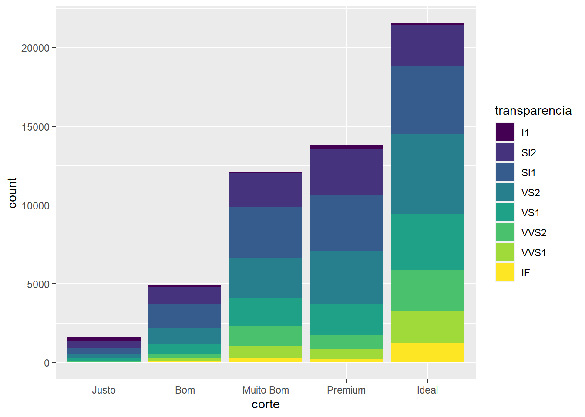


```r
 diamante %>% 
    ggplot(aes(x = corte,  y = preco)) + 
    geom_bar(aes(fill = transparencia), 
             stat = "identity", 
             position = "fill")
```


## evolução

Por fim segue um exemplo de dados temporais em que, em conjunto com as funções do `tidyr` e `dplyr`, remodelamos a base de dados `economics` visando obter a visualização das variáveis `psavert` e `uempmed` desde `1990`:


```r
economics %>%  glimpse()
```

```
## Rows: 574
## Columns: 6
## $ date     <date> 1967-07-01, 1967-08-01, 1967-09-01, 1967-10-01, 1967-11-01, …
## $ pce      <dbl> 506.7, 509.8, 515.6, 512.2, 517.4, 525.1, 530.9, 533.6, 544.3…
## $ pop      <dbl> 198712, 198911, 199113, 199311, 199498, 199657, 199808, 19992…
## $ psavert  <dbl> 12.6, 12.6, 11.9, 12.9, 12.8, 11.8, 11.7, 12.3, 11.7, 12.3, 1…
## $ uempmed  <dbl> 4.5, 4.7, 4.6, 4.9, 4.7, 4.8, 5.1, 4.5, 4.1, 4.6, 4.4, 4.4, 4…
## $ unemploy <dbl> 2944, 2945, 2958, 3143, 3066, 3018, 2878, 3001, 2877, 2709, 2…
```


```r
economics %>%
  select(date, psavert, uempmed) %>%
  filter(date>1990) %>% 
  pivot_longer(-date) %>% #() 
  #gather(key = "variable", value = "value", -date) %>% 
  ggplot(aes(x = date, y = value)) + 
  geom_line(aes(color = name), size = 1) 
```


# Respondendo: qual país bebe mais? 


## gráfico de barra


```r
paises <- c(paises <- c( "Argentina", "Brazil", "Uruguay", "Chile"))

# Colocando a base no formato tidy
drinks_tidy <- drinks %>%
  select(country,
         beer = beer_servings,
         spirit = spirit_servings,
         wine = wine_servings) %>%
  pivot_longer(beer:wine,
               names_to = "type",
               values_to = "servings") %>%
  filter(country %in% paises & type == "beer") %>%
  arrange(country, desc(servings))

# Grafico

drinks_tidy %>%
  ggplot(mapping = aes(x = reorder(country, servings), y = servings))+
  geom_col(position = "dodge", fill = "lightblue", width = 0.8, alpha = 0.8)+
  labs(x = "",
       y = "Servings per person (2010)",
       title = "Where Do People Drink The Most Beer?",
       caption = "Source: World Health Organization (FiveThirtyEight)")+
  scale_y_continuous(limits = c(0,260), expand = c(0, 0))+
  theme_minimal()+
  theme(panel.grid.major.y =element_blank(),
        panel.grid.minor.x = element_blank(),
        plot.caption = element_text(hjust = 0, vjust = -0.5,size = 8))+
  coord_flip()
```

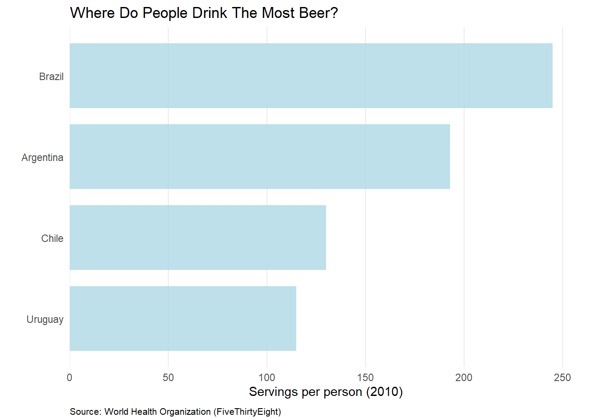


## dot plot


```r
# Selecionando os paises
top20 <- drinks %>%
  select(country,
         beer = beer_servings,
         spirit = spirit_servings,
         wine = wine_servings) %>%
  pivot_longer(beer:wine,
               names_to = "type",
               values_to = "servings") %>%
  filter(type == "beer") %>%
  arrange(country, desc(servings)) %>%
  top_n(20, servings)

# Grafico 

top20 %>%
  ggplot(mapping = aes(x = servings, y = reorder(country, servings)))+
  geom_point(col = "darkgreen", size = 3)+
  labs(x = "Servings per person (2010)",
       y = "",
       title = "Where Do People Drink The Most Beer? (Top 20)",
       caption = "Source: World Health Organization (FiveThirtyEight)")+
  scale_x_continuous(limits = c(250,380),expand = c(0, 0))+
  theme_minimal()+
  theme(plot.caption = element_text(hjust = 0, vjust = -0.5,size = 8))
```

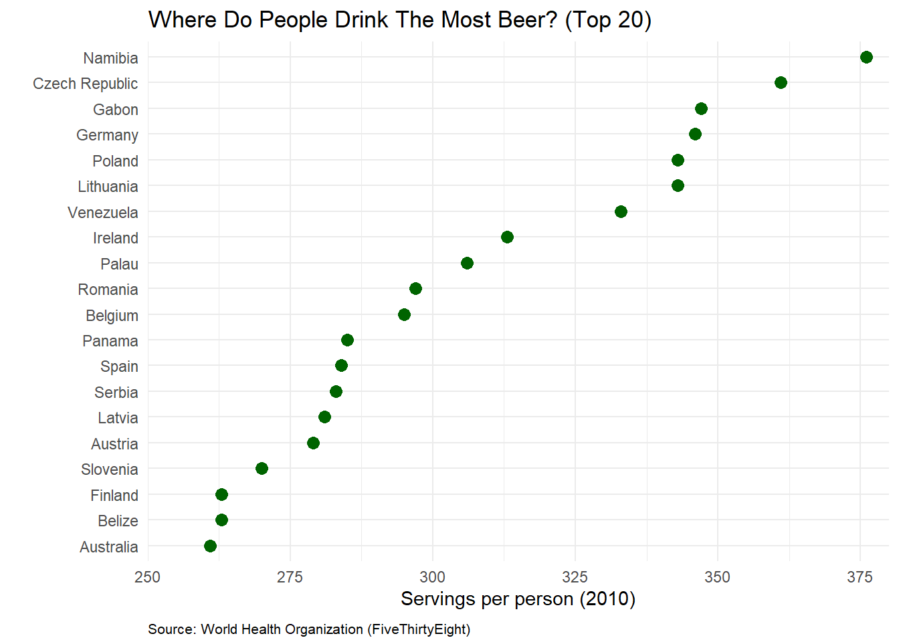


# barra agrupada


```r
paises <- c(paises <- c("China", "Italy", "Saudi Arabia", "USA"))
drinks_tidy <- drinks %>%
  select(country,
         beer = beer_servings,
         spirit = spirit_servings,
         wine = wine_servings) %>%
  pivot_longer(beer:wine,
               names_to = "type",
               values_to = "servings") %>%
  filter(country %in% paises) %>%
  arrange(type, desc(servings))

# Gráfico

drinks_tidy %>%
  ggplot(mapping = aes(x = country, y = servings, fill = type))+
  geom_col(position = "dodge")+
  geom_text(aes(label = ifelse(servings == 0, "", servings)),
            position = position_dodge(width = 1),
            vjust = -0.5, size = 3) +
  scale_y_continuous(limits = c(0,260), expand = c(0, 0))+
  labs(x = "", y = "", fill = "Type",
       title = "Who Drinks The Most Beer, Spirits and Wine?",
       subtitle = "Servings Per Person (2010)",
       caption = "Source: World Health Organization (FiveThirtyEight)")+
  theme_minimal()+
  theme(axis.line=element_blank(), panel.border =element_blank(), panel.grid.major.x =element_blank(),
        panel.grid.minor.y = element_blank(),
        plot.caption = element_text(hjust = 0, vjust = 7,size = 8))+
  scale_fill_brewer(palette = "Pastel1")
```

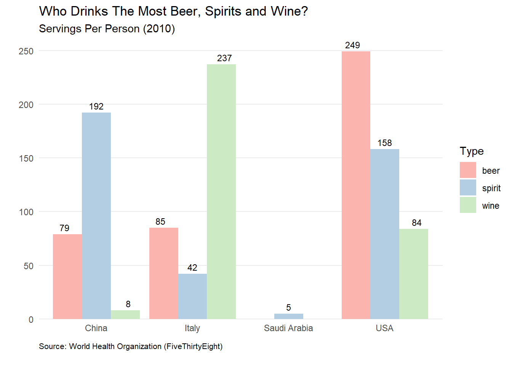

# Tabelas

Por fim gostaria de comentar de uma entidade tão importante quanto o gráfico em si: as tabelas. Eu tenho um amigo, que costuma dizer que "por tras de todo grande gráfico temos uma grande tabela". O que faz sentido, inclusive, se você reparar para vários dos nossos exemplos foi necessário fazer algum ajuste nos dados antes de chegar no gráfico:

## DT
Default do knitr

```r
drinks %>% DT::datatable()
```

```{=html}
<div id="htmlwidget-e40511d644ddea60d87f" style="width:100%;height:auto;" class="datatables html-widget"></div>
<script type="application/json" data-for="htmlwidget-e40511d644ddea60d87f">{"x":{"filter":"none","vertical":false,"data":[["1","2","3","4","5","6","7","8","9","10","11","12","13","14","15","16","17","18","19","20","21","22","23","24","25","26","27","28","29","30","31","32","33","34","35","36","37","38","39","40","41","42","43","44","45","46","47","48","49","50","51","52","53","54","55","56","57","58","59","60","61","62","63","64","65","66","67","68","69","70","71","72","73","74","75","76","77","78","79","80","81","82","83","84","85","86","87","88","89","90","91","92","93","94","95","96","97","98","99","100","101","102","103","104","105","106","107","108","109","110","111","112","113","114","115","116","117","118","119","120","121","122","123","124","125","126","127","128","129","130","131","132","133","134","135","136","137","138","139","140","141","142","143","144","145","146","147","148","149","150","151","152","153","154","155","156","157","158","159","160","161","162","163","164","165","166","167","168","169","170","171","172","173","174","175","176","177","178","179","180","181","182","183","184","185","186","187","188","189","190","191","192","193"],["Afghanistan","Albania","Algeria","Andorra","Angola","Antigua &amp; Barbuda","Argentina","Armenia","Australia","Austria","Azerbaijan","Bahamas","Bahrain","Bangladesh","Barbados","Belarus","Belgium","Belize","Benin","Bhutan","Bolivia","Bosnia-Herzegovina","Botswana","Brazil","Brunei","Bulgaria","Burkina Faso","Burundi","Cote d'Ivoire","Cabo Verde","Cambodia","Cameroon","Canada","Central African Republic","Chad","Chile","China","Colombia","Comoros","Congo","Cook Islands","Costa Rica","Croatia","Cuba","Cyprus","Czech Republic","North Korea","DR Congo","Denmark","Djibouti","Dominica","Dominican Republic","Ecuador","Egypt","El Salvador","Equatorial Guinea","Eritrea","Estonia","Ethiopia","Fiji","Finland","France","Gabon","Gambia","Georgia","Germany","Ghana","Greece","Grenada","Guatemala","Guinea","Guinea-Bissau","Guyana","Haiti","Honduras","Hungary","Iceland","India","Indonesia","Iran","Iraq","Ireland","Israel","Italy","Jamaica","Japan","Jordan","Kazakhstan","Kenya","Kiribati","Kuwait","Kyrgyzstan","Laos","Latvia","Lebanon","Lesotho","Liberia","Libya","Lithuania","Luxembourg","Madagascar","Malawi","Malaysia","Maldives","Mali","Malta","Marshall Islands","Mauritania","Mauritius","Mexico","Micronesia","Monaco","Mongolia","Montenegro","Morocco","Mozambique","Myanmar","Namibia","Nauru","Nepal","Netherlands","New Zealand","Nicaragua","Niger","Nigeria","Niue","Norway","Oman","Pakistan","Palau","Panama","Papua New Guinea","Paraguay","Peru","Philippines","Poland","Portugal","Qatar","South Korea","Moldova","Romania","Russian Federation","Rwanda","St. Kitts &amp; Nevis","St. Lucia","St. Vincent &amp; the Grenadines","Samoa","San Marino","Sao Tome &amp; Principe","Saudi Arabia","Senegal","Serbia","Seychelles","Sierra Leone","Singapore","Slovakia","Slovenia","Solomon Islands","Somalia","South Africa","Spain","Sri Lanka","Sudan","Suriname","Swaziland","Sweden","Switzerland","Syria","Tajikistan","Thailand","Macedonia","Timor-Leste","Togo","Tonga","Trinidad &amp; Tobago","Tunisia","Turkey","Turkmenistan","Tuvalu","Uganda","Ukraine","United Arab Emirates","United Kingdom","Tanzania","USA","Uruguay","Uzbekistan","Vanuatu","Venezuela","Vietnam","Yemen","Zambia","Zimbabwe"],[0,89,25,245,217,102,193,21,261,279,21,122,42,0,143,142,295,263,34,23,167,76,173,245,31,231,25,88,37,144,57,147,240,17,15,130,79,159,1,76,0,149,230,93,192,361,0,32,224,15,52,193,162,6,52,92,18,224,20,77,263,127,347,8,52,346,31,133,199,53,9,28,93,1,69,234,233,9,5,0,9,313,63,85,82,77,6,124,58,21,0,31,62,281,20,82,19,0,343,236,26,8,13,0,5,149,0,0,98,238,62,0,77,31,12,47,5,376,49,5,251,203,78,3,42,188,169,22,0,306,285,44,213,163,71,343,194,1,140,109,297,247,43,194,171,120,105,0,56,0,9,283,157,25,60,196,270,56,0,225,284,16,8,128,90,152,185,5,2,99,106,1,36,36,197,51,51,19,6,45,206,16,219,36,249,115,25,21,333,111,6,32,64],[0,132,0,138,57,128,25,179,72,75,46,176,63,0,173,373,84,114,4,0,41,173,35,145,2,252,7,0,1,56,65,1,122,2,1,124,192,76,3,1,254,87,87,137,154,170,0,3,81,44,286,147,74,4,69,0,0,194,3,35,133,151,98,0,100,117,3,112,438,69,0,31,302,326,98,215,61,114,1,0,3,118,69,42,97,202,21,246,22,34,0,97,0,216,55,29,152,0,244,133,15,11,4,0,1,100,0,0,31,68,50,0,189,114,6,18,1,3,0,6,88,79,118,2,5,200,71,16,0,63,104,39,117,160,186,215,67,42,16,226,122,326,2,205,315,221,18,0,38,5,1,131,25,3,12,293,51,11,0,76,157,104,13,178,2,60,100,35,15,258,27,1,2,21,156,3,22,71,41,9,237,135,126,6,158,35,101,18,100,2,0,19,18],[0,54,14,312,45,45,221,11,212,191,5,51,7,0,36,42,212,8,13,0,8,8,35,16,1,94,7,0,7,16,1,4,100,1,1,172,8,3,1,9,74,11,254,5,113,134,0,1,278,3,26,9,3,1,2,233,0,59,0,1,97,370,59,1,149,175,10,218,28,2,2,21,1,1,2,185,78,0,0,0,0,165,9,237,9,16,1,12,2,1,0,6,123,62,31,0,2,0,56,271,4,1,0,0,1,120,0,0,18,5,18,0,8,128,10,5,0,1,8,0,190,175,1,1,2,7,129,1,0,23,18,1,74,21,1,56,339,7,9,18,167,73,0,32,71,11,24,0,140,0,7,127,51,2,11,116,276,1,0,81,112,0,0,7,2,186,280,16,0,1,86,4,19,5,7,20,7,32,9,0,45,5,195,1,84,220,8,11,3,1,0,4,4],[0,4.9,0.7,12.4,5.9,4.9,8.3,3.8,10.4,9.7,1.3,6.3,2,0,6.3,14.4,10.5,6.8,1.1,0.4,3.8,4.6,5.4,7.2,0.6,10.3,4.3,6.3,4,4,2.2,5.8,8.2,1.8,0.4,7.6,5,4.2,0.1,1.7,5.9,4.4,10.2,4.2,8.2,11.8,0,2.3,10.4,1.1,6.6,6.2,4.2,0.2,2.2,5.8,0.5,9.5,0.7,2,10,11.8,8.9,2.4,5.4,11.3,1.8,8.3,11.9,2.2,0.2,2.5,7.1,5.9,3,11.3,6.6,2.2,0.1,0,0.2,11.4,2.5,6.5,3.4,7,0.5,6.8,1.8,1,0,2.4,6.2,10.5,1.9,2.8,3.1,0,12.9,11.4,0.8,1.5,0.3,0,0.6,6.6,0,0,2.6,5.5,2.3,0,4.9,4.9,0.5,1.3,0.1,6.8,1,0.2,9.4,9.3,3.5,0.1,9.1,7,6.7,0.7,0,6.9,7.2,1.5,7.3,6.1,4.6,10.9,11,0.9,9.8,6.3,10.4,11.5,6.8,7.7,10.1,6.3,2.6,0,4.2,0.1,0.3,9.6,4.1,6.7,1.5,11.4,10.6,1.2,0,8.2,10,2.2,1.7,5.6,4.7,7.2,10.2,1,0.3,6.4,3.9,0.1,1.3,1.1,6.4,1.3,1.4,2.2,1,8.3,8.9,2.8,10.4,5.7,8.7,6.6,2.4,0.9,7.7,2,0.1,2.5,4.7]],"container":"<table class=\"display\">\n  <thead>\n    <tr>\n      <th> <\/th>\n      <th>country<\/th>\n      <th>beer_servings<\/th>\n      <th>spirit_servings<\/th>\n      <th>wine_servings<\/th>\n      <th>total_litres_of_pure_alcohol<\/th>\n    <\/tr>\n  <\/thead>\n<\/table>","options":{"columnDefs":[{"className":"dt-right","targets":[2,3,4,5]},{"orderable":false,"targets":0}],"order":[],"autoWidth":false,"orderClasses":false}},"evals":[],"jsHooks":[]}</script>
```

# Outras opções de bibliotecas

- [kableExtra](https://cran.r-project.org/web/packages/kableExtra/vignettes/awesome_table_in_html.html)


# Hands-on


No RStudio Learn Primers: https://rstudio.cloud/learn/primers, faça os exercícios propostos na aba Visualize Data,  https://rstudio.cloud/learn/primers/3 


