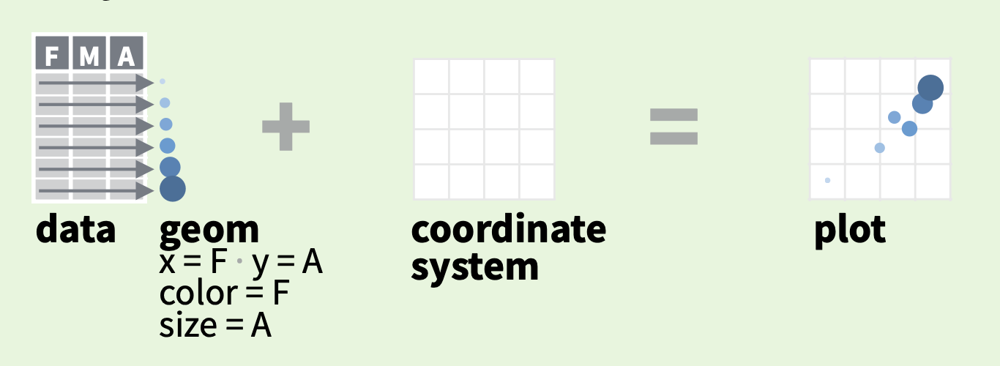

```{r setup, include=FALSE}
knitr::opts_chunk$set(echo = TRUE)
```


# Bibliotecas

```{r}
library(tidyverse)
```


# Introdução

Neste material discutimos sobre a importancia da visualização de dados, tanto para análise quanto para comunicar as descobertas após o processo exploratório.

O principal pacote em R para as visualizações é o `ggplot2`, que tem uma lógica gramatical própria, mas seu domínio é fundamental para criar gráficos dos mais simples até os avançados.

# O que é dataviz? É de comer?

Dataviz é abreviação de *Data Visualization*, ou simplesmente **visualização de dados**. Como o nome sugere, é uma forma de explorarmos os dados de forma visual, normalmente por meio de gráficos.

Esta etapa possui um papel crucial na análise de dados! Citando Ben Shneiderman, um importante nome da ciência da computação: "Visualização nos dá resposta para perguntas que nós não sabiamos que tinhamos".

E no R, apesar de existirem muitos recursos padrão para a visualização de dados, como as funções: `plot()`, `hist()` e `boxplot()`, é quando começamos a trabalhar com o `ggplot2` e outras bibliotecas que as possibilidades se potencializam.

# O pacote `ggplot2`

E dentre os muitos pacotes do R, o `ggplot2` é a maior referência em relação a visualização de dados. Isto porque nele é implementado o *Grammar of Graphics*, uma abstração segundo a qual cada elemento do gráfico é visto como um elemento sintático, ou seja, com uma estrutura própria que pode ser encadeada.

Na prática a explicação faz mais sentido, mas é graças a essa estrutura que a mesma lógica é capaz de construir desde os gráficos mais simples até os mais complexos. Algumas das vantagens de usar o `ggplot2` são:

- Sintaxe única e estruturada
- Maior controle e versatilidade 
- Portfólio amplo e em expansão
- Oferece recursos de design e "embelezamento" dos gráficos
- Fomenta a análise semântica dos dados 
- Cada variável é representada de forma única
- Por ter como base uma linguagem cientifica, que otimiza a reprodutibilidade
- Ao decodificar gráficos, tornamos a sua comunicação mais clara e intencional

Mas nem tudo são flores, o `ggplot2` tem um contra importante aqui que é a **curva de aprendizado**. Pela sua estrutura própria, leva um tempo para entender como construir os gráficos, mas uma vez entendida, é díficil enxergar visualização de outra maneira.


## As camadas do `ggplot2`

Pela função `ggplot()`, o gráfico pode ser construído a partir de um mapeamento de elementos, construídos através é visto como um mapeamento de elementos, feito por camadas. Basta você passar esse mapeamento de elementos para a função inicial, seguindo os parâmetros estabelecidos, que o gráfico é construído.

A imagem abaixo ajuda a entender como isso funciona na prática. A partir do conjunto de dados com as colunas `F`, `M` e `A`, é possível construir *geoms* (abreviação para formas geométricas), como a cor ser representada pelos elementos da coluna `F` ou o tamanho ser proporcional aos valores da `A`.

Ao juntar com o sistema de coordenadas e passando os eixos `x` e `y`, como `F` e `A`, respectivamente, o resultado é um lindo gráfico (ou ao menos informativo) que ajuda a explicar o conjunto de dados em questão.



Para construir isso na prática, basta ver a estrutura de código abaixo. Observe que, depois de passar o conjunto de dados pelo pipe (`%>%`), a função `ggplot()` encadeia os elementos pelo operador `+`.

```{r, eval=F}
dados %>% 
  ggplot(aesthetic) +
    geometries(statistics) +
    facets() +
    themes() +
    coord() +
    scales()
```

Os principais elementos do `ggplot2` que dão conta de construir as visualizações são:

- `{data}`: dados que serão utilizados no gráfico;
- `{aesthetic}`: mapeamentos estéticos dos dados para os componentes visuais (eixo x, y, cores, etc);
- `{geometries}`: objetos geométricos que irão aparecer no gráfico;
- `{facets}`: apresenta as visualizações segundo subgrupos, ou seja, segmentações que você faz nos dados (métricas por diferentes categorias, por exemplo);
- `{themes}`: redefine o layout visual do gráfico, sem mexer nos dados, mas em elementos de design;
- `{scales}`: especifica o intervalo de variação que será considerado para os mapeamentos estéticos;
- `{coord}`: organiza as coordenadas/eixos em que objetos geométricos irão aparecer, normalmente no [padrão cartesiano](https://pt.wikipedia.org/wiki/Sistema_de_coordenadas_cartesiano);
- `{statistics}`: transforma os dados considerando resumos estatísticos, como variância ou média. Normalmente as transformações nos dados são feitas *antes* de visualizar, mas ainda assim pode ser útil.

Apesar de todas essas possibilidades, que fazem mais sentido na prática, apenas três destas camadas são obrigatórias: dados (`data`),  mapeamentos estéticos (`aesthetic`), e objetos geométricos (`geometries`). No caso:

```{r, eval=F}
  dados %>% 
    ggplot(aesthetic) +
      geometries() 
```

Vamos começar por elas!

### Camadas obrigatórias

E para entender melhor do que se tratam, vamos conhece-los um a um. Para tal, utilizeramos a base `gapmider` do pacote `dados`:

```{r}
gapminder <- dados::dados_gapminder %>% glimpse()
```

E aplicar a base no ggplot apenas, sem as demais camadas, temos um painel em branco, com isto podemos entender que a função `ggplot` tem como papel inicializar o gráfico:

```{r}
gapminder %>% 
  ggplot() 
```

Passamos agora para o elemento `aesthetic`, no R, representada de maneira abreviada, `aes()`. Essa função entra dentro do `ggplot()`, ainda sem o operador `+`, e descreve como as variáveis dos dados serão mapeadas para as propriedades visuais (estéticas). 

Ou seja, com `aes()` você indicará quais variáveis serão mapeadas no gráfico, seja um conjunto ou apenas uma. Um mapeamente usual trata do eixo x e eixo y:


```{r}
gapminder %>% 
  ggplot(aes(x = pib_per_capita, y = expectativa_de_vida)) 
```

Note que agora o gráfico passou a apresentar as variáveis nos eixos, mas nada além disto, por quê? Ainda precisamos indicar qual a geometria indicada (`geom`) para representar esses elementos. Vamos fazer isso olhando a relação entre `pib_per_capita` e `expectativa_de_vida`:


```{r}
gapminder %>% 
  ggplot(aes(x = pib_per_capita, y = expectativa_de_vida))  +
  geom_point()
```

Neste caso, a `geom_point()` cria um gráfico de dispersão, com pontos indicando todas as observações dos conjuntos de dados em sua posição correta no eixo cartesiano. Poderíamos, de todo modo, recorrer a outros `geoms` [listados aqui](https://ggplot2.tidyverse.org/reference/index.html).

Isso quer dizer que qualquer um serve? Não. Precisaria ser uma geometria que trabalhasse com dois eixos, sendo ambos numéricos, já que escolhemos variáveis assim. Podemos ainda adicionar novos atributos, bem como novas camadas geométricas, como a `geom_smooth()`, que descreve a tendência dos dados:

```{r, message=F}
gapminder %>% 
  ggplot(aes(x = pib_per_capita, y = expectativa_de_vida))  +
    geom_point() + 
    geom_smooth()
```

Também podemos adicionar mais elementos que nos ajudam a entender a visualização, como colorir por continente:

```{r, message=F}
gapminder %>% 
  ggplot(aes(x = pib_per_capita, y = expectativa_de_vida, color = continente))  +
    geom_point() + 
    geom_smooth()
```

### Texto e outras estéticas

É importante comentar que algumas geometrias demandam estéticas específicas, como é o caso do `geom_text()`, que necessita da informação de qual atributo que será utilizo como texto:

```{r}
gapminder %>% 
  ggplot(aes(x = pib_per_capita, y = expectativa_de_vida, color = continente))  +
    geom_point() +
    geom_text(aes(label = pais))
```

Ficou difícil de ler, certo? Tente filtrar os dados com o `pib_per_capita` maior que 60.000 e ver se o gráfico fica mais claro. Só trocar a última linha por `geom_text(data = . %>% filter(pib_per_capita>60000), aes(label = pais))`.

### Aprofundando o entendimento

Avaliando o resultado acima, faria mais sentido se estivessemos trabalhando com a informação distribuida pelos anos, portando vamos deixar o PIB de lado e olhar para a `expectativa_de_vida` em cada `ano` por `continente`:

```{r}
gapminder %>% 
  ggplot(aes(x = ano, y = expectativa_de_vida, color = continente))  +
    geom_point() 
```

As linhas estão conectando pontos que não necessariamente fazem sentido, para isto podemos utilizar passar a informação de `país` como um mapeamento estético: 

```{r}
gapminder %>% 
  ggplot(aes(x = ano, y = expectativa_de_vida, color = continente))  +
    geom_point() +
    geom_line(aes(group = pais))
```


O gráfico está sobrecarregado, e se mantivessemos apenas as retas ajustadas coloridas? Note a diferença entre a posição do `color` para cada uma das camadas:


```{r}
gapminder %>% 
  ggplot(aes(x = ano, y = expectativa_de_vida, color = continente))  +
    geom_point(color = "gray") +
    geom_line(aes(group = pais), color = "gray") +
    geom_smooth()
```

Melhor de visualizar, certo? Em dataviz, cada detalhe importa. Mesmo a cor (ou a ausência dela, no caso do cinza) e suas combinações ajudam a entender melhor os dados.

### Camadas não obrigatórias 

E considerando as demais camadas, o que poderiamos trabalhar de interessante? Usando o `facet_grid()`, que tal criar subgráficos por continente?

```{r, message=F}
gapminder %>% 
  ggplot(aes(x = ano, y = expectativa_de_vida, color = continente))  +
    geom_point(color = "gray") +
    geom_line(aes(group = pais), color = "gray") +
    geom_smooth() + 
    theme_minimal() +
    facet_grid( continente ~ .)
```

Talvez já tenha ficado avançado demais, mas o meu ponto era justo mostrar o quanto a dificuldade não é de código, e sim do entendimento conceitual das formas de mapeamento do `ggplot2`. Não se preocupe: vamos aprofunadr com calma em recursos suficientes para que você possa evoluir neste pacote ;)

Lembrando que o `ggplot2` também usa o encadeamento de funções, mas a dinâmica aqui é um pouco diferente do `%>%` e por isso trabalhamos com o operador `+`.

Retornando a totalidade da camadas não obrigatórias, temos ainda os níveis em que podemos fazer: a divisão de gráficos (faceting), sistemas de coordenadas (coord), temas de fundo (themes), e sumarizações estatísticas (statistics).


```{r, eval=F}
  dados %>% 
    ggplot(aesthetic) +
      geometries(statistics) +
      facets() +
      coord()
      themes()
```


E aqui vale dar uma checada na *cheat sheet* do ggplot, pois ela nos dá dicas valiosas sobre quais geometrias você pode ou não aplicar a depender do tipo da variável, além de exemplificar demais camadas e de forma visual: 

```{r , echo=FALSE, fig.align = "center", fig.cap="CheatSheet ggplot2 (folha 01)"}
knitr::include_graphics('https://i.pinimg.com/originals/5d/f0/dd/5df0dd5a1c5751f039b8db8ad9267cb5.jpg')
```

## Parece legal, mas como eu supero a barreira de entrada? 

Treinando! Lendo a documentação, experimentando seus próprios gráficos...


Outra dica valiosa é testar o pacote `esquisse::esquisser()`, que ajuda a construir gráficos do `ggplot2` de maneira interativa, e você pode estudar o código para entender o que mudou :) 


# Como fazer boas escolhas visuais?

Uma divisão interessante é separar a etapa de **exploração** da etapa de **explanação** (ou apresentação). Ou seja, tratar de maneira diferente quando você está minerando o conjunto de dados, procurando encontrar insights e validar hipóteses, e quando você já chegou em algo que será compartilhado, e deseja comunicar isto para outras pessoas.

Ambas as partes têm sua complexidade: a primeira exige um entendimento exploratório (e muitas vezes estatístico) de como estudar o conjunto de dados de forma visual para encontrar padrões; e a segunda exige uma maturidade comunicativa para utilizar cada elemento visual de forma que ajude a sua audiência a entender o que você descobriu.

# Exploração: qual gráfico usar? (geom_*)

Como você viu na *cheat sheet* acima, existem diferentes opções de geometria no `ggplot2`, para citar alguns: 

- `geom_line`: para linhas definidas por pares (x,y);
- `geom_abline`: para retas definidas por um intercepto e uma inclinação;
- `geom_hline`: para retas horizontais;
- `geom_bar`: para gráficos de barra;
- `geom_histogram`: para histogramas;
- `geom_boxplot`: para boxplots;
- `geom_density`: para gráficos de densidades;
- `geom_area`: para gráficos com áreas.

E existem vários outros pacotes que aumentam ou complementam estas funções.

O primeiro passo para decidir qual visualização usar é entender como você quer relacionar as variáveis a partir de sua classe, além de ter clareza no que você quer comunicar. Existem duas ferramentas para ampliar o entendimento nestes pontos: a [from Data to Viz](https://www.data-to-viz.com/), que lista gráficos possíveis a partir das variáveis e suas classes; e a [R Graph Gallery](https://r-graph-gallery.com/), que reúne exemplos de gráficos construídos no R.

## Explorando possibilidades

Vamos ver algumas possíbilidades, agora com o conjunto de dados `titanic`, que reúne dados dos sobreviventes dos passageiros do Titanic.

### Distribuição 

```{r, message=F}
library(titanic)
titanic <- titanic_train

# Gráfico

titanic %>%
  ggplot(aes(x = Age,y = ..density..,fill = Sex)) +
  geom_histogram(binwidth = 5,
                 position = "dodge",
                 col = "white",
                 boundary = 0,
                 alpha = 0.7) +
  facet_grid(~Sex,
             labeller = labeller(Sex = function(Sex) paste(Sex,
                                                           "passengers")))+
  scale_x_continuous(expand = c(0, 0))+
  labs(y = "Density")+
  theme_minimal()+
  theme(panel.grid.minor.y =element_blank(),
        panel.grid.major.x = element_blank(),
        panel.grid.minor.x = element_blank(),
        legend.position = "none",
        panel.spacing = unit(1, "lines"),
        strip.text=element_text(hjust=0.8, vjust = -1.2)
  )
  
```


```{r, message=F}
titanic %>%
  ggplot(aes(x = Age, y = ..count..)) +
  geom_density(data = select(titanic, -Sex),
               aes(fill = "a"),
               color = "transparent",
               alpha = 0.6)+
  geom_density(aes(fill = Sex),
               color = "transparent")+
  scale_x_continuous(name = "age (years)",
                     limits = c(0, 85),
                     expand = c(0, 0)) +
  scale_y_continuous(limits = c(0, 25),
                     name = "scaled density",
                     expand = c(0, 0))+
  scale_fill_manual(breaks = c("a", "female", "male"),
                    values = c("gray", "#D55E00", "#0072B2"),
                    labels=c("all","female","male"),
                    name = "")+
  facet_wrap(~Sex)+
  theme_minimal()+
  theme(panel.grid.minor.y =element_blank(),
        panel.grid.major.x = element_blank(),
        panel.grid.minor.x = element_blank(),
        legend.position = "bottom",
        legend.justification = "right",
        strip.text.x = element_blank())+
  ggtitle("Titanic Passengers Age by Sex")
```

### Relação

Agora com o conjunto de dados `diamante`, que lista informações de preço de quase 54 mil diamantes em seus diferentes tipos (cor, quilate, corte, etc).

```{r, message=F}
diamante <- dados::diamante

p <-  diamante %>% 
  sample_frac(0.10) %>% 
  ggplot(aes(x = quilate, y = preco)) +
  geom_point(aes(text = transparencia), size = 4) +
  geom_smooth(aes(colour = corte, fill = corte)) + 
  facet_grid(.~corte) 

plotly::ggplotly(p)
```

### Ordenação 

Aqui, nosso interesse é entender a distribuição da variável `cut` em relação à `clarity`, ou ambas em relação à `count`:  

```{r}
  diamante %>% 
    ggplot(aes(x = corte, fill = transparencia)) + 
    geom_bar()
```


```{r}
 diamante %>% 
    ggplot(aes(x = corte,  y = preco)) + 
    geom_bar(aes(fill = transparencia), 
             stat = "identity", 
             position = "fill")
  
```

### Evolução

Por fim segue um exemplo de dados temporais em que, em conjunto com as funções do `tidyr` e `dplyr`, remodelamos a base de dados `economics` visando obter a visualização das variáveis `psavert` e `uempmed` desde `1990`:

```{r}
economics %>%  glimpse()
```

```{r}
economics %>%
  select(date, psavert, uempmed) %>%
  filter(date>1990) %>% 
  pivot_longer(-date) %>% #() 
  #gather(key = "variable", value = "value", -date) %>% 
  ggplot(aes(x = date, y = value)) + 
  geom_line(aes(color = name), size = 1) 
```

# Explanação: como apresentar? 

Aqui seria uma aula (ou um curso) à parte, mas para começar a entender esse vasto mundo da visualização para comunicação, recomendo o [capítulo 28 de R para Data Science](https://r4ds.had.co.nz/graphics-for-communication.html) que usa o `ggplot2` de exemplo para falar justamente sobre essas possibilidades.

## Bibliotecas tangentes ao ggplot

Existem mais de 350 pacotes relacionados ao pacote ggplot2, oferecendo recursos que complementam as funções iniciais. Poderiam fácil ter mais algumas horas de curso só para falar sobre isto, mas listo aqui algumas funções, em ordem alfabética:

- `{cowplot}` — arranjos de enredo, temas e anotações
- `{ggalt}` — coordenadas alternativas, geoms, estatísticas e escalas
- `{gganimate}` — cria animações
- `{ggbump}` — geoms para gráficos de colisão
- `{ggforce}` — vários recursos adicionais interessantes
- `{ggiraph}` — geoms para visualizações dinâmicas e interativas
- `{ggmaps}` — acesso aos mapas do Google e Stamen
- `{ggplotly}` — cria gráficos interativos
- `{ggraph}` — redes, gráficos e árvores
- `{ggrepel}` — evita a sobreposição de rótulos de texto
- `{ggridges}` — geoms para plotagens de ridgeline
- `{ggsankey}` — geoms para diagramas sankey
- `{ggstream}` — geoms para gráficos de fluxo
- `{ggtext}` — renderização em rich text
- `{ggthemes}` — temas, escalas e geometrias adicionais
- `{hrbrthemes}` — temas mínimos centrados em tipografia
- `{lemon}` — complementos de eixo e legenda
- `{patchwork}` — combine ggplots com gráficos de vários painéis
- `{rayshader}` — mapas sombreados em 2D e 3D
- `{systemfonts}` — use fontes personalizadas (substitui - `{extrafont}` e - `{showtext}`)

Olha até onde podemos chegar com o `ggplot2`: [essa apresentação](https://www.cedricscherer.com/slides/OutlierConf2021_ggplot-wizardry.pdf) reúne *bruxarias* feitas em R que viraram gráficos maravilhosos!

# Bônus: tabelas

Por fim gostaria de comentar de uma entidade tão importante quanto o gráfico em si: as tabelas. Eu tenho um amigo que costuma dizer que "por tras de todo grande gráfico temos uma grande tabela". O que faz sentido, inclusive, se você reparar que para vários de nossos exemplos foi necessário fazer algum ajuste nos dados antes de chegar no gráfico:

## DT (função padrão do pacote `knitr`)

```{r}
gapminder %>% DT::datatable()
```

## Outras opções de bibliotecas

- [kableExtra](https://cran.r-project.org/web/packages/kableExtra/vignettes/awesome_table_in_html.html)

- [flextable](https://ardata-fr.github.io/flextable-book/)


# MÃO NA MASSA!

- No RStudio Learn Primers: https://rstudio.cloud/learn/primers, faça os exercícios propostos na aba Visualize Data,  https://rstudio.cloud/learn/primers/3 
